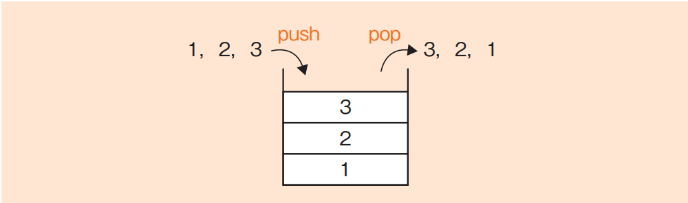
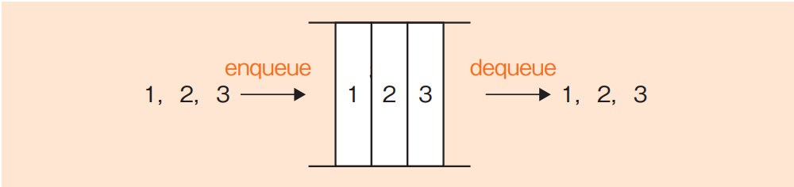
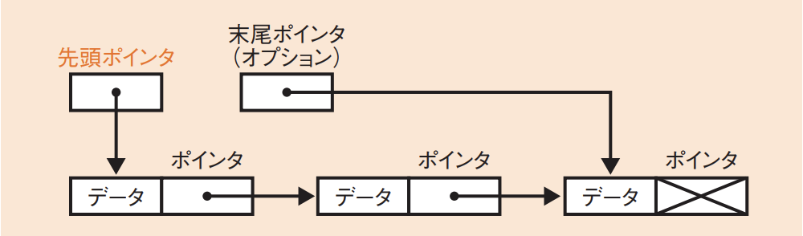
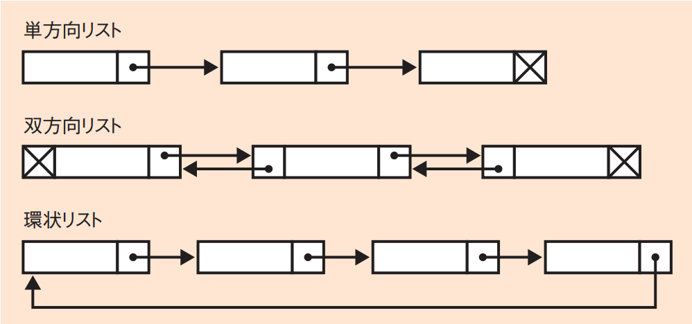
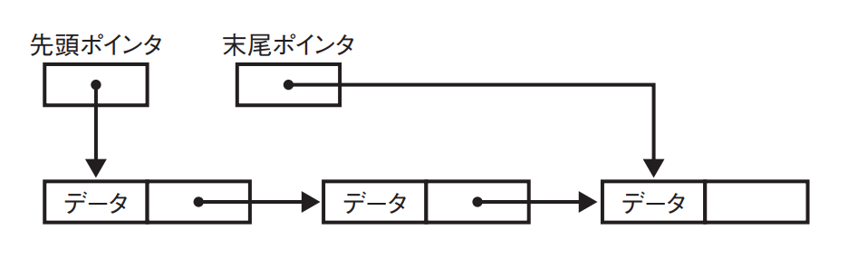
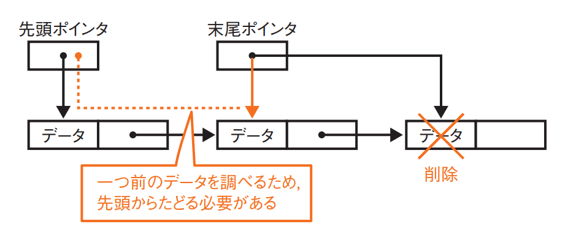
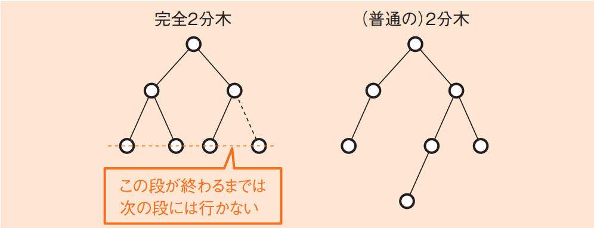
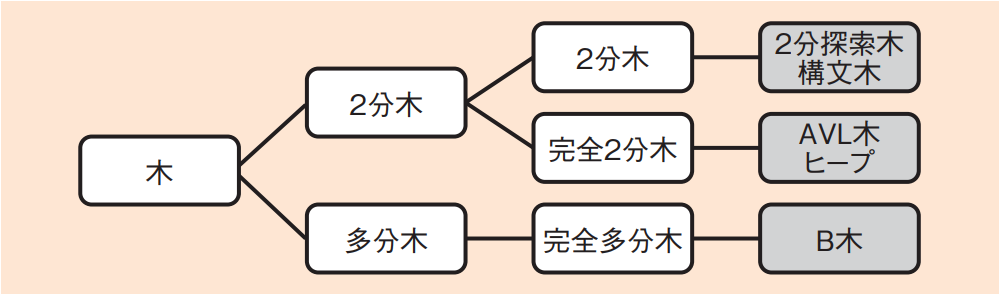
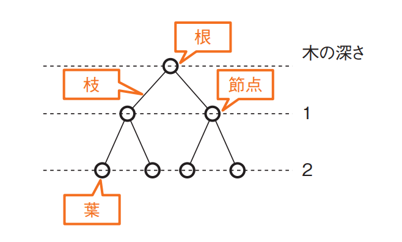

# 1-2-1 データ構造(译: 数据结构)

- [1-2-1 データ構造(译: 数据结构)](#1-2-1-データ構造译-数据结构)
  - [配列(译: 数组)](#配列译-数组)
  - [スタック(译: 堆栈)](#スタック译-堆栈)
  - [キュー(待ち行列)(译: 队列)](#キュー待ち行列译-队列)
  - [リスト(译: 列表)](#リスト译-列表)
  - [ハッシュ(译: 哈希)](#ハッシュ译-哈希)
  - [木(译: 树)](#木译-树)
  - [ヒープ(译: 堆)](#ヒープ译-堆)

## 配列(译: 数组)

- 配列: データ構造を複数個連続させたものである。複数のデータを一度に管理することができる。
  - 例: 文字型を連続させて文字配列とすることで, 文字列を表現することができる。
- 種類
  - 静的配列: 同じデータ型のデータをあらかじめ決めた数しか収納できない
  - 動的配列: 異なった型のデータを収納することや, データの数に応じて可変長の配列とすることが可能

## スタック(译: 堆栈)

- スタック: 後入れ先出し(LIFO: Last In First Out)(译: 后进先出)のデータ構造である。データを取り出すときには, 最後に入れたデータが取り出される。
- 操作
  - **push**操作(译: 进栈, 入栈或压栈): スタックにデータを入れる
  - **pop**操作(译: 出栈或退栈): データを取り出す
- CPUのレジスタやプログラムでの関数呼出しなど, 現在のコンピュータシステムで非常に広範囲で使われている。
- 図: スタック 
- 例: 配列を用いてスタックを実現する場合の構成要素として, 最低限必要なものはどれか。
  - ア: スタックに最後に入った要素を示す添字の変数
  - イ: スタックに最初に入った要素と最後に入った要素を示す添字の変数
  - ウ: スタックに一つ前に入った要素を示す添字の変数を格納する配列
  - エ: スタックの途中に入っている要素を示す添字の変数

  > スタックではpush操作とpop操作しか行わないので, 必要なデータ構造としては, 配列以外では, スタックに最後に入った要素を示す添字の変数のみとなる。したがって, アが正解である。

## キュー(待ち行列)(译: 队列)

- キュー: 先入れ先出し(FIFO: First In FirstOut)(译: 先进先出)のデータ構造でである。データを取り出すときには, 最初に入れたデータが取り出される。
- 操作
  - enqueue(エンキュー)操作(译: 入队): キューにデータを入れる
  - dequeue(デキュー)操作(译: 出队): キューにデータを取り出す
- プリンタの出力やタスク管理など, 順番どおりに処理する必要がある場合に使われている。
- **優先度付きキュー**: データに優先度を付け, 優先度を考慮して順番を決定するキュー。
- 図: キュー 

## リスト(译: 列表)

- リスト: 線形リストともいう。順序づけられたデータの並びである。
- データそのものを格納するデータ部と, データの並び(次のデータへのポインタ, 前のデータへのポインタなど)を格納するポインタ部を合わせて管理する。
- ポインタ
  - **先頭ポインタ**: データの先頭を指し示す。
  - 末尾ポインタ: データの末尾を指し示す。
  - 図: データ部とポインタ部 
- 種類
  - **単方向リスト**
    - 次のデータへのポインタのみをもつリスト
  - **双方向リスト**
    - 前へのポインタと次へのポインタをもつリスト
  - 環状リスト
    - 最後尾のデータから先頭に戻って環状につなげるリスト
  - 図: リストの種類 
- 例: 先頭ポインタと末尾ポインタをもち, 多くのデータがポインタでつながった単方向の線形リストの処理のうち, 先頭ポインタ, 末尾ポインタ又は各データのポインタをたどる回数が最も多いものはどれか。ここで, 単方向のリストは先頭ポインタからつながっているものとし, 追加するデータはポインタをたどらなくても参照できるものとする。
  - ア: 先頭にデータを追加する処理
  - イ: 先頭のデータを削除する処理
  - ウ: 末尾にデータを追加する処理
  - エ: 末尾のデータを削除する処理
  
  > 先頭ポインタと末尾ポインタをもち, 多くのデータがポインタでつながった単方向の線形リストを図で表すと, 以下のようになる。   
  > この線形リストに, ア, イ, ウ, エそれぞれの処理を行う場合を考えてみる。  
  > ア: 先頭にデータを追加する処理は, 現在の先頭ポインタの値を追加するデータの次へのポインタにし, 先頭ポインタが追加するデータを指し示すようにすればOKである。  
  > イ: 先頭のデータを削除する処理は, 先頭ポインタを2番目のデータ( = 1番目のデータの次へのポインタ)を指すようにすればOKである。  
  > ウ: 末尾にデータを追加する処理は, 末尾ポインタをたどり, 末尾のデータの次へのポインタが, 追加するデータを指し示すようにすればOKである。  
  > エ: 末尾のデータを削除する処理は少し複雑である。末尾のデータを削除すると, 末尾ポインタは末尾の一つ前のデータを指し示す必要があるが, それを見つけるためには, 先頭から末尾の直前までたどっていく必要がある。図にすると, 次のようなかたちである。   
  > 先頭から順に末尾の一つ前までたどるには, (データの個数−1)回, データのポインタをたどる必要がある。  
  > ししたがって, エが正解である。

## ハッシュ(译: 哈希)

- ハッシュ関数: あるデータが与えられたときに, そのデータを代表する値に変換する関数である。
- **一方向性**の関数である。
  - ハッシュ関数$y = h(x)$があった場合, $x \to y$に変換できるが, $y \to x$には変換できない。
- ハッシュ関数で求められた値のことを**ハッシュ値**または単に**ハッシュ**という。
- ハッシュ関数の典型例: 割り算の余りを求める関数$h(x) = x \ mod \ n$
  - mod: 余りを求める演算子
- 例: 自然数をキーとするデータを, ハッシュ表を用いて管理する。キー$x$のハッシュ関数$h(x)$を $h(x) = x \ mod \ n$ とすると, 任意のキー$a$と$b$が衝突する条件はどれか。ここで, $n$はハッシュ表の大きさであり, $x \ mod \ n$は$x$を$n$で割った余りを表す。
  - ア: $a + b$が$n$の倍数
  - イ: $a - b$が$n$の倍数
  - ウ: $n$が$a + b$の倍数
  - エ: $n$が$a - b$の倍数

  > $aとbが衝突する$  
  > $=> h(a) = h(b)$  
  > $=> a \ mod \ n = b \ mod \ n$  
  > $=> a - \alpha \times n = b - \beta \times n \cdots (\alpha, \beta は任意の整数)$  
  > $=> a - b = (\alpha - \beta) \times n$  
  > したがって, イが正解である

## 木(译: 树)

- 木(木構造): [グラフ理論](../1-1基礎理論/1-1-2応用数学.md#グラフ理論译-图论)の木の構造をしたデータ構造である。
- ノード間の関連は親子関係で表され, 根ノード以外の子ノードでは, 親ノードは必ず一つである。
  - **2分木**: 親ノードに対する子ノードの数が二つまでに限定されるもの
    - **完全2分木**: 形が完全に決まっているもの, つまり, 一つの段が完全にいっぱいになるまでは次の段に行かないもの
  - **多分木**: 親ノードに対する子ノードの数が三つ以上もてるもの
  - 図: 2分木 
- 2分木の実用例
  - **2分探索木**(译: 二叉搜索树): データの大小関係を, 木を使ってたどっていく
  - **構文木(译: 分析树)**: 構文や文法を表現する
- 完全2分木の実用例
  - **AVL木**(译: 自平衡二叉查找树): 2分探索木を完全2分木に変換したもの
  - ヒープ(译: 堆积): 根から葉に向けてだけデータを整列させたもの
- 多分木の例
  - **B木(译: B树)**:  完全多分木で2分探索木の多分木バージョンである
- 図: 木構造の分類 
- 例: 葉以外の節点は全て二つの子をもち, 根から葉までの深さが全て等しい木を考える。この木に関する記述のうち, 適切なものはどれか。ここで, 木の深さとは根から葉に至るまでの枝の個数を表す。また, 節点には根及び葉も含まれる。
  - ア: 枝の個数が$n$ならば, 節点の個数も$n$である。
  - イ: 木の深さが$n$ならば, 葉の個数は$2^{n−1}$である。
  - ウ: 節点の個数が$n$ならば, 木の深さは$\log_{2}n$である。
  - エ: 葉の個数が$n$ならば, 葉以外の節点の個数は$n - 1$である。

  > 葉以外の節点はすべて二つの子をもち, 根から葉までの深さがすべて等しい木の例を図にすると, 次のようになる。   
  > この木は完全2分木で,
  > - 木の深さ(根から葉までの段数): 2  
  > - 節点(すべての○): 7  
  >   - 根(頂点の節点): 1  
  >   - 葉(一番下の子がない節点): 4  
  > - 枝(節点と節点を結ぶ線): 6
  >
  > したがって, エが正解である。  
  > ア: 枝の個数(6)は, 葉を含むすべての節点(7)より少なくなる。一般的には, 枝の個数が$n$ならば, 節点の個数は$n + 1$である。  
  > イ: 木の深さが$n$ならば, 葉の個数は$2n$になる。  
  > ウ: 節点の個数が$n$ならば, 深さは$\log_{2}{(n + 1)} - 1$となる。
  
## ヒープ(译: 堆)

- 完全2分木の一種で, 最大値または最小値を求めるのに適したデータ構造である。
- 種類
  - 子要素は親要素より常に大きいか等しい
    - 根の値は全体の最小値
  - 子要素は親要素より常に小さいか等しい
    - 根の値は全体の最大値
