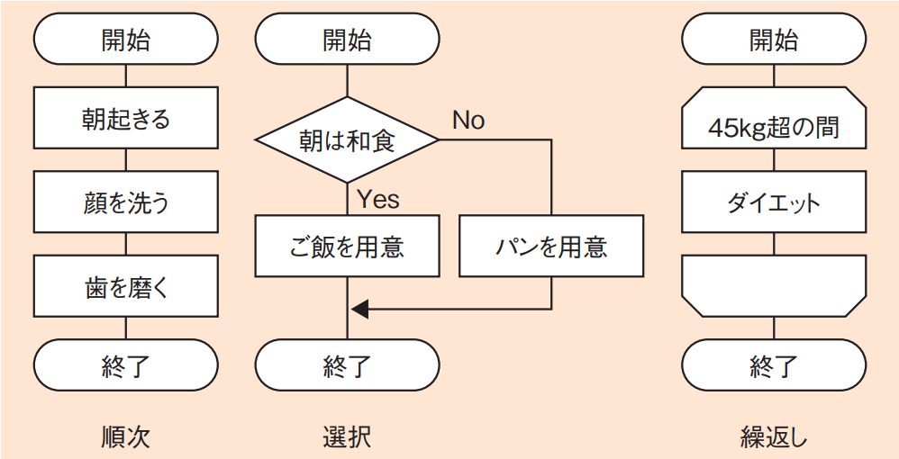
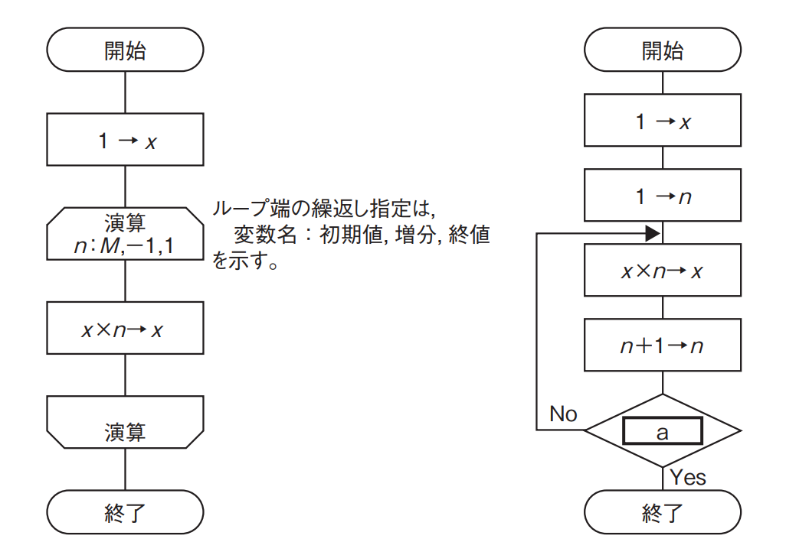
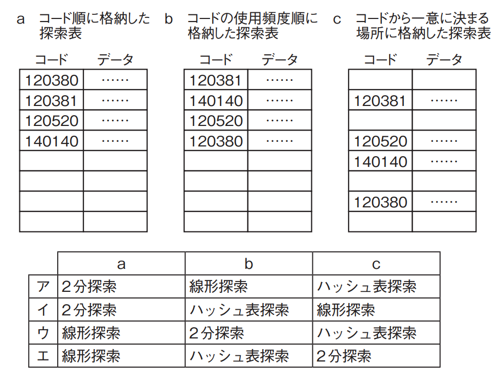

# 1-2-2 アルゴリズム(译: 算法)

- [1-2-2 アルゴリズム(译: 算法)](#1-2-2-アルゴリズム译-算法)
  - [流れ図(フローチャート)(译: 流程图)](#流れ図フローチャート译-流程图)
  - [探索アルゴリズム(译: 搜索算法)](#探索アルゴリズム译-搜索算法)
  - [整列アルゴリズム(译: 排序算法)](#整列アルゴリズム译-排序算法)
  - [再帰のアルゴリズム(译: 递归算法)](#再帰のアルゴリズム译-递归算法)
  - [文字列処理のアルゴリズム(译: 字符串处理算法)](#文字列処理のアルゴリズム译-字符串处理算法)
  - [遺伝的アルゴリズム(译: 遗传算法)](#遺伝的アルゴリズム译-遗传算法)
  - [その他のアルゴリズム(译: 其他算法)](#その他のアルゴリズム译-其他算法)

## 流れ図(フローチャート)(译: 流程图)

- 流れ図(フローチャート): 順次・選択・繰返し(ループ)という基本3構造(ダイクストラが提言したので, **ダイクストラの基本3構造**とも呼ばれる)を用いて, プログラムの骨組みを記述する。
- 図: 流れ図を基本3構造で記述 
- 応用情報技術者試験の午後では, 疑似言語を用いて基本3構造を表現することが多い。このとき, **選択をif**, **繰返しをwhileまたはfor**としてアルゴリズムを表現する。
- **トレース**: プログラミングを1行1行追って確認していくこと。変数の値を1行ごとに確認していくことが大切である。
- 例: 正の整数$M$に対して, 次の二つの流れ図に示すアルゴリズムを実行したとき, 結果$x$の値が等しくなるようにしたい。$a$に入れる条件として, 適切なものはどれか。 
  - ア: $n < M$
  - イ: $n > M - 1$
  - ウ: $n > M$
  - エ: $n > M + 1$

  > 二つの流れ図では, 左が繰返し, 右が選択を用いている。このように, 選択を用いることで, 繰返しと同じような内容を表現することができる。  
  > まず左の流れ図(繰返し)では, ループの繰返し指定で, $n$の初期値が$M$, 増分が$−1$, 終値が$1$となっている。このループの間, $x \times n \to x$という計算を繰り返す。$x$の初期値は$1$なので, ここでの計算結果は以下のようになる。 $x = 1 \times M \times (M - 1) \times (M - 2) \times (M - 3) \times \cdots \cdots \times 3 \times 2 \times 1$  
  > 右の流れ図(選択)で表現されるループは, $n$の初期値が$1$でスタートし, $n + 1 \to n$で$n$を$1$ずつ増やしながら, $x \times n \to x$という計算を繰り返す。$x$の初期値は$1$なので, ここでの計算結果は次のようになる。 $x = 1 \times 2 \times 3  \times \cdots \cdots$  
  > ここで, 左図のループと$x$の値が等しくなるためには, 最後を$M$で終わらせて以下のようにする必要がある。 $x = 1 \times 1 \times 2 \times 3 \times \cdots \cdots \times (M - 3) \times (M - 2) \times (M - 1) \times M$  
  > つまり, $n$が$M$までの間は計算して, $M$を超えたら終了となればOKである。したがって, 空欄aに入れる条件は$n > M$であり, ウが正解である。

## 探索アルゴリズム(译: 搜索算法)

- 探索のアルゴリズム: データの並びの中から目的のものを見つけ出すアルゴリズム。
- 代表的なアルゴリズム

  | アルゴリズム | 説明 | [計算量](../1-1基礎理論/1-1-3情報に関する理論.md#計算量オーダ译-时间复杂度o) |
  | - | - | - |
  | 線形探索 (译: 线性搜索) | データを先頭から順番に探索していく | $n$個のデータで探索を行うと, 平均探索回数は$\frac{n}{2}$回, 計算量は$O(n)$となる。 |
  | 2分探索 (译: 二分查找) | 1. データをあらかじめ整列させておく 2. 最初に真ん中のデータと探索するデータを比較する 3. 二つのデータの関係から前後どちらのグループに目的のデータがあるかを予測し, そのグループの真ん中のデータと比較する | 半分にデータを絞って探索を行うため, $n$回の探索で$2^n$までのデータ数に対応できる。したがって, 計算量は$O(\log n)$となる。 |
  | ハッシュ表探索 (译: 哈希查找) | ハッシュ関数を利用し, データからハッシュ値を求めることによって探索する | 演算ですぐに格納場所が見つかるので, データ量に関係なく計算量は$O(1)$となる |

- シノニム(译: 同义词): 違うデータでハッシュ値が重なる問題のこと。
  - 解決方法
    - チェイン法(译: 拉链法): のシノニムデータを線形リストによって管理する
    - オープンアドレス法(译: 开放定址法): 次の空き位置にデータを格納する
- 例: 探索表の構成法を例とともにa ~ cに示す。最も適した探索手法の組合せはどれか。ここで, 探索表のコードの空欄は表の空きを示す。 

  > a: コード順に格納した探索表の場合  
  > - 線形探索では上から順に単純に見ていくため, 計算量は$O(n)$になる。これに対し, 2分探索を用いると, 真ん中のデータと比較して半分にしていくので計算量が$O(\log n)$となり, 線形探索より効率的である。なお, ハッシュ値で格納されているわけではないので, ハッシュ表探索は使用できない。  
  >
  > b: コードの使用頻度順に格納した探索表の場合  
  > - 線形探索で上から順番に見ていく場合, 一番上に最も使用頻度の高いデータがあるので, 通常の並びに比べて早く見つかる可能性が高くなる。なお, 2分探索は整列されていないデータには使用できず, ハッシュ表探索はハッシュ値を使用していないデータには使用できない。  
  >
  > c: コードから一意に決まる場所に格納した探索表の場合  
  > - コードから一意に決まる場所はハッシュ値によって求められるので, ハッシュ表探索が計算量$O(1)$で使用できる。線形探索でも探索はできるが, データが格納されていない領域などもあるので効率は悪くなる。また, 整列されていないデータなので2分探索は使用できない。  
  >
  > したがって, アが正解である。

## 整列アルゴリズム(译: 排序算法)

- 整列アルゴリズム: 昇順(小さい順)または降順(大きい順)にデータを並び替えるアルゴリズム。
- 代表的なアルゴリズム

  | | アルゴリズム | 説明 | 計算量 |
  | - | - | - | - |
  | 1 | バブルソート (译: 冒泡排序) | **隣り合う要素を比較**して, 大小の順が逆であれば, その要素を入れ替える操作を繰り返す。 | 隣同士を繰り返しすべて比較する $O(n^2)$ |
  | 2 | 挿入ソート (译: 插入排序) | 整列された列に, 新たに要素を一つずつ**適切な位置に挿入**する操作を繰り返す。 | 挿入位置を決めるのに線形探索を行う $O(n^2)$ |
  | 3 | 選択ソート (译: 选择排序) | 未整列の部分列から**最大値(または最小値)を検索**し, それを繰り返すことで整列させていく。 | 最小値の探索を毎回行う $O(n^2)$ |
  | 4 | クイックソート (译: 快速排序) | 最初に**中間的な基準値**を決めて, それよりも大きな値を集めた部分列と小さな値を集めた部分列に要素を振り分ける。その後, それぞれの部分列の中で基準値を決めて, 同様の操作を繰り返す。 | ランダムなデータの場合 $O(n \log n)$ |
  | 5 | シェルソート (译: 希尔排序) | ある**一定間隔おきに取り出した要素**から成る部分列をそれぞれ整列させ, さらに間隔を狭めて同様の操作を繰り返し, 最後に間隔を1にして完全に整列させる。 挿入ソートの発展形で, ざっくり整列させてから細かくしていくので効率が良くなる。 | 間隔は, $15, 7, 3, 1 \cdots \cdots$と, $2^n - 1$で$n$を一つずつ減らして狭めていく $O(n \log n)$ |
  | 6 | [ヒープ](1-2-1データ構造.md#ヒープ译-堆)ソート (译: 堆排序) | 未整列部分で**ヒープ**を構成し, その根から最大値(または最小値)を取り出して整列済の列に移すという操作を繰り返して, 未整列部分をなくしていく。 選択ソートの発展形であり, ヒープを使うことで, 最大値(または最小値)を検索する作業を効率化していく。 | $O(n \log n)$ |
  | 7 | マージソート (译: 归并排序) | 未整列のデータ列を前半と後半に分ける分割操作を, これ以上分割できない, 大きさが1の列になるところまで繰り返す。その後, **分割した前半と後半をマージ(併合)**して, 整列済のデータ列を作成することを繰り返し, 最終的に全体をマージする。 | $O(n \log n)$ |

- 1 ~ 3が基本3ソート
  - 単純ですが時間がかかる
- 4 ~ 7が応用4ソート
  - それぞれアルゴリズムは複雑だが, 速度が改善されて効率良く整列を行うことができる
- 例: 次の手順はシェルソートによる整列を示している。データ列7, 2, 8, 3, 1, 9, 4, 5, 6を手順(1) ~ (4)に従って整列するとき, 手順(3)を何回繰り返して完了するか。ここで, ［　］は小数点以下を切り捨てた結果を表す。 〔手順〕 (1)　“$H \gets [データ数 \div 3]$”とする。 (2)　データ列を, 互いに$H$要素分だけ離れた要素の集まりから成る部分列とし, それぞれの部分列を, 挿入法を用いて整列する。 (3)　“$H \gets [H \div 3]$”とする。 (4)　$H$が$0$であればデータ列の整列は完了し, $0$でなければ(2)
に戻る。

  > 〔手順1回目〕  
  > (①) H = 9 / 3 = 3  
  > (②)-1 データ列を3ごとの部分列とする  
  > 7, **2**, *8*, 3, **1**, *9*, 4, **5**, *6*  
  > (②)-2 それぞれの部分列ごとに整列する  
  > 3, **1**, *6*, 4, **2**, *8*, 7, **5**, *9*  
  > (③) H = 3 / 3 = 1  
  > (④) Hは0ではないので(2)に戻る  
  > 〔手順2回目〕  
  > (②) データ列を1ごとの部分列とし, それぞれの部分列ごとに整列する  
  > 1, 2, 3, 4, 5, 6, 7, 8, 9  
  > (③) H = 1 / 3 = 0  
  > (④) Hは0なのでデータ列の整列は完了になる  
  > したがって, (③)は2回実行されるので, アが正解である。

## 再帰のアルゴリズム(译: 递归算法)

- 再帰: 再び帰る, 自分自身をもう一度呼び出すこと。
  - 関数などで, 呼び出した関数自身を呼び出す場合が再帰に当たる。
- 例: $fact(n)$は, 非負の整数$n$に対して$n$の階乗を返す。$fact(n)$の再帰的な定義はどれか。
  - ア: if $n = 0$ then return $0$ else return $n \times fact(n - 1)$
  - イ: if $n = 0$ then return $0$ else return $n \times fact(n + 1)$
  - ウ: if $n = 0$ then return $1$ else return $n \times fact(n - 1)$
  - エ: if $n = 0$ then return $1$ else return $n \times fact(n + 1)$

> ① $fact(n) = 1 \times 2 \times 3 \times \cdots \times (n - 1) \times n$  
> ② $fact(n - 1) = 1 \times 2 \times 3 \times \cdots \times (n - 1)$  
> ②を①に代入すると  
> $fact(n) = fact(n - 1) \times n$  
> また, $n = 0$のときの$0$の階乗は数学的には$1$と定義されている  
> なので, $fact(n)$は$n = 0$のときには1, それ以外のときには$n \times fact(n - 1)$を返す  
> したがって, ウが正解である。

## 文字列処理のアルゴリズム(译: 字符串处理算法)

- 文字列の探索
  - 単純に前から探索する方法
  - BM法(ボイヤ・ムーア法)
- 文字列の置換
  - 探索の後に行われる, 基本的に文字列探索と同じアルゴリズムである。

## 遺伝的アルゴリズム(译: 遗传算法)

- 遺伝的アルゴリズム: 生物の進化論を利用し, 進化を模倣することで最適化問題を解く手法
- 与えられた問題の解の候補を記号列で表現して, それを遺伝子に見立てて突然変異, 交配, とう汰を繰り返して逐次的により良い解に近づけていく。

## その他のアルゴリズム(译: 其他算法)

- グラフのアルゴリズム
- 近似・確率統計などの数学的なアルゴリズム
- データ圧縮のアルゴリズム
- 図形描画のアルゴリズム
- メモリ管理のアルゴリズム
