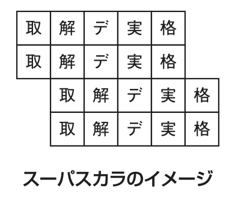
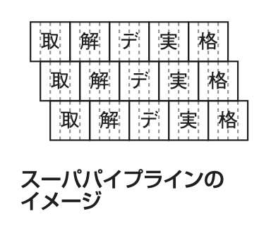
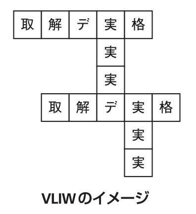

# 2-1-1 プロセッサ(译: 处理器)

- [2-1-1 プロセッサ(译: 处理器)](#2-1-1-プロセッサ译-处理器)
  - [プロセッサの種類(译: 处理器的种类)](#プロセッサの種類译-处理器的种类)
  - [命令のステージと実行手順(译: 命令的阶段和执行步骤)](#命令のステージと実行手順译-命令的阶段和执行步骤)
  - [プロセッサの高速化技術(译: 处理器的加速技术)](#プロセッサの高速化技術译-处理器的加速技术)
  - [マルチプロセッサ(译: 多处理器)](#マルチプロセッサ译-多处理器)
  - [プロセッサの省電力技術(译: 处理器的省电技术)](#プロセッサの省電力技術译-处理器的省电技术)
  - [プロセッサの性能指標(译: 处理器的性能指标)](#プロセッサの性能指標译-处理器的性能指标)
  - [割込み(译: 中断)](#割込み译-中断)
  - [エンディアン(译: 端序)](#エンディアン译-端序)

## プロセッサの種類(译: 处理器的种类)

- コンピュータの中心として汎用的に用いられるCPU以外にも, それぞれの役割に特化したプロセッサがある。
- 代表的なプロセッサ

  | 代表的なプロセッサ | 説明 |
  | - | - |
  | **DSP**(Digital Signal Processor) (译: 数字信号处理器) | A/D変換など, ディジタル信号処理に特化したプロセッサ |
  | **FPU**(Floating Point Unit) (译: 浮点运算器) | 浮動小数点演算に特化したプロセッサ |
  | **GPU**(Graphics Processing Unit) (译: 图形处理器) | $\bullet$画像処理のための行列演算を行うプロセッサ $\bullet$ 画像処理以外の汎用の行列演算でも利用でき, ディープラーニングなどの演算に用いられる |

## 命令のステージと実行手順(译: 命令的阶段和执行步骤)

- プロセッサは, 一つの命令を実行するまでにやることはいくつもあり, それぞれをステージと呼ぶ。
- 代表的なステージ

  | 順番| 代表的なステージ | 略称 | 説明 |
  | - | - | - | - |
  | 1 | **命令の取り出し** (译: 提取) | 取 | 実行する命令を記憶装置(またはキャッシュメモリ)から1行取り出す |
  | 2 | **命令の解読** (译: 解码) | 解 | 制御装置で命令を解読して, 何を行うかを知る |
  | 3 | **データの取り出し** (译: 访存) | デ | 記憶装置(またはキャッシュメモリ)から, 命令の実行に使うデータを演算装置に取り出す |
  | 4 | **命令の実行** (译: 执行) | 実 | 演算装置で命令を実行する |
  | 5 | **結果の格納** (译: 写回) | 格 | 演算結果を記憶装置(またはキャッシュメモリ)に格納する |

## プロセッサの高速化技術(译: 处理器的加速技术)

- 高速化する一番単純な方法は,  クロック周波数(1秒間に実行されるクロック(ステージ)の数)を上げることである。
- 限界があるので, 以下のような高速化技術が考えられた。

  | 高速化技術 | 説明 | イメージ |
  | - | - | - |
  | **パイプライン** (译: 流水线) | $\bullet$ 命令のステージを一つずつずらして, 同時に複数の命令を実行させる方法 $\bullet$ 分岐命令などで順番が変わると, **パイプラインハザード**(译: 流水线冒险)が発生し, 処理のやり直しとなる |  |
  | **スーパスカラ** (译: 超标量) | $\bullet$ パイプラインのステージを複数同時に実行させることで効率化を実現する $\bullet$ 演算の割当てはハードウェアによって動的に行う |  |
  | **スーパパイプライン** (译: 超流水线) | $\bullet$ パイプラインをさらに細分化して, 一度に実行できる命令数を増やす方法 $\bullet$ Pentium4では一つの命令を20ステージに分ける。 |  |
  | **VLIW**(Very Long Instruction Word：超長命令語) (译: 超长指令字) | 命令語を長くすることで, 一つの命令で複数の機能を一度に実行できるようにしたもの |  |

- 例: スーパスカラの説明として, 適切なものはどれか。
  - ア: 処理すべきベクトルの長さがベクトルレジスタよりも長い場合, ベクトルレジスタ長の組に分割して処理を繰り返す方式である。
  - イ: パイプラインを更に細分化することによって, 高速化を図る方式である。
  - ウ: 複数のパイプラインを用い, 同時に複数の命令を実行可能にすることによって, 高速化を図る方式である。
  - エ: 命令語を長く取り, 一つの命令で複数の機能ユニットを同時に制御することによって, 高速化を図る方式である。

  > スーパスカラは, 複数のパイプラインを用いて同時に複数の命令を実行する。  
  > したがって, ウが正解である  
  > ア: ベクトルプロセッサに関する説明である。  
  > イ: スーパパイプラインの説明である。  
  > エ: VLIWの説明である。

## マルチプロセッサ(译: 多处理器)

- マルチプロセッサ: 複数のプロセッサを同時に稼働させて高速化を図る。
- マルチプロセッサの結合方式

  | マルチプロセッサの結合方式 | 説明 |
  | - | - |
  | **密結合マルチプロセッサ** | $\bullet$ 複数のプロセッサが, **メモリ(主記憶)を共有**するもの $\bullet$ 現在のCPU高速化技術の主流となっている $\bullet$ 例: **マルチコアプロセッサ**(译: 多核处理器): 一つに見えるプロセッサの中に複数のプロセッサ(コア)を封入 |
  | **疎結合マルチプロセッサ** | $\bullet$ 複数のプロセッサに別々のメモリを割り当てたもの $\bullet$ 複数の独立したコンピュータシステムがあるのと同じなので, その間に高速な通信システムを用いてデータのやり取りを行う $\bullet$ 例: **クラスタシステム**(译: 集群系统) |

## プロセッサの省電力技術(译: 处理器的省电技术)

  | プロセッサの省電力技術 | 説明 |
  | - | - |
  | クロックゲーティング (译: 时钟门控) | 動作していない回路ブロックへのクロック供給を停止する |
  | **パワーゲーティング** (译: 电源门控) | 動作していない回路ブロックへの電源供給を遮断する |

## プロセッサの性能指標(译: 处理器的性能指标)

- 代表的な性能指標

  | 代表的な性能指標 | 説明 |
  | - | - |
  | **MIPS**(Million Instructions Per Second) (译: 每秒百万指令) | $\bullet$ **1秒間に何百万個の命令が実行できるか**を表す $\bullet$ PCやサーバなどのプロセッサの性能を表すときによく用いられる指標 $\bullet$ 分岐のないプログラムを実行させたときのピーク値を示すため, 実際のアプリケーションを動かした場合の性能とは異なる |
  | **FLOPS**(Floating-point Operations Per Second) (译: 每秒浮点运算次数) | $\bullet$ 1秒間に浮動小数点演算が何回できるかを表す $\bullet$ 科学技術計算やシミュレーションを行うスーパーコンピュータ, ゲーム機などの性能を表すのによく用いられる |

- 例: 表に示す命令ミックスによるコンピュータの処理性能は, 何MIPSか。

  | 命令種別 | 実行速度(ナノ秒) | 出現頻度(%) |
  | - | - | - |
  | 整数演算命令 | 10 | 50 |
  | 移動命令 | 40 | 30 |
  | 分岐命令 | 40 | 20 |

  - ア: 11
  - イ: 25
  - ウ: 40
  - エ: 90

  > ① 1命令当たりの実行時間を求める  
  > $10[ナノ秒] \times 50 \% + 40[ナノ秒] \times 30 \% + 40[ナノ秒] \times 20 \% = 25[ナノ秒] = 25 \times 10^{-9}[秒]$  
  > $MIPS(= 10^6 命令/秒)$をを求める  
  > $1 \div (25 \times 10^{-9}[秒]) = 0.04 \times 10^9[命令/秒] = 40 \times 10^6 命令/秒 = 40[MIPS]$  
  > したがって, ウが正解である。

## 割込み(译: 中断)

- 割込み: 現在実行中のプログラムを中断して別の処理を行うこと。

  | 割込みの種類 | 説明 | 例 |
  | - | - | - |
  | **内部割込み** | $\bullet$ 実行しているプログラムの内部からの割込み $\bullet$ ソフトウェア割込みともいう |  $\bullet$ **プログラム割込み**(译: 程序中断): プログラム内で0の割り算やオーバフローが起こったときに発生する $\bullet$ **SVC割込み**(译: 管理程序调入中断): プログラムがOSに処理を依頼するときに行われる $\bullet$ **ページフォールト**(译: 页缺失): 仮想記憶管理において存在しないページにアクセスするときに行われる |
  | **外部割込み** | ハードウェア割込みともいう |  $\bullet$ **タイマ割込み**(译: 计时器中断): タイマから行われる $\bullet$ **機械チェック割込み**(译: 机器检查中断): ハードウェアの異常が検出されたときに行われる $\bullet$ **入出力割込み**(译: 输入输出中断): キーボードなどの入出力装置から行われる $\bullet$ **コンソール割込み**(译: 控制台中断): コンソールからスイッチが行われたときに発生する |

## エンディアン(译: 端序)

- エンディアン: 複数バイトのデータを格納するときに, それをメモリに配置する方式である。
  - バイトオーダ(译: 字节序)もという。
- **ビッグエンディアン**(译: 大端序): データの上位バイトから順番にメモリに並べる方式
- **リトルエンディアン**(译: 小端序): データの下位バイトから順番にメモリに並べる方式
- 例: 主記憶の1000番地から, 表のように4バイトの整数データが格納されている。これを32ビットのレジスタにロードするとき, プロセッサのエンディアンとレジスタにロードされる数値との組合せとして, 正しいものはどれか。

  | バイトアドレス | データ |
  | - | - |
  | 1000 | 00 |
  | 1001 | 01 |
  | 1002 | 02 |
  | 1003 | 03 |

  - 選択肢

    |  | リトルエンディアン | ビッグエンディアン |
    | - | - | - |
    | ア | 00010203 | 02030001 |
    | イ | 00010203 | 03020100 |
    | ウ | 02030001 | 00010203 |
    | エ | 03020100 | 00010203 |

  > ① リトルエンディアンでは, 下位バイト, つまりバイトアドレスが大きい方(1003番地)から順に1003番地, 1002番地……とデータを並ぶ。  
  > リトルエンディアンでロードされる数値は, 03020100である。  
  > ② ビックエンディアンでは, 上位バイト, つまりバイトアドレスが小さい方(1000番地)から順に1000番地, 1001番地……とデータを並を並ぶ。  
  > ビックエンディアンでロードされる数値は, 0010203である。  
  > したがって, エが正解である。
