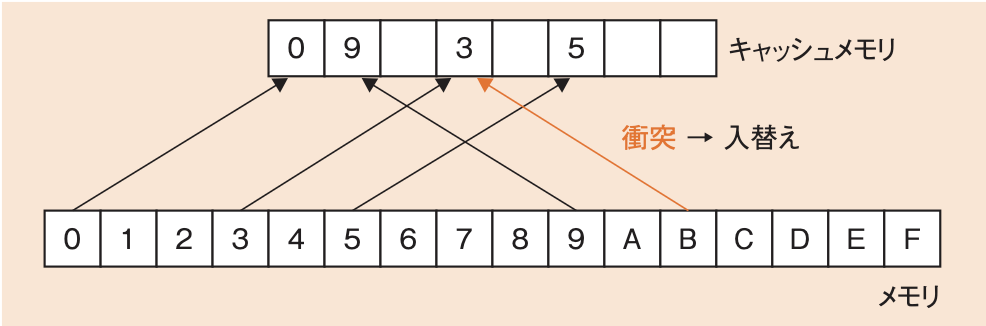
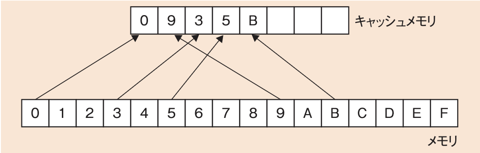
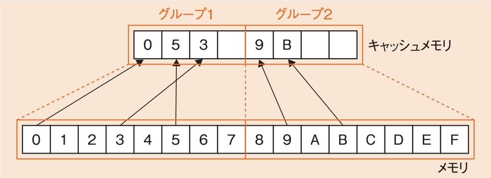
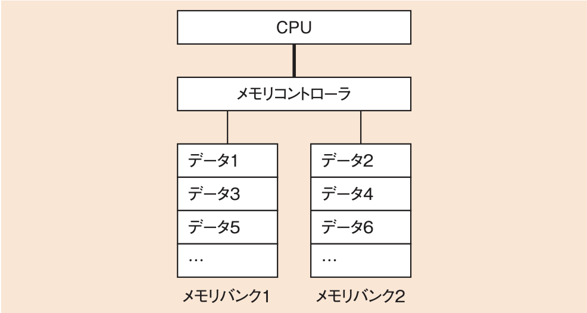

# 2-1-2 メモリ(译: 存储器)

- [2-1-2 メモリ(译: 存储器)](#2-1-2-メモリ译-存储器)
  - [主記憶装置の種類(译: 主存储器的种类)](#主記憶装置の種類译-主存储器的种类)
  - [RAM(译: 随机存取存储器)](#ram译-随机存取存储器)
  - [ROM(译: 只读存储器)](#rom译-只读存储器)
  - [キャッシュメモリ(译: 高速缓存存储器)](#キャッシュメモリ译-高速缓存存储器)
  - [キャッシュメモリのデータ格納方法(译: 高速缓存存储器的数据存放方式)](#キャッシュメモリのデータ格納方法译-高速缓存存储器的数据存放方式)
  - [キャッシュメモリのデータ更新方式(译: 高速缓存存储器的数据更新方式)](#キャッシュメモリのデータ更新方式译-高速缓存存储器的数据更新方式)
  - [キャッシュメモリのヒット率(译: 高速缓存存储器的命中率)](#キャッシュメモリのヒット率译-高速缓存存储器的命中率)
  - [メモリインタリーブ(译: 交错内存)](#メモリインタリーブ译-交错内存)
  - [記憶領域の管理方式(译: 存储区域的管理方式)](#記憶領域の管理方式译-存储区域的管理方式)

---

- メモリ(記憶装置): コンピュータにおいて情報の記憶を行う装置である。
  - 主記憶装置: プロセッサが直接アクセスできる
  - 補助記憶装置: それ以外

## 主記憶装置の種類(译: 主存储器的种类)

- **RAM**(Random Access Memory)(译: 随机存取存储器): 読み書きが自由
- **ROM**(Read Only Memory)(译: 只读存储器): 読出し専用

## RAM(译: 随机存取存储器)

- **電源の供給がなくなると内容が消えてしまう**
  - 揮発性メモリとも呼ばれる
  - 電源を切った後も保存しておきたい情報は補助記憶装置に退避させておき, 必要に応じてメモリに呼び出す。
- DRAMとSRAM
  - **DRAM**(Dynamic RAM)(译: 动态随机存储器): 一定時間たつとデータが消失してしまう
  - **SRAM**(Static RAM)(译: 静态随机存储器): 電源を切らない限り内容を保持している

  | 特徴 | DRAM | SRAM |
  | - | - | - |
  | リフレッシュ | 必要 | **不要** |
  | 速度 | 低速 | **高速** |
  | 電力消費 | 高消費電力 | **低消費電力** |
  | コスト | **安価** | 高価 |
  | 容量  | **大容量** | 小容量 |
  | 用途 | **メモリ** | **キャッシュメモリ** |

- 主記憶装置に使う**メモリ**には, コストと容量の関係でDRAMが用いられる。しかし, プロセッサがメモリに直接アクセスすることが多くなると処理速度の低下が起こるので, 高速な**キャッシュメモリ**を間に置いて両者のギャップを埋める。
  - このキャッシュメモリにはSRAMが用いられる。
- メモリに用いられるDRAMは, 現在ではほとんどが, システムのバスと同期して動作するSDRAM(Synchronous DRAM)(译: 同步动态随机存储器)となっている。

## ROM(译: 只读存储器)

- ROM: 基本的に読出し専用の記憶装置である。
  - 種類によっては全消去, 書込み, 追記が可能なことがある。
- 電気の供給がなくても記憶を保持できる
  - 不揮発性メモリとも呼ばれる
- マスクROMとPROM
  - **マスクROM**(译: 掩模ROM): 書換えが不可能
  - **PROM**(Programmable ROM)(译: 可编程ROM): 書込みが可能
- 書込みが可能なROMは, 記憶を保持する機器として様々な場面で利用されている。
  - **フラッシュメモリ**(译: 快闪存储器, 闪存): ブロック単位での消去や書込みを行う
  - **相変化メモリ**(译: 相变化存储器): 晶状態と非結晶状態の違いを利用して情報を記憶する

## キャッシュメモリ(译: 高速缓存存储器)

- キャッシュメモリ: プロセッサとメモリの性能差を埋めるために両者の間で用いるメモリである。
- 高速である必要があるため, **SRAM**が用いられる。
- CPUのチップ内に取り込まれ, 内蔵されることが一般的である。
- データの格納方法や更新方式に様々なアーキテクチャを採用している。
- キャッシュメモリを多段構成にして, CPUに近い順に1次キャッシュ, 2次キャッシュとするものが多く見られる。

## キャッシュメモリのデータ格納方法(译: 高速缓存存储器的数据存放方式)

- キャッシュメモリでデータを管理するときには, ブロックと呼ばれる一定長の単位にまとめる。
- メモリのデータがキャッシュメモリのどの部分にあるのかを管理する方法

  | 方法 | 説明 | イメージ図 |
  | - | - | - |
  | **ダイレクトマップ方式** (译: 直接相联方式) | $\bullet$ メモリのアドレスごとに, キャッシュメモリの格納場所が一つに決まる方式 $\bullet$ メモリのアドレスさえ分かれば場所が特定できるので検索は容易だが, その分データの衝突が起こりやすくなり, ヒット率が下がる |  |
  | **フルアソシアティブ方式** (译: 全相联方式) | $\bullet$ アドレスによる振分けを行わず, キャッシュメモリの空いているブロックならどこでも使える方式 $\bullet$ キャッシュメモリがいっぱいになるまでデータの衝突は起こらないが, データの使用時に毎回, すべてのブロックを検索する必要があるため, 応答速度に問題が出てくる |  |
  | **セットアソシアティブ方式** (译: 组相联映象方式) | キャッシュメモリを複数のグループに分け, そのグループ内でならどこでも使える |  |

- セットアソシアティブ方式とフルアソシアティブ方式では, **連想メモリ**(CAM: Content Addressable Memory)(译: 内容可寻址内存)を使用することで検索を高速化する。
- 例: キャッシュメモリにおけるダイレクトマップ方式の説明として, 適切なものはどれか。
  - ア: アドレスが連続した二つ以上のメモリブロックを格納するセクタを, キャッシュ内の任意のロケーションに割り当てる。
  - イ: 一つのメモリブロックをキャッシュ内の単一のロケーションに割り当てる。
  - ウ: メモリブロックをキャッシュ内の任意のロケーションに割り当てる。
  - エ: メモリブロックをキャッシュ内の二つ以上の配置可能なロケーションに割り当てる。

  > ダイレクトマップ方式では, メモリブロックに対して格納場所(ロケーション)は一つに決まる。  
  > したがって, イが正解である。  
  > ウ: 任意のロケーションに割り当てる方式がフルアソシアティブ方式である。  
  > エ: 二つ以上の配置可能なロケーションに割り当てる方式がセットアソシアティブ方式である。

## キャッシュメモリのデータ更新方式(译: 高速缓存存储器的数据更新方式)

- プロセッサがキャッシュメモリのデータを更新した場合, その内容をメモリに反映させる必要がある。しかし, メモリにアクセスするのには時間がかかり, 毎回アクセスしていると効率が悪くなる。
- 更新方式

  | 更新方式 | 説明 |
  | - | - |
  | **ライトスルー方式** (译: 写直达) | $\bullet$ プロセッサがキャッシュメモリに書込みを行ったとき, その内容を同時にメモリにも転送する方式 $\bullet$ 単位時間の処理量であるスループット(译: 吞吐量)が悪くなるという制約があるが, **コヒーレンシ**(データの一貫性)(译: 一致性)は保たれる |
  | **ライトバック方式** (译: 写返回) | $\bullet$ プロセッサがキャッシュメモリに書き込んでも, すぐにはメモリに転送しない方式 $\bullet$ キャッシュメモリのデータがメモリに追い出されるなど, 条件を満たした場合にのみメモリに書き込まれる $\bullet$ スループットは良くなるが, コヒーレンシが保たれないことがある |

- 例: 主記憶アクセスの高速化技術であるライトバック方式における, キャッシュメモリ及び主記憶への書込みの説明として, 適切なものはどれか。
  - ア: キャッシュメモリ及び主記憶の両方に同時に書き込む。
  - イ: キャッシュメモリにだけ書き込み, 対応する主記憶の更新は, キャッシュメモリからデータが追い出されるときに行う。
  - ウ: キャッシュメモリへの書込みと同時にバッファに書き込んだ後, バッファから主記憶へ順次書き込む。
  - エ: 主記憶を, 独立して動作する複数のブロックに分けて, 各ブロックに並列に書き込む。

  > ライトバック方式では, 更新があったときにはキャッシュメモリにだけ書込みを行う。その後, 主記憶の更新は, キャッシュメモリのデータが追い出されるときなどに行う。  
  > したがって, イが正解である。  
  > ア: ライトスルー方式である。  
  > エ: メモリインタリーブの説明である。  
  > ウ: ウのようなバッファは, キャッシュメモリと主記憶の間にはない。

## キャッシュメモリのヒット率(译: 高速缓存存储器的命中率)

- キャッシュメモリの**ヒット率**: キャッシュメモリを用いてCPUとメモリがやり取りするとき, データがキャッシュメモリ上にある確率である。
- **実効アクセス時間**: データがキャッシュメモリに存在する場合もしない場合も含めた, 平均的なアクセス時間である。
- $実効アクセス時間 = キャッシュメモリへのアクセス時間 \times ヒット率 + メモリへのアクセス時間 \times (1 - ヒット率)$

## メモリインタリーブ(译: 交错内存)

- **メモリインタリーブ**: キャッシュメモリ以外の, CPUとメモリのデータ転送を高速化する技術
- データを複数のメモリバンクに順番に分割して配置しておく。データを読み出すときには, その複数のメモリバンクにほぼ同時にアクセスすることで, 効率良くデータを取り出す。
- 図: メモリインタリーブのイメージ 
- 例: メモリインタリーブの説明として, 適切なものはどれか。
  - ア: 主記憶と外部記憶を一元的にアドレス付けし, 主記憶の物理容量を超えるメモリ空間を提供する。
  - イ: 主記憶と磁気ディスク装置との間にバッファメモリを置いて, 双方のアクセス速度の差を補う。
  - ウ: 主記憶と入出力装置との間で CPU とは独立にデータ転送を行う。
  - エ: 主記憶を複数のバンクに分けて, CPU からのアクセス要求を並列的に処理できるようにする。

  > メモリインタリーブは, CPUと主記憶(メモリ)のデータ転送を高速化する技術である。主記憶の連続したアドレスを複数のバンクに分けて, 並列的にアクセスすることで高速化を行う。  
  > したがって, エが正解である。  
  > ア: 仮想記憶(译: 虚拟内存)の説明である。  
  > イ: ディスクキャッシュ(译: 磁盘高速缓存)の説明である。  
  > ウ: DMA(Direct Memory Access)(译: 直接内存访问)の説明である。

## 記憶領域の管理方式(译: 存储区域的管理方式)

- メモリやキャッシュメモリなどの記憶領域を割り当てるときには, どの領域にどのデータを割り当てるのかを管理する必要がある。
- 記憶領域を管理するアルゴリズムの代表例

  | 記憶領域を管理するアルゴリズム | 説明 |
  | - | - |
  | **ファーストフィット方式** (译: 首次适应算法) | 記憶領域の空き領域をアドレスの下位から順に検索し, 最初に見つかった空き領域を割り当てる |
  | **ベストフィット方式** (译: 最佳适应算法) | 空き領域のうち, 要求された大きさを満たす最小のものを割り当てる |
