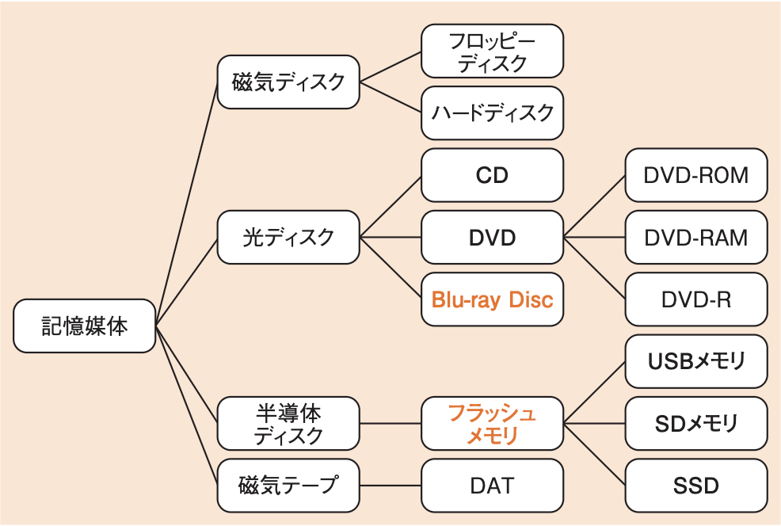

# 2-1-5 入出力装置(译: 输入输出装置)

- [2-1-5 入出力装置(译: 输入输出装置)](#2-1-5-入出力装置译-输入输出装置)
  - [入力装置(译: 输入装置)](#入力装置译-输入装置)
  - [出力装置(译: 输出装置)](#出力装置译-输出装置)
  - [ディスプレイの種類(译: 显示器的种类)](#ディスプレイの種類译-显示器的种类)
  - [3D映像の立体視を可能とする仕組み(译: 实现3D影像立体视觉的机制)](#3d映像の立体視を可能とする仕組み译-实现3d影像立体视觉的机制)
  - [補助記憶装置(译: 辅助存储装置)](#補助記憶装置译-辅助存储装置)

---

- プログラム内蔵方式の装置では, 入力装置でデータを入力し, 出力装置でデータを出力する。さらに, 記憶装置のデータを永続的に保存しておくために補助記憶装置を使用する。

## 入力装置(译: 输入装置)

- 入力装置には, キーボード, マウス, トラックボール, タブレットなどがある。
  - タッチスクリーンなど, 画面に直接触れて入力するものも入力装置である。
- スキャナやOCR(Optical Character Reader)(译: 光学字符阅读器), OMR(Optical Mark Reader)(译: 光学标记阅读器), バーコード読取り装置など, 入力したデータを変換するものもある。
- 生体認証装置やICカード読取り装置なども入力装置である。

## 出力装置(译: 输出装置)

- ディスプレイやプリンタ, プロジェクタなどががある。

## ディスプレイの種類(译: 显示器的种类)

| ディスプレイの種類 | 説明 | 特徴 |
| - | - | - |
| STN(Super-Twisted Nematic)液晶ディスプレイ (译: 超扭曲向列型液晶显示器) | 単純マトリクス方式を採用したディスプレイ | 単純マトリクス方式とは, X軸方向とY軸方向の2方向から電圧をかけて, 交点の液晶を駆動させる方式である。 |
| **TFT(Thin Film Transistor)液晶ディスプレイ** (译: 薄膜晶体管液晶显示器) | 薄型トランジスタを用い, アクティブマトリクス方式を採用したディスプレイ | アクティブマトリクス方式とは, 単純マトリクス方式に加え, 各液晶にアクティブ素子を配置させた方式である。 |
| **有機EL(Electro-Luminescence)ディスプレイ** (译: 有机发光二极管显示器) | ELとは電圧をかけると発光する物理現象であり, 有機発光素子を利用したものが有機ELディスプレイ | 低電力で高い輝度を得ることができる。 |

## 3D映像の立体視を可能とする仕組み(译: 实现3D影像立体视觉的机制)

  | 3D映像の立体視を可能とする仕組み | 説明 | 特徴 |
  | - | - | - |
  | アクティブシャッタ方式 (译: 主动快门式方式) | 利用者が眼鏡を利用することで, 遠近感を伴う映像を表現する方式 | 右目用と左目用の映像を用意し, 交互に表示する。映像の切替えのタイミングに合わせて, 左右交互に映像を透過／遮断と繰り返すことで, 立体視が可能となる |
  | アナグリフ方式 (译: 偏振方式) | 片方の目に赤色, もう片方の目に青色のフィルタを付けた眼鏡を利用する方式 | ディスプレイに赤色と青色で右目用, 左目用の映像を重ねて描画することで, 立体視を可能とする |
  | パララックスバリア方式 (译: 视差屏障方式) | 眼鏡を利用しない方式 | 専用の特殊なディスプレイに右目用, 左目用の映像を同時に描画し, 網目状のフィルタを用いてそれぞれの映像が右目と左目に入るようにして, 裸眼立体視を可能とする |

## 補助記憶装置(译: 辅助存储装置)

- 補助記憶装置には, 以下の図に示すようにいろいろな記憶媒体(リムーバブルメディア)がある。
- 図: 補助記憶媒体の種類 

| 補助記憶装置 | 説明 | 特徴 |
| - | - | - |
| ハードディスク (译: 硬盘) | 磁性体を塗布した円盤を重ねた記憶媒体 | 数Tバイト程度の大容量のデータを格納することができる |
| CD(Compact Disc) (译: 光盘) | ディジタル情報を記録するための光ディスクの一種である | データの変更ができない**CD-ROM**や, 追記のみ可能なCD-R, 書換え可能な**CD-RW**などがある |
| DVD(Digital Versatile Disc) (译: 数字多功能光盘) | CDとほぼ同じ形式であり, CDよりはるかに大きい記憶容量をもつ光ディスクである | $\bullet$ CDは700Mバイト程度が限界であるのに対し, DVDは片面1層で4.7Gバイト, 両面2層で17.08Gバイトの容量を持つ $\bullet$ データの変更ができない**DVD-ROM**や, 追記のみ可能な**DVD-R**やDVD+R, 書換え可能な**DVD-RW**やDVD-RAM, DVD+RWなどがある |
| **Blu-ray Disc** (译: 蓝光光盘) | 青紫色半導体レーザーを使用する光ディスクである | $\bullet$ DVDより大容量で, 一層で25Gバイト, 二層で50Gバイトを実現している。 $\bullet$ データの変更ができない**BD-ROM**や, 追記のみ可能な**BD-R**, 書換え可能な**BD-RE**がある。 |
| **フラッシュメモリ** (译: 闪存) | 書換え可能で, 電源を切ってもデータが消えない半導体メモリである | $\bullet$ EEPROMの一種である。 $\bullet$ 記憶媒体としても, **USBメモリ**や**SDメモリカード**, **SSD**(Solid StateDrive), メモリスティックなど様々な形態で用いられている。 $\bullet$ SDメモリカードには, 上位規格として, SDHC(SD HighCapacity)と**SDXC**(SD eXtended Capacity)がある。 $\bullet$ SDHCは, ファイルシステムにFAT32を採用し, 最大32Gバイトの容量を持つ。 $\bullet$ SDXCは, ファイルシステムにexFATを採用することで, 最大2Tバイトの容量を実現している。 |
| DAT(Digital Audio Tape) (译: 数字音频磁带) | 磁気テープの規格の一つである | $\bullet$ ディジタル音声データを録音するための規格だが, データのバックアップなどでも用いられる。 $\bullet$ **DDS**(Digital Data Storage)とも呼ばれる。 $\bullet$ DAT72では36Gバイト, DAT320では160Gバイトのデータを記録可能である。 |
