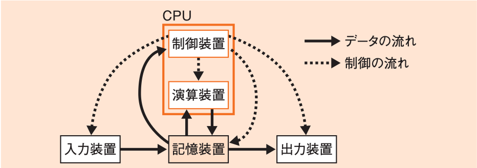

# 2-1 コンピュータ構成要素

- [2-1-1 プロセッサ](2-1-1プロセッサ.md)
- [2-1-2 メモリ](2-1-2メモリ.md)
- [2-1-3 バス](2-1-3バス.md)
- [2-1-4 入出力デバイス](2-1-4入出力デバイス.md)
- 2-1-5 入出力装置

---

- 現在のコンピュータのほとんどは, プログラム内蔵方式である。
  - プログラム内蔵方式: コンピュータの内部にプログラムを保存することで様々な処理を行うことができる。
  - 図: プログラム内蔵方式 
  - プログラム内蔵方式によるコンピュータを構成する要素

    | 構成する要素 | 説明 |
    | - | - |
    | **演算装置** | 演算を行う |
    | **制御装置** | プログラムの制御を行う |
    | **記憶装置** | プログラムやデータを記憶する |
    | **入力装置** | 外部からデータやプログラムを入力する |
    | **出力装置** | 外部に結果を出力する |
    | **バスや入出力デバイス** | 装置をつなぐための経路 |

  - CPU(Central Processing Unit)
    - 演算装置と制御装置
    - コンピュータの心臓部に当たるハードウェアである。
  - メモリ
    - 記憶装置
    - 入力したデータ, 出力するデータ, CPUで演算するデータがすべて格納される。
    - レジスタ(译: 寄存器): 記憶装置の一部で, CPUと直結した, 速度が最速のものである。
