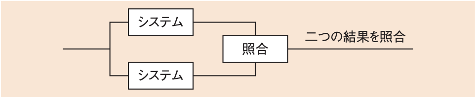
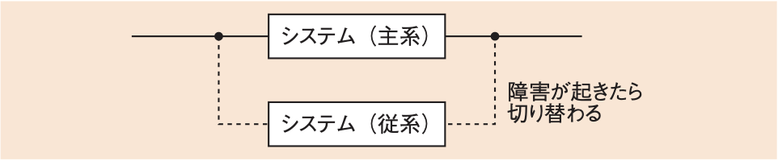
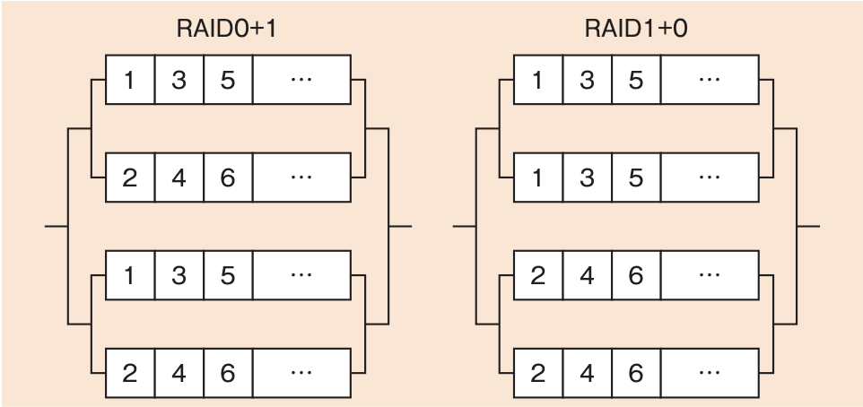
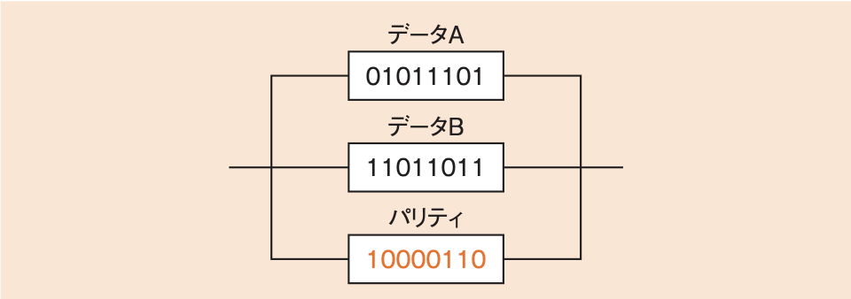

# 2-2-1 システムの構成(译: 系统的构成)

- [2-2-1 システムの構成(译: 系统的构成)](#2-2-1-システムの構成译-系统的构成)
  - [システム構成の基本(译: 系统构成的基础)](#システム構成の基本译-系统构成的基础)
  - [クライアントサーバシステム(译: 客户端-服务器系统)](#クライアントサーバシステム译-客户端-服务器系统)
  - [RAID(译: 冗余磁盘阵列)](#raid译-冗余磁盘阵列)
  - [信頼性設計(译: 可靠性设计)](#信頼性設計译-可靠性设计)
  - [いろいろなシステム構成(译: 各种系统构成)](#いろいろなシステム構成译-各种系统构成)
  - [HPC(译: 高性能计算)](#hpc译-高性能计算)
  - [ストレージ(译: 存储)](#ストレージ译-存储)
  - [仮想化技術(译: 虚拟化技术)](#仮想化技術译-虚拟化技术)

## システム構成の基本(译: 系统构成的基础)

- システム構成の基本は, 2台のシステムを接続する**デュアルシステム**(译: 双机系统)と**デュプレックスシステム**(译: 双工系统)である。
- **デュアルシステム**
  - 二つのシステムを用意し, **並列して同じ処理を走らせ**て, 結果を比較する方式である。
  - 結果を比較することで高い信頼性が得られる。
  - 一つのシステムに障害が発生しても, もう一つのシステムで処理を続行することができる。
  - 図: デュアルシステムのイメージ 
- **デュプレックスシステム**
  - 二つのシステムを用意するが, 普段は一つのシステムのみ稼働させて, もう一方は待機させておく。
    - 稼働させるシステムを主系(現用系), 待機させるシステムを従系(待機系)と呼ぶ。
  - 図: デュプレックスシステムのイメージ 
  - 従系の待機のさせ方によって三つのスタンバイ方式がある。

    | 従系のスタンバイ方式 | 説明 | 特徴 |
    | - | - | - |
    | **ホットスタンバイ** (译: 热备份) | 従系のシステムを**常に稼働可能な状態で**待機させておく | $\bullet$ サーバを立ち上げておき, アプリケーションやOSなどもすべて主系のシステムと同じように稼働させておく $\bullet$ 主系に障害が発生した場合には, すぐに従系への切替えが可能であ。 $\bullet$ 故障が起こったときに自動的に従系に切り替えて処理を継続することを**フェールオーバ**(译: 故障转移)という |
    | ウォームスタンバイ (译: 温备份) | 従系のシステムを本番と同じような状態で用意してあるが, すぐに稼働はできない状態で待機させておく | サーバは立ち上がっているものの, アプリケーションは稼働していないか別の作業を行っているかで, 切替え少し時間がかかる |
    | コールドスタンバイ (译: 冷备份) | 従系のシステムを, 機器の用意だけをして稼働せずに待機させておく | $\bullet$ 源を入れずに予備機だけを用意しておいて, 障害が発生したら電源を入れて稼働し, 主系の代わりになるように準備する $\bullet$ 主系から従系への切替えに最も時間がかかる方法である |

## クライアントサーバシステム(译: 客户端-服务器系统)

- クライアントサーバシステム: ライアントとサーバでそれぞれ役割分担して, 協力して処理を行うシステムである。
- 3層クライアントサーバシステム
  - その役割を**プレゼンテーション層**, **ファンクション層**(アプリケーション層/ロジック層), **データベースアクセス層**に分けている。それぞれの役割をクライアントとサーバのどちらが行うかは, システムの形態によって異なる。
    - **プレゼンテーション層**(译: 表示层): ユーザインタフェースを受けもつ層である。
    - **ファンクション層**(译: 功能层): メインの処理やビジネスロジックを受けもつ層である。
    - **データベースアクセス層**(译: 数据库层): データ管理を受けもつ層である。
  - 図: 3層クライアントサーバシステム 
- 例: ストアドプロシージャの特徴を生かして通信回線を減らしたシステムをクライアントサーバシステムで実現するとき, クライアントとサーバの機能分担構成はどれか。ここで, データベースアクセス層はDB層, ファンクション層はFN層, プレゼンテーション層はPR層とそれぞれ略す。
  - 選択肢

    |  | クライアント | サーバ |
    | - | - | - |
    | ア | DB 層とFN 層とPR 層 | DB 層 |
    | イ | FN 層とPR 層  | DB 層とFN 層 |
    | ウ | FN 層とPR 層  | DB 層とPR 層 |
    | エ | PR 層  | DB 層とFN 層とPR 層 |

  > ストアドプロシージャ(译: 存储过程, 存储程序)は, データベースの一連の処理をまとめたもので, アプリケーションから命令を発行して呼び出す。  
  > あらかじめ“SP_処理”のような名前で一連の処理を登録しておき, その名前で呼び出すことによって処理を実行でき, 通信量の削減が可能である。  
  > ストアドプロシージャはアプリケーションなので, FN層に該当する。  
  > クライアントとサーバの両方にFN層を置き, そこでデータをやり取りすることで通信量の削減を実現できる。  
  > したがって, イが正解である。

## RAID(译: 冗余磁盘阵列)

- RAID: 複数台のハードディスクを接続して全体で一つの記憶装置として扱う仕組みである。
- その方法はいくつかあるが, 複数台のディスクを組み合わせることによって信頼性や性能が上がる。
- RAIDの代表的な種類

  | RAIDの代表的な種類 | 説明 | 特徴 | イメージ |
  | - | - | - | - |
  | **RAID0** | 複数台のハードディスクにデータを分散することで高速化したもの | $\bullet$ **ストライピング**(译: 条带化)と呼ぶ $\bullet$ 性能は上がるが, 信頼性は1台のディスクに比べて低下する |  |
  | **RAID1** | 複数台のハードディスクに同時に同じデータを書き込む | $\bullet$ **ミラーリング**(译: 镜像)と呼ぶ $\bullet$ 2台のディスクがあっても一方は完全なバックアップである $\bullet$ 信頼性は上がるが, 性能は特に上がらない。 |  |
  | RAID0+1, RAID1+0 | $\bullet$ RAID0+1: ストライピングされたディスクをミラーリングする $\bullet$ RAID1+0: ミラーリングされたディスクをストライピングする | $\bullet$ RAID0, RAID1を組み合わせて性能と信頼性の両方を向上させる $\bullet$ 最低でもディスクが4台必要である |  |
  | RAID3, RAID4 | $\bullet$ 複数台のディスクのうち1台を誤り訂正用のパリティディスク(译: 奇偶校验磁盘)にし, 誤りが発生した場合に復元する $\bullet$ **RAID3**: **ビット**ごとに行う方式 $\bullet$ **RAID4**: **ブロック**ごとに行う方式 | データBのディスクが故障した場合, データAとパリティディスクから偶数パリティを計算することで, データBが復元できる。データAのディスクが故障した場合も同様に, データBとパリティディスクから偶数パリティでデータAが復元できる。 |  |
  | **RAID5** | 誤り訂正用のパリティを**ブロック**ごとに分散し, 通常時にもすべてのディスクを使うようにした方式 | データを分散させた方がアクセス効率が上がる |  |
  | RAID6 | 冗長データを2種類作成することで, 2台のディスクが故障しても支障がないようにした方式 |  |  |

- 例: RAIDの種類a, b, cに対応する組合せとして, 適切なものはどれか。

  | RAIDの種類 | a | b | c |
  | - | - | - | - |
  | ストライピングの単位 | ビット | ブロック |ブロック|
  | 冗長ディスクの構成 | 固定 | 固定 | 分散 |

  - 選択肢

    |  | a | b | c |
    | - | - | - | - |
    | ア | RAID3 | RAID4 | RAID5 |
    | イ | RAID3 | RAID5 | RAID4 |
    | ウ | RAID4 | RAID3 | RAID5 |
    | エ | RAID4 | RAID5 | RAID3 |

  > a: ストライピングの単位がビットで, 冗長ディスクの構成が固定なので, RAID3である。  
  > b: ストライピングの単位がブロックで, 冗長ディスクはRAID3と同じ固定なので, RAID4である。  
  > c: 冗長ディスクの構成が分散なので, 分散パリティを使用するRAID5である。  
  > したがって, アが正解である。

## 信頼性設計(译: 可靠性设计)

- システム全体の信頼性を設計するときには, 体の視点というものが必要になってきくる。
- 代表的な信頼性設計の手法

  | 代表的な信頼性設計の手法 | 説明 |
  | - | - |
  | **フォールトトレランス** (译: Fault Tolerance, 故障容许, 容错) | システムの一部で障害が起こっても, 全体でカバーして機能停止を防ぐ |
  | **フォールトアボイダンス** (译: Fault Avoidance, 故障避免, 免错) | 個々の機器の障害が起こる確率を下げて, 全体として信頼性を上げる |
  | **フェールセーフ** (译: Fail Safe, 故障保护) | $\bullet$ システムに障害が発生したとき, **安全側に制御する** $\bullet$ 例: 信号が故障したときにはとりあえず赤を点灯させる |
  | **フェールソフト** (译: Fail Soft, 故障弱化) | $\bullet$ システムに障害が発生したとき, 障害が起こった部分を切り離すなどして**最低限のシステムの稼働を続ける** $\bullet$ 機能を限定的にして稼働を続ける操作を**フォールバック**(縮退運転)(译: 后备机制)という |
  | フォールトマスキング (译: Fault Masking, 故障屏蔽) | $\bullet$ 機器などに故障が発生したとき, その影響が**外部に出ないようにする** $\bullet$ 装置の冗長化などによって, 1台が故障しても全体に影響が出ないようにする |
  | フールプルーフ (译: Fool Proof, 防呆) | $\bullet$ 利用者が間違った操作をしても危険な状況にならないようにするか, そもそも間違った操作ができないようにする $\bullet$ 例: 面上で押してはいけないボタンは押せないようにする |

- 例: システムの信頼性向上技術に関する記述のうち, 適切なものはどれか。
  - ア: 故障が発生したときに, あらかじめ指定されている安全な状態にシステムを保つことを, フェールソフトという。
  - イ: 故障が発生したときに, あらかじめ指定されている縮小した範囲のサービスを提供することを, フォールトマスキングという。
  - ウ: 故障が発生したときに, その影響が誤りとなって外部に出ないように訂正することを, フェールセーフという。
  - エ: 故障が発生したときに対処するのではなく, 品質管理などを通じてシステム構成要素の信頼性を高めることを, フォールトアボイダンスという。

  > 故障が発生したときにどうするかというフォールトトレランスの考え方ではなく, 品質管理などを通じてシステム構成要素の信頼性を高める考え方をフォールトアボイダンスという。  
  > したがって, エが正解である。  
  > アはフェールセーフである。  
  > イはフェールソフトである。  
  > ウはフォールトマスキングの説明である。

## いろいろなシステム構成(译: 各种系统构成)

  | システム構成 | 説明 | 特徴 |
  | - | - | - |
  | クラスタ (译: 集群) | 複数のコンピュータを結合してひとまとまりにしたシステム | $\bullet$ **クラスタリング**ともいう $\bullet$ 負荷分散(ロードバランス)(译: 负载均衡)や, HPC(高性能計算)(译: High-Performance Computing, 高性能计算)の手法としてよく使われる |
  | シンクライアント (译: 瘦客户端) | ユーザが使うクライアントの端末には必要最小限の処理を行わせ, ほとんどの処理をサーバ側で行う方式 |  |
  | ピアツーピア (译: 点对点) | 端末同士で対等に通信を行う方式 | $\bullet$ **P2P**ともいわれる $\bullet$ クライアントサーバ方式と異なり, サーバを介さずクライアント同士で直接アクセスするのが特徴である |
  | 分散処理システム (译: 分布式系统) | 複数のプログラムが並列的に複数台のコンピュータで実行され, それらが通信しあって一つの処理を行うシステム | 利便性の面では, 利用者にその場所を意識させず, どこにあるプログラムも同じ操作で利用できることが大切である。これを**アクセス透過性**(译: 访问透明性)という |
  | CDN(Contents Delivery Network) (译: 内容分发网络) | 動画や音声などの大容量のデータを利用する際に, インターネット回線の負荷を軽減するようにサーバを分散配置する手法 | Webシステムにおいてよく用いられる |

## HPC(译: 高性能计算)

- HPC(High Performance Computing: ハイパフォーマンスコンピューティング)(译: 高性能计算): 高精度な高速演算を必要とするような分野で利用されるシステム方式
- スーパコンピュータや複数のコンピュータをLANなどで結び, CPUなどの資源を共有して単一の高性能なコンピュータとして利用できるように構成する。

## ストレージ(译: 存储)

- ストレージ: ハードディスクやCD-Rなど, データやプログラムを記録するための装置である。
- 従来は, サーバに直接, 外部接続装置や内蔵装置として接続するのが一般的だったが, 近年ではネットワークを通じて, コンピュータとは別の場所にあるストレージと接続することも多くなっている。
- ストレージを接続する方法

  | ストレージを接続する方法 | 説明 | 特徴 |
  | - | - | - |
  | DAS(Direct Attached Storage) (译: 直连式存储) | サーバにストレージを直接接続する従来の方法 |  |
  | **SAN**(Storage Area Network) (译: 存储区域网络) | サーバとストレージを接続するために専用のネットワークを使用する方法 | ファイバチャネルやIPネットワークを使って, 内蔵されたストレージのように使用することができる |
  | **NAS**(Network Attached Storage) (译: 网络附加存储) | ファイルを格納するサーバをネットワークに直接接続することで, 外部からファイルを利用できるようにする方法 |  |

- DASに比べると, SANもNASもストレージを複数のサーバやクライアントで共有できるので, ストレージの資源を効率的に活用することができる。また, 物理的なストレージ数を減らせるため, バックアップなども取りやすくなる。
- SANとNASの大きな違いは, サーバから見たとき, SANで接続されたストレージは内蔵のディスクのように利用できるのに対し, NASでは外部のネットワークにあるサーバに接続するように見えることである。

## 仮想化技術(译: 虚拟化技术)

- 仮想化: コンピュータの物理的な構成と, それを利用するときの論理的な構成を自由にする考え方である。
  - 例:
    - 仮想OSを用いて1台の物理サーバ上で複数の仮想マシンを走らせ, それぞれを1台のコンピュータとして利用すること
    - クラスタリングで複数台のマシンを一つにまとめたりすること
- 仮想化技術

  | 仮想化技術 | 説明 | 特徴 |
  | - | - | - |
  | サーバの仮想化方式 | $\bullet$ **ホスト型**(译: 主机型): OSの上にアプリケーションをインストールして仮想マシンを実行する $\bullet$ **ハイパーバイザ型**(译: 虚拟机管理程序型): 物理マシンに仮想OSを直接インストールする $\bullet$ **コンテナ型**(译: 容器型): OSの上にコンテナエンジンを入れ, その中にコンテナという分割した仮想化領域を作成する |  |
  | スケールアップとスケールアウト (译: 纵向扩展和横向扩展) | $\bullet$ **スケールアップ**: サーバのハードウェアを高性能なものにする $\bullet$ **スケールアウト**:サーバの数を増やすことで性能を上げる | 仮想サーバでは, この二つの方法を同時に用い, スケールアップしたサーバ上で仮想サーバをいくつも動かす方法がよくとられる。 |
  | シンプロビジョニング (译: 自动精简配置) | サーバではなく, ハードディスクなどのストレージを仮想化する方法 | 仮想的なディスクドライブを設定することで, サーバは実際の物理的な容量を意識せず, 大容量が割り当てられているものとして運用することができる |
  | ライブマイグレーション (译: 热迁移) | 仮想サーバで稼働しているOSやソフトウェアを停止することなく, 他の物理サーバへ移し替える技術 | サーバ障害時に切り替えることで処理を継続できる |
  | VDI(Virtual Desktop Infrastructure:  デスクトップ仮想化) (译: 桌面虚拟化) | アプリケーションやデータをVDIサーバで管理し, PC(シンクライアント端末)では通信・操作のみ実行する方式 | クラウド上でVDIサーバを用意し, それをサービスとして利用するDaaS(Desktop as a Service)(译: 桌面即服务)もある |
  | エッジコンピューティング (译: 边缘计算) | 端末の近くにサーバを分散配置することで, ネットワークの負荷分散を行う手法 | ネットワークでの遅延が少なくなり, 高速化も実現できる |
  | サーバコンソリデーション (译: 服务器整合) | サーバの仮想化を行うことで物理サーバを統合する方法 | 仮想化ソフトウェアを利用して, 複数の物理サーバを仮想化し, 1台の物理サーバに統合する |

- 例: 物理サーバのスケールアウトに関する記述として, 適切なものはどれか。
  - ア: サーバの CPUを高性能なものに交換することによって, サーバ当たりの処理能力を向上させること
  - イ: サーバの台数を増やして負荷分散することによって, サーバ群としての処理能力を向上させること
  - ウ: サーバのディスクを増設して冗長化することによって, サーバ当たりの信頼性を向上させること
  - エ: サーバのメモリを増設することによって, 単位時間当たりの処理能力を向上させること

  > 物理サーバのスケールアウトとは, サーバ単独での性能をアップさせるのではなく, サーバの台数を増やして負荷分散することによって, サーバ群全体としての性能を上げる手法である。  
  > したがって, イが正解である。  
  > ア, エ: サーバのハードウェアを高性能なものにするスケールアップについての記述である。  
  > ウ: RAID(Redundant Arrays of Inexpensive Disks)などのストレージ増強策についての記述である。
