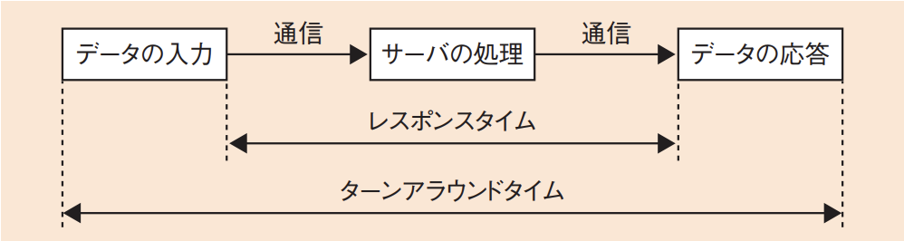
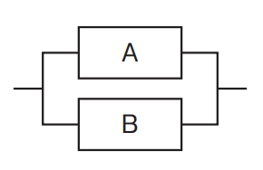
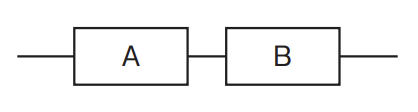

# 2-2-2 システムの評価指標(译: 系统的评价指标)

- [2-2-2 システムの評価指標(译: 系统的评价指标)](#2-2-2-システムの評価指標译-系统的评价指标)
  - [システムの性能指標(译: 系统的性能指标)](#システムの性能指標译-系统的性能指标)
  - [キャパシティプランニング(译: 容量规划)](#キャパシティプランニング译-容量规划)
  - [システム信頼性の評価項目 RASIS(译: 系统可靠性评价项目 RASIS)](#システム信頼性の評価項目-rasis译-系统可靠性评价项目-rasis)
  - [信頼性指標(译: 可靠性指标)](#信頼性指標译-可靠性指标)
  - [信頼性計算(译: 可靠性计算)](#信頼性計算译-可靠性计算)

## システムの性能指標(译: 系统的性能指标)

| システムの性能指標 | 説明 | 特徴 |
| - | - | - |
| **レスポンスタイム**(応答時間) (译: 响应时间) | $\bullet$ システムにデータを入力し終わってから, データの応答が開始されるまでの時間 $\bullet$ 「速く返す」ことを表す指標 | **ターンアラウンドタイム**(译: 周转时间): データの入力が始まってから, 応答が完全に終わるまでの時間のこと  |
| **スループット** (译: 吞吐量) | $\bullet$ 単位時間当たりにシステムが処理できる処理数 $\bullet$ 「数多く返す」ことを表す指標 | Webシステムの応答性能を求めるときにはレスポンスタイムが, 処理性能を求めるときにはスループットがよく用いられる |
| **ベンチマーク** (译: 基准测试) | $\bullet$ システムの処理速度を計測するための指標 $\bullet$ 特定のプログラムを実行し, その実行結果を基に性能を比較する | 有名なベンチマーク:  $\bullet$ TPC(Transaction ProcessingPerformance Council: トランザクション処理性能評議会) $\quad \bullet$ **TPC-C**(オンライントランザクション処理のベンチマーク) $\bullet$ SPEC(Standard Performance Evaluation Corporation: 標準性能評価法人) $\quad \bullet$ **SPECint**(整数演算を評価) $\quad \bullet$ **SPECfp**(浮動小数点演算を評価) |
| モニタリング (译: 监控) | システムを実際に稼働させて, その性能を測定する手法 | システムの性能改善時に用いられる |

## キャパシティプランニング(译: 容量规划)

- キャパシティプランニング: システムに求められるサービスレベルから, システムに必要なリソースの処理能力や容量, 数量などを見積もり, システム構成を計画すること。
- 手順

  | 手順 | 説明 |
  | - | - |
  | ワークロード情報の収集 (译: 收集工作负载信息) | $\bullet$ CPU利用率などで現行システムの測定を行い, ヒアリングなどで関係者の意見を聞く $\bullet$ ワークロード(译: 负荷): コンピュータ資源の利用状況, 負荷状況のこと |
  | サイジング (译: 容量估算) | $\bullet$ サーバの台数やCPUの性能, ストレージの容量などを見積もる $\bullet$ **サイジング**: システムに必要な規模や性能を見極めて, 構成要素を用意すること |
  | 評価・チューニング (译: 评估・调优) | $\bullet$ サイジングで見積もった量が適切かどうか, テスト環境などで評価を行い, チューニングを繰り返す $\bullet$ TPCやSPECなど, ベンチマークの数値を参考にすることもある |

## システム信頼性の評価項目 RASIS(译: 系统可靠性评价项目 RASIS)

- **RASIS**: システムの信頼性を総合的に評価する基準とする概念である。
- 五つの評価項目

  | 評価項目 | 説明 |
  | - | - |
  | **信頼性** (译: Reliability, 可靠性) | $\bullet$ 故障や障害の発生しにくさ, 安定性を表す $\bullet$ 具体的な指標としては, MTBFやその逆数の**故障率**がある |
  | **可用性** (译: Availability, 可用性) | $\bullet$ 稼働している割合の多さ, 稼働率を表す $\bullet$ 具体的な指標としては, 稼働率が用いられる |
  | **保守性** (译: Serviceability, 可维护性) | $\bullet$ 障害時のメンテナンスのしやすさ, 復旧の速さを表す $\bullet$ 具体的な指標としては, **MTTR**が用いられる |
  | 保全性・完全性 (译: Integraity, 完整性) | $\bullet$ 障害時や過負荷時におけるデータの書換えや不整合, 消失の起こりにくさを表す $\bullet$ 一貫性を確保する能力である |
  | 機密性 (译: Security, 和安全性) | $\bullet$ 情報漏えいや不正侵入などの起こりにくさを表す $\bullet$ セキュリティ事故を防止する能力である |

- 例: RASISの各特性のうち, “I”で表される特性は, 何に関するものか。
  - ア: 情報の一貫性を確保する能力
  - イ: 情報の漏えい, 紛失, 不正使用などを防止する能力
  - ウ: 要求された機能を, 規定された期間実行する能力
  - エ: 要求されたサービスを, 提供し続ける能力

  > RASISのIは, Integrity(保全性・完全性)で, 情報の一貫性を確保する能力である。  
  > したがって, アが正解である。  
  > イはSのSecurity(機密性)である。  
  > ウはAのAvailability(可用性)である。  
  > エはRのReliability(信頼性)の説明である。

## 信頼性指標(译: 可靠性指标)

- 信頼性指標: 信頼性を表す指標である。
- 代表的なもの

  | 信頼性指標 | 説明 |
  | - | - |
  | **MTBF**(Mean Time Between Failure: 平均故障間隔) (译: 平均故障间隔) | $\bullet$ 故障が復旧してから次の故障までにかかる時間の平均である $\bullet$ 連続稼働できる時間の平均値にもなる |
  | **MTTR**(Mean Time To Repair: 平均復旧時間) (译: 平均修复时间) | 故障したシステムの復旧にかかる時間の平均である |
  | 稼働率 (译: 有效性) | $\bullet$ ある特定の時間にシステムが稼働している確率 $\bullet$ $稼働率 = \frac{MTBF}{MTBF + MTTR}$ |
  | 故障率 (译: 故障率) | 1. 稼働率の反対で, ある特定の時間にシステムが稼働していない確率 $\quad \bullet$ $故障率 = 1 - 稼働率 = 1 - \frac{MTBF}{MTBF + MTTR}$ 2. 単位時間内にどの程度の確率で故障するかを表す確率 $\quad \bullet$ $故障率 = \frac{1}{MTBF}$ |

## 信頼性計算(译: 可靠性计算)

- 並列システム
  - 機器を並列に並べたシステムは, どれか一つが稼働していれば全体で稼働していることになるので, 稼働率が向上する。
  - 図のようなA, B二つの機器がある並列システムで, それぞれの稼働率が$a$, $b$だとする。
  - このシステムは, A, Bのいずれも動かないとき以外は稼働するので, Aの不稼働率$(1 - a)$とBの不稼働率$(1 - b)$を用いて $稼働率 = 1 - (1 - a) \times (1 - b)$
  - 図: 並列システム 
- 直列システム
  - 機器を直列に並べたシステムは, すべて稼働していなければ全体で稼働しないので, 稼働率が低下する。
  - 図のようなA, B二つの機器がある並列システムで, それぞれの稼働率が$a$, $b$だとする。
  - このシステムは, A, Bのどちらも動くときだけ稼働するので,  $稼働率 = a \times b$
  - 図: 直列システム 
- 三つ以上の組合せのシステム
  - 三つ以上を組み合わせてシステム全体の稼働率を求める場合には, 次の二つの方法がある。
    1. 部分ごとにグループに分け, 全体を考える
    2. 一つ一つの組合せをすべて考える
