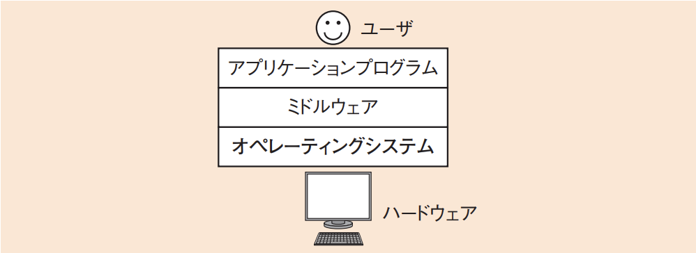
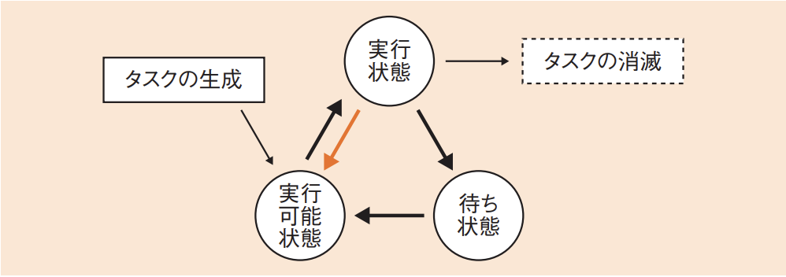
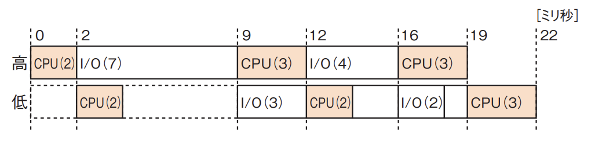
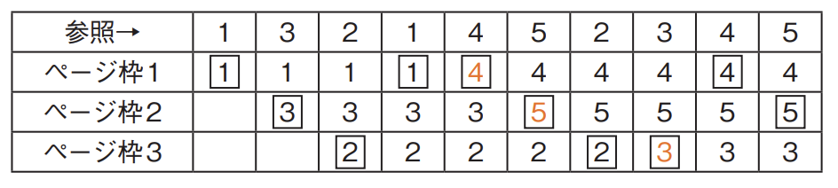
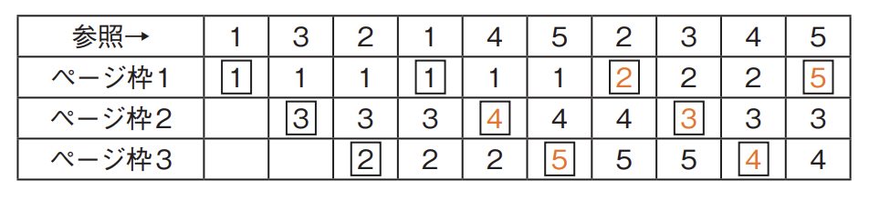

# 2-3-1 オペレーティングシステム(译: 操作系统)

- [2-3-1 オペレーティングシステム(译: 操作系统)](#2-3-1-オペレーティングシステム译-操作系统)
  - [OSの起動(译: 操作系统的启动)](#osの起動译-操作系统的启动)
  - [OSの機能(译: 操作系统的功能)](#osの機能译-操作系统的功能)
  - [ジョブ管理(译: 作业管理)](#ジョブ管理译-作业管理)
  - [タスク管理(译: 任务管理)](#タスク管理译-任务管理)
  - [タスクのスケジューリング方式(译: 任务调度方式)](#タスクのスケジューリング方式译-任务调度方式)
  - [リアルタイムOS(译: 实时操作系统)](#リアルタイムos译-实时操作系统)
  - [記憶管理(译: 存储管理)](#記憶管理译-存储管理)
  - [仮想記憶管理(译: 虚拟存储管理)](#仮想記憶管理译-虚拟存储管理)

---

- オペレーティングシステム(OS：Operating System)(译: 操作系统): ハードウェアを抽象化したインタフェースをアプリケーションプログラムに提供するソフトウェアである。
- 図: システムの中のOSのイメージ 

## OSの起動(译: 操作系统的启动)

- コンピュータの電源を入れたときにOSは自動的に起動し, 通常の操作が可能になるようにプログラムを立ち上げる。
- そのときの一連の処理の流れを**ブートストラップ**(译: 自举引导)という。
  - コンピュータのROMに**ブートストラップローダ**(译: 引导装入程序)と呼ばれる特殊なプログラムが用意されており, それがブートストラップを起動して実行する。

## OSの機能(译: 操作系统的功能)

- OSの主な目的に, 複数のアプリケーションプログラムを同時に動かしたときのリソースを管理し, コンピュータの利用効率を向上させることがある。
- OSの管理機能

  | 管理機能 | 説明 |
  | - | - |
  | ジョブ管理(译: 作业管理) | $\bullet$ ジョブを, それを構成するジョブステップごとに管理する $\quad \bullet$ ジョブ(译: 作业): 一つのまとまった仕事の単位である |
  | **タスク管理**(译: 任务管理) | $\bullet$ マルチタスクOSであっても, 一つのCPUでは一度に一つのタスクしか処理できないので, いつどのタスクを実行させるかを管理する $\bullet$ CPUの利用はスレッド単位で行われる。 $\quad \bullet$ マルチタスクOS(译: 多任务处理OS): 一度に複数のタスクを実行できるOSである $\quad \bullet$ **タスク**(またはプロセス)(译: 任务): 動作中のプログラムの実行単位である $\quad \bullet$ **スレッド**(译: 线程): 一つのタスクは一つ以上の**スレッド**から構成される |
  | **記憶管理**(译: 存储管理) | $\bullet$ コンピュータ上の記憶を管理する $\bullet$ コンピュータの記憶は主記憶装置に格納されているが, 主記憶が足りないときには仮想記憶を用いて容量を大きくする $\quad \bullet$ 記憶管理には, **実記憶管理**と**仮想記憶管理**の2種類がある |
  | データ管理, 入出力管理(译: 文件管理, 设备管理) | $\bullet$ データ管理: 補助記憶装置へのアクセスを行う $\bullet$ 入出力管理: 入出力装置へのアクセスを行う $\bullet$ **スプーリング**(译: 假脱机技术)などを用いて, 複数の周辺装置を同時並行で動作させる |

## ジョブ管理(译: 作业管理)

- ジョブ管理: 複数のジョブの起動や終了を制御し, それぞれのジョブの実行や終了の状態を管理する。
- メインフレームなどの汎用機ではOSに組み込まれており, JCL(Job Control Language)(译: 作业控制语言)というジョブ制御用のスクリプト言語を使用して, バッチ処理やプロセスの起動を制御する。

## タスク管理(译: 任务管理)

- タスク管理(プロセス管理): タスクの生成, 実行, 消滅を管理する。
- タスクの実行では, タスクを**実行状態**, **実行可能状態**, **待ち状態**の三つの状態に分けて管理する。
- 図: タスクの状態遷移 
- タスク生成 ↓ **実行可能状態**になる ↓ CPUに空きができると **実行状態**に移り, 処理を実行する ↓ 実行が完了すると タスクは消滅する
- 実行中に ↓入出力が必要な処理など, CPU以外を使用する処理が始まると **待ち状態**に移り,  ↓入出力が完了すると また**実行可能状態**になる
- **実行状態**でタスクを実行中に ↓**タイムクォンタム**(译: Time Quantum, 时间片)(一つのタスクに割り当てられた時間)を使い切ると,  **実行可能状態**に戻る
- 実行状態のタスクを中断させる**プリエンプション**(译: Preemption, 抢占)が発生した場合も, 実行可能状態に戻る
  - プリエンプションは, ほかに優先度の高いタスクが生成された場合や, 割込みが起こった場合に発生する

## タスクのスケジューリング方式(译: 任务调度方式)

- 代表的なタスクのスケジューリング方式

  | タスクのスケジューリング方式 | 説明 |  |
  | - | - | - |
  | **到着順方式** (译: 到达顺序式) | $\bullet$ タスクを到着順で処理する $\bullet$ **FIFO**(First In First Out), FCFS(First Come First Served)とも呼ばる | 按任务到达的先后顺序依次执行(先来先服务) |
  | 処理時間順方式 (译: 短作业优先式) | $\bullet$ タスクの**処理時間が短いものから順に**処理する $\bullet$ SPT(Shortest Processing Time first)とも呼ばれる | 按任务所需处理时间的长短排序, 优先执行处理时间短的任务 |
  | 優先度順方式 (译: 优先级调度式) | タスクを**優先度順**で処理する | 按任务的优先级高低依次执行, 优先级高的任务先执行 |
  | **ラウンドロビン方式** (译: 时间片轮转式) | 一つ一つのタスクに**同じタイムクォンタム**を割り当て, 一定時間ごとに順番に処理を回していく方式 | 给每个任务分配相同的时间片, 轮流执行各个任务 |
  | **プリエンプション方式(プリエンプティブ方式)** (译: 抢占式) | タスクに優先度をつけ, 優先度の高いタスクが実行可能状態になると**プリエンプション**を発生させる方式 | 允许高优先级任务中断正在执行的低优先级任务 |
  | 多段フィードバック待ち行列 (译: 多级反馈队列) | $\bullet$ 複数の優先度の待ち行列をもち, 高い優先度の待ち行列から順次処理していく方式 $\bullet$ このとき, 低い優先度で長時間待っているタスクの優先度を上げる, 一度実行したタスクの優先度を下げるなどのフィードバック調整を行う | 根据任务的执行情况动态调整优先级, 任务可在多个队列间移动 |
  | イベントドリブンプリエンプション方式 (译: 事件驱动抢占式) | 割込みによってタスクの切替えを行うイベントドリブン方式(译: 事件驱动方式)と, 優先度の高いタスクを実行させるプリエンプション方式を組み合わせた方式 | 发生特定事件时, 允许高优先级任务抢占当前任务的执行 |

- 例: 二つのタスクの優先度と各タスクを単独で実行した場合のCPUと入出力装置(I/O)の動作順序と処理時間は, 表のとおりである。二つのタスクが同時に実行可能状態になってから, 全てのタスクの実行が終了するまでの経過時間は何ミリ秒か。ここで, CPUは1個であり, I/Oの同時動作はできないものとし, OSのオーバヘッドは考慮しないものとする。また, 表の( )内の数字は処理時間を示すものとする。

  | 優先度 | 単独実行時の動作順序と処理時間(ミリ秒) |
  | - | - |
  | 高 | CPU(2) → I/O(7)→ CPU(3)→ I/O(4)→ CPU(3) |
  | 低 | CPU(2) → I/O(3)→ CPU(2)→ I/O(2)→ CPU(3) |

  - ア: 19
  - イ: 20
  - ウ: 21
  - エ: 22

  > 二つのタスクが同時に実行可能状態になったときは, 優先度の高いタスクが実行状態になる。  
  > I/Oとやり取りをしているときには待ち状態となるため, その間に優先度の低いタスクは実行状態となり処理を実行できる。  
  > また, I/Oの同時操作はできないため, 先にI/Oを実施しているタスクの実行が終わるまでは, もう一方のタスクのI/Oは実行できない。  
  > そのため, 表の処理時間で処理を実行すると, 次の図のような実行順序になる。   
  > 全体の経過時間は22ミリ秒となるので, エが正解である。

## リアルタイムOS(译: 实时操作系统)

- リアルタイムOS(译: 实时操作系统): リアルタイム処理を行うOSである。
- リアルタイム処理では, ジョブの実行が決められた時間までに終了するという時間制約を守ることが最優先される。
- 例: リアルタイムOSのマルチタスク管理機能において, タスクAが実行状態から実行可能状態へ遷移するのはどの場合か。
  - ア: タスクAが入出力要求のシステムコールを発行した。
  - イ: タスクAが優先度の低いタスクBに対して, メッセージ送信を行った。
  - ウ: タスクAより優先度の高いタスクBが実行状態となった。
  - エ: タスクAより優先度の高いタスクBが待ち状態となった。

  > リアルタイムOSでは高優先度のタスクを優先するため, プリエンプションを発生させて優先度の低いタスクを実行可能状態に移す。タスクAよりタスクBの優先度が高く, タスクBが実行可能状態になった場合には, プリエンプションが発生し, タスクAが実行状態→実行可能状態に, タスクBが実行可能状態→実行状態に入れ替わる。  
  > したがって, ウが正解である。  
  > アは待ち状態に遷移する。  
  > イのようにタスクBの方が優先度が低い場合には状態は変わらない。  
  > エではタスクBは待ち状態なので, 状態は変わらない。

## 記憶管理(译: 存储管理)

- 主記憶装置の領域には限りがあるため, 必要なプログラム以外は補助記憶装置に置いてアクセスする。
- 補助記憶装置とのやり取りは, 次の方法で行う。
  - オーバレイ(译: Overlay, 覆盖)
    - あらかじめプログラムを分けて補助記憶装置に格納しておき, 必要な部分だけ主記憶装置に置く方法
    - オーバレイで記憶領域を割り当てる方式
      - [ファーストフィット方式](../2-1コンピュータ構成要素/2-1-2メモリ.md#記憶領域の管理方式译-存储区域的管理方式): 最初の空き領域を割り当てる方式
      - [ベストフィット方式](../2-1コンピュータ構成要素/2-1-2メモリ.md#記憶領域の管理方式译-存储区域的管理方式): 割り当てたときの残り領域が最も小さくなる方式
  - スワッピング(译: Swapping, 交换)
    - メモリの内容を補助記憶装置のスワップファイル(译: 虚拟内存交换文件)に書き出して, ほかのタスクがメモリを使えるように解放する方法
    - **スワップアウト**(译: Swap Out, 换出): メモリからスワップに取り出すこと
    - **をスワップイン**(译: Swap In, 换入): スワップからメモリに戻すこと
  - **ページング**(译: Paging, 分页)
    - プログラムを固定長のページに分けて, ページごとに補助記憶装置の仮想記憶領域に取り出す方法
    - **ページアウト**(译: Page Out): メモリから仮想記憶に取り出すこと
    - **ページイン**(译: Page In): 仮想記憶からメモリに戻すこと
    - **ページフォール**(译: Page Fault, 页缺失): メモリ上に必要なページがないこと
    - **スラッシング**(译: Thrashing, 系统抖动): ページフォールトが頻繁に起こってページインとページアウトが繰り返されること
      - システムの応答速度が急激に低下する
    - ページの読込み方法
      - **デマンドページング**(译: Demand Paging, 请调, 请求分页): ページの内容が必要となった時点で仮想記憶の内容を主記憶にロードする
      - **プリページング**(译: Pre-paging, 预调): 将来必要とされそうな仮想記憶の内容をあらかじめ主記憶にロードしておく
- 例: 仮想記憶方式では, 割り当てられる実記憶の容量が小さいとページアウト, ページインが頻発し, スループットが急速に低下することがある。このような現象を何というか。
  - ア: スラッシング
  - イ: スワッピング
  - ウ: フラグメンテーション
  - エ: メモリリーク

  > 仮想記憶方式において, 実記憶の容量が不足すると, CPUで計算をするたびにその計算に必要なページを読み込む必要があるため, ページイン, ページアウトが頻発する。  
  > この現象はスラッシングと呼ばれるので, アが正解である。  
  > イ: スワッピング(译: 交换)は, 仮想記憶と実記憶との間でデータのやり取りを行う動作である。  
  > ウ: フラグメンテーション(译: 碎片化)は, 記憶の確保や解放を繰り返し, 未使用領域が断片的になる現象である。  
  > エ: メモリリークは, すでに使用していない記憶領域が解放されず, 他のプログラムで利用できなくなる現象である。

## 仮想記憶管理(译: 虚拟存储管理)

- 仮想記憶: コンピュータに実装される主記憶装置(メモリ)よりも大きな領域をメモリ空間として利用できるようにする技術である。
- 補助記憶上に仮想記憶領域を用意し, そこにOSが自動的にデータを出し入れする。
- 仮想記憶の方式
  - **ページング方式**(译: 分页式): 固定長のページ単位で管理を行う
  - セグメント方式(译: 分段式): 可変長の区画で管理を行う
- ページング方式におけるページの置換えのアルゴリズム
  - **FIFO**(First In First Out)方式(译: 先进先出式)
    - **最初にページイン**したページを最初にページアウトさせる方式
  - **LRU**(Least Recently Used)方式(译: 最近最少使用式)
    - **最後に使用**されてからの経過時間が最も長いページを最初にページアウトさせる方式
  - LFU(Least Frequently Used)方式(译: 最少使用式)
    - **使用頻度**が最も低いページを最初にページアウトさせる方式
- 例: 仮想記憶方式のコンピュータにおいて, 実記憶に割り当てられるページ数は3とし, 追い出すページを選ぶアルゴリズムは, FIFOとLRUの二つを考える。あるタスクのページのアクセス順序が 1, 3, 2, 1, 4, 5, 2, 3, 4, 5 のとき, ページを置き換える回数の組合せとして適切なものはどれか。
  - 選択肢

    |  | FIFO | LRU |
    | - | - | - |
    | ア | 3 | 2 |
    | イ | 3 | 6 |
    | ウ | 4 | 5 |
    | エ | 5 | 4 |

  > FIFO方式では, 最初にページインしたページをページアウトさせるので, 問題文のタスクでページアクセスを実行すると次のようになる。  色の文字が, ページアウトしてページを置き換えた部分なので, FIFOでは3回になる。  
  > LRU方式では, 最後に使用されてからの期間が最も長いページを置き換えると, 次のようになる。  色の文字が置換え部分なので, LRUでは6回になる。  
  したがって, イが正解である。
