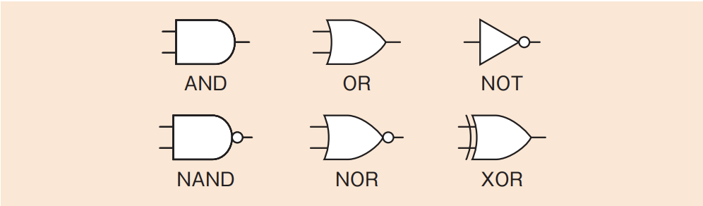
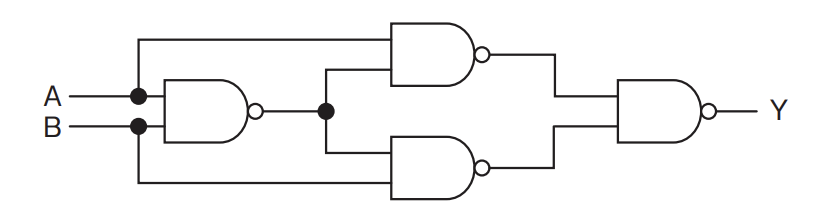
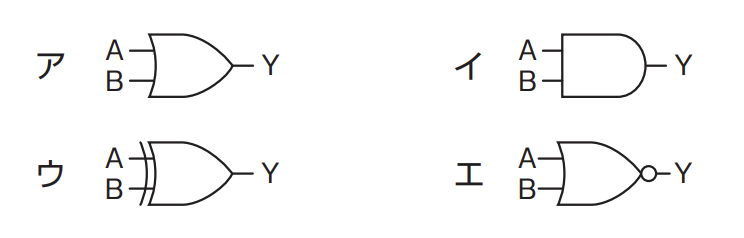
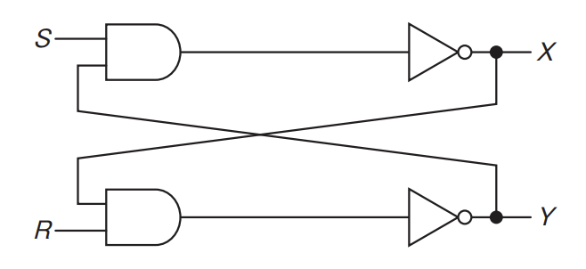

# 2-4-1 ハードウェア(译: 硬件)

## 電子・電気回路(译: 电子·电路)

- コンピュータの[論理](../1-1基礎理論/1-1-1離散数学.md#論理演算译-逻辑运算)回路
  - 論理積 - AND回路(译: 与门电路)
  - 論理和 - OR回路(译: 或门电路)
  - 否定 - NOT回路(译: 非门电路)
  - 否定論理積 - NAND回路(译: 与非门电路)
  - 否定論理和 - NOR回路(译: 或非门电路)
  - 排他的論理和 - XOR回路(译: 异或门电路)
- 図: 回路記号 
- **NAND**回路は, ほかの回路に比べて回路構成が簡単なので作りやすいという特徴がある。また, ほかの五つの論理回路をNANDだけで表現することが可能である。
- 例題: 図の論理回路と等価な回路はどれか。 
  - 選択肢 

  > 入力A, Bに0, 1それぞれの値を入れてみて, 出力Yがどうなるか確認していく。  
  >
  > | A | B | Y |  
  > | - | - | - |  
  > | 0 | 0 | 0 |  
  > | 0 | 1 | 1 |  
  > | 1 | 0 | 1 |  
  > | 1 | 1 | 0 |  
  >
  > これは, 排他的論理和(XOR)の結果と同じである。  
  > したがって, ウが正解である。

## フリップフロップ回路(译: 触发器电路)

- **フリップフロップ**(译: 触发器): 1ビットの情報を記憶することができる論理回路である。
- [SRAM](../2-1コンピュータ構成要素/2-1-2メモリ.md#ram译-随机存取存储器)でよく利用される。
- 種類
  - SR(Set Reset)型: 二つのNAND回路を使う
  - JK型: 四つのNAND回路を使う
- 例題: 図の論理回路において, $S = 1, R = 1, X = 0, Y = 1$のとき, $S$を一旦$0$にした後, 再び$1$に戻した。この操作を行った後の$X$, $Y$の値はどれか。 
  - ア: $X = 0, Y = 0$
  - イ: $X = 0, Y = 1$
  - ウ: $X = 1, Y = 0$
  - エ: $X = 1, Y = 1$

## 半導体素子の構成部品(译: 半导体元件的组成部件)

- 半導体素子(译: 半导体元件): 半導体による電子部品である。
- **IC**(Integrated Circuit: 集積回路)(译: 集成电路)や, 更に集積度を高めた**LSI**(Large Scale Integration: 大規模集積回路)(译: 大规模集成电路)などがある。
- 代表的な構成部品

  | 構成部品 | 説明 |
  | - | - |
  | カスタムIC (译: 定制集成电路) | $\bullet$ 利用者が要求する特定の用途に特化したICである $\quad \bullet$ ASIC(Application Specific IntegratedCircuit)(译: 应用特定集成电路): 製造するときに回路設計を決定する $\quad \bullet$ FPGA(Field-ProgrammableGate Array)(译: 现场可编程门阵列): 製造後に回路を変更できる |
  | **システムLSI** (译: 系统级集成电路) | $\bullet$ 組込みシステム製品の電子回路を1チップに集約した半導体製品である $\bullet$ その設計手法は, **SoC**(System On a Chip)(译: 系统级芯片)と呼ばれる $\bullet$ 複数の半導体を組み合わせて一つにすることで占有面積を縮小でき, システムを小型化, 高速化することが可能になる |
  | **FPGA**(Field Programmable Gate Array) (译: 现场可编程门阵列) | $\bullet$ 製造後に構成を変更できる集積回路である $\bullet$ 特定のシステムに適用するように, 利用者が回路構成を変更することができる $\bullet$ 構成を記述するハードウェア記述言語として, **HDL**(HardwareDescription Language) (译: 硬件描述语言)がある |
  | **MEMS**(Micro Electro Mechanical Systems) (译: 微机电系统) | センサー(译: 传感器), アクチュエータ(译: 执行器)などや電子回路を一つのシリコン基板などに集積化したデバイスである |

- 例題: FPGAなどに実装するディジタル回路を記述して, 直接論理合成するために使用されるものはどれか。
  - ア: DDL
  - イ: HDL
  - ウ: UML
  - エ: XML

  > FPGA(Field Programmable Gate Array)は, 製造後に設計や構成を変更できるディジタル回路の集まりである。ディジタル回路の設計, 構成を記述するハードウェア記述言語には, HDL(Hardware Description Language)がある。HDLを使用することで直接, FPGAのディジタル回路の実装設計(論理合成)を行うことができる。  
  > したがって, イが正解である。  
  > ア: [DDL(Data Definition Language: データ定義言語)](../1-2アルゴリズムとプログラミング/1-2-5その他の言語.md#データ定義言語译-数据定义语言)は, データベースで使用される, テーブルやビュー, インデックスを作成するときなどに使用される言語である  
  > ウ: UML(Unified Modeling Language: 統一モデリング言語)はオブジェクト指向分析や設計で使用される図の集まりである。  
  > エ: [XML(eXtensible Markup Language)](../1-2アルゴリズムとプログラミング/1-2-5その他の言語.md#xmlextensible-markup-language译-可扩展标记语言)は, 用途に合わせて拡張することができる, タグを用いたマークアップ言語である。

## 半導体の故障メカニズム(译: 半导体的故障机制)

- 半導体素子では, 大規模に集積するため特有の故障が起こる。
- 半導体が故障する主なメカニズム

  | メカニズム | 説明 | 説明 |
  | - | - | - |
  | ESD破壊 (译: 静电破坏) | $\bullet$ 静電気放電(ElectroStatic Discharge: ESD)により, デバイスが劣化・故障することである $\bullet$ 人体や装置, デバイスが帯電し, 酸化膜や配線などが破壊される | 静电放电造成的损坏 |
  | ラッチアップ (译: 闩锁效应) | $\bullet$ 半導体素子では, 構造上, 期待していない位置にトランジスタ(译: 晶体管)やサイリスタ(译: 晶闸管)などができてしまうことがある $\bullet$ これを寄生トランジスタ, 寄生サイリスタなどと呼ぶ $\bullet$ これらが原因で回路に不具合が起こることを**ラッチアップ**(译: 闩锁效应)という | 芯片内部寄生结构导致的短路 |
  | ストレスマイグレーション (译: 应力迁移) | 機械的な力によって配線が切断されるなど, 半導体素子が不良になる現象 | 由于热或机械应力导致材料迁移, 造成断路或短路 |
  | エレクトロマイグレーション (译: 电迁移) | 電流が過度に流れることによって配線が切断されるなど, 半導体素子が不良になる現象 | 电流作用下金属原子迁移, 导致断路或短路 |

## タイマ(译: 定时器)

- **タイマ**(译: 定时器): あらかじめ設定された時間を計測する装置のこと
- **カウンタ**(译: 计数器)を用いて, 一定時間ごとに起こる割込みをカウントして時間を計測する
- 組込みシステムで使われるタイマ

  | タイマ | 説明 | 説明 |
  | - | - | - |
  | インターバルタイマ (译: 间隔定时器) | $\bullet$ 一定間隔でCPUに対して割込みを発生させるタイマである $\bullet$ コンピュータは, 時刻を刻み続けるリアルタイムクロックから時刻を取得した後は, インターバルタイマの割込みを使って時刻をアップデートしていく | 用于以固定时间间隔产生中断或信号。 |
  | **ウォッチドッグタイマ** (译: 看门狗定时器) | $\bullet$ コンピュータの正常動作を確認するためのタイマである $\bullet$ OSがウォッチドッグタイマに対して一定間隔でクリアを行う。規定時間内にクリアが行われなかったときには, システムに障害が起こったと判断し, システムをリセットする | 用于检测系统异常并自动复位系统。 |
  | RTC (译: Real Time Clock, 实时时钟) | $\bullet$ コンピュータが内部に保持している時計である $\bullet$ 単なるカウンタだけでなく, 日付や時刻などを示すカレンダ情報をもっており, システムの時刻の管理に使わる | 用于提供和保持当前日期和时间。 |

## 論理設計(译: 逻辑设计)

- ハードウェアの論理設計: 性能, 設計効率, コストなどを考慮して, どの構成が最適であるのかを検討し, 設計を行う。

## 診断プログラム(译: 诊断程序)

- **診断プログラム**(译: 诊断程序): コンピュータなどに問題が発生した場合, て問題を特定するプログラムである。
  - ハードウェア診断プログラム: PCのハードウェアの故障時に使用する
  - ソフトウェア診断プログラム: アプリケーションに不具合が発生したときに使用する

## オープンソースハードウェア(译: 开源硬件)

- オープンソースハードウェア(译: 开源硬件): ハードウェアの設計や回路図, ソフトウェアなどの情報を無償で公開することで, ハードウェアを誰でも作成可能にすること。

## エネルギーハーベスティング(译: 能量采集)

- エネルギーハーベスティング(译: 能量采集): 身の周りにある位置エネルギーなどを集めて電気に変換し, 機器を動作させる一連の流れのこと。
- 自然にある小さなエネルギーを活用することによって, センサなど, 小さな電力で動く機器を動作させることができる。
