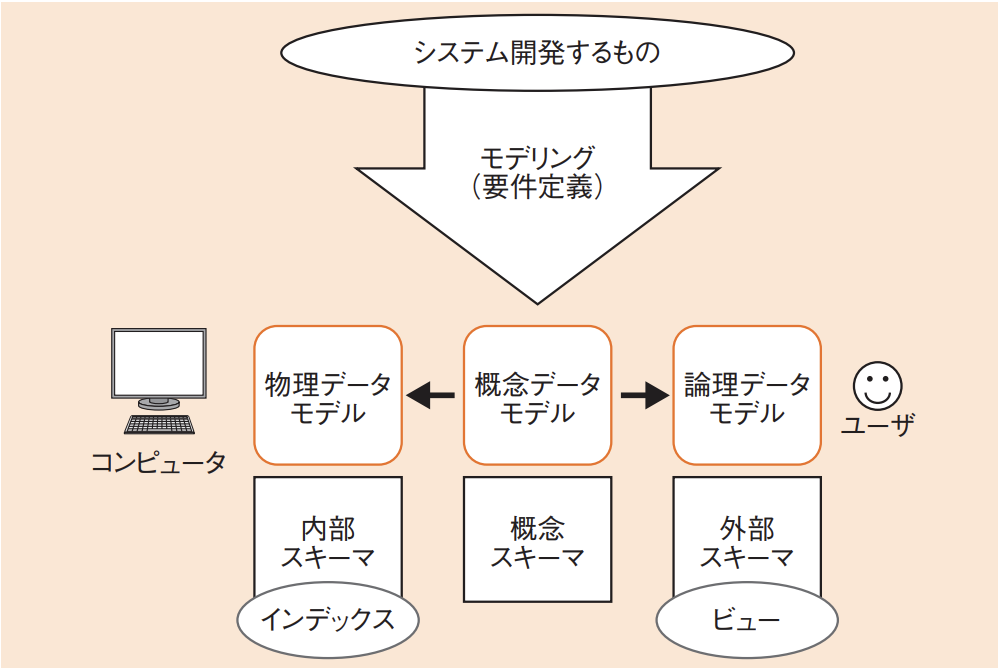

# 3-3-1 データベース方式(译: 数据库形式)

- [3-3-1 データベース方式(译: 数据库形式)](#3-3-1-データベース方式译-数据库形式)
  - [データベースの種類と特徴(译: 数据库的种类与特点)](#データベースの種類と特徴译-数据库的种类与特点)
  - [データベースのモデル(译: 数据库模型)](#データベースのモデル译-数据库模型)
  - [DBMS(データベース管理システム)(译: 数据库管理系系统)](#dbmsデータベース管理システム译-数据库管理系系统)

## データベースの種類と特徴(译: 数据库的种类与特点)

| データベースの種類 | 説明 | 説明 |
| - | - | - |
| 階層型データベース (译: 层次型数据库) | $\bullet$ データを階層型の親子関係で表現する $\bullet$ 最も古くからある手法であり, データ同士の関係はポインタで表す | 以树状结构(父子关系)组织数据, 适合表示层级关系 |
| ネットワーク型データベース (译: 网络型数据库) | 階層型で表現できない, 子が複数の親をもつ状態を表現する | 以网状结构组织数据, 支持多对多复杂关系 |
| **関係データベース(リレーショナルデータベース)**(RDB: Relational Database) (译: 关系型数据库) | $\bullet$ テーブル間の関連でデータを表現するデータベースである $\bullet$ 数学の理論を基にしているので, 上記の2種類とは考え方がまったく異なる $\bullet$ 現在のデータベースの主流である | 以表格(行和列)形式存储数据, 通过关系进行关联 |
| オブジェクト指向データベース(OODB: Object Oriented DBMS) (译: 面向对象数据库) | $\bullet$ オブジェクト指向に対応したデータベースである $\bullet$ データと操作を一体化して扱う | 以对象为单位存储数据, 支持继承、多态等面向对象特性 |

## データベースのモデル(译: 数据库模型)

- 全体のE-R図: データベースを作成する際にモデリング(要件定義)が終わった段階でできるもの。
- **概念データモデル**: データやその関係を抽象的に表現するモデル。主に要件定義や設計の初期段階で使用される。
  - **論理データモデル(外部モデル)**: 外部(システムの利用者やほかのプログラム)に向けたもの
  - **物理データモデル(内部モデル)**: 内部(コンピュータやハードウェア)に向けたもの
- スキーマ(译: 架构): データを具体的に表現したもの
  - **概念スキーマ**, **外部スキーマ**(副スキーマ), **内部スキーマ**(記憶スキーマ)がある
- 図: データベースのモデル 
- 3層に分ける理由: データの独立性を高めるためである。
  - データベース構造の概念スキーマと外部スキーマを分け, ユーザからの変更要求は外部スキーマで吸収する。
    - 外部スキーマでは**ビュー**を定義し, 見せるための表を作る。
  - 概念スキーマと内部スキーマを分け, データベースの変更は内部スキーマで行う。
    - 内部スキーマでは**インデックス**を定義し, 検索を高速化する。
- 論理データ独立: 概念データモデル(概念スキーマ)と論理データモデル(外部スキーマ)の間の独立性のこと。
- 物理データ独立: 概念データモデル(概念スキーマ)と物理データモデル(内部スキーマ)の間の独立性のこと。

## DBMS(データベース管理システム)(译: 数据库管理系系统)

- DBMSの目的: データを一つにまとめて管理することでデータの整合性を保ち, データを安全に保管すること。
- DBMSは機能:
  - メタデータ管理
    - データとその特性(メタデータ)を管理する。
  - 質問(クエリ)処理
    - クエリ(SQL)を処理する。
  - トランザクション(译: 数据库事务)管理
    - 複数のトランザクションの同時実行を管理する。
    - 排他制御や障害回復などを行う。
- RDBMSにはセキュリティ機能を備えるものも多くなっている。
