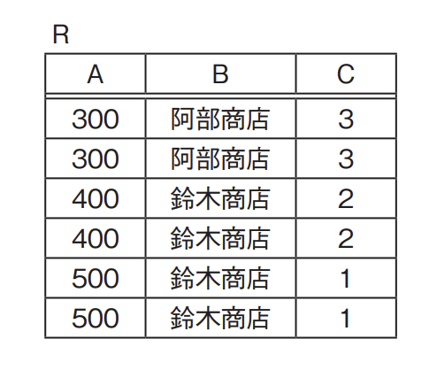
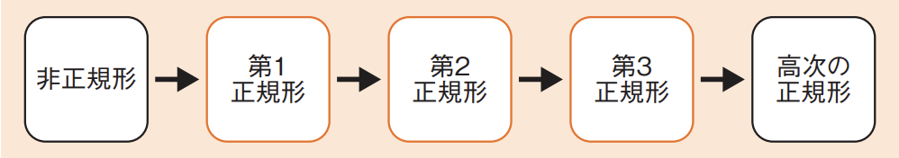
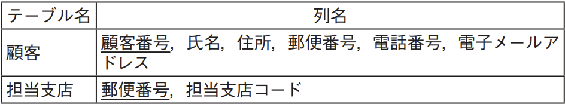
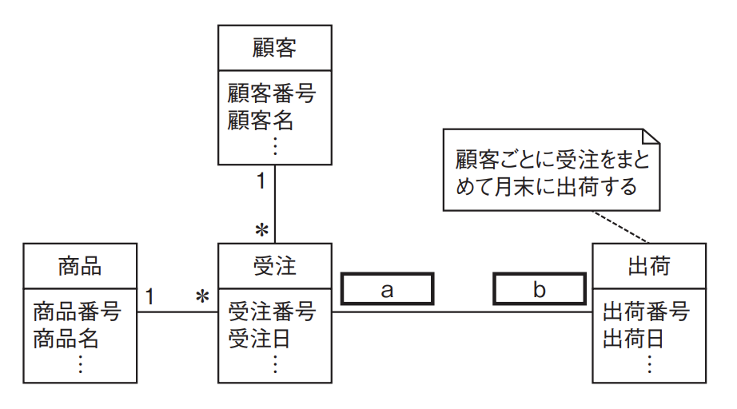

# 3-3-2 データベース設計(译: 数据库设计)

- [3-3-2 データベース設計(译: 数据库设计)](#3-3-2-データベース設計译-数据库设计)
  - [トップダウンアプローチ(译: 自顶向下方法)](#トップダウンアプローチ译-自顶向下方法)
  - [ボトムアップアプローチ(译: 自底向上方法)](#ボトムアップアプローチ译-自底向上方法)
  - [正規化(译: 规范化)](#正規化译-规范化)
  - [主キー・候補キー(译: 主键・候选键)](#主キー候補キー译-主键候选键)
  - [関数従属性(译: 函数依赖性)](#関数従属性译-函数依赖性)
  - [正規化の手順(译: 规范化步骤)](#正規化の手順译-规范化步骤)
  - [E-R図(译: E-R图)](#e-r図译-e-r图)
  - [E-R図のUML表記(译: E-R图的UML表示法)](#e-r図のuml表記译-e-r图的uml表示法)
  - [制約(译: 约束)](#制約译-约束)
  - [パフォーマンス設計(译: 性能设计)](#パフォーマンス設計译-性能设计)
  - [物理設計(译: 物理设计)](#物理設計译-物理设计)
  - [関係データベース以外のデータベース(译: 非关系数据库)](#関係データベース以外のデータベース译-非关系数据库)

## トップダウンアプローチ(译: 自顶向下方法)

- 全体から部分に落とし込むアプローチである。
- 新しい要件や機流れ能を追加する場合に使用する。
- 流れ
  1. エンティティ(译: 实体)を洗い出し, リレーションシップ(译: 关系)を考えて**E-R図を作成**する
  2. エンティティの**属性を洗い出し**, 主キーを決定する
  3. **正規化**を行い, 多対多のリレーションシップを排除する

## ボトムアップアプローチ(译: 自底向上方法)

- 部分から全体にまとめていくアプローチである
- 元の帳票やシステムが存在する場合に使用する。
- 流れ
  1. 帳票や仕様から**属性の洗い出し**を行う
  2. 主キーを見つけ, テーブルの**正規化**を行う
  3. テーブル構造から**E-R図を作成**する

## 正規化(译: 规范化)

- 正規化: 正しい規則に従ってテーブルを分割することである。
- 正規化の目的: **更新時異状の排除**である。
  - テーブルを分けてデータの重複を排除し, 一つのデータを1か所に保管すること(1fact in 1 place)により, データの**整合性**を保つ。
- 正規化の目的は「更新時異状の排除」なので, 逆に言うと, 更新しないのなら正規化は行わなくても構わない。正規化を行うことで速度は遅くなることの方が多いので, 性能のためにあえて正規化しないということもよくある。
- 例題: データの正規化に関する記述のうち, 適切なものはどれか。
  - ア: 正規化は, データベースへのアクセス効率を向上させるために行う。
  - イ: 正規化を行うと, 複数の項目で構成される属性は, 単一の項目をもつ属性に分解される。
  - ウ: 正規化を完全に行うと, 同一の属性を複数の表で重複してもつことはなくなる。
  - エ: 非正規形の表に対しては, 選択, 射影などの関係演算は実行不可能である。

  > 正規化を行う際, 非正規形から第一正規形にすると, すべての属性がシンプル(単一の項目をもつ属性)になりる。したがって, イが正解である。  
  > ア: アクセス効率は, 正規化することによって低下することもある。  
  > ウ: 同一の属性については, 表同士の関係を表すために複数の表でもつ。  
  > エ: 関係演算は正規化の有無とは関係ない。

## 主キー・候補キー(译: 主键・候选键)

- 候補キーと主キー
  - 候補キー(译: 候选键, 候选关键字): すべての属性を**一意に特定する**属性または属性の組で**最小**のものである。
  - 主キー(译: 主键, 主关键字): データベースに実装するときに設定するキーである, 候補キーのうちの一つを選ぶ。
    - 主キーの条件: 候補キーであることに加えて, 「NULLを含まないこと」がある。
  - 例: 社員(社員番号, 氏名, メールアドレス)
    - 社員番号: 社員を一意に特定できるもの
    - 氏名: は同姓同名の人がいる可能性があるので一意ではない
    - メールアドレス: もっていない人もいるがが, もっている人については一意である。
    - 候補キーは{ 社員番号 }, { メールアドレス }の二つになる。
    - 主キーは{ 社員番号 }になる。
  - 非キー属性: どの候補キーにも含まれない属性のことである。
    - 上記例で非キー属性は{ 氏名 }になる。
- 例題: 関係データベースの候補キーとなる列又は列の組に関する記述として, 適切なものはどれか。
  - ア: 値を空値(null)にすることはできない。
  - イ: 検索の高速化のために, 属性の値と対応するデータの格納位置を記録する。
  - ウ: 異なる表の列と関連付けられている。
  - エ:  表の行を唯一に識別できる。

  > 候補キーは, 表の行を唯一に識別できる列又は列の組である。
  > したがって, エ正解である。  
  > ア: アの条件が加わると主キーになりる。  
  > イ: インデックスの説明である。  
  > ウ: 外部キーの説明である。  

## 関数従属性(译: 函数依赖性)

- 関数従属性(译: 函数依赖性): ある属性Aの値が決まったら別の属性Bの値も一意に決定できること。
- A → Bと表記する。
- 完全関数従属, 部分関数従属と推移的関数従属
  - 完全関数従属性: { 候補キーの全部 } → { 非キー属性 }, すべての属性が候補キーの全部の属性に関数従属していること。
  - 部分関数従属性: { 候補キーの一部 } → { 非キー属性 }, 候補キーの一部分のみの属性に関数従属が存在すること。
  - 推移的関数従属性: { 候補キー } → { 候補キー以外 } → { 非キー属性 }, 推移的な関数従属が存在すること。
    - このとき, 候補キーに関係なく, { 候補キー以外 } → { 非キー属性 }の関係が成立する。
- 例: 商品番号 -> 商品名という関数従属性があるときには, 商品番号“1001”が決まれば商品名“冷やし中華”も決まる。
- 例題: 六つのタプルから成る関係Rの単一の属性間において成立する全ての関数従属性を挙げたものはどれか。ここで, X → Yは, XがYを関数的に決定することを表す。 
  - ア: A → B
  - イ: A → C, C → A
  - ウ: A → B, A → C, C → A, C → B
  - エ: A → B, A → C, B → C, C → A, C → B

  > 関係(表)Rを見ると, Aが300のときにはBは必ず阿部商店, Aが400, 500のときにはBは必ず鈴木商店である。したがって, Aが決まればBは一意に決まるので, A →B の関数従属性は成り立つ。  
  > 同様に, Aが300のときにはCは必ず3, Aが400のときにはCは必ず2, Aが 500のときにはCは必ず1である。したがって, A → Cの関数従属性は成り立つ。  
  > またAとCの場合は, 逆から考えても, Cが3のときにはAは必ず300など, 1対1に対応しているので, C → Aの関数従属性も成り立つ。  
  > BとCの場合には, Cが3のときにはBは阿部商店, Cが2と1のときにはBは鈴木商店と, Cが決まればBは一意に決定できます。つまり, C →B は成り立つ。  
  > したがって, これらの四つの関数従属性を挙げているウが正解である。

## 正規化の手順(译: 规范化步骤)

- 正規化の実際の流れ  非正規形のテーブルを第1正規形にし, 続いて第2正規形, 第3正規形とテーブルを分割していく。
- の正規形の条件

  | 正規形の条件 | 説明 | 説明 |
  | - | - | - |
  | 第1正規形 | $\bullet$ ドメインがシンプルであること $\bullet$ そのために, **繰返し属性を排除**して単純な表にする $\quad \bullet$ ドメイン: データベースの1マス, つまり1まとまりのデータが入るスペースのこと $\quad \bullet$ シンプル: データベースの1マスにデータが一つだけ入っている状態である | 每个字段只能有一个值, 不能有重复的组(即, 消除重复列与多值字段) |
  | **第2正規形** | $\bullet$ 第1正規形で, すべての非キー属性が候補キーに完全関数従属していること $\bullet$ そのために, **候補キーの一部だけに関数従属している属性(部分関数従属性)を排除**して, 別の表にする $\quad \bullet$ 完全関数従属性: すべての属性が候補キーの全部に関数従属していること | 满足第1正規形, 且不存在只依赖主键一部分的字段(消除部分依赖) |
  | **第3正規形** | $\bullet$ 第2正規形で, すべての非キー属性がいかなる候補キーにも**推移的に関数従属していない**こと $\bullet$ そのため, **候補キー以外の属性に関数従属している属性を排除**し, 別の表にする $\quad \bullet$ 推移的に関数従属する: A → B → Cのような形で, Aが決まればBが決まるが, Bが決まればAに関係なくCが決まるという関係である。このとき, Aは候補キー, Bは候補キー以外, Cは非キー属性である必要がある。 | 满足第2正規形, 且字段不依赖于非主属性(消除传递依赖) |

## E-R図(译: E-R图)

- E-R図(Entity-Relationship Diagram): エンティティ(実体)とリレーションシップ(関連)を表す図である。
  - リレーションシップ: 対応関係(カーディナリティ)を記述する。
- 対応関係(カーディナリティ)では, 1, 多のほかに, ゼロを含むかどうかで区別することもある。ゼロを含むとは, 対応するデータがないこともある。1だと, 必ず対応するデータがある。
  - このような記述では, 多くの場合**UML**が使用される。
- 対応関係の種類

  | 対応関係 | 説明 | 図示 |
  | - | - | - |
  | 1対1のリレーションシップ | $\bullet$ 一つのデータに一つのデータが対応する $\bullet$ 例: 家庭教師のようなマンツーマンの関係 |  |
  | 1対多のリレーションシップ | $\bullet$ 一つのデータに複数のデータが対応する $\bullet$ 例: 学校の担任のように先生1人で複数の生徒を教える関係 |  |
  | 多対1のリレーションシップ | $\bullet$ 複数のデータに一つのデータが対応する $\bullet$ 例: 複数の先生が1人の生徒に質問する面接のような関係 |  |
  | 多対多のリレーションシップ | $\bullet$ 複数のデータに複数のデータが対応する $\bullet$ 例: 学校のように複数の先生が複数の生徒を教える関係 |  |

- ボトムアップアプローチの場合, 正規化したテーブルはそのままE-R図に変換できる。
- 図: テーブル例 
  - 顧客テーブルと担当支店テーブルは, 次のようなE-R図になる。 
  - 一つのテーブルが, 一つのエンティティに対応する。リレーションシップは, **共通の属性**“郵便番号”があるので, それが二つの間の関連を表している。
  - 郵便番号が一つに決まれば担当支店は一つに決まるので, **担当支店側のカーディナリティは1**, 郵便番号が決まっても顧客は1人とは限らないので, **顧客側のカーディナリティは多**である。
  - また, 1対多のリレーションシップの場合, **1の方の主キー(または候補キー)が多の方の外部キー**になる。したがって, 担当支店テーブルの主キー“郵便番号”が顧客テーブルの外部キーになっている。

## E-R図のUML表記(译: E-R图的UML表示法)

- E-R図を, UMLのクラス図を用いて表記することもある。この場合には, 多は「＊」と表現される。また, UMLでの多重度では, ゼロを含むかどうかについても表記される。「＊」はゼロを含むので, UMLの多重度表記ルールで表現すると次のようになる。

  | 多重度 | 意味 |
  | - | - |
  | ＊ | ゼロ以上の数字すべて |
  | 1..＊ | 1以上 |
  | 0..1 | ゼロまたは1 |
  | 1 | 1 |
  | a..b(a, bは任意の数字) | aからbまで |

- 例題: その月に受注した商品を, 顧客ごとにまとめて月末に出荷する場合, 受注クラスと出荷クラスとの間の関連のa, bに入る多重度の組合せはどれか。ここで, 出荷のデータは実績に基づいて登録される。また, モデルの表記にはUMLを用いる。 
  - 選択肢

    |  | a | b |
    | - | - | - |
    | ア | 1 | 1..＊ |
    | イ | 1 | 0..1 |
    | ウ | 1..＊ | 0..1 |
    | エ | 1..＊ | 1..＊ |

  > 空欄aについて, 出荷に対する受注は, 注釈に「顧客ごとに受注をまとめて月末に出荷する」とあるので, 複数の受注に対して出荷が一つになることが分かる。受注した商品を出荷するため受注は必ずあることになるので, 多重度は1..＊である。  
  > 空欄bについて, 受注に対する出荷は, 問題文に「その月に受注した商品を, 顧客ごとにまとめて月末に出荷」とあり, 月の途中では, 受注に対する出荷は存在しないことになる。したがって, 受注に対する出荷はないこともあると考えられ, 多重度は0..1となる。  
  > したがって, ウが正解である。

## 制約(译: 约束)

- 関係データベースでは, 正規化によって複数のテーブルにデータを分けるが, それぞれのテーブルにはリレーションシップ(関連)がある。そのリレーションシップを維持するため, テーブル間に制約をかける。
- **参照制約**: 最も重要な制約である。二つのテーブル間のリレーションシップでの参照整合性を満たすため, **外部キー**を設定し, データの追加・削除に制限をかける。
  - 前述の顧客と担当支店の例で考えると,   
    - 参照制約では, 多の方の(顧客)テーブルを作るときに, 1の方の(担当支店)テーブルを参照して制約をかける。このとき, 顧客テーブルには**担当支店テーブルにない郵便番号の行は追加できない**。また, 担当支店テーブルは, **顧客テーブルに残っている郵便番号の行は削除できない**。このようにして, 二つのテーブル間の参照整合性を保つ。
- **一意性制約**: 一つの列に同じ値を入れることができないこと。
- 非ナル制約: データに空値(NULL値)を許さないこと。
- 主キー制約: 一意性制約と非ナル制約を合わせたものである。
- ドメイン制約: データの値一つ一つに制約をかけること。
  - **検査制約**(CHECK制約, 形式制約):データの範囲などの形式を制限するもの。
- 例題: 次の表定義において, “在庫”表の製品番号に定義された参照制約によって拒否される可能性のある操作はどれか。ここで, 実線は主キーを, 破線は外部キーを表す。 
  - ア: “在庫”表の行削除
  - イ: “在庫”表の表削除
  - ウ: “在庫”表への行追加
  - エ: “製品”表への行追加

  > 在庫と製品の関連をE-R図に表すと, 次のようになる。   
  > このとき, “在庫”表に行を追加する場合と, “製品“表から行を削除する場合に参照制約がかかる。  
  > “製品”表にないものを“在庫”表に追加する, まだ在庫があるのに“製品”表の製品を削除する, などが起こると参照整合性に異状が発生するので, これを阻止する。  
  > したがって, ウが正解である。

## パフォーマンス設計(译: 性能设计)

- データベースのパフォーマンスを向上させる方法は次の3種類である。

  | データベースのパフォーマンスを向上させる方法 | 説明 |
  | - | - |
  | データベース設計を変更する | $\bullet$ データベース設計を変更し, テーブル構造やリレーションシップを変えることによってパフォーマンスを向上さる。 $\bullet$ 代表的な方法に, 正規化をあえて崩す**非正規化**がある。 |
  | SQLのパフォーマンスチューニングを行う | $\bullet$ SQLを効率良く処理できるように変更して, パフォーマンスを向上させる。 $\bullet$ テーブルの結合順序を変更したり, EXISTS句などを用いて判断を簡略化したりする。 |
  | DBMSの機能を使う | $\bullet$ DBMSを使って処理を高速化させる。 $\bullet$ インデックスを設定したり, データベースを再編成してアクセス効率を上げたりする。 $\bullet$ DBMSのデータをすべてメモリ上に展開する**インメモリデータベース**を用いると, ディスクとの入出力が必要なくなり, 高速化が実現できる。 |

## 物理設計(译: 物理设计)

- データベースの物理設計: アクセス効率, 記憶効率を考えてデータベースの最適化を図る。
- データの保存にハードディスクだけでなくRAIDやSSDを用いるなど, システム構成を変更することも物理設計の対象である。

## 関係データベース以外のデータベース(译: 非关系数据库)

- オブジェクト指向データベース
  - オブジェクト指向でシステム開発を行う際は, オブジェクトを永続化させるためにデータベースが必要である。
  - このために, オブジェクト指向用に**オブジェクト指向データベース**が開発された。
  - 従来の関係データベースを利用してオブジェクト指向のデータを連携する**O-Rマッピング**(オブジェクトリレーショナルマッピング)という手法も一般的である。
- XMLデータベース
  - XMLのツリー構造をそのままデータベースで格納するためのXMLデータベースも登場し, 発展してきている。
