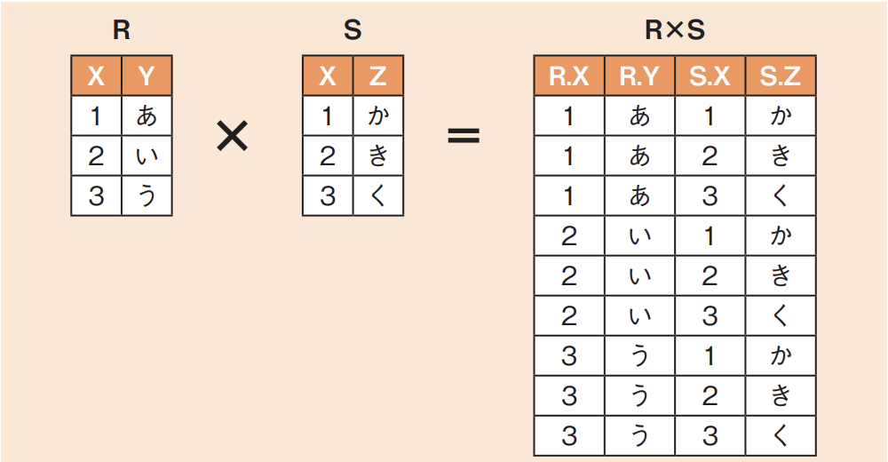
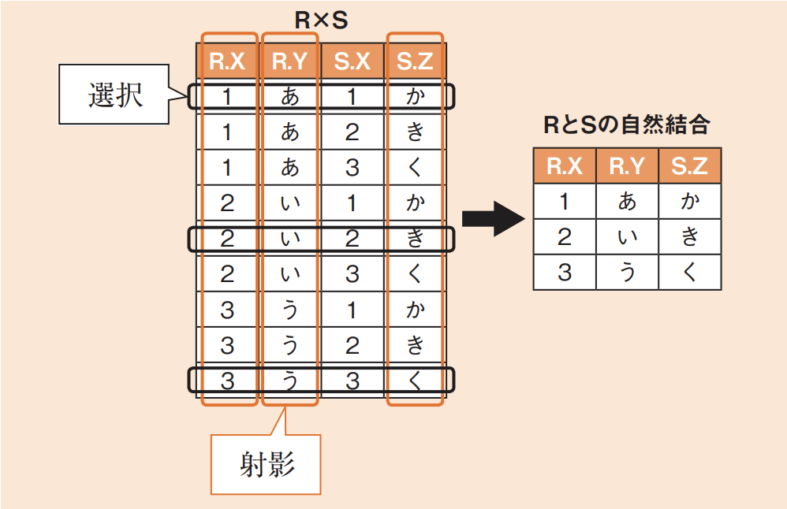
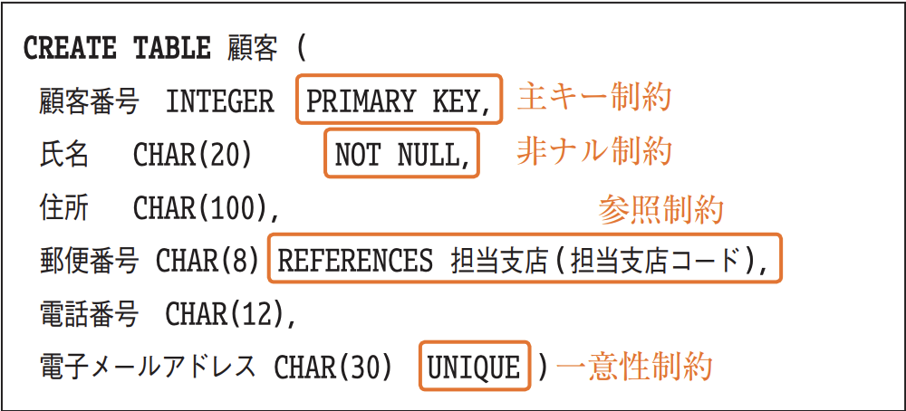
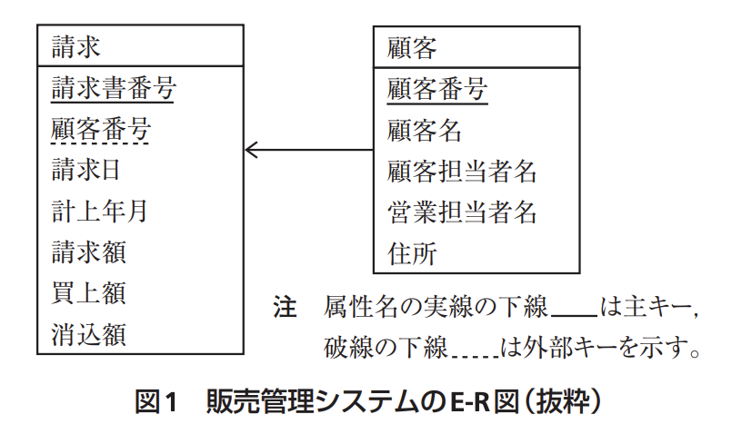
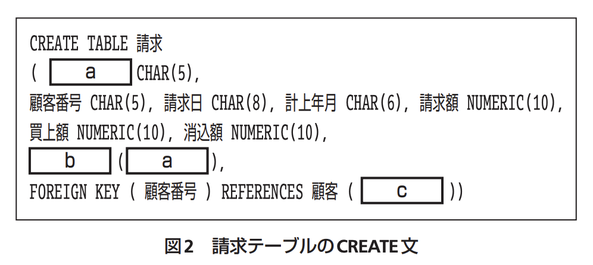
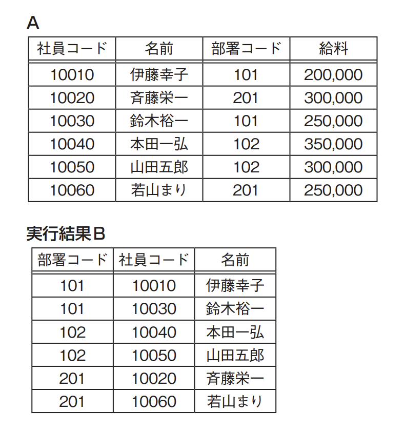
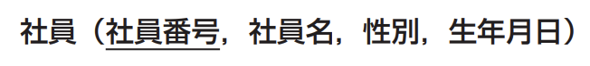

# 3-3-3 データ操作(译: 数据操作)

- [3-3-3 データ操作(译: 数据操作)](#3-3-3-データ操作译-数据操作)
  - [集合演算(译: 集合运算)](#集合演算译-集合运算)
  - [SQL(译: 结构化查询语言)](#sql译-结构化查询语言)
  - [データ定義言語(SQL-DDL)(译: 数据定义语言)](#データ定義言語sql-ddl译-数据定义语言)
  - [データ操作言語(SQL-DML: SELECT)(译: 数据操作语言)](#データ操作言語sql-dml-select译-数据操作语言)
  - [その他のデータ操作言語(SQL-DML: INSERT, UPDATE, DELETE)(译: 其他数据操作语言)](#その他のデータ操作言語sql-dml-insert-update-delete译-其他数据操作语言)
  - [副問合せ(译: 子查询)](#副問合せ译-子查询)
  - [その他のSQLの構文(译: 其他的SQL语法)](#その他のsqlの構文译-其他的sql语法)
  - [カーソル(译: 游标)](#カーソル译-游标)
  - [ビュー(译: 视图)](#ビュー译-视图)
  - [ストアドプロシージャ(译: 存储过程)](#ストアドプロシージャ译-存储过程)

## 集合演算(译: 集合运算)

データベースでは, 集合演算と関係演算を用いることによってデータの集合を表現する。

- 集合演算(和, 差, 積, 直積)
  - 和, 差, 積: [集合](../1-1基礎理論/1-1-1離散数学.md#集合译-集合)と同じである。
    - 和: $A + B$
    - 差: $A - B$
    - 積: $A \cdot B$
  - **直積**(译: 笛卡儿积): 二つのリレーションのすべての組合せである。
    - 例: 集合$R$と集合$S$の直積$R \times S$は, 次のようになる。<br>
- 関係演算(選択, 射影, 結合, 商)
  - **選択**(译: 选择): **行**を取り出す操作
  - **射影**(译: 投影): **列**を取り出す操作
  - **結合**(译: 连接): **直積, 選択, 射影**を組み合わせた操作
    - $R$と$S$の自然結合は, 次のようになる。<br>
    - 自然結合(内部結合)と外部結合
      - 自然結合(内部結合): 両方に共通する行を選択する
      - 外部結合: 片方のテーブルだけに存在する行も選択する
  - 商: リレーションの割り算である。
    - $R \div S$は, 表Sのすべての属性の値を同時に満たす表Rの行を選び出し, Sの属性を取り除いた列を取り出す演算である。
      - すべての商品を買ってくれている人などを抽出するときなどに使う。

## SQL(译: 结构化查询语言)

- SQL: 関係データベースを記述するための言語である。
  - データ定義言語(**SQL-DDL**: SQL Data Definition Language)
  - データ操作言語(**SQL-DML**: SQL Data Manipulation Language)
  - データ制御言語(SQL-DCL: SQL Data Control Language)
    - アクセス権限を付与する`GRANT`文や, トランザクションを管理する`COMMIT`, `ROLLBACK`などの構文が含まれる。
- SQLには, 単独で一つ一つ使用する方法以外にも, プログラム言語から呼び出したり, あらかじめ登録しておいた**カーソル**や**ストアドプロシージャ**を呼び出したりする方法もある。

## データ定義言語(SQL-DDL)(译: 数据定义语言)

- データ定義言語: **`CREATE`文**で新しくデータベースやテーブル, ビュー, インデックス, ストアドプロシージャなどを作成する。
  - `DROP`: 作ったものを削除する
  - `ALTER`: 作ったものを変更する
- 例: 図: テーブルの作成<br>
- ビューを作成するときには, 以下の構文で元のテーブルを指定する

  ```SQL
  CREATE VIEW ビュー名 AS SELECT 〜
  ```

- 例題: 販売管理システムに関する次の図を見て設問に答えよ。<br><br><br>設問　図2中の a 〜 c に入れる適切な字句を答
え, CREATE文を完成させよ。

  > 図1を見ると, エンティティ“請求”には七つの属性がある。図2を見ると, 請求書番号以外の六つの属性はすでに記述されているので, 空欄aが**請求書番号**だと分かる。  
  > 空欄aはもう1か所あるが, 図1を見ると請求書番号となっているので, この属性が主キーだということが分かる。したがって, 空欄bは主キーを示す**`PRIMARY KEY`**となる。`PRIMARY KEY`はこのように, 列の後にまとめて書く場合もある。主キーが複数の列で構成される場合には, こちらが使われる。  
  > 顧客番号は外部キーである。外部キーの表記方法では, 主キーなどは省略できるが, すべて書くと構文は次のようになる。  
  >
  > ```SQL
  > FOREIGN KEY (外部キー名) REFERENCES 表名(主キー名)
  > ```
  >
  > したがって, 空欄cには顧客テーブルの主キーである**顧客番号**が入る。  
  > ≪解答≫ a: 請求書番号, b: `PRIMARY KEY`, c: 顧客番号

## データ操作言語(SQL-DML: SELECT)(译: 数据操作语言)

- `SELECT`文: 検索して表示するため。データ操作言語のうち最もよく使われるものである。
- `SELECT`文の構文

  ```SQL
  SELECT * | [ALL | DISTINCT] <列名1> [, <列名2>, ･･･. ]
      FROM <表名1> [, <表名2>, ･･･, ]
          [JOIN <表名2> ON <結合条件>]
      [WHERE <検索条件> (AND <検索条件2> ･･･)]
      [GROUP BY グループ化する列の位置(または列名)]
      [HAVING グループ化した後の行を抽出する条件]
      [ORDER BY 整列の元となる列 [ ASC | DESC] ]
  ```

  - [ ]内はオプション
  - |はORを示し, いずれか一つを選択する
  - テーブルの結合にJOIN句を用いる場合, 内部結合(自然結合)の場合には, `INNER JOIN`と記述する。外部結合の場合には, `LEFT(OUTER) JOIN`または, `RIGHT(OUTER) JOIN`として, 列を残す方のテーブルを左か右か指定して記述する。
- **`SELECT`文**: 射影して表示する列名を記述する。重複を許さない場合には**`DISTINCT`**を用いる。
- テーブルの結合には2通り
  1. 使用する表名を**`FROM`句**で列挙して, 結合に使う列名を`WHERE`句で指定する
  2. `FROM`句内で**`JOIN`句**を用いる
- **`WHERE`句**: 行を選択する条件を記述する。
- **`GROUP BY`句**: グループ化, つまり指定された列の値が同じ複数の行を一つにまとめる。
  - グループ化すると複数の行が一つになるので, 元の行のデータは取り出せなくなる。
- **`HAVING`句**: グループ化後の選択条件。
- `ORDER BY`句: 指定された列を使って整列する。
- 例題: 表Aから実行結果Bを得るためのSQL文はどれか。<br>
  - ア:

    ```SQL
    SELECT 部署コード, 社員コード, 名前 FROM A
        GROUP BY 社員コード
    ```

  - イ:

    ```SQL
    SELECT 部署コード, 社員コード, 名前 FROM A
        GROUP BY 部署コード
    ```

  - ウ:

    ```SQL
    SELECT 部署コード, 社員コード, 名前 FROM A
        ORDER BY 社員コード, 部署コード
    ```

  - エ:

    ```SQL
    SELECT 部署コード, 社員コード, 名前 FROM A
        ORDER BY 部署コード, 社員コード
    ```

  > 表Aと実行結果Bでは, 行数が変わっていないことと, 特にグループでまとめられていないことから, `GROUP BY`句は使われていないことが分かる。  
  > また, 実行結果Bを見ると, データは部署コード順に整列されていて, さらに同じ部署コードなら社員コード順に並んでいることが読み取れるので, `ORDER BY 部署コード, 社員コード`というかたちで整列していることが分かる。  
  > したがって, エが正解である。

## その他のデータ操作言語(SQL-DML: INSERT, UPDATE, DELETE)(译: 其他数据操作语言)

- 更新系SQLとも呼ばれる
- `INSERT`文

  ```SQL
  INSERT INTO <表名> (<列名1>, <列名2>, ･･･)
    VALUES(<値1>, <値2>, ･･･)
  ```

  または

  ```SQL
  INSERT INTO <表名> (<列名1>, <列名2>, ･･･)
    SELECT　〜　(以降, 通常のSELECT文)
  ```

- `UPDATE`文

  ```SQL
  UPDATE <表名> SET <列名1> = <値1>
    [,<列名2> = <値2> ･･･] WHERE <検索条件>
  ```

- `DELETE`文

  ```SQL
  DELETE FROM <表名> WHERE <検索条件>
  ```

## 副問合せ(译: 子查询)

- 副問合せ: SQL文の中でSQL文を呼び出すこと。
- カッコを使って, もう一つのSQL文を記述する。
  - **副問合せ**: カッコ内のSQL文のこと。
- **相関副問合せ**: カッコ内とカッコ外で共通のテーブルを用い, 外と中のSQL文を結び付けた問合せのこと。
- 例題: “社員”表から, 男女それぞれの最年長社員を除くすべての社員を取り出すSQL文とするために, aに入る副問合せはどれか。ここで, “社員”表は次の構造とし, 下線部は主キーを表す。<br>

  ```SQL
  SELECT 社員番号, 社員名　FROM 社員 AS S1
            WHERE 生年月日 > (「   a   」)
  ```

  - ア:

    ```SQL
    SELECT MIN(生年月日) FROM 社員 AS S2
                        GROUP BY S2.性別
    ```

  - イ:

    ```SQL
    SELECT MIN(生年月日) FROM 社員 AS S2
                        WHERE S1.生年月日 > S2.生年月日
                        OR S1.性別 = S2.性別
    ```

  - ウ:

    ```SQL
    SELECT MIN(生年月日) FROM 社員 AS S2
                        WHERE S1.性別 = S2.性別
    ```

  - エ:

    ```SQL
    SELECT MIN(生年月日) FROM 社員
                        GROUP BY S2.性別
    ```

  > “社員”表の例に, 次のような表を考えてみる。
  >
  > | 社員番号 | 社員名 | 性別 | 生年月日 |
  > | - | - | - | - |
  > | 1001 | 吉井 九兵衛 | 男 | 1961-01-01 |
  > | 1002 | 姫路 円 | 女 | 1971-03-03 |
  > | 1003 | 木下 理樹 | 男 | 1981-05-05 |
  > | 1004 | 坂本 恭介 | 男 | 1986-07-07 |
  > | 1005 | 島田 真実 | 女 | 1991-09-09 |
  >
  > このとき, 外側の問合せでは, 「男女それぞれの最年長社員を除くすべての社員を取り出す」必要があるので, 空欄aには, 自分と同じ性別の最年長社員を求めるSQL文が入る。  
  > したがって, `S1.性別＝S2.性別`という条件で最年長社員の生年月日`MIN(生年月日)`を検索するウが正解である。  
  > ウを前提に上記の例を考えてみると, 最初の社員番号1001の吉井さんは性別が男である。`'男' = S2.性別`という条件で`MIN(生年月日)`を求めると'1961-01-01'となり, `生年月日 > (「   a   」)`という条件にはあてはまらないので, 表示されない。  
  > 同様に, 社員番号1002の姫路さんは性別が女である。ここで, `'女' = S2.性別`という条件で`MIN(生年月日)`を求めると'1971-03-03'となり, `生年月日 > (「   a   」)`という条件にはあてはまらず, 表示されない。  
  > あとの3行では, 男でも女でも生年月日は最年長の社員より新しいため, 表示される。

- 副問合せを接続するための方法
  - 演算子
    - `>`, `<`, `=`, `>=`, `<=`, `<>`
  - 接続詞
    - `IN`, `EXISTS`など

## その他のSQLの構文(译: 其他的SQL语法)

- 集計関数
  - **`SUM`**: 合計
  - `AVG`: 平均
  - `MAX`: 最大
  - `MIN`: 最小
  - **`COUNT(*)`**または`COUNT(列名)`: 行をカウントする
- 比較演算子
  - 1行ずつ比較する
    - `<`
    - `>`
    - **`<=`**
    - **`>=`**
    - **`<>`**
  - 複数行を比較する
    - **`IN`**: 含まれる
  - `値1`から`値2`までの範囲を指定する
    - **`BETWEEN 値1 AND 値2`**
- 評価を行う演算子
  - **`EXISTS`**: 1行でも存在する
  - **`NOT EXISTS`**: 1行もない
- あいまいな条件を比較する演算子
  - **`LIKE`**
    - 例: `氏名 LIKE '吉井%'`の場合は, 「吉井」で始まる氏名を検索する。
    - 参考: 0文字以上の任意の文字列を示すのに「%」(パーセント)を用いる。 任意の1文字を示すのに「_」(アンダースコア)を用いる。
- SELECT文を合わせる`UNION`句
  - 二つのSELECT文の結果を合わせる集合演算(和演算)を行う。
  - **`UNION`**: 二つのSELECT文の結果に同じ行があったとき, 合わせて一つにまとめる場合に使う。
  - **`UNION ALL`**: 二つのSELECT文の結果に同じ行があったとき, 両方とも出力する場合に使う。

## カーソル(译: 游标)

- カーソル(译: 游标): 一連のデータに順にアクセスするための仕組みである。
  - プログラムとともに用いられることが多く, 1行ずつ読み出して処理を行うのに向いている。
- 例:

  ```SQL
  DECLARE カーソル名 CURSOR FOR SELECT 〜
  ```

  上記の構文でカーソル文を定義し, `OPEN`でカーソルをオープン, **`FETCH`**で1行ずつ取り込み, `CLOSE`でカーソルを閉じる。

## ビュー(译: 视图)

- **ビュー(译: 视图)**: 見せるための表である。導出表ともいう。
- 元の表から必要なデータを選択し, 表示する。更新された場合は元の表に変更が加わる。
- すべてのビューが更新可能ではなく, 元の行が特定できる必要がある。条件は次のとおりである。
  - 集計関数, `DISTINCT`, `GROUP BY`句などで**複数の行を一つにまとめていない**こと
  - 複数の表を結合していないこと(ただし, 元の行を特定できれば変更可能)

## ストアドプロシージャ(译: 存储过程)

- **ストアドプロシージャ**(译: 存储过程): データベースへの問合せを一連の処理としてまとめ, DBMSに保存したものである。
- 使用するときには, プロシージャ名で呼び出すと, 一連の処理を実行してくれる。
- 例題: クライアントサーバシステムにおけるストアドプロシージャに関する記述のうち, 適切でないものはどれか。
  - ア: 機密性の高いデータに対する処理を特定のプロシージャ呼出しに限定することによって, セキュリティを向上させることができる。
  - イ: システム全体に共通な処理をプロシージャとして格納しておくことによって, 処理の標準化を行うことができる。
  - ウ: データベースへのアクセスを細かい単位でプロシージャ化することによって, 処理性能(スループット)を向上させることができる。
  - エ: 複数のSQL文から成る手続を1回の呼出しで実行することによって, クライアントとサーバの間の通信回数を減らすことができる。

  > ストアドプロシージャは一つのプロシージャ呼出しで複数の処理を行うことができるので, 処理性能(スループット)が向上する。データベースのアクセスを細かい単位でプロシージャ化すると, スループットは逆に低下する。  
  > したがって, ウが誤りである。  
  > ア: 機密性の高いデータは, プロシージャ呼出しに限定して, そこにアクセス制限をかけることによってセキュリティを向上させることができる。  
  > イ: 共通な処理をプロシージャ化しておくことで, 標準化が図れる。  
  > エ: ストアドプロシージャには, 通信回数を削減する効果もある。
