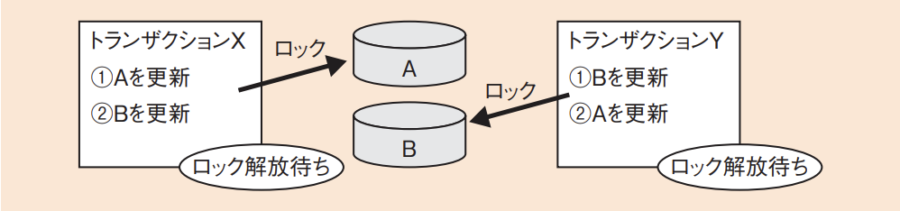
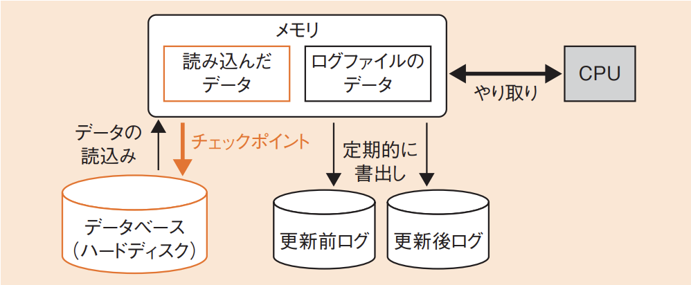
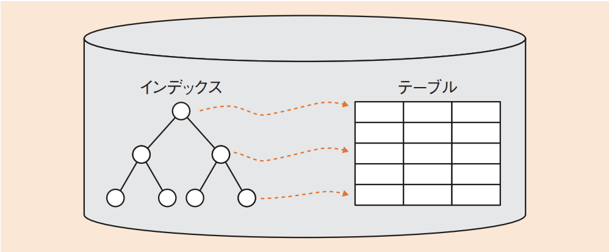

# 3-3-4 トランザクション処理(译: 事务处理)

- [3-3-4 トランザクション処理(译: 事务处理)](#3-3-4-トランザクション処理译-事务处理)
  - [トランザクション管理(译: 事务管理)](#トランザクション管理译-事务管理)
  - [排他制御(译: 排他控制)](#排他制御译-排他控制)
  - [ロック(译: 锁)](#ロック译-锁)
  - [セマフォ(译: semaphore, 信号量)](#セマフォ译-semaphore-信号量)
  - [障害回復処理(译: 故障恢复处理)](#障害回復処理译-故障恢复处理)
  - [ログファイルによる障害回復処理(译: 通过日志文件的故障恢复处理)](#ログファイルによる障害回復処理译-通过日志文件的故障恢复处理)
  - [データベースの性能向上(译: 提高数据库性能)](#データベースの性能向上译-提高数据库性能)

---

- トランザクション処理を考えるときのポイントは, 信頼性と性能の二つである。
  - 信頼性
    - データベースの中のデータが失われたり改ざんされたりしないように適切に管理する。
      - そのために, DBMSにはトランザクション管理機能がある。
  - 性能
    - 性能を向上させ, 短い時間で応答するための工夫も大切である。

## トランザクション管理(译: 事务管理)

- トランザクション(译: transaction, 事务): 分けることのできない一連の処理単位である。
  - 例: 銀行の処理で, Aさんの口座からBさんの口座に振り込む場合, 次のような一連の処理が発生する。 **Aさんの口座の残高を減らす → Bさんの口座の残高を増やす**
  - これらを途中で終わらせるわけにはいかないので, 二つの処理をまとめてトランザクションとする。
- **ACID特性**: トランザクションに技術的に満たすべき四つの性質である。

  | ACID特性 | 説明 | 説明 |
  | - | - | - |
  | **原子性** (译:Atomicity, 原子性) | トランザクションは, 完全に終わる(コミット), もしくは元に戻す(ロールバック)のどちらかでなければならない | 事务是最小的执行单位, 要么全部执行成功, 要么全部失败回滚, 不会只执行其中一部分 |
  | **一貫性** (译:Consistency, 一致性) | トランザクションで処理されるデータは, 実行前と後で整合性をもち, 一貫したデータを確保しなければならない | 事务执行前后, 数据库必须从一个一致状态转换到另一个一致状态, 不违反完整性约束 |
  | **独立性** (译:Isolation, 隔离性) | トランザクションAで変更中のデータを, トランザクションBで処理してはならない |  并发执行的事务之间不会相互干扰, 每个事务的中间状态对其他事务是不可见的 |
  | **耐久性** (译:Durability, 持久性) | いったんコミットしたら, そのデータは障害時にも回復できなければならない | 一旦事务提交, 其对数据库的更改将被永久保存, 即使系统故障也不会丢失 |

- 例題: トランザクションのACID特性のうち, 耐久性(durability)に関する記述として, 適切なものはどれか。
  - ア: 正常に終了したトランザクションの更新結果は, 障害が発生してもデータベースから消失しないこと
  - イ: データベースの内容が矛盾のない状態であること
  - ウ: トランザクションの処理が全て実行されるか, 全く実行されないかのいずれかで終了すること
  - エ: 複数のトランザクションを同時に実行した場合と, 順番に実行した場合の処理結果が一致すること

  > 耐久性(durability)とは, 障害時の耐久があるかどうかの指標である。耐久性があると, 障害が発生しても, 障害までにコミットしたデータについては, データベースから消失しないことが補償される。  
  > したがって, アが正解である。  
  > イ: 一貫性(consistency)に関する記述である。  
  > ウ: 原子性(Atomicity)に関する記述である。  
  > エ: 独立性(Isolation)に関する記述である。

## 排他制御(译: 排他控制)

- 排他制御: 一度に一つのトランザクションしかデータの更新が行えないようにする。
  - 実現方法に**ロック**や**セマフ**ォがある。
- **MVCC**(MultiVersion Concurrency Control: 多版同時実行制御)
  - 排他制御ではなく, 同時に複数のトランザクションを実行する方法である。
  - 複数のユーザの処理要求を同時並行性を失わずに処理し, 可用性を向上させる制御技術である。
  - 同時実行される二つのトランザクションがある場合, 先発のトランザクションがデータを更新しコミットする前に, 後発のトランザクションが同じデータを参照すると, 更新前の値(書込み直前のスナップショット)を返すことで同時実行を可能にする。

## ロック(译: 锁)

- ロック(译: 锁): データへの参照や更新を一時的に制限する仕組みである。
- 参照・更新するデータにロックをかけ, 使用が終わったときにロックを解除する。
- ロックの種類

  | ロックの種類 | 説明 | 説明 |
  | - | - | - |
  | 共有ロック/専有ロック (译: 共有锁/专有锁) | $\bullet$ データを参照するだけの場合には, 複数のトランザクションで同時に実行しても問題ない。そのために**共有ロック**をかけて, データの参照は自由に行えるようにする $\bullet$ データを更新する場合には, ほかのトランザクションに見えないように**専有ロック(排他ロック)**をかけ, 参照もできないようにする | $\bullet$ 共有锁允许多个事务读取同一数据, 但不能修改 $\bullet$ 专有锁(排他锁)则禁止其他事务读写该数据 |
  | デッドロック (译: 死锁) | $\bullet$ **デッドロック**: 二つのトランザクションで複数のデータを参照するとき, ロックのために互いのデータが使用可能になるのを待ち続けて, 互いに動けない状態になること $\bullet$ デッドロックが起こらないようにするためには, 複数のトランザクションにおいてデータの呼出し順序を同じにする方法が効果的である $\bullet$ 図: デッドロック  | 死锁: 多个事务相互等待对方释放锁, 导致永远无法继续执行 |
  | 2相ロック (译: 两段锁) | $\bullet$ 複数のテーブルにロックをかける際, かけたり外したりするのではなく, ロックするときにはずっとかけ続け(**単調増加**), 解除するときはずっと外した状態にしておく(**単調減少**)という考え方である $\bullet$ これにより, データベースの矛盾は起こりにくくなる | 两段锁协议: 事务在加锁阶段可以不断加锁, 但一旦开始释放锁就不能再加新锁, 用于确保事务的隔离性 |

## セマフォ(译: semaphore, 信号量)

- セマフォ(译: semaphore, 信号量): 複数のプロセスが共有するメモリなどの資源にアクセスするのを制御するための排他制御の仕組みである。同時に使用可能な共有資源の数を管理する。
- 例: 利用可能な共有資源が三つあり, どのプロセスも利用していない場合には, セマフォの値は3になる。ここで, 一つのプロセスが利用するときに, 利用を始める操作(P操作)を実行すると, セマフォの値は2となる。その後, 利用を終えるときに, 利用を終える操作(V操作)を実行すると, セマフォの値は3に戻る。このように, セマフォを利用することで共有資源の管理が可能となる。

## 障害回復処理(译: 故障恢复处理)

- データベースの障害には, 大きく分けて次の三つがある。

  | データベースの障害 | 説明 | 説明 |
  | - | - | - |
  | **トランザクション障害** | $\bullet$ デッドロックのような, トランザクションに不具合が起こる障害である $\bullet$ トランザクション障害ではDBMSは正常に動いており, データの不具合はないため, DBMSでロールバック命令などを実行することでのみ対処できる | 由于事务本身的逻辑错误或中断(如应用程序崩溃、ROLLBACK 操作)导致事务无法完成 |
  | **ソフトウェア(電源)障害** | ソフトウェアの実行中止などで, DBMSのデータに不具合が起こる障害である | 由于操作系统崩溃、数据库软件异常或断电等导致的系统级中断 |
  | **ハードウェア(媒体)障害** | $\bullet$ ハードディスクの故障などでデータが損傷するような障害である $\bullet$ バックアップデータを用いて復元する必要がある | 由于磁盘损坏、存储介质故障等引发的数据物理损坏或丢失 |

## ログファイルによる障害回復処理(译: 通过日志文件的故障恢复处理)

- データベース障害に備えるために, データベース用のハードディスクとは別のディスクにログファイルを用意する。
- 用意するログファイルは, **更新前ログ**と**更新後ログ**の二つである。
- 「データベースを更新するタイミング」及び「トランザクションがコミットするタイミング」で情報をログファイルに書き込む。
  - データベースの内容は実際にはメモリ上でのみ更新されており, ハードディスク上のデータは不定期にしか更新されないからである。
- **チェックポイント**: メモリからハードディスク上のデータベースに書込みを行うポイントである。
  - チェックポイント後に更新されたデータは, 障害が発生してメモリ上のデータが消えると失われてしまう。
  - そのためにログファイルを用意しておき, 障害発生に備える。
- 図: 障害回復処理 
- **ロールフォワード**(译: 前滚): データベースに障害が発生したときにトランザクションのコミットが完了していた場合には, **更新後ログ**を使って, チェックポイント後のデータを復元させること。
- **ロールバック**(译: 回滚): コミットが完了しないうちに障害が発生したときには, ハードディスクに書き込まれていた実行途中のデータをトランザクションの実行前の状態に戻す必要がある。そのためには, **更新前ログ**を用いて復元させる。
- 例題:データベースの障害回復処理に関する記述のうち, 適切なものはどれか。
  - ア: 異なるトランザクション処理プログラムが, 同一データベースを同時更新することによって生じる論理的な矛盾を防ぐために, データのブロック化が必要となる。
  - イ: システムが媒体障害以外の原因によって停止した場合, チェックポイントの取得以前に終了したトランザクションについての回復作業は不要である。
  - ウ: データベースの媒体障害に対して, バックアップファイルをリストアした後, ログファイルの更新前情報を使用してデータの回復処理を行う。
  - エ: トランザクション処理プログラムがデータベースの更新中に異常終了した場合には, ログファイルの更新後情報を使用してデータの回復処理を行う。

  > システムが媒体障害(ハードウェア障害)以外の原因によって停止した場合には, チェックポイント取得時点までのデータはハードディスク上に残っている。だから, トランザクションの回復処理は, チェックポイント後にコミット, または途中終了したトランザクションに限定される。  
  > したがって, イが正解である。  
  > ア: 同時更新することによる矛盾を防ぐための方法は, ブロック化ではなくロックである。  
  > ウ: バックアップファイルには, コミットが完了していないデータは残っていない。そのため, ログファイルの更新後ログを用いたロールフォワードのみで回復が可能である。  
  > エ: 更新中に異常終了した場合には, 更新前情報を使用してロールバック処理を行う。

## データベースの性能向上(译: 提高数据库性能)

- **インデックス**(译: 索引): 検索速度を上げるために設定する索引であり, 元のテーブルとは別に, キーとデータの場所(ポインタ)の組を一緒に格納する。
  - データベースの性能を向上させる方法として一般的なものである。
- 図: インデックス 
- インデックスはテーブルを更新するたびに更新する必要があるので, インデックスを設定すると, かえって処理速度が遅くなることがある。
- インデックスのデータ構造としては, B木やB+木, B*木, ビットマップなどが用いられる。
- 例題: 関係データベースにおけるインデックスの設定に関する記述のうち, 適切なものはどれか。
  - ア: インデックスの設定に際しては, 検索条件の検討だけでなく, テーブルのレコード数についての考慮も必要である。
  - イ: インデックスの設定によって検索性能が向上する場合は, 更新・削除・追加処理の性能も必ず向上する。
  - ウ: インデックスの設定は, 論理設計段階で洗い出された検索条件に指定されるすべての列について行う必要がある。
  - エ:  性別のように2値しかもたないような列でも, 検索条件に頻繁に指定する場合は, インデックスの設定を行う方がよい。

  > インデックスの設定を行う場合には, 検索条件の検討だけでなくレコード数の考慮も必要である。レコード数が少なければ直接検索した方が早い場合もある。  
  > したがって, アが正解である。  
  > イ: 更新・削除・追加処理の性能は, インデックスの設定によって低下する。  
  > ウ: すべての列ではなく, 検索効率が上がる列にのみインデックスを設定する必要がある。  
  > エ: 2値しかもたないような列にはインデックスは向かない。
