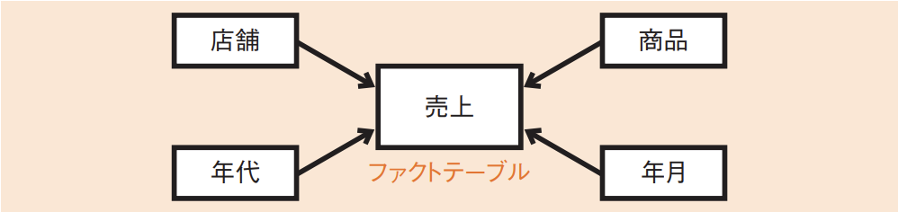
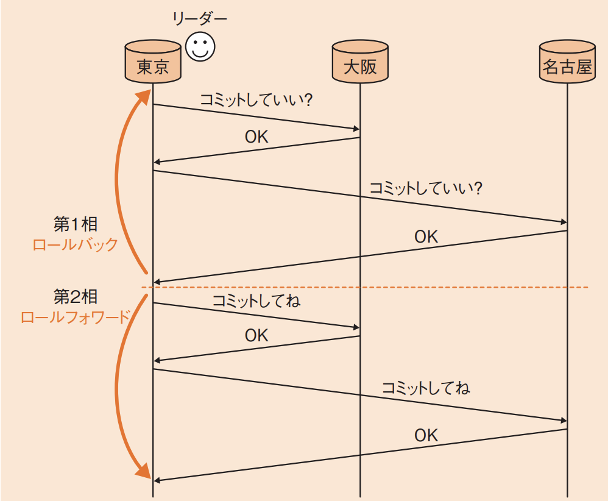
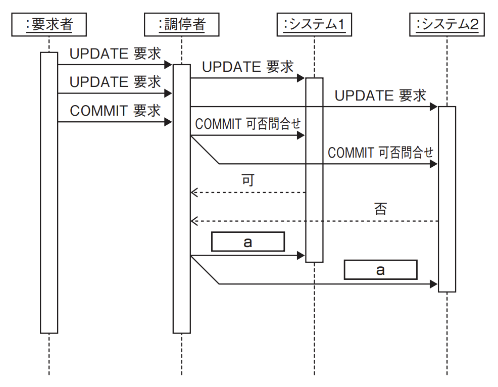

# 3-3-5 データベース応用(译: 数据库应用)

- [3-3-5 データベース応用(译: 数据库应用)](#3-3-5-データベース応用译-数据库应用)
  - [OLAP(译: 联机分析处理)](#olap译-联机分析处理)
  - [分散データベース(译: 分布式数据库)](#分散データベース译-分布式数据库)
  - [ビッグデータ(译: 大数据)](#ビッグデータ译-大数据)
  - [NoSQL(译: 非关系型数据库)](#nosql译-非关系型数据库)

---

- OLTP(译: Online Transaction Processing, 联机事务处理): トランザクションを中心とした処理のこと。
- OLAP(译: Online Analytical Processing, 联机分析处理): 複雑で分析的な問合せに素早く回答する処理のこと。

## OLAP(译: 联机分析处理)

- OLAP: OLTPのデータ, つまり関係データベースなどのデータのスナップショット(ある時点のデータベースの内容)を取り, 別のデータベースに移す。そのとき, 多次元データとして再構成することで, いろいろな次元(分析軸)での分析を可能にする。
- **データウェアハウス**(译: 数据仓库): 多次元データの集まりである。 
- **データクレンジング**(译: 数据清洗): 複数の関係データベースを統合する場合に行い, データの形式やコード体系を統一する。
- **ファクトテーブル**(译: Fact Table, 事实表): 抽出したデータの格納先である。
- **ディメンション(次元)テーブル**(译: Dimension  Table, 维表): 分析軸のデータの格納先である。
  - スノーフレークスキーマ(译: 雪花型模式): ディメンションテーブルを階層化して, さらに細かく分析できるようにした構造である。雪の結晶のように見える。
- 図: ファクトテーブルとディメンションテーブルの関係 
  - 図の売上テーブルがファクトテーブルで, その他がディメンションテーブルである。
  - それぞれの分析軸を基にデータの分析を繰り返す。
  - このE-R図の構造は**スタースキーマ**(译: 星型模式)と呼ばれる。
- データウェアハウスの基本操作

  | データウェアハウスの基本操作 | 説明 | 説明 |
  | - | - | - |
  | **スライシング** (译: 切片) | 多次元のデータを2次元の表に切り取る操作 | 切片: 从多维数据中固定一个维度, 提取出一个子集(类似二维表的一部分) |
  | **ダイシング** (译: 切块) | データの分析軸を変更し, 視点を変える操作 | 切块: 选取多个维度的特定范围, 形成一个更小的多维子立方体 |
  | ドリリング (译: 钻取) | $\bullet$ 分析の深さを詳細にしたり, また, 集計したりして変更する操作 $\bullet$ **ドリルアップ**(译: 向上汇总): 例: 年月での分析を年単位にすること $\bullet$ **ドリルダウン**(译: 向下深入): 例: 年月での分析を日単位にすること | 下钻/上卷: 在维度层级中向下深入(Drill Down)或向上汇总(Drill Up)查看数据的不同粒度 |

- **データマイニング**(译: 数据挖掘): データウェアハウスなどに, 統計学, パターン認識, 人工知能などのデータ解析手法を適用することで新しい知見を取り出す技術のこと。

## 分散データベース(译: 分布式数据库)

- **分散データベース**(译: 分布式数据库): データベース中のデータを複数のデータベースに分散配置したデータベースである。
- CAP定理: 複数のDBMSが並行して稼働する場合, 一貫性(Consistency)・可用性(Availability)・分断耐性(Partition-tolerance)の三つの特性のうち, 同時に保証できるのは最大二つまでで, 三つ同時に満たすことができない。
- 分散データベースは, ユーザにデータの分散を意識させないようにするために**透過的**である必要がある。
  - 例: 物理的に複数の場所に置かれたシステムであっても, 全体で一つのシステムとして動く必要がある。
  - そのために必要な仕組みが, **2相コミット**(译: 二阶段提交)である。
- 図: 2相コミット 
- 2相コミットでは, コミットを2段階に分けて考える。
  - 第1相: ユーザからの要求はリーダー(調停者)が受け, リーダーがほかのすべてのデータベースに「コミットしていい？」と問い合わせる。これが第1相で, この段階で一つでもNGが返ってきたら, 全体をロールバックする。
  - 第2相: 全員からOKが返ってきたら, 第2相に移る。この段階では, 「コミットしてね」と, すべてのシステムにコミットを強制する。この段階で失敗した場合は, ログファイルなどを使ってロールフォワードさせるなどして, すべてのシステムをコミットさせる。
  - セキュア状態: リーダー以外のシステムでは, 第1相の問合せに返答してから第2相の要求が来るまでの間は, コミットもロールバックもできない状態(セキュア状態)になる。
- 例題: 分散データベースにおいて図のようなコマンドシーケンスがあった。調停者がシーケンスaで発行したコマンドはどれか。ここで, コマンドシーケンスの記述にUMLのシーケンス図の記法を用いる。 
  - ア: COMMITの実行要求
  - イ: ROLLBACKの実行要求
  - ウ: 判定レコードの書出し要求
  - エ: ログ書出しの実行要求

  > 問題の図はUMLのシーケンス図であるが, 要求者のUPDATE要求に対して, 調停者がすべてのシステムにUPDATE要求を指示している。  
  > その後, 2相コミットの第1相でCOMMIT可否問合せが行われ, システム1からは"可", システム2からは"否"の応答が返ってきている。  
  > この状態ではコミットはできないので, すべてのシステムをロールバックさせる必要がある。  
  > したがって, 「ROLLBACKの実行要求」を出すイが正解である。

## ビッグデータ(译: 大数据)

- **ビッグデータ**(译: 大数据): 通常のDBMS(関係データベースなど)で取り扱うことが困難な大きさのデータの集まりのことである。
  - 単にデータ量が多いだけでなく, 様々な種類があり, 非構造化データ(構造化できないデータ)や定型的でないデータなども含まれる。
- **データレイク**(译: 数据湖): 扱うデータの保存先である。
  - 分析などで加工する前のデータをデータレイクに保存しておくことで, 様々な視点での分析や利用が可能になる。
- ビッグデータを扱うための技術
  - **グリッド・コンピューティング**(译: 网格计算)
    - インターネットなどの広域ネットワークにある計算資源を結びつけ, 一つの複合的なシステムとして使用する仕組みである。
  - **データマイニング**(译: 数据挖掘)
  - 超並列コンピュータ(译: 大规模并行计算机)

## NoSQL(译: 非关系型数据库)

- **NoSQL**: ビッグデータは, 通常の関係データベースでSQLを使用する処理に向いていない。そのため, 様々な新しいデータベースが考案されており, それらのDBMSを総称してNoSQLと呼ぶ。
- NoSQLに分類される主なデータベース

  | NoSQLに分類される主なデータベース | 説明 | 説明 |
  | - | - | - |
  | **キーバリュー型(KVS: Key-Value Store)データベース** (译: 键值型数据库) | $\bullet$ 様々な形式のデータを一つのキーに対応付けて管理するデータベース $\bullet$ 値の型は定義されていないので, 様々な型の値を格納することができる | $\bullet$ 以"键-值"对的形式存储数据, 结构简单, 查询速度快, 适用于高速读写场景 $\bullet$ 例: Redis, Amazon DynamoDB |
  | **ドキュメント型データベース** (译: 文档型数据库) | $\bullet$ データ項目の値として, 階層構造のデータをドキュメントという単位で管理することができるデータベース $\bullet$ JSON形式のデータなどが格納される | $\bullet$ 以类似 JSON 或 BSON 格式存储结构化数据, 灵活支持复杂嵌套结构 $\bullet$ 例: MongoDB, CouchDB |
  | **グラフ指向データベース** (译: 图数据库) | $\bullet$ グラフ構造をデータベースで実現するデータベース $\bullet$ 具体的には, グラフの一つ一つのデータをノードとして, ノードとノードの関係をリレーションとして定義する。ノードやリレーションは, 情報としてプロパティをもつことができる | $\bullet$ 以节点和边的形式存储数据, 适合表示和查询复杂关系, 如社交网络, 推荐系统 $\bullet$ 例: Neo4j, Amazon Neptune |

- 例題: ビッグデータの基盤技術として利用されるNoSQLに分類されるデータベースはどれか。
  - ア: 関係データモデルをオブジェクト指向データモデルに拡張し, 操作の定義や型の継承関係の定義を可能としたデータベース
  - イ: 経営者の意思決定を支援するために, ある主題に基づくデータを現在の情報とともに過去の情報も蓄積したデータベース
  - ウ: 様々な形式のデータを一つのキーに対応付けて管理するキーバリュー型データベース
  - エ: データ項目の名称や形式など, データそのものの特性を表すメタ情報を管理するデータベース

  > NoSQLとは, 関係データベース以外のデータベースで, 大量のデータを高速に処理する場合などに使用される。NoSQLに分類されるデータベースの代表的なものに, データをキーという単位で管理するキーバリュー型(KVS: Key-Value Store)データベースがある。  
  > したがって, ウが正解である。  
  > ア: オブジェクト指向型データベース(译: OODB, 面向对象数据库)の説明である。  
  > イ: データウェアハウス(译: 数据仓库)の説明である。  
  > エ: データディクショナリ(译: 数据字典)の説明である。
