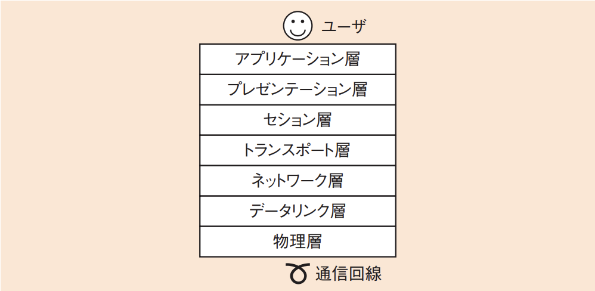

# 3-4-2 データ通信と制御(译: 数据通信与控制)

- [3-4-2 データ通信と制御(译: 数据通信与控制)](#3-4-2-データ通信と制御译-数据通信与控制)
  - [OSI基本参照モデル(译: OSI基本参考模型)](#osi基本参照モデル译-osi基本参考模型)
  - [LAN間接続装置(译: 局域网间连接设备)](#lan間接続装置译-局域网间连接设备)
  - [LANの方式(译: 局域网的类型)](#lanの方式译-局域网的类型)
  - [無線LAN(译: 无线局域网)](#無線lan译-无线局域网)
  - [スイッチの機能(译: 交换机的功能)](#スイッチの機能译-交换机的功能)
  - [LANの速度(译: 局域网的速度)](#lanの速度译-局域网的速度)
  - [様々なネットワーク(译: 各种网络)](#様々なネットワーク译-各种网络)

## OSI基本参照モデル(译: OSI基本参考模型)

- OSI(Open Systems Interconnection)基本参照モデル(译: 开放系统互联): ネットワーク階層化の考え方として最も有名なものである。
- コンピュータのもつべき通信機能を, 次の七つの階層に分けて定義している。  ユーザが作成したデータは, 通信に使用するアプリケーションに送られる。それがアプリケーション層である。その後, 順にプレゼンテーション層, セション層……と送られ, 最終的に物理層に到達し, 電気信号として通信回線に流す。
- それぞれの層の機能や役割

  |  | 階層 | 説明 | 説明 |
  | - | -- | ---- | -- |
  | 第7層 | アプリケーション層 (译:Application Layer, 应用层) | 通信に使う**アプリケーション**(サービス)そのもの | 为用户提供网络服务接口, 如 HTTP, FTP, SMTP 等 |
  | 第6層 | プレゼンテーション層 (译:Presentation Layer, 表示层) | $\bullet$ データの**表現**方法を変換する $\bullet$ 例: 画像ファイルをテキスト形式に変換したり, データを圧縮したりする | 处理数据的表示, 加密, 解密, 压缩等功能, 例如字符编码转换 |
  | 第5層 | セション層 (译:Session Layer, 会话层) | $\bullet$ 通信するプログラム間で**会話**を行う $\bullet$ セションの開始や終了を管理したり, 同期をとったりする | 管理通信会话的建立, 维护与终止, 协调会话活动 |
  | 第4層 | トランスポート層 (译:Transport Layer, 传输层) | $\bullet$ コンピュータ内でどの通信プログラム(サービス)と通信するのかを管理する $\bullet$ 通信の**信頼**性を確保する | 提供端到端的可靠或不可靠的数据传输(如 TCP, UDP) |
  | 第3層 | ネットワーク層 (译:Network Layer, 网络层) | $\bullet$ ネットワーク上でデータが**始点から終点まで**配送されるように管理する $\bullet$ ルーティングを行い, データを転送する | 负责路径选择与逻辑寻址, 实现不同网络间的数据传输(如 IP) |
  | 第2層 | データリンク層 (译:Data Link Layer, 数据链路层) | $\bullet$ ネットワーク上でデータが**隣の通信機器まで**配送されるように管理する $\bullet$ 通信機器間で信号の受渡しを行う | 负责帧的封装与传输, 提供物理寻址与差错检测(如 MAC, 以太网) |
  | 第1層 | 物理層 (译: Physical Layer, 物理层) | $\bullet$ 物理的な接続を管理する $\bullet$ 電気信号の変換を行う | 负责比特流的实际传输, 包括电缆, 电信号, 网卡等物理设备 |

- 例題: OSI基本参照モデルにおいて, アプリケーションプロセス間での会話を構成し, 同期をとり, データ交換を管理するために必要な手段を提供する層はどれか。
  - ア: アプリケーション層
  - イ: セション層
  - ウ: トランスポート層
  - エ: プレゼンテーション層

  > アプリケーションプロセス間での「会話」を構成するのはセション層である。  
  > したがって, イが正解である。  
  > トランスポート層では「信頼」, プレゼンテーション層では「表現」がポイントとなる。

## LAN間接続装置(译: 局域网间连接设备)

- OSI基本参照モデルでは階層ごとに機能や役割が違うので, ネットワークに接続するときに必要となる装置も異なる。
- それぞれの階層で必要な機器

  | 階層 | 必要な機器 | 説明 | 説明 |
  | - | - | ---- | - |
  | 第1層 (物理層) | リピータ (译: 中继器) | $\bullet$ 電気信号を増幅して整形する装置である $\bullet$ リピータの機能で複数の回線に中継する**リピータハブ**が一般的である $\bullet$ すべてのパケットを中継するので, 接続数が多くなってくるとパケットの衝突が発生し, ネットワークが遅くなる $\bullet$ 図: リピータ  | 放大和转发物理信号, 延长传输距离, 不处理数据内容 |
  | 第2層 (データリンク層) | ブリッジ (译: 网桥) | $\bullet$ データリンク層の情報(**MACアドレス**(译: MAC地址))に基づき, 通信を中継するかどうかを決める装置である $\bullet$ ブリッジの機能で複数の回線に中継する**スイッチングハブ**(レイヤ2スイッチ)(译: 网络交换机)が一般的である $\bullet$ リピータに加えて, **アドレス学習機能**と**フィルタリング機能**を備えている $\bullet$ 送信元のMACアドレスを**アドレステーブル**(译: 地址表)に学習し, 宛先のMACアドレスがアドレステーブルにある場合に, そのポートのみにデータを送信する | 根据 MAC 地址转发数据, 用于划分局域网段 |
  | 第3層 (ネットワーク層) | ルータ (译: 路由器) | $\bullet$ ネットワーク層の情報(**IPアドレス**(译: IP地址))に基づき, 通信の中継先を決める装置である $\bullet$ ルーティングテーブル(译: 路由表)によって中継先を決める動作を**ルーティング**(译: 路由)という $\bullet$ スイッチングハブの機能にルーティングの機能を加えた**レイヤ3スイッチ**もある | 根据 IP 地址转发数据, 实现不同网络之间的通信 |
  | 第4 ~ 7層 (トランスポート層以上) | ゲートウェイ (译: 网关) | $\bullet$ トランスポート層以上でデータを中継する必要がある場合に用いる $\quad \bullet$ **プロキシサーバ**: PCの代理でインターネットにパケットを中継する $\quad \bullet$ **VoIPゲートウェイ**: 電話の音声をディジタルデータに変換して送出する | 用于不同协议, 数据格式或体系结构之间的转换, 如企业网络与互联网之间的连接 |

- 例題: スイッチングハブ(レイヤ2スイッチ)の機能として, 適切なものはどれか。
  - ア: IPアドレスを解析することによって, データを中継するか破棄するかを判断する。
  - イ: MACアドレスを解析することによって, 必要なLANポートにデータを流す。
  - ウ: OSI基本参照モデルの物理層において, ネットワークを延長する。
  - エ: 互いに直接, 通信ができないトランスポート層以上の二つの異なるプロトコルの翻訳作業を行い, 通信ができるようにする。

  > スイッチングハブ(レイヤ2スイッチ)は, その名のとおり, レイヤ2, つまりOSI基本参照モデルの下から2番目のデータリンク層でパケットの転送を制御する。データリンク層のアドレスはMACアドレスで, スイッチングハブはMACアドレスに基づいて必要なLANポートにデータを中継するので, イが正解である。  
  > ア: ルータ(レイヤ3スイッチ)の機能である。
  > ウ: リピータ(リピータハブ, レイヤ1スイッチ)の機能である。
  > エ: ゲートウェイの機能である。

## LANの方式(译: 局域网的类型)

- 複数台のコンピュータでネットワークを共有するときは, 競合しないように通信を管理することが重要である。
- **トークンリング**(译: 令牌环)と**FDDI**(译: 光纤分布式数据接口)
  - **トークンリング**: トークンという送信権を設定し, トークンをもったもののみが通信できる方式
  - **FDDI**(Fiber-Distributed Data Interface): 光ファイバでトークンリングを二重化した方式
  - 送信権の管理は複雑なので機器が高価になる。
- **CSMA/CD**(Carrier Sense Multiple Access with Collision Detection)(译: 载波监听多路访问/冲突检测): 衝突したらそれを検出して再送する方式
  - イーサネットが考えられた仕組み
    - **イーサネット**(译: 以太网): LANの標準規格である
  - 次の手順で通信を管理する。
    1. Carrier Sense(译: 载波监听) $\cdots \cdots$ 誰も使っていなければ使用可
    2. Multiple Access(译: 多路访问) $\cdots \cdots$ 全員向けに送る
    3. Collision Detection(译: 冲突检测) $\cdots \cdots$ 衝突が起こったら検出
  - 衝突を検出したら, **ランダムな時間待機**をしてから再送を試む。
  - 図: CSMA/CD方式 

## 無線LAN(译: 无线局域网)

- 無線LANは有線LANと違って電波を使用するので, 衝突は検出できない。
- **CSMA/CA**(Carrier Sense Multiple Access with Collision Avoidance)(译: 载波监听多路访问/冲突避免): 衝突を避けるための仕組み。衝突を回避するために, 送信の前に毎回待ち時間を挿入する。
- 無線LANの代表的な規格

  | 規格 | 周波数帯 | 公称速度 |
  | - | - | - |
  | **IEEE 802.11a** | 5GHz帯 | 54Mビット/秒 |
  | IEEE 802.11b | 2.4GHz帯 | 11Mビット/秒 |
  | IEEE 802.11g  | 2.4GHz帯 | 54Mビット/秒 |
  | **IEEE 802.11n** | 2.4GHz / 5GHz帯 | 600Mビット/秒 |
  | **IEEE 802.11ac** | 5GHz帯 | 1.3Gビット/秒 |
  | IEEE 802.11ah | 920MHz帯 | 4Mビット/秒 |

  - IEEE 802.11nやIEEE 802.11acの高速化技術
    - **MIMO**(Multiple Input Multiple Output)(译: 多进多出): 複数のアンテナで送受信を行う
    - **チャネルボンディング**(译: 通道捆合技术): 複数の周波数帯を結合する
  - IEEE 802.11ah
    - IoTデバイス向けの規格で, 省電力で低速の通信を実現できる。
- 無線LANの代表的な機能

  | 無線LANの代表的な機能 | 説明 | 説明 |
  | - | ---- | - |
  | **SSID**(Service Set Identifier) (译: 服务集标识) | $\bullet$ 無線LANでネットワークを識別するIDである $\bullet$ 複数のアクセスポイントに同じSSIDを設定することができるので, **ローミング**(アクセスポイントが変わっても接続が維持されること)(译: 漫游)が可能である $\bullet$ アクセスポイントはビーコン信号(译: 信标)を発信してSSIDを周囲に知らせるのだが, 知らせないようにする**ステルス**機能(译: SSID非广播功能)がある $\bullet$ どのアクセスポイントにも接続できる「ANY」という特殊なSSIDがあり, ここからの接続を受け付けない**ANY接続拒否**(译: 拒绝以 SSID=ANY 方式进行的无线LAN连接请求)の設定も可能である | 用于识别无线LAN的网络名称, 设备通过SSID连接到目标网络 |
  | 暗号化 (译: 加密) | $\bullet$ 無線LANの暗号化の規格 $\quad \bullet$ **WEP**(Wired EquivalentPrivacy)(译: 有线等效加密) $\quad \bullet$ **WPA**(Wi-Fi Protected Access)(译: Wi-Fi网络安全存取协议): より強度が高い $\bullet$ 現在の最新バージョンはWPA3で, **WPA2**か**WPA3**の使用が推奨される | 对无线通信数据进行加密, 防止被窃听。常见方式有WEP, WPA2, WPA3等 |
  | 認証 (译: 认证) | $\bullet$ 無線LANでは, 通信相手を認証し, 制限を行う $\bullet$ 最も単純なものに**MACアドレス認証**があり, MACアドレスを基にアクセスを制御する $\bullet$ 認証規格である**IEEE 802.1X**を使い, 複数の認証方式の中から選択して認証を行うことも多くある | 确认连接设备的合法性, 确保只有授权用户能访问无线网络, 例如使用密码或企业级认证(如802.1X) |

## スイッチの機能(译: 交换机的功能)

- スイッチ(レイヤ2スイッチ, レイヤ3スイッチ)には, 有線/無線にかかわらず次のような機能をもっているものがあり, 信頼性やセキュリティを向上させている。

  | スイッチの機能 | 説明 | 説明 |
  | - | ---- | - |
  | **スパニングツリー** (译: Spanning Tree Protocol, STP, 生成树协议) | $\bullet$ ネットワークの**冗長性**を確保するためのプロトコルである $\bullet$ スイッチをループ状に接続すると, パケットが永遠に巡回し続けるという問題がある $\bullet$ それを避けるために, 優先するスイッチとそうでないスイッチを決め, 論理的に接続を切断してループを止める | 防止因冗余路径而产生网络环路, 确保局域网中只有一条有效路径 |
  | **VLAN**(Virtual LAN: 仮想LAN) (译: 虚拟局域网) | $\bullet$ 一つのスイッチに接続されているPCを, 論理的に複数のネットワークに分ける仕組みである $\quad \bullet$ 部署ごとに接続するVLANを分ける, または, ウイルス対策は専用のVLAN(**検疫VLAN**)に隔離して行うなどの使い方がある $\bullet$ ポートベースVLAN(译: 基于端口的VLAN): スイッチのポートごとにVLANを割り当てる $\bullet$ **タグVLAN**(译: 标签VLAN): フレームにタグを付けることで同じポートで複数のVLANを利用する $\quad \bullet$ タグVLANの規格にIEEE 802.1Qがあり, フレームにVLAN IDを付けて, 接続するネットワークを制御する | 通过逻辑划分将一个物理网络分割成多个子网, 提高安全性与管理灵活性 |
  | 認証スイッチ (译: 认证交换机) | $\bullet$ スイッチのポート一つ一つで認証を行い, アクセス制御を行うスイッチである $\bullet$ よく用いられる規格は, IEEE 802.1Xである | 控制设备接入网络的权限, 常结合 802.1X 认证协议使用, 仅允许通过认证的设备通信 |

- フレーム(译: 帧, 数据帧): パケットのうち, データリンク層のヘッダまで付いたパケット全体のこと。
  - IPデータグラム(译: IP 数据报): ヘッダがネットワーク層まで
  - セグメント(译: 段, 传输层报文段): ヘッダがトランスポート層まで
- 应用层数据(HTTP等) ↓ 传输层 → セグメント(加上TCP头) ↓ 网络层 → IPデータグラム(加上IP头) ↓ 数据链路层 → フレーム(加上MAC地址等) ↓ 物理层 → 比特流传输

## LANの速度(译: 局域网的速度)

- LANの種類と通信速度

  | LANの種類 | 通信速度 | 説明 | 説明 |
  | - | - | -- | - |
  | 10メガビット・イーサネット | 10Mビット/秒 (10Mbps) | $\bullet$ 10BASE2や10BASE5 $\quad \bullet$ 同軸ケーブル $\bullet$ **10BASE-T** $\quad \bullet$ **カテゴリ3**以上のUTP(Unshielded Twisted Pair)ケーブル(译: 非屏蔽双绞线) | 最早期的以太网标准, 速度较慢, 现已基本淘汰 |
  | 100メガビット・イーサネット | 100Mビット/秒 (100Mbps) | $\bullet$ **100BASE-TX** $\quad \bullet$**カテゴリ5**以上のUTPケーブル | 又称"快速以太网(Fast Ethernet)", 仍用于部分办公网络中 |
  | ギガビット・イーサネット | 1Gビット/秒 (1Gbps) | $\bullet$ 1000BASE-T $\quad \bullet$ **カテゴリ5e**以上のUTPケーブル $\bullet$ 1000BASE-SX, LX $\quad \bullet$ 光ファイバケーブル | 千兆以太网, 目前的主流 LAN 标准, 适用于多数企业和家庭网络 |
  | 10ギガビット・イーサネット | 10Gビット/秒 (10Gbps) | $\bullet$ **10GBASE-T** $\quad \bullet$ **カテゴリ6**以上のUTPケーブル $\bullet$ 1000BASE-SR, LR $\quad \bullet$ 光ファイバケーブル | 万兆以太网, 应用于数据中心, 高速骨干网络等高性能环境 |

## 様々なネットワーク(译: 各种网络)

- センサネットワーク(译: 无线感测网络): 複数のセンサ付きの無線端末が, 互いに協調して環境や物理的状況のデータを採取する無線ネットワークである。
- **PLC**(Power Line Communication: 電力線通信)(译: 电力线通信): 電力線を通信回線として利用する技術である。機器を既存のコンセントに差すだけでネットワークを構築できる。
