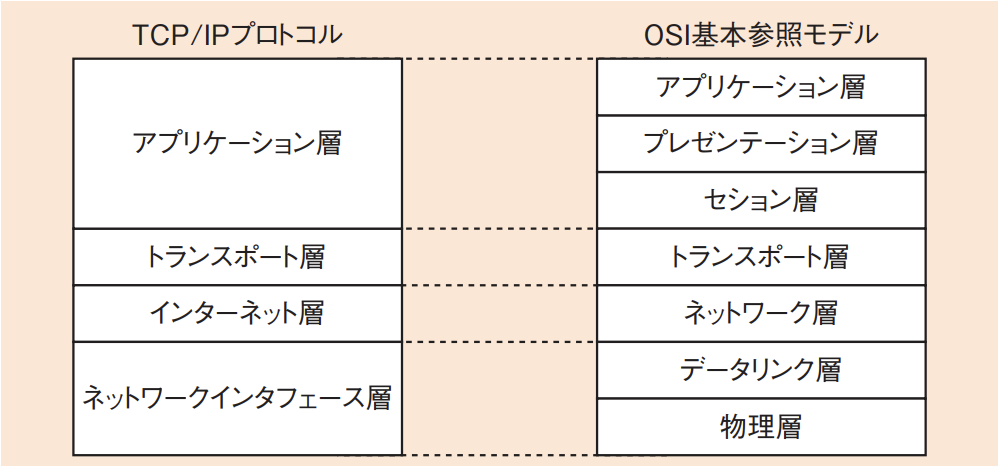
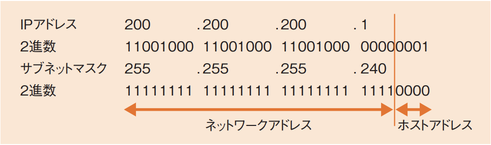
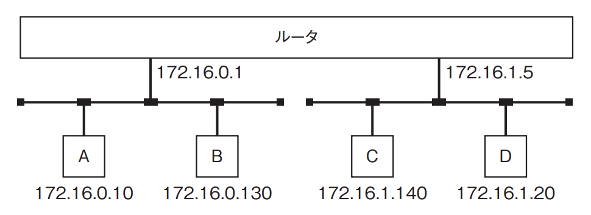
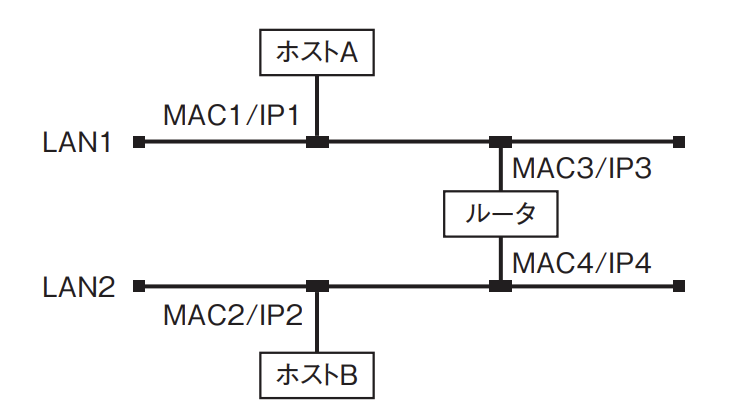

# 3-4-3 通信プロトコル(译: 通信协议)

- [3-4-3 通信プロトコル(译: 通信协议)](#3-4-3-通信プロトコル译-通信协议)
  - [TCP/IPプロトコルスイート(译: TCP/IP 协议族)](#tcpipプロトコルスイート译-tcpip-协议族)
  - [ネットワークを流れるフレームの様子(译: 网络中传输的帧的状态)](#ネットワークを流れるフレームの様子译-网络中传输的帧的状态)
  - [ネットワークインタフェース層のプロトコル(译: 网络接口层的协议)](#ネットワークインタフェース層のプロトコル译-网络接口层的协议)
  - [インターネット層のプロトコル(译: 网络层的协议)](#インターネット層のプロトコル译-网络层的协议)
  - [トランスポート層のプロトコル(译: 传输层的协议)](#トランスポート層のプロトコル译-传输层的协议)
  - [アプリケーション層のプロトコル(译: 应用层的协议)](#アプリケーション層のプロトコル译-应用层的协议)
  - [IPアドレスとMACアドレス(译: IP地址与MAC地址)](#ipアドレスとmacアドレス译-ip地址与mac地址)
  - [アドレス変換(译: 地址转换)](#アドレス変換译-地址转换)
  - [IPv6(Internet Protocol version 6)(译: IPv6(互联网协议第6版))](#ipv6internet-protocol-version-6译-ipv6互联网协议第6版)
  - [常见网络协议 速查表(含中文说明 + OSI层 + 默认端口)](#常见网络协议-速查表含中文说明--osi层--默认端口)

## TCP/IPプロトコルスイート(译: TCP/IP 协议族)

- TCP/IPプロトコルスイート(译: TCP/IP 协议族): インターネットや多くの商用ネットワークで使われるプロトコルをまとめたインターネットプロトコルスイートである。
- 最初に定義された最も重要な二つのプロトコル
  - TCP(TransmissionControl Protocol)(译: 传输控制协议)
  - IP(Internet Protocol)(译: 网际互连协议)
- 4階層にまとめられるが, OSI基本参照モデルの7階層と切り口は同じである。 図: TCP/IPプロトコルとOSI基本参照モデル 
- 実際のコンピュータでは
  - アプリケーション層: プログラムをサービスとしてインストールする。
  - トランスポート層とインターネット層は: TCP/IPプロトコルとしてOSに内蔵されている
  - ネットワークインタフェース層: ドライバなどの, ハードウェアとのインタフェースである

## ネットワークを流れるフレームの様子(译: 网络中传输的帧的状态)

- 階層ごとフレームの状態

  | 階層 | フレームの状態 |
  | - | - |
  | アプリケーション層 | データ部分生成 |
  | トランスポート層(TCPなど) | TCPヘッダ付加 |
  | ネットワーク層(IPなど) | IPヘッダ付加 |
  | ネットワークインタフェース層(イーサネットなど) | $\bullet$ イーサネットヘッダ付加 $\bullet$ トレーラ(译: 挂载)(FCS: フレームチェックシーケンス(译: 帧校验序列))付加 |

- ネットワーク上を流れるフレームは, 次図のような構成になる。 

## ネットワークインタフェース層のプロトコル(译: 网络接口层的协议)

- ネットワークインタフェース層(物理層, データリンク層)の代表的な規格

  | 規格 | 利用先 | 説明 |
  | -- | - | ---- |
  | PPP(Point-to-Point Protocol) (译: 点对点协议) | WAN | $\bullet$ 2点間を接続してデータ通信を行うためのプロトコル $\bullet$ ダイヤルアップネットワーク(译: 拨号网络)で使用されてきた $\bullet$ 通信相手の認証や, IPアドレスの取得などを行う |
  | **ATM**(Asynchronous Transfer Mode) (译: 异步传输模式) | WAN | $\bullet$ 53バイトの固定長のデータであるセルを単位としてデータを送る通信プロトコル $\bullet$ 通信会社のバックボーン回線(译: 骨干线路)でよく用いられている |
  | **イーサネット** (译: 以太网) | LAN | $\bullet$ プロトコルとして[**CSMA/CD**](3-4-2データ通信と制御.md#lanの方式译-局域网的类型)方式を用い, **MACアドレス**(Media Access Control address)(译: 媒体访问控制地址)によって通信相手を決定する $\bullet$ MACアドレスは, 各通信機器に固定で設定されているハードウェアアドレスで, 同じネットワーク内で通信相手を識別するために使用される |

- MACアドレスに関するプロトコル

  | プロトコル | 説明 |
  | - | ---- |
  | **ARP**(Address Resolution Protocol) (译: 地址解析协议) | $\bullet$ **IPアドレス**から**MACアドレス**を得るためのプロトコル $\bullet$ ネットワーク上で通信を開始するときには, IPアドレスは知っていてもMACアドレスは分からないため $\quad$ → 「このIPアドレスに該当する人は, MACアドレスを教えてください」というARP要求パケットを**ブロードキャスト**(全員向けのパケット)(译: Broadcast, 广播)で送出する $\quad$ → IPアドレスが該当する場合は, ARP応答パケットを**ユニキャスト**(相手だけに向けたパケット)(译: Unicast, 单播)で送出する |
  | RARP(Reverse Address Resolution Protocol) (译: 反向地址解析协议) | $\bullet$ **MACアドレス**から**IPアドレス**を得るためのプロトコル $\bullet$ ハードディスクがなく, 自分のIPアドレスを保持しておけないPCなどが利用する |

- ADSLやFTTHで利用されるPPPは, イーサネット上でパケットを送る必要がある。
  - **PPPoE**(PPP over Ethernet): イーサネットの上でPPPを使用するプロトコル
  - **IPoE**(IP over Ethernet): IPv6接続でのFTTH(Fiber To The Home)(译: 光纤到户)の通信を高速化するための規格

- 例題: TCP/IPに関連するプロトコルであるRARPの説明として, 適切なものはどれか。
  - ア: IPアドレスを基にMACアドレスを問い合わせるプロトコル
  - イ: IPプロトコルのエラー通知及び情報通知のために使用されるプロトコル
  - ウ: MACアドレスを基にIPアドレスを問い合わせるプロトコル
  - エ: ルーティング情報を交換しながら, ルーティングテーブルを動的に作成するプロトコル

  > RARPは, MACアドレスを基にIPアドレスを問い合わせるプロトコルである。  
  > したがって, ウが正解である。  
  >ア: ARPの説明である。  
  >イ: はICMP(译: Internet Control Message Protocol, 互联网控制报文协议)の説明である。  
  >エ: はダイナミックルーティングのプロトコル(译: 动态路由协议)(RIP(Routing Information Protocol)(译: 路由信息协议), OSPF(Open Shortest Path First)(译: 开放最短路径优先)など)の説明である。

## インターネット層のプロトコル(译: 网络层的协议)

- **IP**(Internet Protocol)(译: 网际互连协议): インターネット層のプロトコルの中心である。
  - **IPアドレス**によって, 世界中のインターネットに接続されている機器の中から相手を見つけ, パケットを送る。
  - **ICMP**(Internet Control Message Protocol)(译: 互联网控制报文协议): IPプロトコルのエラー通知及び情報通知のために使用されるプロトコル
    - **ping**(Packet Internet Groper)(译: 因特网包探索器): ICMPを使うプロトコルである。特定のIPアドレスに向けてpingを実行することで, 相手のホストが動いているかどうかを確認する。
- **IPアドレス**(译: IP地址)は, **ネットワークアドレス**(译: 网络地址) + **ホストアドレス**(译: 主机地址)で構成される。
  - IPv4(IP version 4)アドレスの場合は合計で32ビットである。
  - 同じネットワークであれば同じネットワークアドレスが割り当てられ, そのネットワーク内で一意のホストアドレスが割り当てられる。
- ネットワークアドレスの長さはクラスを基準に定められる。

  | クラス | IPアドレスの範囲 | ネットワークアドレス | ホストアドレス | 用途 | 中文说明 |
  | - | ---- | -- | -- | -- | -- |
  | クラスA | 0.0.0.0 ~ 127.255.255.255 | 8ビット | 24ビット | 特大网络(最多主机) | 适合超大型网络, 如ISP |
  | クラスB | 128.0.0.0 ~ 191.255.255.255 | 16ビット | 16ビット |  中型网络 | 适用于高校, 企业等 |
  | クラスC | 192.0.0.0 ~ 223.255.255.255 | 24ビット | 8ビット | 小型网络(最多254主机) | 适用于小型公司或家庭 |
  | クラスD | 224.0.0.0 ~ 239.255.255.255 | IPマルチキャスト用 (译: IP多播) | IPマルチキャスト用 | 多播(Multicast) | 用于一对多通信 |

- **CIDR**(Classless Inter Domain Routing)(译: 无类别域间路由): クラスに依存せずにネットワークアドレスを割り当てる技術である。
  - クラスを固定してネットワークアドレスを割り当てるとIPアドレスが足りなくなるため
- IPアドレスをCIDRで表記する場合は, ネットワークアドレスが占める範囲のビット数を"/"(スラッシュ)の後に付記する。
  - 例: 200.200.200.1/28: 先頭から28ビットがネットワークアドレス, 残りの4ビットがホストアドレスであることを示す。
- サブネットマスク(译: Subnet Mask, 子网掩码): ネットワークアドレスの部分を1, ホストアドレスの部分を0で示したアドレス表記である。
  - 例: 200.200.200.1/28: サブネットマスクは255.255.255.240となる。
  - 図: サブネットマスク 
- **ネットワークアドレス**と**ブロードキャストアドレス**は, 普通のIPアドレスとしては使用できない。
  - **ネットワークアドレス**(译: 网络地址): ホストアドレスのすべてのビットが0のIPアドレス
    - 例: 200.200.200.0/28
  - **ブロードキャストアドレス**(译: 广播地址): ホストアドレスのすべてのビットが1のIPアドレス
    - 例: 200.200.200.15/28
- 例題: IPネットワークにおいて, 二つのLANセグメントを, ルータを経由して接続する。ルータの各ポート及び各端末のIPアドレスを図のとおりに設定し, サブネットマスクを全ネットワーク共通で255.255.255.128とする。ルータの各ポートのアドレス設定は正しいとした場合, IPアドレスの設定を正しく行っている端末の組合せはどれか。 
  - ア: AとB
  - イ: AとD
  - ウ: BとC
  - エ: CとD

  > ルータの各ポートの設定は正しいので, ルータの左ポートのIPアドレス172.16.0.1と同じネットワークに端末AとBは所属するはずである。  
  > サブネットマスクが255.255.255.128なので, 最後の$(128)_{10} = (10000000)_2$により, 先頭から25ビット目までがネットワークアドレスである。  
  > ルータと端末A, Bのネットワークアドレスを求めると, 以下のようになる。
  >
  > | 端末 | IPアドアレス | ネットワークアドレス | 一致するかどうか |
  > | - | - | - | - |
  > | ルータ左 | 172.16.0.1/25 | 172.16.0.0 |  |
  > | 端末A | 172.16.0.10/25 | 172.16.0.0 | ○ |
  > | 端末B | 172.16.0.130/25 | 172.16.0.128 | × |
  >
  > 同様に, ルータの右ポートは172.16.1.5なので, 端末C, Dのネットワークアドレスを求める。
  >
  > | 端末 | IPアドアレス | ネットワークアドレス | 一致するかどうか |
  > | - | - | - | - |
  > | ルータ右 | 172.16.1.5/25 | 172.16.1.0 |  |
  > | 端末C |  172.16.1.140/25 | 172.16.1.128 | ○ |
  > | 端末D | 172.16.1.20/25 | 172.16.1.0 | × |
  >
  > したがって, 設定が正しいのは端末AとDである。

## トランスポート層のプロトコル(译: 传输层的协议)

- **TCP**(Transmission Control Protocol)(译: 传输控制协议)と**UDP**(User Datagram Protocol)(译: 用户数据报协议)
  - トランスポート層の主なプロトコルである。
  - どちらも**ポート番号**を使って, 同じIPアドレスのコンピュータ内でサービス(プログラム)を区別する。
- **TCP**
  - **信頼性**を確保するために, 必ず**1対1**で通信し, 3段階で**コネクションを確立**する。
  - シーケンス(処理の流れ)をチェックして, パケットの再送管理やフロー制御などを行う。
  - 信頼性を確保するために, 3段階でコネクションを確立する。これを**3ウェイ・ハンドシェイク方式**(译: three-way handshaking, 三次握手)と呼ぶ。
    1. クライアントから**SYN**(译: Synchronize Sequence Numbers, 同步序列编号)(コネクション確立要求)を送る
    2. その返答に, サーバから**SYN + ACK**(コネクション確立応答)を返する
    3. さらにクライアントが**ACK**(译: Acknowledge Character, 确认字符)を返して, コネクションが確立される
- **UDP**
  - TCPの機能が多い分, 速度が下がるので, 信頼性よりリアルタイム性が要求される場合にはUDPを使う。

## アプリケーション層のプロトコル(译: 应用层的协议)

- アプリケーション層の代表的なプロトコル

  | プロトコル | 説明 | 説明 |
  | - | ---- | -- |
  | **HTTP**(HyperText Transfer Protocol) (译: 超文本传输协议) | $\bullet$ WebブラウザとWebサーバとの間で, **[HTML](../1-2アルゴリズムとプログラミング/1-2-5その他の言語.md#webページを記述するためのマークアップ言語译-用于描述网页的标记语言)**などの**コンテンツの送受信**を行うプロトコルである $\bullet$ HTTP/1.1では, 一つのTCPコネクションに対して一つの通信しか行えなかったが, HTTP/2では, 複数の通信を並行して行うことができるようになった | 用于从Web服务器传输网页数据, 是网页浏览的基础协议(默认端口80) |
  | **SMTP**(Simple Mail Transfer Protocol) (译: 简单邮件传输协议) | インターネットで**メールを転送**するプロトコル | 用于发送电子邮件, 通常由邮件客户端将邮件传送到服务器(默认端口25) |
  | **POP**(Post Office Protocol) (译: 邮局协议) | $\bullet$ ユーザがメールサーバから自分のメールを取り出すときに使う $\bullet$ メールをクライアントにダウンロードする | 用于从邮件服务器接收邮件, 会将邮件下载到本地, 常用版本是 POP3(默认端口110) |
  | **IMAP**(Internet Message Access Protocol) (译: 联网邮件访问协议) | $\bullet$ メールサーバ上のメールにアクセスして操作するためのプロトコルである $\bullet$ **メールをサーバ上に保存したまま**管理する | 与 POP 不同, 邮件保留在服务器上, 支持多设备同步查看(默认端口143) |
  | **DNS**(Domain Name System) (译: 域名系统) | $\bullet$ インターネット上のホスト名・ドメイン名とIPアドレスを対応付けて管理する $\bullet$ 分散データベースシステムで, ルートサーバから階層的にデータを管理している $\bullet$ ゾーン情報(元となるDNSレコード)をもつ**プライマリサーバ**(译: 主域名服务器)と, その完全なコピーとなる**セカンダリサーバ**(译: 从域名服务器)との間で**ゾーン転送**(译: 区域传送)を行い, データの同期を実行する | 将人类可读的域名(如 example.com)转换为IP地址(默认端口53) |
  | FTP(File Transfer Protocol) (译: 文件传输协议) | ネットワーク上で**ファイルの転送**を行うプロトコル | 用于在客户端与服务器之间上传/下载文件(默认端口21) |
  | **DHCP**(Dynamic Host Configuration Protocol) (译: 动态主机配置协议) | $\bullet$ コンピュータがネットワークに接続するときに必要な**IPアドレス**などの情報を**自動的に割り当てる**プロトコル $\bullet$ 割り当てられるコンピュータが, 探索パケットをブロードキャストし, それを受け取ったDHCPサーバがIPアドレスを提供することでIPアドレスを取得する | 自动为设备分配 IP 地址, 子网掩码, 网关等信息(默认端口67/68) |
  | NTP(Network Time Protocol) (译: 网络时间协议) | ネットワーク上の機器を**正しい時刻に同期**させるためのプロトコル | 用于在计算机之间同步系统时钟, 保持准确的时间(默认端口123) |

- HTTPプロトコルはインターネット通信の基本であるが, パケットの通信量が多くなる。通信を軽量化するため, HTTPに似たプロトコルがいくつか存在する。
  - MQTT(Message Queuing Telemetry Transport)(译: 消息队列遥测传输协议): 産業用のアプリケーションで用いられる
  - CoAP(Constrained Application Protocol)(译: 受限应用协议): IoTネットワークで用いられる
- DHCPでは, IPアドレスだけでなく, サブネットマスクやデフォルトゲートウェイ, DNSサーバについても設定を行う。
  - **デフォルトゲートウェイ**(译: 默认网关): 外部に接続する場合に最初にデータを転送するルータのことである。

## IPアドレスとMACアドレス(译: IP地址与MAC地址)

- IPアドレスはOSI基本参照モデルのネットワーク層のアドレスである。
  - **エンドツーエンド**(译: 端到端): 通信の最初から最後までを管理する, 送信元IPアドレスと宛先IPアドレスは, 基本的には変わらない。
- MACアドレスはOSI基本参照モデルのデータリンク層のアドレスである。
  - **リンクバイリンク**(译: 链到链): 一つのリンク(ネットワーク)ごとに宛先が変わる。
    - 端末から最初のルータまで, ルータから次のルータまで, 最後のルータからサーバまで, というように, 送信元MACアドレスと宛先MACアドレスの値は毎回変わる。
- 例題: 図のようなIPネットワークのLAN環境で, ホストAからホストBにパケットを送信する。LAN1において, パケット内のイーサネットフレームの宛先とIPデータグラムの宛先の組合せとして, 適切なものはどれか。ここで, 図中の$MAC_n/IP_m$はホスト又はルータがもつインタフェースのMACアドレスとIPアドレスを示す。 
  - 選択肢

    |  | イーサネットフレームの宛先 | IPデータグラムの宛先 |
    | - | - | - |
    | ア | MAC2 | IP2 |
    | イ | MAC2 | IP3 |
    | ウ | MAC3 | IP2 |
    | エ | MAC3 | IP3 |

  > ホストAからホストBにパケットを送るとき, イーサネットフレームのMACアドレスは, リンクバイリンクで付け変わる。つまり, LAN1の場合は, ホストAからルータまでなので, 送信元MACアドレスがMAC1, 宛先MACアドレスがMAC3になる。  
  > 一方, IPデータグラムのIPアドレスは, エンドツーエンドで同じである。つまり, LAN1でもLAN2でも, 送信元IPアドレスはホストAのIP1, 宛先IPアドレスはホストBのIP2である。  
  >したがって, 組合せはウが正解である。

## アドレス変換(译: 地址转换)

- IPアドレスは, 基本的にはエンドツーエンドで変わらないものであるが, 近年はIPv4アドレスの枯渇問題により, IPアドレスを節約するためにアドレスを変換することが一般的になった。
  - 具体的には, 社内LANなど, 内部でしか使用できないアドレスとしては**プライベートIPアドレス**(译: 私有IP地址)を使用し, 外部と接続するときには**グローバルIPアドレス**(译: 公有IP地址)を使用する。
- プライベートIPアドレスの範囲は, 以下のように決まっている。

  | クラス | IPアドレスの範囲 |
  | - | - |
  | クラスA | 10.0.0.0 ~ 10.255.255.255 (即 10.0.0.0/8) |
  | クラスB | 172.16.0.0 ~ 172.31.255.255 (即 172.16.0.0/12) |
  | クラスC | 192.168.0.0 ~ 192.168.255.255 (即 192.168.0.0/16) |

- プライベートアドレスをグローバルアドレスに変換する仕組み

  | 仕組み | 説明 | 説明 |
  | - | -- | - |
  | NAT(Network Address Translation) (译: 网络地址转换) | $\bullet$ プライベートIPアドレスをグローバルIPアドレスに**1対1**で対応させる $\quad \bullet$ **静的NAT**: あらかじめ決められたIPアドレス同士を対応させる $\quad \bullet$ **動的NAT**:接続ごとに動的に対応させる $\bullet$ 同時接続できるのは, IPアドレスの数分の端末のみである | 将私有IP地址转换为公共IP地址, 使内部网络设备能访问互联网。主要用于节省全球IP地址资源 |
  | NAPT(Network Address Port Translation) (译: 网络地址端口转换) | $\bullet$ IPアドレスだけでなく**ポート番号**も合わせて変換する方法である $\bullet$ 一つのIPアドレスに対して異なるポート番号を用いることで, **1対多**の通信が可能になる $\bullet$ **IPマスカレード**と呼ばれることもある | NAT 的一种形式, 不仅转换IP地址, 还转换端口号, 从而允许多个私有IP设备共享一个公网IP同时访问外部网络。又称为"端口多路复用NAT"或"PAT(Port Address Translation)" |

- 例題: インターネット接続におけるNAPTの説明として, 適切なものはどれか。
  - ア: IPアドレスとMACアドレスとの変換を行う。
  - イ: プライベートIPアドレスとグローバルIPアドレスとの1対1の変換を行う。
  - ウ: プライベートIPアドレスとポート番号の組合せと, グローバルIPアドレスとポート番号の組合せとの変換を行う。
  - エ: ホスト名とIPアドレスとの変換を行う。

  > NATやNAPTでは, プライベートIPアドレスとグローバルIPアドレスの変換を行う。  
  > NAPTではポート番号も組み合わせて変換するので, ウが正解である。  
  > ア: ARPの説明である。  
  > イ: NATの説明である。  
  > エ: DNSの説明である。

## IPv6(Internet Protocol version 6)(译: IPv6(互联网协议第6版))

- IPv6: IPv4アドレスの枯渇を根本的に解決するための対策である。
  - IPアドレスを**128ビット**とし, 十分なアドレス空間が用意されている。
- IPv6の記法
  - IPv6アドレスを表記する場合は16進数を使用し, 4桁ごとにコロン(:)で区切る。
    - 例: ABCD:EF01:2345:6789:ABCD:EF01:2345:6789
  - 区切りごとの前に着く0は省略できる。
    - 例: 2001:0DB8:0000:0023:0008:0800:200C:417A → 2001:DB8:0:23:8:800:200C:417A
  - 0が続く場合には1か所に限り, 0を省略してコロン2つ(::)で表すことができる。
    - 例: FF01:0:0:0:0:0:0:1101 → FF01::1101 0:0:0:0:0:0:0:1 → ::1 0:0:0:0:0:0:0:0 → ::
- IPv6の特徴

  | IPv6の特徴 | 説明 | 説明 |
  | - | ---- | -- |
  | IPアドレスの自動設定 (译: IP地址自动配置) | DHCPサーバがなくても, IPアドレスを自動設定できる | IPv6 支持通过 SLAAC(无状态地址自动配置)机制, 在不依赖 DHCP 的情况下为设备自动分配地址, 简化网络设置 |
  | ルータの負荷軽減 (译: 减轻路由器负担) | 固定長ヘッダとなり, ルータはエラー検出を行う必要がなくなったので, 負荷を軽減できる | IPv6 头部结构比 IPv4 更简洁, 有助于提高转发效率, 减少路由器处理负担 |
  | **セキュリティ**の強化 (译: 加强安全性) | **IPsec**のサポートが可能(推奨)であるため, セキュリティが確保され, ユーザ認証やパケット暗号化を行うことができる | IPv6 原生支持 IPsec, 加密与认证功能成为标准部分, 增强了网络通信的安全性 |
  | 3種類のアドレス (译: 三种地址类型) | $\bullet$ **ユニキャストアドレス**(译: 单播地址): 一つのインタフェースに割り当てられる $\bullet$ **マルチキャストアドレス**(译: 组播地址): 複数のノードに割り当てられる $\bullet$ **エニーキャストアドレス**(译: 任播地址): 複数のノードのうち, ネットワーク上で最も近い一つだけと通信する | IPv6 支持单播(Unicast), 多播(Multicast), 任播(Anycast)三种通信方式, 取代 IPv4 的广播机制 |

- 例題: IPv6においてIPv4から仕様変更された内容の説明として, 適切なものはどれか。
  - ア:  IPヘッダのTOSフィールドを使用し, 特定のクラスのパケットに対する資源予約ができるようになった。
  - イ: IPヘッダのアドレス空間が, 32ビットから64ビットに拡張されている。
  - ウ:  IPヘッダのチェックサムフィールドを追加し, 誤り検出機能を強化している。
  - エ: IPレベルのセキュリティ機能(IPsec)である認証と改ざん検出機能がサポート必須となり, パケットを暗号化したり送信元を認証したりすることができる。

  > IPv6では, IPレベルのセキュリティ機能(IPsec)のサポートが必須となった。そのため, パケットを暗号化したり送信元を認証したりすることができる。  
  > したがって, エが正解である。  
  > なお, IPv6の規格が改訂されたため, 現在ではIPsecは必須ではなくなったが推奨はされている。  
  > ア: TOS(Type of Service)フィールドは, IPv6ではTraffic Classフィールドになり, 優先制御などの機能を果たすことができる。資源予約をするためのIPv6のフィールドはFlow Labelである。  
  > イ: アドレス空間は, 128ビットに拡張された。  
  > ウ:  チェックサムはエラー検出のためのものであるが, IPv6では廃止された。

## 常见网络协议 速查表(含中文说明 + OSI层 + 默认端口)

| 协议名        | 中文名称      | 所属OSI层 | 主要用途           | 默认端口                     |
| ---------- | --------- | ------ | -------------- | ------------------------ |
| **HTTP**   | 超文本传输协议   | 应用层    | 浏览网页           | TCP 80                   |
| **HTTPS**  | 安全超文本传输协议 | 应用层    | 加密网页通信         | TCP 443                  |
| **SMTP**   | 简单邮件传输协议  | 应用层    | 发送邮件           | TCP 25                   |
| **POP3**   | 邮局协议 第3版  | 应用层    | 接收邮件(下载式)      | TCP 110                  |
| **IMAP**   | 互联网邮件访问协议 | 应用层    | 接收邮件(服务器保留)    | TCP 143                  |
| **DNS**    | 域名系统      | 应用层    | 域名解析(域名 ↔ IP)  | UDP 53(查询), TCP 53(区域传送)  |
| **FTP**    | 文件传输协议    | 应用层    | 上传/下载文件        | TCP 21(控制), TCP 20(数据)    |
| **DHCP**   | 动态主机配置协议  | 应用层    | 自动分配 IP 地址等    | UDP 67(服务器端), UDP 68(客户端) |
| **NTP**    | 网络时间协议    | 应用层    | 设备之间同步时间       | UDP 123                  |
| **TELNET** | 远程终端协议    | 应用层    | 远程登录(明文)       | TCP 23                   |
| **SSH**    | 安全外壳协议    | 应用层    | 安全远程登录         | TCP 22                   |
| **SNMP**   | 简单网络管理协议  | 应用层    | 网络设备监控         | UDP 161                  |
| **ICMP**   | 网络控制消息协议  | 网络层    | 诊断通信状态(如 ping) | 不使用端口(直接封装在IP中)          |
| **ARP**    | 地址解析协议    | 数据链路层  | IP地址 ↔ MAC地址映射 | 不使用端口(广播形式)              |
