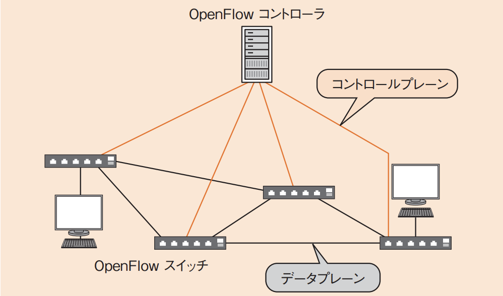

# 3-4-4 ネットワーク管理(译: 网络管理)

- [3-4-4 ネットワーク管理(译: 网络管理)](#3-4-4-ネットワーク管理译-网络管理)
  - [ネットワーク運用管理(译: 网络运行管理)](#ネットワーク運用管理译-网络运行管理)
  - [ネットワーク管理ツール(译: 网络管理工具)](#ネットワーク管理ツール译-网络管理工具)
  - [ネットワーク機器の監視・制御(译: 网络设备的监视与控制)](#ネットワーク機器の監視制御译-网络设备的监视与控制)
  - [仮想ネットワーク(译: 虚拟网络)](#仮想ネットワーク译-虚拟网络)
    - [仮想ネットワークを実現する方法](#仮想ネットワークを実現する方法)
      - [**SDN**(Software Defined Network)(译: 软件定义网络)](#sdnsoftware-defined-network译-软件定义网络)
      - [NFV(Network Functions Virtualization)(译: 网络功能虚拟化)](#nfvnetwork-functions-virtualization译-网络功能虚拟化)

## ネットワーク運用管理(译: 网络运行管理)

- ネットワークの運用においては, 以下のような管理が行われる。

  | ネットワーク運用管理 | 説明 | 説明 |
  | - | -- | -- |
  | 構成管理 (译: 配置管理) | $\bullet$ ネットワークの構成情報を維持し, 変更を記録する $\bullet$ ネットワーク構成図を作成し, そのバージョンを管理する | 管理网络设备(如路由器, 交换机)的构成信息, 如设备型号, 接线结构, IP地址等, 确保网络结构清晰, 可追溯 |
  | 障害管理 (译: 故障管理) | $\bullet$ 障害の検出, 切り分け, 障害原因の特定などを管理する $\bullet$ 障害時の記録をとり, 対応を管理して次に役立てる | 监控并检测网络中的故障(如连接断开, 设备异常), 迅速定位并采取恢复措施, 确保服务可用性 |
  | 性能管理 (译: 性能管理) | $\bullet$ ネットワークのトラフィック量(译: 网络流量‌)や転送時間を管理する $\bullet$ トラフィックを監視して不具合がないかチェックするほか, 構成変更による負荷分散なども管理する | 收集与分析网络流量, 延迟, 带宽等性能指标, 识别瓶颈并优化网络资源使用 |

## ネットワーク管理ツール(译: 网络管理工具)

- ネットワーク管理に用いる一般的なツール

  | ツール | 説明 | 説明 |
  | - | -- | -- |
  | **ping** (译: 测试连通性工具) | $\bullet$ 相手先のホストにパケットが到達したかどうかを確かめるツールである $\bullet$ IPアドレス, ホスト名のいずれでも実行できる | $\bullet$ 用于检测本机是否能够与目标主机通信, 并测量往返延迟时间(RTT)。常用于判断网络是否畅通 |
  | **ipconfig** (译: IP配置查看工具) | $\bullet$ Windowsのネットワーク設定を確認する $\bullet$ IPアドレスやデフォルトゲートウェイ, サブネットマスクなどを見ることができる $\bullet$ UNIXでの同様のツールはifconfigである | $\bullet$ 显示本机的IP地址, 子网掩码, 默认网关等网络设置信息 $\bullet$ Linux/Unix中对应的是`ifconfig`或`ip`命令 |
  | netstat (译: 网络状态查看工具) | ネットワーク接続やルーティングテーブル, ネットワークインタフェースの統計情報などを確認できる | 于查看当前的网络连接, 端口使用情况, 路由表, 接口状态等, 有助于检测网络连接异常或端口占用 |
  | traceroute (译: 路由跟踪工具) | ルーティングの経路を調べる | 显示数据包从本机到目标主机之间经过的每一个路由器节点, 用于诊断网络路径中的瓶颈或中断点 |
  | arp (译: 地址解析协议工具) | ARPテーブルを調べる | 用于查看和管理本机的 ARP 缓存表, 显示 IP 地址与 MAC 地址之间的映射关系。也可手动添加或清除记录 |

## ネットワーク機器の監視・制御(译: 网络设备的监视与控制)

- **SNMP**(Simple Network Management Protocol)(译: 简单网络管理协议): IPネットワーク上でネットワーク機器を監視, 制御するためのプロトコルである。
  - TCP/IPプロトコルスイートではアプリケーション層に該当する
  - トランスポート層にはUDP(译: User Datagram Protocol, 用户数据报协议)を使用する
- **マネージャ**と**エージェント**
  - **マネージャ**(译: Manager, 管理器): サーバやPCなど集中的にモニタリングして監視を行うための機器。管理情報を取得する。
  - **エージェント**(译: Agent, 代理程序): ルータやスイッチ, サーバなど監視されるネットワーク機器。
- SNMPでやり取りされる情報は**MIB**(Management Information Base: 管理情報ベース)(译: 管理信息库)という階層型のデータベースに集約される。
- 例題: 図で示したネットワーク構成において, アプリケーションサーバA上のDBMSのデーモンが異常終了したという事象とその理由を, 監視用サーバXで検知するのに有効な手段はどれか。
  - ア: アプリケーションサーバAから監視用サーバXへのICMP宛先到達不能(Destination Unreachable)メッセージ
  - イ: アプリケーションサーバAから監視用サーバXへのSNMPトラップ
  - ウ: 監視用サーバXからアプリケーションサーバAへのfinger
  - エ: 監視用サーバXからアプリケーションサーバAへのping

  > アプリケーションサーバA上のDBMSのデーモンが異常終了したといったアプリケーションでの障害管理は, アプリケーション層での管理が可能なSNMPで行う必要がある。SNMPトラップは, エージェントがサーバに出す緊急信号で, 異常終了などを知らせるのに役立つ。  
  > したがって, イが正解である。  
  > ア, エ: アのICMPはpingで使用されているプロトコルで,エのpingと同様, ネットワークへの到達性のみを確認できる。  
  > ウのfingerは, ユーザ情報など人間に関わるステータスを確認するためのツールである。

## 仮想ネットワーク(译: 虚拟网络)

- 物理的なサーバやネットワーク機器により構成されるネットワーク管理では, 需要の変化に柔軟に対応することが難しく, また変更の記録も手作業となるため作業負荷が大きくなる。
- 仮想化技術を利用し, サーバやネットワーク機器などをソフトウェアで管理することで, より効率的なネットワーク管理が可能となる。
  - このようなネットワークを仮想ネットワークという。

### 仮想ネットワークを実現する方法

#### **SDN**(Software Defined Network)(译: 软件定义网络)

- ネットワークの構成や機能, 性能などをソフトウェアだけで動的に設定できるネットワークである。
- **OpenFlow**: SDNで利用する代表的な方式
  - ONF(Open Networking Foundation)が標準化を進めているSDNの規格である。
  - 各フレームがもつMACアドレスやVLANタグ, IPアドレス, ポート番号などのような特徴をフローとして扱い, そのフローをベースにスイッチングを行い, 経路を柔軟に制御できるようにする。
  - 代表的な特徴: 制御用のネットワークとパケット処理用のネットワークが分離されている。
    - コントロールプレーン(译: 控制面): 制御用のネットワークである。**OpenFlowコントローラ**と呼ばれる機器を用意し, 経路制御などの管理機能を実行する。
    - データプレーン(译: 数据面): パケット処理用のネットワークである。**OpenFlowスイッチ**と呼ばれる機器がパケットのデータ転送を行う。
    - コントロールプレーンとデータプレーンは分離させて別々に用意する必要があるが, 物理的に分離させる必要はなく, 仮想ネットワークを構築することで対応可能である。
    - 図: OpenFlowのデータプレーンとコントロールプレーン 
- SD-WAN(Software Defined Wide Area Network)(译: 软件定义广域网): WAN回線でSDNを使用する技術である。
  - 様々な種類のネットワーク接続を効率的に管理することが可能になる。

#### NFV(Network Functions Virtualization)(译: 网络功能虚拟化)

- ETSI(欧州電気通信標準化機構)によって提案された, ソフトウェアによってネットワーク機器を実現する技術である。
- 仮想化技術を利用し, ネットワーク機能を汎用サーバ上にソフトウェアとして実現したコンポーネントを用いることによって, 柔軟なネットワーク基盤を構築する。
- SDNを補完する技術で, 専用の機器を使用せず, 汎用サーバでネットワーク機器を使用することが可能となる。
