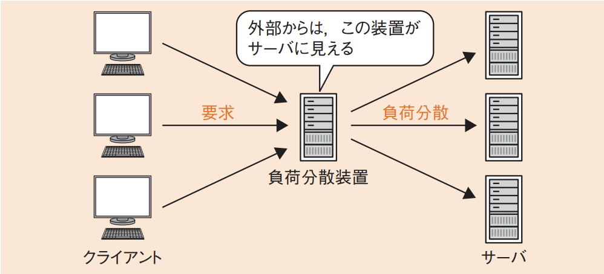

# 3-4-5 ネットワーク応用(译: 网络应用)

- [3-4-5 ネットワーク応用(译: 网络应用)](#3-4-5-ネットワーク応用译-网络应用)
  - [ネットワーク上でのデータ交換(译: 网络上的数据交换)](#ネットワーク上でのデータ交換译-网络上的数据交换)
  - [通信サービス(译: 通信服务)](#通信サービス译-通信服务)
  - [モバイルシステム(译: 移动系统)](#モバイルシステム译-移动系统)
  - [負荷分散とロードバランサ(译: 负载均衡与负载均衡器)](#負荷分散とロードバランサ译-负载均衡与负载均衡器)

## ネットワーク上でのデータ交換(译: 网络上的数据交换)

- ネットワーク上でデータをやり取りするための応用的なプロトコルの例

  | プロトコル | 説明 | 中文说明 |
  | - | -- | -- |
  | **SOAP**(Simple Object Access Protocol) (译: 简单对象访问协议) | $\bullet$ ソフトウェア同士がオブジェクトを交換するためのプロトコル $\bullet$ **XML**に基づいており, HTTPやSMTPなど様々なコンピュータネットワークの通信プロトコルで利用できる | $\bullet$ 一种基于 XML 的通信协议, 用于 Web 服务之间的远程调用 $\bullet$ 通过 HTTP 等传输协议发送结构化的 XML 消息, 常用于企业系统间的集成 |
  | CORBA(Common Object Request Broker Architecture) (译: 通用对象请求代理架构) | $\bullet$ ソフトウェアのオブジェクトを, ネットワークを通じてやり取りするための規格である $\bullet$ データはCDR(Common Data Representation)(译: 公共数据标识)形式で送る | $\bullet$ 由 OMG(对象管理组织)制定的标准, 用于不同语言, 不同平台的程序间进行对象调用 $\bullet$ 它通过 ORB(对象请求代理)进行通信, 主要应用于分布式对象系统中 |

## 通信サービス(译: 通信服务)

- 電気通信事業者が提供する公衆通信サービスの例

  | 公衆通信サービス | 説明 | 中文说明 |
  | - | ---- | -- |
  | フレームリレー (译: Frame Relay, 帧中继) | $\bullet$ 昔のパケット交換サービス(X.25)を簡素化して高速化したネットワーク $\bullet$ 64kbps ~ 1.5Mbps程度の通信速度である | 一种面向连接的广域网通信服务, 通过固定长度的帧交换进行数据传输, 曾广泛用于企业远程网络连接, 现已逐步被更现代的方式替代 |
  | **ATM**(Asynchronous Transfer Mode) (译: 异步传输模式) | $\bullet$ パケットを**53バイト**の固定長のセルに分割して通信する仕組みである $\bullet$ バックボーンネットワークで使われている | 以固定长度的53字节单元进行高速数据传输, 适用于语音, 视频, 数据混合通信, 具有高 QoS 控制能力, 曾用于电信骨干网 |
  | **IP-VPN** (译: 基于IP的虚拟专用网络) | $\bullet$ 通信事業者が提供する専用の**IPネットワーク**で, **VPN**(Virtual Private Network)を構築する $\bullet$ **MPLS**(Multi-Protocol Label Switching)(译: 多协议标签交换)という, パケットの前にラベルを付けて通信を識別する技術を用いる | 利用公网 IP 网络构建逻辑上的专用网络, 通过 MPLS 技术实现企业间的安全通信, 常用于跨地连接公司分支机构 |
  | **広域イーサネット** (译: 广域以太网) | $\bullet$ 通信事業者が提供する専用のイーサネット接続サービスである $\bullet$ **VLAN**を用い, ほかの顧客との通信を分離する | 将以太网扩展到广域网络环境, 实现不同地点之间通过以太网直接连接, 带宽高, 延迟低, 适合数据中心互联或企业远程办公 |
  | 電話回線 (译: 电话线路) | $\bullet$ 通常の固定のアナログ電話回線のほかに, ディジタルな電話サービスである**ISDN**(Integrated Services Digital Network)(译: 综合业务数字网)がある $\bullet$ 携帯電話やPHSを利用してデータを送信することもできる | 传统的模拟电话通信线路, 用于语音通信, 也可通过拨号上网(如 PSTN)进行数据传输, 速度较慢, 现代应用已较少 |
  | **FTTH**(Fiber To The Home) (译: 光纤到户) | $\bullet$ 高速の光ファイバを建物内に直接引き込む $\bullet$ 回線の終端には**ONU**(Optical Network Unit)(译: 光网络单元)が設置され, これによって光と電気信号を変換する | 将光纤线路直接铺设到用户住宅, 提供高速, 稳定的大带宽接入服务, 是现代家庭常用的光通信方式 |
  | **ADSL**(Asymmetric Digital Subscriber Line) (译: 非对称数字用户线) | $\bullet$ 既存のアナログ回線を拡張利用して, 高速なデータ通信を実現する $\bullet$ **スプリッタ**(译: ADSL语音分离器)という装置によって音声とデータを分離及び混合する | 利用现有电话线传输数据, 上下行速度不对称, 适合普通家庭上网。现多被 FTTH 所取代 |

- IP-VPNはネットワーク層までのサービスなので, IPを用いた通信に限定される。
- 広域イーサネットはデータリンク層までのサービスなので, IP以外にもホスト間の通信など, 別のプロトコルも使用可能である。
- IP-VPNや広域イーサネットなどの通信サービスでは, 通信速度だけでなくQoS(Quality of Service: サービス品質)が大切になってくる。
  - QoSは, サービスがどれだけニーズに合っているか, ユーザを満足させられるかという尺度である。
  - QoSを上げるために, 優先制御を行い, より重要な通信を優先するといった処理が行われる。

## モバイルシステム(译: 移动系统)

- 無線アクセスによる, モバイル通信サービスを用いたモバイルシステムの例

  | モバイルシステム | 説明 | 中文说明 |
  | - | -- | - |
  | WiMAX, (WiMAX2, WiMAX2+) (Worldwide Interoperability for Microwave Access) (译: 全球微波互操作性标准) | $\bullet$ 広帯域をカバーする無線アクセス技術の一つで, IEEE 802.16-2004として規格化されている $\bullet$ 拡張規格としてさらに高速化させたWiMAX2やWiMAX2+なども考案されている | $\bullet$ 一种无线宽带接入技术, 可提供较大覆盖范围和高速通信, 曾用于移动和固定无线接入 $\bullet$ WiMAX2 和 WiMAX2+ 是其高速化版本, 最高速率可达 100Mbps 以上。现被 4G/5G 等技术逐渐取代 |
  | 仮想移動体通信事業者 (MVNO: Mobile Virtual Network Operator) (译: 虚拟移动通信运营商) | $\bullet$ **移動体通信事業者**: 電気通信事業者のうち, モバイル通信サービスを提供する事業者 $\bullet$ **想移動体通信事業者(MVNO)**: そのうち, 無線通信回線設備を設置・運用せずに, 自社ブランドで通信サービスを提供する事業者 $\bullet$ 移動体通信事業者では, 通信サービスを利用できるようにするために**SIMカード**を提供する | $\bullet$ 不拥有无线通信基础设施的通信服务商, 通过租用 MNO(传统运营商)网络来向用户提供移动通信服务 $\bullet$ 因其价格灵活, 常用于数据通信或低成本套餐 |
  | LPWA (LowPower, WideArea) (译: 低功耗广域网) | $\bullet$ バッテリ消費量が少なく, 一つの基地局で広範囲をカバーできる無線通信技術である $\bullet$ IoTでの活用が行われており, 複数のセンサが同時につながるネットワークに適している | $\bullet$ 适用于物联网(IoT)场景的无线通信技术, 特点是低功耗, 广覆盖, 低速率 $\bullet$ 代表技术有 LoRa, Sigfox, NB-IoT 等, 广泛用于传感器, 远程监控, 智能抄表等领域 |

## 負荷分散とロードバランサ(译: 负载均衡与负载均衡器)

- **負荷分散**(译: Load Balancing, 负载均衡): 処理の負荷を複数のコンピュータやプロセスに分散させることである。
  - **スケーラビリティ(拡張性)**(译: Scalability, 可扩展性)の向上: コンピュータの台数を増やすことで処理性能を向上させることができる。
  - **アベイラビリティ(可用性)**(译: Availability, 可用性)の向上: 故障が起きた場合でも他のコンピュータで処理を代替することができる。
- **ロードバランサ**(Load Balancer: 負荷分散装置)(译: 负载均衡器): 負荷分散を行うための専用の装置である。
  - クライアントからの要求をロードバランサが一手に引き受け, それを複数のサーバに分散して転送する。外部のクライアントからは, ロードバランサがサーバに見える。
  - 図: 負荷分散装置の利用 
- ロードバランサでは, クライアントからの1回目の通信と2回目以降の通信を**同じサーバに振り分ける必要**がある。ロードバランサの負荷分散アルゴリズムの代表的な方法には, 次のものがある。

  | 負荷分散アルゴリズム | 説明 | 中文说明 |
  | - | -- | -- |
  | **ラウンドロビン** (译: Round Robin, 轮询法) | $\bullet$ 要求ごとに順番にサーバにセッションを振り分けていく方式 $\bullet$ **重み付けラウンドロビン**: 優先的に分散先を指定する方式 | 将用户请求按顺序轮流分配给服务器, 每台服务器依次接受请求, 适用于服务器性能相近的场景, 简单易实现 |
  | リーストコネクション (译: Least Connection, 最少连接数法) | $\bullet$ 接続コネクション数を基に, 接続が少ないサーバに振り分ける方式 $\bullet$ 重み付けリーストコネクション: 優先的に分散先を指定する方式 | 将新请求分配给当前连接数最少的服务器, 适用于请求处理时间差异较大的场景, 有助于避免某台服务器负载过重 |
  | ファーストアンサ (译: First Answer, 最先响应法) | サーバに応答を確認し, 最も応答が早かったサーバに接続する方式 | 将请求发送给多个服务器, 选择最先响应的服务器处理请求, 适合对响应时间要求高的环境, 但会产生额外网络负担 |
