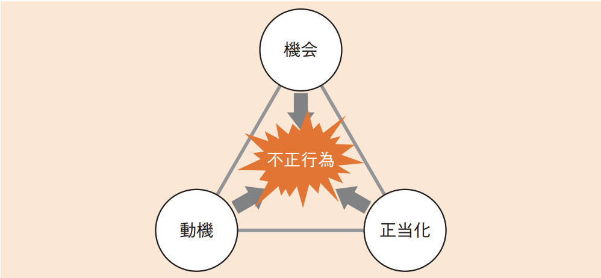
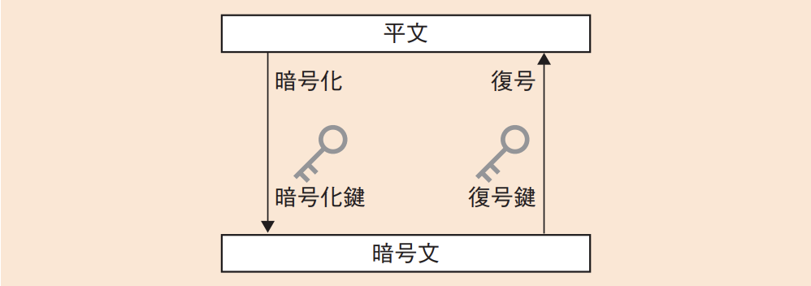
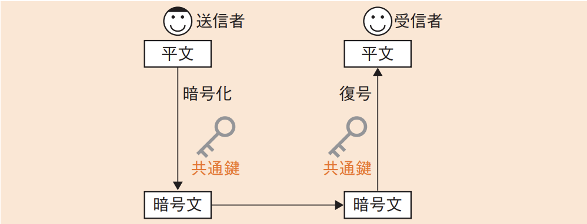
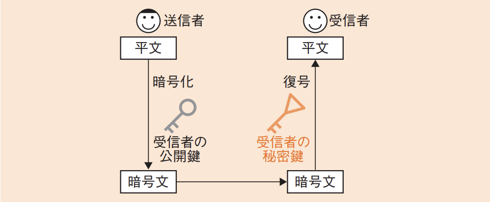
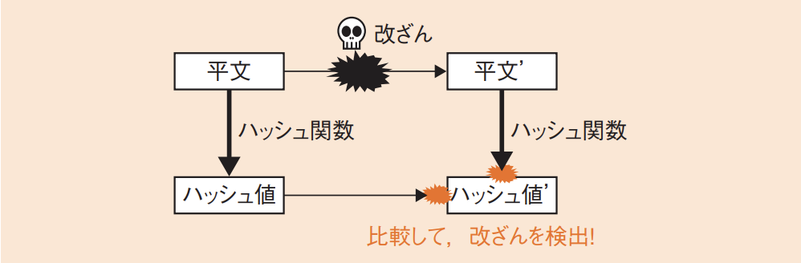
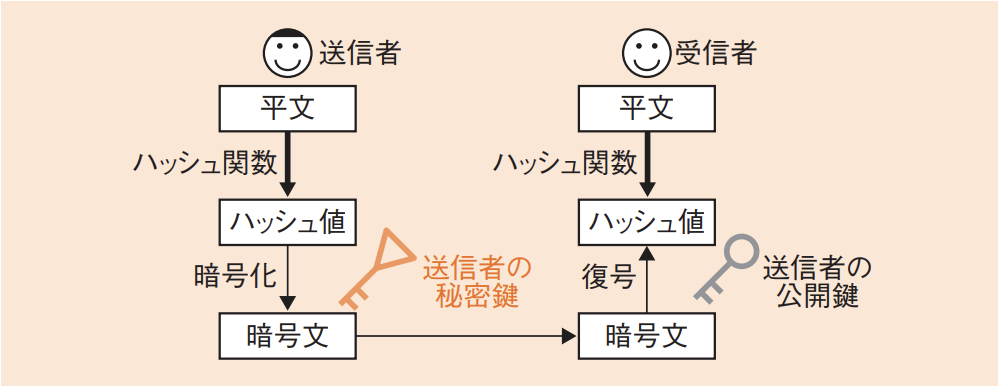
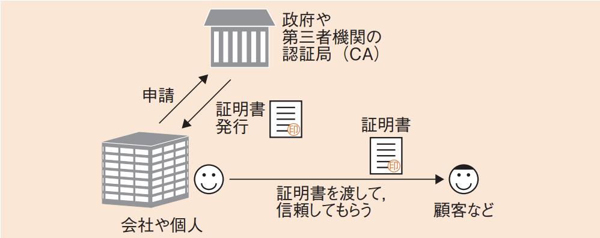
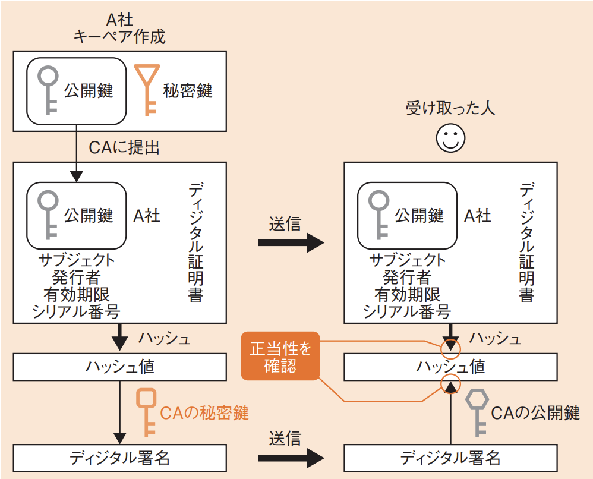

# 3-5-1 情報セキュリティ(译: 信息安全)

- [3-5-1 情報セキュリティ(译: 信息安全)](#3-5-1-情報セキュリティ译-信息安全)
  - [情報セキュリティの目的と考え方(译: 信息安全的目的与基本理念)](#情報セキュリティの目的と考え方译-信息安全的目的与基本理念)
  - [情報セキュリティの重要性(译: 信息安全的重要性)](#情報セキュリティの重要性译-信息安全的重要性)
  - [不正のメカニズム(译: 非法行为的机制)](#不正のメカニズム译-非法行为的机制)
  - [攻撃者の種類と動機・目的(译: 攻击者的类型与动机・目的)](#攻撃者の種類と動機目的译-攻击者的类型与动机目的)
  - [暗号化技術(译: 加密技术)](#暗号化技術译-加密技术)
  - [ハッシュ(译: 哈希)](#ハッシュ译-哈希)
  - [ディジタル署名(译: 数字签名)](#ディジタル署名译-数字签名)
  - [暗号アルゴリズム(译: 加密算法)](#暗号アルゴリズム译-加密算法)
  - [PKI(Public Key Infrastructure)(译: 公钥基础设施)](#pkipublic-key-infrastructure译-公钥基础设施)
  - [CRLとOCSP(译: 证书吊销列表与在线证书状态协议)](#crlとocsp译-证书吊销列表与在线证书状态协议)
  - [暗号化技術の応用(译: 加密技术的应用)](#暗号化技術の応用译-加密技术的应用)
    - [SSL/TLS(译: 安全套接层/传输层安全性协议)](#ssltls译-安全套接层传输层安全性协议)
    - [**IPsec**(译: IP安全架构)](#ipsec译-ip安全架构)
    - [**S/MIME**(Secure MIME)(译: 安全的多功能互联网邮件扩展)](#smimesecure-mime译-安全的多功能互联网邮件扩展)
    - [PGP(译: PGP加密软件)](#pgp译-pgp加密软件)
    - [**SSH**(译: 安全外壳协议)](#ssh译-安全外壳协议)
    - [メッセージ認証(译: 消息认证)](#メッセージ認証译-消息认证)
    - [コードサイニング認証(译: 代码签名认证)](#コードサイニング認証译-代码签名认证)
    - [リスクベース認証(译: 风险认证)](#リスクベース認証译-风险认证)

## 情報セキュリティの目的と考え方(译: 信息安全的目的与基本理念)

- 情報セキュリティマネジメントシステム(ISMS)(译: Information Security Management Systems, 信息安全管理体系): 情報セキュリティを確保するためのシステムである
  - 情報セキュリティに関する要求事項を定めた**JIS Q 27001(ISO/IEC 27001)**からの説明

    > ISMSの採用は, 組織の戦略的決定である。組織のISMSの確立及び実施は, その組織のニーズ及び目的, セキュリティ要求事項, 組織が用いているプロセス, 並びに組織の規模及び構造によって影響を受ける。

    - つまり, 「組織の戦略によって決定され, 組織の状況によって変わる」というのが情報セキュリティの考え方である。
- **CIA**: 情報セキュリティの三要素

  |  | 情報セキュリティ | 説明 | 中文说明 |
  | - | -- | -------- | ---- |
  | 1 | **機密性** (译: Confidentiality, 机密性) | 認可されていない個人, エンティティ又はプロセスに対して, 情報を**使用させず, また, 開示しない**特性 | $\bullet$ 防止信息被未授权者访问 $\bullet$ 例: 加密, 防火墙, 访问控制 |
  | 2 | **完全性**(インテグリティ) (译: Integrity, 完整性) | **正確さ及び完全さ**の特性 | $\bullet$ 确保信息未被篡改, 保持原始状态 $\bullet$ 例: 哈希, 数字签名 |
  | 3 | **可用性** (译: Availability, 可用性) | 認可されたエンティティが要求したときに, **アクセス及び使用が可能である**特性 | $\bullet$ 确保合法用户在需要时能使用信息系统 $\bullet$ 例: 冗余系统, 故障恢复 |

- さらに, 次の四つの特性を含めることがある。

  |  | 情報セキュリティ | 説明 | 中文说明 |
  | - | -- | -------- | ---- |
  | 4 | **真正性** (译: Authenticity, 真实性) | エンティティは, それが主張どおりであることを確実にする特性 | $\bullet$ 验证信息的来源, 通信对象是否真实 $\bullet$ 例: 认证, 数字证书 |
  | 5 | 責任追跡性 (译: Accountability, 责任可追踪性) | あるエンティティの動作が, その動作から動作主のエンティティまで一意に追跡できることを確実にする特性 | $\bullet$ 可追溯用户行为, 明确操作责任 $\bullet$ 例: 日志记录, 审计机制 |
  | 6 | 否認防止 (译: Non-Repudiation, 防否认性) | 主張された事象又は処置の発生, 及びそれを引き起こしたエンティティを証明する能力 | $\bullet$ 防止当事人否认已执行的行为 $\bullet$ 例: 电子签章, 数字签名 |
  | 7 | 信頼性 (译: Reliability, 可靠性) | 意図する行動と結果とが一貫しているという特性 | $\bullet$ 系统运行的稳定性, 持久性和容错能力 $\bullet$ 例: 高可用架构, 系统冗余 |

- エンティティ: 独立体, 認証される1単位を指する。
  - 具体的には, 認証される単位であるユーザや機器, グループなどのことである。
- ⭐️ 例題: 完全性を脅かす攻撃はどれか。
  - ア: Webのページ改ざん
  - イ: システム内に保管されているデータの持出しを目的とした不正コピー
  - ウ: システムを過負荷状態にするDoS攻撃
  - エ: 通信内容の盗聴

  > 完全性とは, 情報の正確さ及び完全さを保護する特性である。それが脅かされるのは, Webページの改ざんなどのように, 正確な情報が書き換えられる脅威である。  
  > したがって, アが正解である。  
  > イとエ: 機密性を脅かす攻撃である。  
  > ウ: 可用性を脅かす攻撃である。

## 情報セキュリティの重要性(译: 信息安全的重要性)

- 企業の資産には, 商品や不動産など形のあるものだけでなく, 顧客情報や技術情報など形のないものもある。
- 業務に必要なこうした価値のある情報を**情報資産**という。
- ISMSでは, 組織がもつ情報資産にとっての脅威を洗い出し, 脆弱性を考慮することによって, 最適なセキュリティ対策を考える。
- ここでの**脅威**とは, システムや組織に損害を与える可能性があるインシデント(译: Incident, 事件)の**潜在的な原因**である。
- **脆弱性**とは, 脅威がつけ込むことができる, **資産がもつ弱点**である。
- **インシデント**(译: Incident, 事件): 望まないセキュリティ事象のことで, 事業継続を危うくする確率の高いものである。
  - 具体的には, セキュリティ事故や攻撃などを指す。インシデントを起こす潜在的な原因が脅威であり, ISMSではこれに対応する。
- ⭐️ 例題: JIS Q 27002における情報資産に対する脅威の説明はどれか。
  - ア: 情報資産に害をもたらすおそれのある事象の原因
  - イ: 情報資産に内在して, リスクを顕在化させる弱点
  - ウ: リスク対策に費用をかけないでリスクを許容する選択
  - エ: リスク対策を適用しても解消しきれずに残存するリスク

  > 情報資産に対する脅威とは, 情報資産に害をもたらすおそれのある事象(インシデント)の原因なので, アが正解である。  
  > イは脆弱性である。  
  > ウはリスク受容である。  
  > エは残存リスクの説明である。

## 不正のメカニズム(译: 非法行为的机制)

- **不正のトライアングル理論**(译: Fraud Triangle Theory, 舞弊三角理论):人が不正行為を実行するに至るまでには, 次の不正リスクの3要素が揃う必要があると考えられている。
  1. **機会**$\cdots \cdots$不正行為の実行が可能, または容易となる環境
  2. **動機**$\cdots \cdots$不正行為を実行するための事情
  3. **正当化**$\cdots \cdots$不正行為を実行するための良心の呵責を乗り越える理由
  - 図: 不正のトライアングル 

- **状況的犯罪予防論**: 英国で提唱された, 不正のトライアングルを考慮して犯罪を予防する考え方である。次の五つの観点で犯罪予防の手法を整理している
  1. 物理的にやりにくい状況を作る
  2. やると見つかる状況を作る
  3. やっても割に合わない状況を作る
  4. その気にさせない状況を作る
  5. 言い訳を許さない状況を作る

## 攻撃者の種類と動機・目的(译: 攻击者的类型与动机・目的)

- 攻撃者の種類

  | 攻撃者の種類 | 説明 | 中文说明 |
  | - | -- | -- |
  | **スクリプトキディ** (译: Script Kiddie,  脚本小子) | インターネット上で公開されている簡単なクラッキングツール(译: 软件破解工具)を利用して不正アクセスを試みる攻撃者 | 缺乏专业技术, 仅靠他人制作的工具或脚本发动攻击的人, 常出于好奇或炫耀。虽技术水平低, 但也能造成破坏 |
  | **ボットハーダー** (译: Bot Herder, 僵尸网络操控者 ) | ボット(译: 机器人)を利用することでサイバー攻撃などを実行する攻撃者 | 控制多个被感染主机(Bot)构成的僵尸网络, 远程下发指令进行DDoS攻击, 垃圾邮件发送等恶意行为 |
  | **内部関係者** (译: 内部人员) | 従業員や業務委託先の社員など, 組織の内部情報にアクセスできる権限を悪用する攻撃者 | 具有系统访问权限的公司员工, 承包商等, 可能因疏忽, 报复或利益动机泄露信息或破坏系统, 危害极大 |
  | その他 (译: 其他攻击者) | 愉快犯, 詐欺犯, 故意犯など | 包括出于恶作剧心理的愉快犯, 进行金钱诈骗的欺诈犯, 或蓄意破坏的故意犯等, 不一定具备专业背景, 但动机复杂多变 |

- 攻撃者の動機・目的

  | 攻撃者の動機・目的 | 説明 | 中文说明 |
  | - | -- | -- |
  | 金銭奪取 (译: 金钱获取型攻击者) | 金銭的に不当な利益を得ることを目的とした攻撃 | 以获取经济利益为目的, 进行信息窃取, 诈骗, 勒索软件攻击等 |
  | **ハクティビズム** (译: Hacktivism, 黑客行动主义者) | 政治的・社会的な思想を基に積極的に行われるハッキング活動 | 以政治或社会诉求为动机, 进行网页篡改, 信息泄露等网络抗议行为 |
  | **サイバーテロリズム** (译: Cyber Terrorism, 网络恐怖分子) | $\bullet$ ネットワークを対象に行われるテロリズム $\bullet$ 組織や社会機能に大きな打撃を与える | 以制造社会恐慌或威胁国家安全为目的, 攻击关键基础设施(如电力, 金融, 交通等) |

## 暗号化技術(译: 加密技术)

- 暗号化技術: 普通の文章(平文)を読めない文章(暗号文)に変換することである。
  - **暗号化**: 読めないようにすること
  - **復号**: 元に戻すこと
- 暗号化及び復号の際に必要となるのは, その方法である**暗号アルゴリズム**と, 暗号化及び復号するための**鍵**である。
  - **暗号化鍵**: 暗号化するときに使う鍵
  - **復号鍵**: 復号するときに使う鍵
  - 図: 暗号化鍵と復号鍵 
- 暗号化の方式

  | 暗号化の方式 | 説明 | 中文说明 | 図示 |
  | - | ---- | -- | -- |
  | **共通鍵暗号方式** (译: 对称密钥加密方式) | $\bullet$ 暗号化鍵と復号鍵が**共通である**暗号方式である $\bullet$ **共通鍵**: 共通で使用する鍵のこと。信相手だけとの秘密にしておく $\bullet$ 共通鍵暗号方式では, 暗号化する経路の数だけ鍵が必要になる $\bullet$ 鍵を秘密にして共有しなければならないので, 鍵を**受け渡す方法**が重要である $\bullet$ アルゴリズムが単純で**高速**なため, よく利用される方法である | 加密和解密使用相同的密钥。优点是处理速度快, 缺点是密钥分发困难, 存在被窃取的风险。常见算法如 AES, DES |  |
  | **公開鍵暗号方式** (译: 非对称密钥加密方式) | $\bullet$ 暗号化鍵と復号鍵が**異なる**方式である $\bullet$ 使用する**人ごと**に**公開鍵**と**秘密鍵**のペア(**キーペア**)を作る。そして, 公開鍵は相手に渡し, 秘密鍵は自分で保管しておく $\bullet$ 暗号化と復号は, 次の二つの方法で行うことが可能である $\quad \bullet$ 1. **公開鍵で暗号化すると, 同じ人の秘密鍵で復号できる** $\quad \bullet$ 2. **秘密鍵で暗号化すると, 同じ人の公開鍵で復号できる** $\bullet$ 通常の暗号化では, 受信者が自分の秘密鍵で復号できるように, 1の方法を使って受信者の公開鍵で暗号化しておく | 使用一对不同的密钥(公钥与私钥)进行加密和解密。适合安全通信和身份验证, 如 RSA, ECDSA, 但计算量较大, 速度慢 |  |

- 暗号化のアルゴリズムとしては公開鍵暗号方式の方が優れているのであるが, 計算が複雑で遅いという欠点がある。一方, 共通鍵暗号方式は, 鍵の受渡しが大変である。そのため, 共通鍵暗号方式で使う共通鍵を公開鍵暗号方式で暗号化して送るというハイブリッド方式など, 二**つの方式を組み合わせる**手法がよく用いられる。

## ハッシュ(译: 哈希)

- ハッシュ関数は一方向性の関数で, 平文を変換してハッシュ値(ハッシュ)を求める。送りたいデータと合わせてハッシュ
値を送ることで, **改ざんを検出**するのに役立つ。
- 図: ハッシュ 
- ハッシュ関数の強度を示す指標

  | ハッシュ関数の強度を示す指標 | 説明 | 中文说明 |
  | - | -- | -- |
  | 衝突発見困難性 (译: 碰撞发现困难性) | ハッシュ関数において, ハッシュ値が一致する二つのメッセージを発見することの困難さ | $\bullet$ 很难找到两个不同的输入, 它们的哈希值却相同 $\quad \bullet$ 也就是说, 难以找到 $x \neq y$ 且 $hash(x) = hash(y)$ 的情况 $\bullet$ 这是防止伪造或数据篡改的重要特性 |
  | 原像計算困難性(一方向性) (译: 原像计算困难性(单向性)) | メッセージと, そのハッシュ値が与えられたときに, 同一のハッシュ値になる別のメッセージを計算することの困難さ | $\bullet$ 给定一个哈希值$h$, 几乎不可能计算出满足 $hash(x) = h$ 的输入 $x$ $\bullet$ 这保证了从哈希值中**无法反推出原始数据**, 用于保护密码等敏感信息 |

- 情報セキュリティ対策では, 改ざん検出以外にも様々なかたちでハッシュが使われている。
  - チャレンジレスポンス方式(译: 挑战响应): ランダムな値(チャレンジ)にパスワードを付加したものをハッシュ化して送ることによってユーザ認証を行う

## ディジタル署名(译: 数字签名)

- 公開鍵暗号方式は, 暗号化以外にも使われる。本人の秘密鍵をもっていることが当の本人であるという真正性の証明になるのである。
- 送信者の秘密鍵で暗号化し, それを受け取った受信者が送信者の公開鍵で復号することによって, 本人であるという真正性を確認できる。前述の公開鍵暗号方式の2番目の使い方である。
- さらに, ハッシュを組み合わせることで, データの改ざんも検出できる。この方法をディジタル署名という。
- 図: ディジタル署名 
- ⭐️ 例題: ディジタル署名において, 発信者がメッセージのハッシュ値からディジタル署名を生成するのに使う鍵はどれか。
  - ア: 受信者の公開鍵
  - イ: 受信者の秘密鍵
  - ウ: 発信者の公開鍵
  - エ: 発信者の秘密鍵

  > ディジタル署名を生成するときには, 発信者が本人だという証明のために, 発信者しかもっていない発信者の秘密鍵を使用する。  
  > したがって, エが正解である。

## 暗号アルゴリズム(译: 加密算法)

- 暗号アルゴリズムの代表例

  | 分類 | 暗号アルゴリズム | 説明 | 中文说明 |
  | - | -- | ---- | -- |
  | 公開鍵暗号方式 | RSA(Rivest Shamir Adleman) (译: RSA加密算法) | $\bullet$ **大きい数での素因数分解の困難さ**を安全性の根拠とした方式 $\bullet$ 公開鍵暗号方式で最もよく利用されている  | $\bullet$ 基于大素数分解难题的经典非对称加密算法 $\bullet$ 广泛用于加密, 数字签名 |
  | 公開鍵暗号方式 | 楕円曲線暗号(Elliptic Curve Cryptography: ECC) (译: 椭圆曲线密码学) | $\bullet$ 楕円曲線上の**離散対数問題**を安全性の根拠とした方式 $\bullet$ RSA暗号の後継として注目されている | $\bullet$ 基于椭圆曲线数学的非对称加密算法 $\bullet$ 在较短密钥长度下提供与 RSA 同等的安全性, 适合移动设备等资源受限场景 |
  | 共通鍵暗号方式 | DES(Data Encryption Standard) (译: 数据加密标准) | $\bullet$ ブロックごとに暗号化する**ブロック暗号**の一種 $\bullet$ 米国の旧国家暗号規格で, **56ビット**の鍵を使う $\bullet$ しかし, 鍵長が短すぎるため, 近年は安全ではないと見なされている | $\bullet$ 早期广泛使用的对称加密算法 $\bullet$ 因密钥太短(56位)已不再安全 |
  | 共通鍵暗号方式 | **AES**(Advanced Encryption Standard) (译: 高级加密标准) | $\bullet$ 米国立標準技術研究所(**NIST**)が規格化した新世代標準の方式で, DESの後継 $\bullet$ **ブロック暗号**で, 鍵長は**128ビット, 192ビット, 256ビット**の三つが利用できる | $\bullet$ 目前主流的对称加密标准 $\bullet$ 具有高速度和高安全性, 被广泛用于政府, 企业, 移动设备等 |
  | 共通鍵暗号方式 | RC4(Rivest's Cipher 4) (译: RC4加密算法) | $\bullet$ ビット単位で随時暗号化を行う**ストリーム暗号**の一種 $\bullet$ 高速であり, 無線LANのWEPなどで使用されている | $\bullet$ 一种流加密算法 $\bullet$ 速度快但已被发现存在多种安全漏洞, 现在已不推荐使用 |
  | ハッシュ | MD5(Message Digest Algorithm 5) (译: MD5信息摘要算法) | 与えられた入力に対して**128ビット**のハッシュ値を出力するハッシュ関数 $\bullet$ 理論的な弱点が見つかっている | $\bullet$ 老旧的哈希算法 $\bullet$ 已能轻易找到碰撞, 不适用于安全场合, 如数字签名 |
  | ハッシュ | **SHA-1**(Secure Hash Algorithm 1) (译: 安全哈希算法1) | $\bullet$ NISTが規格化したハッシュ関数 $\bullet$ 与えられた入力に対して**160ビット**のハッシュ値を出力する $\bullet$ 脆弱性があり, すでに攻撃手法が見つかっている | $\bullet$ 老旧的哈希算法 $\bullet$ 已被证明存在碰撞攻击, 现正逐步被 SHA-2 替代 |
  | ハッシュ | **SHA-2**(Secure Hash Algorithm 2) (译: 安全哈希算法2) | $\bullet$ SHA-1の後継で, NISTが規格化したハッシュ関数 $\bullet$ それぞれ224ビット, 256ビット, 384ビット, 512ビットのハッシュ値を出力するSHA-224, **SHA-256, SHA-384, SHA-512**の総称である $\bullet$ 現在のところ, SHA-256以上は安全なハッシュ関数と見なされており, 米国の新世代標準である | $\bullet$ 当前主流的哈希函数 $\bullet$ 包括 SHA-256, SHA-512 等版本, 广泛用于数字签名, 区块链等安全应用 |

- 共通鍵暗号方式のアルゴリズムでは, 排他的論理和の演算を中心に行う。そのため, 2度同じ演算をすると元に戻って復号でき, また, コンピュータでの演算を高速に実行することも可能である。
- 暗号アルゴリズムは古くなると, コンピュータの計算能力の向上や解読手法の進歩などによって破られやすくなる。
  - **危殆化**: このことを暗号アルゴリズムの危殆化といい, 古いアルゴリズムの使用は推奨されない。
  - 具体的には, DESやMD5, SHA-1などは現在推奨されていない暗号アルゴリズムであり, 代わりにAESやSHA-2の使用が推奨されている。
  - RSAも, 鍵長が短いと破られやすいため, 2,048ビット以上の鍵を使用することが推奨されている。
- ⭐️ 例題: 暗号方式に関する記述のうち, 適切なものはどれか。
  - ア: AESは公開鍵暗号方式, RSAは共通鍵暗号方式の一種である。
  - イ: 共通鍵暗号方式では, 暗号化及び復号に同一の鍵を使用する。
  - ウ:  公開鍵暗号方式を通信内容の秘匿に使用する場合は, 暗号化に使用する鍵を秘密にして, 復号に使用する鍵を公開する。
  - エ: ディジタル署名に公開鍵暗号方式が使用されることはなく, 共通鍵暗号方式が使用される。

  > 共通鍵暗号方式は, 暗号化する鍵と復号する鍵が共通(同一)な暗号方式である。  
  > したがって, イが正解である。  
  > ア: AESは共通鍵暗号方式, RSAは公開鍵暗号方式になる。  
  > ウ: 公開鍵暗号方式で通信内容を秘匿にする場合には, 暗号化に使用する鍵を公開して, 復号に使用する鍵を秘密にする。  
  > エ: ディジタル署名では, 公開鍵暗号方式が使用される。

## PKI(Public Key Infrastructure)(译: 公钥基础设施)

- **PKI**(公開鍵基盤)(Public Key Infrastructure)(译: 公钥基础设施):公開鍵暗号方式を利用した社会基盤である。
- 政府や信頼できる第三者機関の認証局(**CA**: Certificate Authority)(译: 证书颁发机构)に証明書を発行してもらい, 身分を証明してもらうことで, 個人や会社の信頼を確保する。
- 図: PKIの概要 
- **GPKI**(政府認証基盤)(Government Public Key Infrastructure)(译: 政府公钥基础设施): 政府が運営するPKIである。
- PKIの流れ
  1. CAでは**ディジタル証明書**を発行する。ディジタル証明書ではCAがディジタル署名を行うことによって, 申請した人や会社の公開鍵などの証明書の内容が正しいことを証明する。
  2. ディジタル証明書を受け取った人は, CAの公開鍵を用いてディジタル署名を復元し, ディジタル証明書のハッシュ値と照合して一致すると, ディジタル証明書の正当性を確認することができる。
- 一般にディジタル証明書は, Webサーバなどのサーバで使用される**サーバ証明書**と, クライアントが使用する**クライアント証明書**に区別される。
- 図: ディジタル証明書の役割 

## CRLとOCSP(译: 证书吊销列表与在线证书状态协议)

- **CRL**(Certificate Revocation List)(译: 证书吊销列表)
  - ディジタル証明書には有効期限があるが, その有効期限内に秘密鍵が漏えいしたりセキュリティ事故が起こったりしてディジタル証明書の信頼性が損なわれることがある。
  - その場合には, CAに申請し, **CRL**(Certificate Revocation List)に登録してもらう。
  - CRLは, 失効したディジタル証明書のシリアル番号のリストで, これを参照することで, ディジタル証明書が失効しているかどうかを確認できる。
- **OCSP**(Online Certificate Status Protocol)(译: 在线证书状态协议)
  - ディジタル証明書の失効情報を取得するためのプロトコルである。
  - CRLの代替として提案されており, 失効情報を問い合わせる際に使用する。
  - OCSPのやり取りを行うサーバをOCSPレスポンダという。
- ⭐️ 例題: ディジタル証明書が失効しているかどうかをオンラインでリアルタイムに確認するためのプロトコルはどれか。
  - ア: CHAP
  - イ: LDAP
  - ウ: OCSP
  - エ: SNMP

  > ディジタル証明書の失効情報を確認するためのプロトコルは, OCSPである。  
  > したがって, ウが正解である。  
  > ア: CHAPはChallenge-Handshake Authentication Protocol(译: 挑战握手身份认证协议)の略で, ユーザの認証プロトコルである。  
  > イ: LDAPはLightweight Directory Access Protocol(译: 轻型目录访问协议)の略で, ディレクトリサービスに接続するためのプロトコルである。  
  > エ: SNMPはSimple Network Management Protocol(译: 简单网络管理协议)の略で, ネットワーク機器の管理を行うためのプロトコルである。

## 暗号化技術の応用(译: 加密技术的应用)

- これまでに解説した公開鍵暗号方式, 共通鍵暗号方式及びハッシュの三つを組み合わせて応用することができる。

### SSL/TLS(译: 安全套接层/传输层安全性协议)

- **SSL**: Secure Sockets Layer
  - セキュリティを要求される通信のためのプロトコルである。
- **TLS**: Transport Layer Security
  - SSL3.0を基に, TLS1.0が考案された。
- 提供する機能:
  - **認証**
    - サーバが**サーバ証明書**をクライアントに送り, クライアントがその**正当性を確認**する。
    - クライアントがクライアント証明書を送ってサーバが確認することもある。
  - **暗号化**
    - サーバ証明書の公開鍵を用いて, クライアントはデータの暗号化に使う**共通鍵の種を, サーバの公開鍵で暗号化**して送る。
    - その種を基にクライアントとサーバで共通鍵を生成し, その共通鍵を用いて暗号化通信を行う。
  - **改ざん検出**
    - **データレコードにハッシュ値を付加**して送り, データの改ざんを検出する。
- **用于加密网站等通信内容的协议**, 应用于 HTTPS, 确保浏览器与服务器之间的数据传输安全。
- <発展>
  - SSLが発展してTLSになっており, 正確なバージョンとしては, SSL1.0, SSL2.0, SSL3.0, TLS1.0, TLS1.1, TLS1.2, TLS1.3 というかたちで順に進化している。
  - 現在のブラウザなどではTLSが使われていることが多いのであるが, SSLという名称が広く普及したので, あまり区別せず, TLSをSSLと呼ぶこともある。
- <関連>
  - SSL/TLSは様々なアプリケーションプロトコルと組み合わせて使用する。最も代表的なものが, HTTPと組み合わせるHTTPS(HTTPover SSL/TLS)である。
  - HTTPSを用いる方がより安全に接続できるため, Webサイトでは, HTTPSでの通信をクライアントに強制するために, HSTS(HTTP Strict Transport Security)(译: HTTP严格传输安全协议)という仕組みを設定することがある。

### **IPsec**(译: IP安全架构)

- **IPsec**: Security Architecture for Internet Protocol
- IPパケット単位でのデータの改ざん防止や秘匿機能を提供するプロトコルである。
- **AH**(Authentication Header)(译: 验证头): 完全性確保と認証
- **ESP**(Encapsulated Security Payload)(译: 封装安全载荷): AHの機能に加えて暗号化
- **IKE**(InternetKey Exchange protocol)(译: 密钥协议): 共通鍵の鍵交換を行う
- **在IP层实现加密与认证的协议套件**, 常用于构建安全的VPN通道

### **S/MIME**(Secure MIME)(译: 安全的多功能互联网邮件扩展)

- **S/MIME**: Secure Multipurpose Internet Mail Extensions
- **MIME**形式の電子メールを暗号化し, ディジタル署名を行う標準規格である。認証局(CA)で正当性が確認できた公開鍵を用いる。
- **ハイブリッド暗号**方式: まず共通鍵を生成し, その**共通鍵でメール本文を暗号化**する。そして, その共通鍵を**受信者の公開鍵で暗号化**し, メールに添付する。
- 組み合わせることで, 共通鍵で高速に暗号化でき, 公開鍵で安全に鍵を配送できるようになる。また, **ディジタル署名**を添付することで, データの真正性と完全性も確認できる。
- **用于电子邮件加密和数字签名的标准**, 增强邮件的保密性与真实性。
- <用語>
  - **MIME**(MultipurposeInternet Mail Extension)(译: 多功能互联网邮件扩展)とは, テキストしか使用できなかったインターネットの電子メール規格を拡張したものである。
  - 画像や音声, バイナリデータなど, 様々なデータを利用することができる。

### PGP(译: PGP加密软件)

- PGP: Pretty Good Privacy
- S/MIMEと同様の, 電子メールの暗号方式である。
- 違いは, 認証局を利用するのではなく, 「信頼の輪」の理念に基づき, 自分の友人が信頼している人の公開鍵を信頼するという形式をとる。小規模なコミュニティ向きである。
- **用于个人邮件加密与签名的加密软件**, 采用混合加密方式, 广泛用于保障邮件隐私。

### **SSH**(译: 安全外壳协议)

- **SSH**: Secure Shell
- ネットワークを通じて別のコンピュータにログインしたり, ファイルを移動させたりするプロトコルである。
- 公開鍵暗号方式によって共通鍵の交換を行う**ハイブリッド暗号**を使用する。
- **用于远程登录和安全文件传输的协议**, 通过加密保障远程操作安全。
- <発展>
  - SSHを利用したプログラムには, リモートホストでのファイルコピー用コマンドのrcpを暗号化するscpや, FTPを暗号化するsftpなどがある。

### メッセージ認証(译: 消息认证)

- 送信する内容が正しいことを確認する技術である。
- HMAC(Hash-based Message Authentication Code)(译: 散列消息认证码)
  - 代表的なメッセージ認証の方式である。
  - 送信するメッセージにパスワード(秘密鍵, パスフレーズ)を加えたものに対してハッシュ値(HMAC)を求める。この求めた値を相手に送り, 通信相手もハッシュ値を計算することで, メッセージの内容が正しいことを確認できる。
  - オンラインバンキングでの送金内容が正しいことを確認する送金内容認証などで用いられる。
- **基于哈希与密钥的消息认证机制**, 用于防止消息被篡改, 常见于 API 安全通信。

### コードサイニング認証(译: 代码签名认证)

- コードサイニング認証: インターネット上でソフトウェアを配布する場合に, ソフトウェアの開発者とソフトウェアの内容がどちらも正しいことを確認する技術である。
- コードサイニング証明書(译: 代码签名证书): そのために発行される証明書である。
- 具体的には, 信頼されたコードサイニング認証局が, ソフトウェアの開発者を証明する公開鍵証明書を発行する。ソフトウェアの開発者は, 証明書に対応する秘密鍵を用いて, ソフトウェアのプログラムや実行可能ファイルなどにディジタル署名を行う。
- **对程序代码进行数字签名**, 确保软件未被篡改, 且来源可信, 常见于软件安装验证。

### リスクベース認証(译: 风险认证)

- Risk-Based Authentication
- リスクベース認証: 通常と異なる環境からログインをしようとする場合などに, 通常の認証に加えて, 合言葉などによる追加認証を行う認証方式である。
- ユーザの利便性をそれほど損わずに, 第三者による不正利用が防止しやすくなる。
- **基于风险动态调整验证方式的认证机制**, 根据用户行为, 设备, 位置等判断风险, 自动启用更强认证手段(如双因素认证)。
