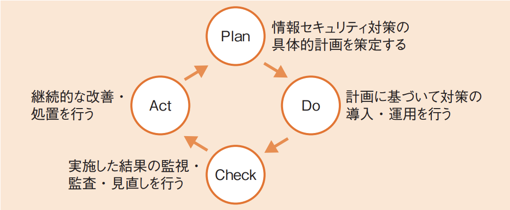

# 3-5-2 情報セキュリティ管理(译: 信息安全管理)

- [3-5-2 情報セキュリティ管理(译: 信息安全管理)](#3-5-2-情報セキュリティ管理译-信息安全管理)
  - [情報セキュリティマネジメントシステム(译: 信息安全管理体系)](#情報セキュリティマネジメントシステム译-信息安全管理体系)
  - [情報セキュリティ継続(译: 信息安全的持续性)](#情報セキュリティ継続译-信息安全的持续性)
  - [リスクマネジメント(译: 风险管理)](#リスクマネジメント译-风险管理)
  - [リスク対応(译: 风险应对)](#リスク対応译-风险应对)
  - [情報セキュリティポリシ(译: 信息安全方针)](#情報セキュリティポリシ译-信息安全方针)
  - [認証の3要素(译: 认证的三个要素)](#認証の3要素译-认证的三个要素)
  - [情報セキュリティ組織・機関(译: 信息安全组织与机构)](#情報セキュリティ組織機関译-信息安全组织与机构)
    - [情報セキュリティ委員会(译: 信息安全委员会)](#情報セキュリティ委員会译-信息安全委员会)
    - [SOC(セキュリティオペレーションセンター)(译: 安全运营中心)](#socセキュリティオペレーションセンター译-安全运营中心)
    - [CSIRT(译: 计算机安全事件响应小组)](#csirt译-计算机安全事件响应小组)
    - [IPAセキュリティセンター(译: IPA信息处理推进机构安全中心)](#ipaセキュリティセンター译-ipa信息处理推进机构安全中心)
    - [JVN(译: 日本漏洞通报平台)](#jvn译-日本漏洞通报平台)
    - [NISC(内閣サイバーセキュリティセンター)(译: 内阁网络安全中心)](#nisc内閣サイバーセキュリティセンター译-内阁网络安全中心)
    - [ホワイトハッカー(译: 白帽黑客)](#ホワイトハッカー译-白帽黑客)
    - [**J-CRAT**(サイバーレスキュー隊)(译: 日本网络应急救援队)](#j-cratサイバーレスキュー隊译-日本网络应急救援队)

## 情報セキュリティマネジメントシステム(译: 信息安全管理体系)

- **ISMS**(情報セキュリティマネジメントシステム, Information Security Management System)(译: 信息安全管理体系): 組織において情報セキュリティを管理するための仕組みである。
- JIS Q **27001**(ISO/IEC 27001): ISMSの構築方法や**要求事項**などを示す。
- JIS Q **27002**(ISO/IEC 27002): どのようにISMSを実践するかという**実践規範**を示す。
- ISMSでは, **情報セキュリティ基本方針**を基に, 次のような**PDCAサイクル**(译: PDCA循环)を繰り返する。
  - **PDCAサイクル**: Plan(计划), Do(执行), Check(检查), Act(处理)
  - 図: 情報セキュリティのPDCAサイクル 

    | PDCAサイクル | 説明 | 中文说明 |
    | - | ---- | -- |
    | Planフェーズ (译: 计划阶段) | 具体的な計画を立て, 情報セキュリティポリシなどを策定する | 制定信息安全方针, 目标与对策, 明确管理框架与实施内容 |
    | Doフェーズ (译: ) (译: 执行阶段) | $\bullet$ 組織全員が情報セキュリティを確保できるように, 責任者が適切に**リーダシップ**をとり, 法的及び契約において情報セキュリティを順守させるようにする $\bullet$ そのため, 定期的に**情報セキュリティ教育**や訓練を行う必要がある | 根据计划实施信息安全措施并开始运行 |
    | Checkフェーズ (译: 检查阶段) | $\bullet$ 内部監査やマネジメントレビューなどの**パフォーマンス評価**を行う $\bullet$ また, コーポレートガバナンス(译: Corporate Governance, 公司治理)と, それを支える内部統制の仕組みを情報セキュリティの観点から運用する**情報セキュリティガバナンス**(译: 信息安全治理)も意識する必要がある | 评估与监视对策效果, 检查是否有偏差或问题 |
    | Actフェーズ (译: 改善阶段) | 継続的な改善を行う | 据检查结果进行改进, 并将其反馈到下一轮计划中, 持续优化信息安全管理体系 |

## 情報セキュリティ継続(译: 信息安全的持续性)

- 組織は, 危機または災害発生による非常事態に備えて, 継続した情報セキュリティの運用を確実にするためのプロセスである**情報セキュリティ継続**を策定しておく必要がある。
- 具体的には, **コンティンジェンシープラン**(緊急時対応計画)(译: Contingency Plan, 应急计划)や復旧計画, バックアップ対策などを事前に考案しておく。

## リスクマネジメント(译: 风险管理)

- **リスク**(译: Risk, 风险): もしそれが発生すれば情報資産に影響を与える不確実な事象や状態のことである。
- **リスクマネジメント**(译: Risk Management, 风险管理): リスクに関して組織を指揮し, 管理する。
- **リスクアセスメント**(译: Risk Assessment, 风险评估): **リスク分析**によって情報資産に対する脅威と脆弱性を洗い出し, そのリスクの大きさを算出する。
- リスクの大きさ: そのリスクの**発生確率**と, 事象が起こったときの**影響の大きさ**とを組み合わせたもので, 金額などで算出される。
- **リスク評価**(译: Risk Evaluation, 风险评价):リスクの大きさに基づき, それぞれのリスクに対してリスク評価を行う。
  - **定性的評価**: リスクの大きさを金額以外で評価する手法
  - **定量的評価**: リスクの大きさを金額で評価する手法

## リスク対応(译: 风险应对)

- **がリスク対応**: リスクを評価した後で, それぞれのリスクに対してどのように対応するかを決める。

  | リスク対応 | 説明 | 中文说明 |
  | - | -- | -- |
  | **リスク最適化**(低減) (译: 风险最优化(降低)) | $\bullet$ 損失の発生確率や被害額を減少させるような対策を行うことである $\bullet$ 一般的なセキュリティ対策はこれにあたる | 通过采取安全对策, 减少风险发生的概率或影响程度, 例如安装防火墙, 加密, 备份等 |
  | リスク回避 (译: 风险回避) | $\bullet$ リスクの根本原因を排除することでリスクを処理する $\bullet$ リスクの高いサーバの運用をやめるなどがその一例である | 通过中止或避免存在风险的行为或业务来消除风险, 例如放弃某个高风险服务 |
  | **リスク移転** (译: 风险转移) | $\bullet$ リスクを第三者へ移転する $\bullet$ 保険をかけるなどしてリスク発生時の費用負担を外部に転嫁するといった方法がある | 通过保险或外包等方式, 将风险责任转移给第三方, 如购买网络安全保险 |
  | リスク保有(受容) (译: 风险保留(接受)) | 特にリスクに対応せず, そのことを受容する | 认为风险在可接受范围内, 不采取特别对策, 直接承担后果 |

- ⭐️ 例題: 個人情報の漏えいに関するリスク対応のうち, リスク回避に該当するものはどれか。
  - ア: 個人情報の重要性と対策費用を勘案し, あえて対策をとらない。
  - イ: 個人情報の保管場所に外部の者が侵入できないように, 入退室をより厳重に管理する。
  - ウ: 個人情報を含む情報資産を外部のデータセンタに預託する。
  - エ: 収集済みの個人情報を消去し, 新たな収集を禁止する。

  > リスク回避とは, リスクの根本原因を排除することでリスクを処理することである。新たな収集を禁止し, 収集済みの個人情報を消去することで, 情報漏えいのリスクを回避できる。  
  > したがって, エが正解である。  
  > ア: リスク保有に該当する。  
  > イ: リスク最適化に該当する。  
  > ウ: リスク移転に該当する。

## 情報セキュリティポリシ(译: 信息安全方针)

- **情報セキュリティポリシ**: 組織の情報資産を守るための方針や基準を明文化したもので, 基本構成は次の二つである。
  1. **情報セキュリティ基本方針**
      - 情報セキュリティに対する組織の基本的な考え方や方針を示すもので, **経営陣によって承認**される。
      - 目的や対象範囲, 管理体制や罰則などについて記述されており, 全従業員及び関係者に通知して公表される。
  2. **情報セキュリティ対策基準**
      - 情報セキュリティ基本方針と, リスクアセスメントの結果に基づいて対策基準を決める。
      - 適切な情報セキュリティレベルを維持・確保するための具体的な遵守事項や基準を定める。
- ⭐️ 例題: ISMSにおいて定義することが求められている情報セキュリティ基本方針に関する記述のうち, 適切なものはどれか。
  - ア: 重要な基本方針を定めた機密文書であり, 社内の関係者以外の目に触れないようにする。
  - イ: 情報セキュリティの基本方針を述べたものであり, ビジネス環境や技術が変化しても変更してはならない。
  - ウ: 情報セキュリティのための経営陣の方向性及び支持を規定する。
  - エ:  特定のシステムについてリスク分析を行い, そのセキュリティ対策とシステム運用の詳細を記述する。

  > 情報セキュリティ基本方針は, 経営陣によって承認されるもので, 情報セキュリティのための経営陣の方向性及び支持を規定する。  
  > したがって, ウが正解である。
  > ア: 機密文書とするのではなく, 全社員に公開し, 必要なら外部関係者にも通知する。
  > イ:「変更してはならない」は誤りである。ISMSの一環として整備されるものなので, PDCAサイクルに則って定期的に改善する必要がある。
  > エ: 基本方針ではなく, 情報セキュリティ対策実施手順, 規程類のことである。

- <参考>
  - 情報セキュリティポリシはあくまで方針と基準なので, 実際の細かい内容は定めれられていない。
  - そのため, 情報セキュリティマネジメントを行う際には, 情報セキュリティ対策実施手順や規程類を用意し, 詳細な手続きや手順を記述するようにする。

## 認証の3要素(译: 认证的三个要素)

- 認証の3要素: ユーザ認証の方法には大きく次の3種類があり, それを認証の3要素という。

  | 認証の3要素 | 説明 | 中文说明 |
  | - | -- | -- |
  | 記憶 (译: 记忆) | $\bullet$ ある**情報**をもっていることによる認証 $\bullet$ 例: パスワード, 暗証番号など | $\bullet$ **知识因素**: 通过用户记住的信息进行认证 $\bullet$ 如密码, PIN码等 $\bullet$ 最常见, 但容易被猜测或泄露 |
  | 所持 (译: 持有) | $\bullet$ ある**もの**をもっていることによる認証 $\bullet$ 例: ICカード, 電話番号, 秘密鍵など | $\bullet$ **物理因素**: 通过用户持有的物品认证 $\bullet$ 如智能卡, 验证码器, 手机OTP应用等 |
  | 生体 (译: 生物识别) | $\bullet$ 身体的な**特徴**による認証 $\bullet$ 例: 指紋, 虹彩, 静脈など | $\bullet$ **生物因素**: 通过用户的生理特征进行认证 $\bullet$ 如指纹, 人脸, 虹膜等 $\bullet$ 安全性较高 |

- それぞれの認証には一長一短があるため, このうちの2種類以上を組み合わせて**多要素認証**(または**2要素認証**)とすることが重要である
- <用語>
  - **ICカード**は, 通常の磁気カードと異なり, 情報の記録や演算をするためにICが組み込まれている。そして, 内部の情報を読み出そうとすると壊れるなどして情報を守る。
  - このような, 物理的あるいは論理的に内部の情報を読み取られることに対する耐性のことを**耐タンパ性**(译: 防篡改)という。

## 情報セキュリティ組織・機関(译: 信息安全组织与机构)

- 進化する情報セキュリティ攻撃から組織を守るためには, 組織の中に情報セキュリティを確保する仕組みを作り, 組織同士で連携する必要がある。

### 情報セキュリティ委員会(译: 信息安全委员会)

- 組織の中における, 情報セキュリティ管理責任者(CISO)をはじめとした経営層の意思決定組織である。
- **CISO**: Chief Information Security Officer(译: 首席信息安全官)
- 企业或组织内部设立的负责信息安全方针制定, 实施与监督的专责机构。

### SOC(セキュリティオペレーションセンター)(译: 安全运营中心)

- **SOC**: Security Operation Center(译: 安全运营中心)
- セキュリティ監視の拠点である。
- セキュリティ管理サービスを提供するIT企業が複数の顧客への対応を集中して行うためにSOCを用意し, 顧客のセキュリティ機器を監視し, サイバー攻撃の検出やその対策を行う。
- 24小时监控和分析网络与系统活动, 及时检测, 响应安全事件的专业团队或设施。

### CSIRT(译: 计算机安全事件响应小组)

- **CSIRT**: Computer Security Incident Response Team
- 主にセキュリティ対策のためにコンピュータやネットワークを監視し, 問題が発生した際にはその原因の解析や調査を行う組織である。
- CSIRTでは, インシデントが発生したときに適切に対処する**インシデントハンドリング**(译: Incident Handling, 事故处理)を行う。
- 日本には, 他のCSIRTとの情報連携や調整を行う**JPCERT/CC**(Japan Computer Emergency Response Team Coordination Center)(译: 日本计算机应急小组协调中心)がある。
- 负责应对信息安全事件(如入侵, 病毒感染等)并采取恢复措施的专业组织, 企业或国家均可设立。

### IPAセキュリティセンター(译: IPA信息处理推进机构安全中心)

- IPA(情報処理推進機構)内に設置されているセキュリティセンターである。
- ここでは情報セキュリティ早期警戒パートナーシップという制度を運用しており, コンピュータウイルス, 不正アクセス, 脆弱性などの届出を受け付けている。
- 経済産業省と共同で, **サイバーセキュリティ経営ガイドライン**を公開している。
- 日本IPA(独立行政法人 情報処理推進機構)旗下的安全部门, 负责信息安全普及, 指导, 漏洞信息发布等。

### JVN(译: 日本漏洞通报平台)

- **JVN**: Japan Vulnerability Notes
- 日本で使用されているソフトウェアなどの脆弱性関連情報とその対策情報を提供する脆弱性対策情報ポータルサイトである。
- JPCERT/CCとIPAが共同で運営している。
- 由IPA与JPCERT/CC 共同运营, 提供日本国内外软件/系统的漏洞信息数据库与通告服务。

### NISC(内閣サイバーセキュリティセンター)(译: 内阁网络安全中心)

- **NISC**: National center of Incident readiness and Strategy for Cybersecurity
- 内閣官房に設置された組織である。
- サイバーセキュリティ基本法に基づき, 内閣にサイバーセキュリティ戦略本部が設置され, 同時に内閣官房にNISCが設置された。
- サイバーセキュリティ戦略の立案と実施の推進などを行っている。
- 日本政府设立的国家级网络安全统筹机构, 制定国家战略, 主导政府机关的安全对策。

### ホワイトハッカー(译: 白帽黑客)

- ホワイトハッカー: コンピュータやネットワークに関する高い技術をもつハッカーと呼ばれる人のうち, その技術を善良な目的に生かす人である。
- サイバー犯罪に対処するためにも, **ホワイトハッカー**の育成は急務といわれている。
- 合法使用黑客技能, 帮助企业或组织发现并修复系统漏洞的专业技术人员。

### **J-CRAT**(サイバーレスキュー隊)(译: 日本网络应急救援队)

- J-CRAT: Cyber Rescue and Advice Team against targeted attack of Japan
- IPAが経済産業省の支援のもとに設立した, 相談を受けた組織の被害の低減と攻撃の連鎖の遮断を支援する活動を行う団体である。
- 「標的型サイバー攻撃特別相談窓口」で, 広く一般からの相談や情報提供を受け付けており, 調査結果を用いた助言を実施する。
- 基本的にはメールや電話などでのやり取りであるが, 場合によっては, 現場組織に赴いて支援を行うこともある。
- 由IPA运营, 针对遭受严重网络攻击的企业提供应急支援与恢复服务的组织。
- ⭐️ 例題: サイバーレスキュー隊(J-CRAT)の役割はどれか。
  - ア: 外部からのサイバー攻撃などの情報セキュリティ問題に対して, 政府横断的な情報収集や監視機能を整備し, 政府機関の緊急対応能力強化を図る。
  - イ: 重要インフラに関わる業界などを中心とした参加組織と秘密保持契約を締結し, その契約の下に提供された標的型サイバー攻撃の情報を分析及び加工することによって, 参加組織間で情報共有する。
  - ウ: セキュリティオペレーション技術向上, オペレータ人材育成, 及びサイバーセキュリティに関係する組織・団体間の連携を推進することによって, セキュリティオペレーションサービスの普及とサービスレベルの向上を促す。
  - エ: 標的型サイバー攻撃を受けた組織や個人から提供された情報を分析し, 社会や産業に重大な被害を及ぼしかねない標的型サイバー攻撃の把握, 被害の分析, 対策の早期着手の支援を行う。

  > サイバーレスキュー隊(J-CRAT)とは, IPAが経済産業省の支援のもとに設立した, 相談を受けた組織の被害の低減と攻撃の連鎖の遮断を支援する活動を行う団体である。  
  > したがって, エが正解である。  
  > ア: CSIRTの役割である。  
  > イ: J-CSIP(サイバー情報共有イニシアティブ)の役割である。  
  > ウ: ISOG-J(日本セキュリティオペレーション事業者協議会)の役割である。
