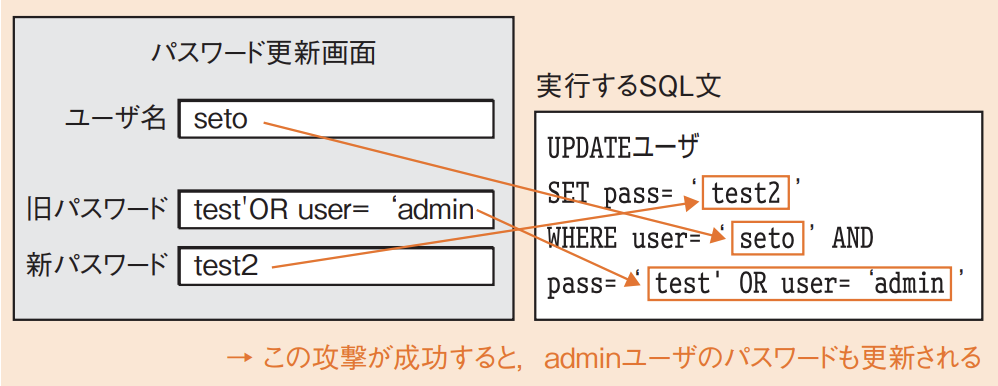
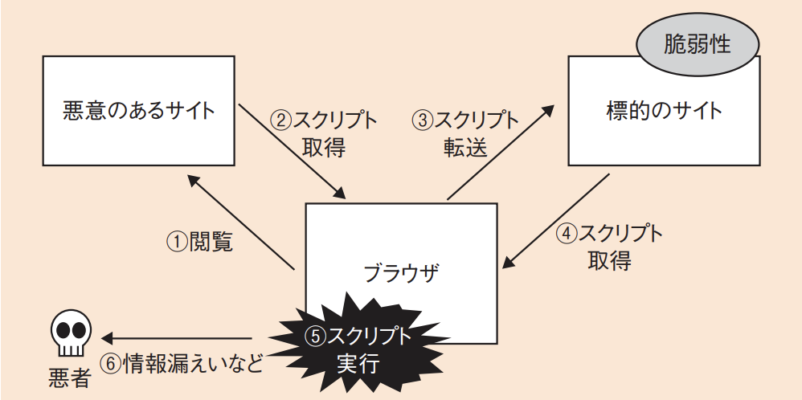
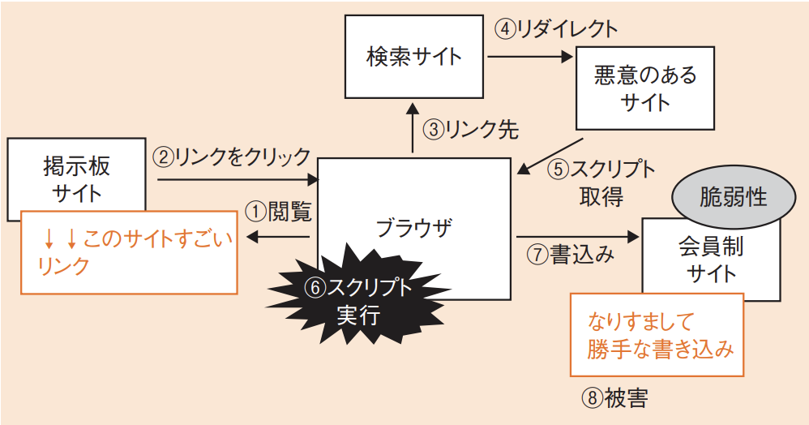

# 3-5-4 情報セキュリティ対策(译: 信息安全对策)

- [3-5-4 情報セキュリティ対策(译: 信息安全对策)](#3-5-4-情報セキュリティ対策译-信息安全对策)
  - [情報セキュリティ対策の種類(译: 信息安全对策的种类)](#情報セキュリティ対策の種類译-信息安全对策的种类)
  - [個人情報保護対策(译: 个人信息保护对策)](#個人情報保護対策译-个人信息保护对策)
  - [典型的なサイバー攻撃(译: 典型的网络攻击)](#典型的なサイバー攻撃译-典型的网络攻击)
    - [バッファオーバフロー攻撃(BOF)(译: 缓冲区溢出攻击)](#バッファオーバフロー攻撃bof译-缓冲区溢出攻击)
    - [**SQLインジェクション**(译: SQL注入攻击)](#sqlインジェクション译-sql注入攻击)
    - [**クロスサイトスクリプティング攻撃**(XSS)(译: 跨站脚本攻击)](#クロスサイトスクリプティング攻撃xss译-跨站脚本攻击)
    - [クロスサイトリクエストフォージェリ攻撃(CSRF)(译: 跨站请求伪造攻击)](#クロスサイトリクエストフォージェリ攻撃csrf译-跨站请求伪造攻击)
    - [セッションハイジャック(译: 会话劫持)](#セッションハイジャック译-会话劫持)
    - [**DNSキャッシュポイズニング攻撃**(译: DNS缓存投毒攻击)](#dnsキャッシュポイズニング攻撃译-dns缓存投毒攻击)
    - [**DoS攻撃(サービス不能攻撃)**(译: 拒绝服务攻击)](#dos攻撃サービス不能攻撃译-拒绝服务攻击)
    - [**フィッシング**(译: 网络钓鱼)](#フィッシング译-网络钓鱼)
    - [パスワードクラック(译: 密码破解)](#パスワードクラック译-密码破解)
    - [**ランサムウェア**(译: 勒索软件)](#ランサムウェア译-勒索软件)
    - [ディレクトリトラバーサル(译: 目录遍历攻击)](#ディレクトリトラバーサル译-目录遍历攻击)
    - [ポリモーフィック型マルウェア(译: 多态恶意软件)](#ポリモーフィック型マルウェア译-多态恶意软件)
    - [ドライブバイダウンロード(译: 恶意下载攻击 / Drive-by下载)](#ドライブバイダウンロード译-恶意下载攻击--drive-by下载)
    - [SEOポイズニング(译: SEO毒化攻击)](#seoポイズニング译-seo毒化攻击)
    - [ビジネスメール詐欺(译: 商业邮件欺诈 / BEC攻击)](#ビジネスメール詐欺译-商业邮件欺诈--bec攻击)
    - [クリプトジャッキング(译: 加密劫持)](#クリプトジャッキング译-加密劫持)
    - [クリックジャッキング(译: 点击劫持)](#クリックジャッキング译-点击劫持)
  - [標的型攻撃(译: 针对型攻击)](#標的型攻撃译-针对型攻击)
  - [セキュリティ対策(译: 安全防护措施)](#セキュリティ対策译-安全防护措施)
    - [アカウント管理(译: 账户管理)](#アカウント管理译-账户管理)
    - [ログ管理(译: 日志管理)](#ログ管理译-日志管理)
    - [入退室管理(译: 门禁管理)](#入退室管理译-门禁管理)
    - [アクセス制御(译: 访问控制)](#アクセス制御译-访问控制)
    - [マルウェア対策(译: 恶意软件对策)](#マルウェア対策译-恶意软件对策)
    - [不正アクセス対策(译: 非法访问对策)](#不正アクセス対策译-非法访问对策)
    - [情報漏えい対策(译: 信息泄露对策)](#情報漏えい対策译-信息泄露对策)
    - [無線LANセキュリティ(译: 无线局域网安全)](#無線lanセキュリティ译-无线局域网安全)
    - [携帯端末のセキュリティ(译: 移动设备安全)](#携帯端末のセキュリティ译-移动设备安全)
    - [ペネトレーションテスト(译: 渗透测试)](#ペネトレーションテスト译-渗透测试)

## 情報セキュリティ対策の種類(译: 信息安全对策的种类)

- 情報セキュリティ対策の3種類

  | 情報セキュリティ対策 | 説明 | 中文说明 |
  | - | ---- | -- |
  | 技術的セキュリティ対策 | $\bullet$ 暗号化, 認証, アクセス制御など, 技術によるセキュリティ対策である $\quad \bullet$ **入口対策**: 攻撃を防いで内部に侵入させない $\quad \bullet$ **出口対策**: 侵入された後にその被害を外部に広げない $\bullet$ 一つの対策だけでなく複数の対策を組み合わせる**多層防御**も大切である | **技术性安全对策**: 使用软硬件手段防范计算机系统或网络威胁, 如防火墙, 防病毒软件, 加密, IDS/IPS等 |
  | **人的**セキュリティ対策 | $\bullet$ 教育, 訓練や契約などにより, 人に対して行うセキュリティ対策である $\bullet$ 管理的セキュリティと呼ばれることもある $\bullet$ 組織における不正行為は, **内部関係者**によって行われることが多いため, それを防ぐ対策が必要である $\bullet$ IPAでは『**組織における内部不正防止ガイドライン**』を公表し, 内部不正を防止するための証拠確保などの具体的な方法を示している | **人为安全对策**: 通过员工培训, 意识提升, 防止人为错误或内部人员泄密等方法加强安全管理 |
  | **物理的**セキュリティ対策 | $\bullet$ 建物や設備などを対象とした, 物理的なセキュリティ対策である。 $\bullet$ 入退室管理やバックアップセンタ設置などを行う。 $\bullet$ **クリアスクリーン**: 離席時にはPCの画面を見えないようにする $\bullet$ **クリアデスク**: 帰宅時に机の上のものをPCなども含めてすべてロッカーにしまって施錠する | **物理性安全对策**: 通过门禁管理, 监控, 上锁等手段保护物理场所和信息资产, 防止非法入侵或盗窃 |

## 個人情報保護対策(译: 个人信息保护对策)

- **個人情報**: 氏名, 住所, メールアドレスなど, それ単体もしくは組み合わせることによって個人を特定できる情報のことである。
- 個人情報保護の基本的な考え方: 個人情報は本人の財産なので, それが勝手に別の人の手に渡ったり, 間違った方法で使われたり, 内容を勝手に変えられたりしないように適切に管理する必要があるということである。
- **個人情報の保護に関する法律(個人情報保護法)**: 個人情報の利用目的の特定と公表などについて定められている。
  - 個人情報に関しても, 法律や標準に従って, 適正な管理を行う必要がある。

## 典型的なサイバー攻撃(译: 典型的网络攻击)

### バッファオーバフロー攻撃(BOF)(译: 缓冲区溢出攻击)

- BOF: Buffer Overflow Attack
- バッファの長さを超えるデータを送り込むことによって, バッファの後ろにある領域を破壊して動作不能にし, プログラムを上書きする攻撃である。
- 対策としては, 入力文字列長をチェックする方法が一般的であるが, それを言語としてチェックしないC言語やC++言語などは使わないという方法もある。
- 利用程序未正确限制输入大小, 覆盖内存执行恶意代码。

### **SQLインジェクション**(译: SQL注入攻击)

- SQL Injection
- 不正なSQLを投入することで, 通常はアクセスできないデータにアクセスしたり更新したりする攻撃である。
- 図: SQLインジェクションの例  
  - このように, SQLインジェクションでは, 「'」(シングルクォーテーション)などの制御文字をうまく組み入れることによって, 意図しない操作を実行できる。
- 対策としては, 制御文字を置き換える**エスケープ処理**(译: Escape Processing, 转译处理)や, プレースホルダを利用する**バインド機構**(译: 绑定机制)が有効である。
- 向数据库查询中注入恶意SQL代码, 读取或篡改数据。
- <用語>
  - **バインド機構**: 入力データの部分を埋め込んで文字列を組み立てる際に, 文字列の連結ではなくプリペアドステートメントという各プログラム言語に用意された関数を利用して, SQL文を事前に組み立てておく方法である。
    - 具体的には, `preparedStatement("SELECT name FROM table WHEREcode=?");`といったかたちであらかじめSQL文をコンパイルしておき, 「?」の部分に文字列を挿入する。この「?」を**プレースホルダ**(译: 占位符)と呼ぶ。

### **クロスサイトスクリプティング攻撃**(XSS)(译: 跨站脚本攻击)

- XSS: Cross-Site Scripting
- 悪意のあるスクリプトを, 標的サイトに埋め込む攻撃である。
- 図: クロスサイトスクリプティング攻撃 
- 対処方法としては, スクリプトを実行できないようにする, 制御文字をエスケープ処理するなどがある。
- 向网页注入脚本, 使用户浏览时自动执行攻击者代码。

### クロスサイトリクエストフォージェリ攻撃(CSRF)(译: 跨站请求伪造攻击)

- CSRF: Cross-Site Request Forgery
- Webサイトにログイン中のユーザのスクリプトを操ることで, Webサイトに被害を与える攻撃である。
- 図: クロスサイトリクエストフォージェリ攻撃 
- 利用用户已登录状态, 诱导其执行未授权操作。
- <参考>
  - クロスサイトスクリプティング(XSS)とクロスサイトリクエストフォージェリ(CSRF)の違いは, 攻撃がブラウザ上で行われるかサーバに向けて行われるかである。
  - ブラウザ上で行われる: XSS
  - サーバに向けて行われる: CSRF

### セッションハイジャック(译: 会话劫持)

- Session Hijacking
- セッションIDやクッキーを盗むことで, 別のユーザになりすましてアクセスするという不正アクセスの手口である。
- 窃取或伪造用户会话ID, 冒充用户操作。

### **DNSキャッシュポイズニング攻撃**(译: DNS缓存投毒攻击)

- DNS Cache Poisoning
- DNSのキャッシュに不正な情報を注入することで, 不正なサイトへのアクセスを誘導する攻撃である。
- 篡改DNS解析结果, 使用户访问伪造网站。

### **DoS攻撃(サービス不能攻撃)**(译: 拒绝服务攻击)

- DoS(Denial of Service) Attack
- サーバなどのネットワーク機器に大量のパケットを送るなどしてサービスの提供を不能にする攻撃である。
- 踏み台と呼ばれる複数のコンピュータから一斉に攻撃を行う**DDoS**(Distributed DoS)(译: 分布式DoS)攻撃もある。
- 向服务器大量发送请求, 导致服务瘫痪。

### **フィッシング**(译: 网络钓鱼)

- Phishing
- 信頼できる機関を装い, 偽のWebサイトに誘導する攻撃である。
- 例えば, 銀行のメールを装って「本人情報の再確認が必要なので入力してください」などと詐称し, 個人情報を入力させるといった手口がある。
- 伪造正规网站或邮件, 诱导用户泄露账号密码等。

### パスワードクラック(译: 密码破解)

- Password Cracking
- パスワードを不正に取得する攻撃である。
- 手法
  - **辞書攻撃**(译: 字典攻击): 辞書に出てくる用語を使用する
    - 利用常见密码词汇表尝试登录的一种攻击方式, 效率高于暴力破解
  - **ブルートフォース攻撃**(译: 暴力破解攻击): 適当な文字列を組み合わせて力任せに攻撃を繰り返す
    - 枚举所有可能的字符组合尝试密码, 成功率高但效率低, 计算资源消耗大
  - **リプレイ攻撃スニッフィング**(译: 重放攻击): 認証情報の入ったパケットを取得し, それを送信する
    - 拦截合法通信数据(如登录请求), 再伪装成发送者进行重复发送, 达到伪装或欺骗目的
  - **スニッフィング**(译: 嗅探攻击): パスワードを盗聴する
    - 过监听网络数据包来窃取信息, 如账号密码, 会话ID 等, 常用于非加密通信环境
  - **パスワードリスト攻撃**(译: 密码库攻击):他のサイトで取得したパスワードのリストを利用して攻撃を行う
    - 使用已泄露的账号密码组合尝试登录多个系统, 尤其用于攻击使用相同密码的用户账户
- ⭐️ 例題: パスワードリスト攻撃に該当するものはどれか。
  - ア: 一般的な単語や人名からパスワードのリストを作成し, インターネットバンキングへのログインを試行する。
  - イ: 想定され得るパスワードとそのハッシュ値との対のリストを用いて, 入手したハッシュ値からパスワードを効率的に解析する。
  - ウ: どこかのWebサイトから流出した利用者IDとパスワードのリストを用いて, 他のWebサイトに対してログインを試行する。
  - エ: ピクチャパスワードの入力を録画してリスト化しておき, それを利用することでタブレット端末へのログインを試行する。

  > パスワードリスト攻撃とは, パスワードのリストを使ってログインを試行する攻撃で, そのリストにはどこかのWebサイトから流出した利用者IDとパスワードなどが使用される。  
  > したがって, ウが正解である。  
  > ア: 辞書攻撃の説明である。  
  > イ: レインボー攻撃(译: Rainbow Table Attack, 彩虹表攻击)の説明である。  
  > エのピクチャパスワードとは, 画像を用意し, その画像の特定の部分をクリックするなどの動作を登録しておき, その動作をログインに使う認証方法である。

### **ランサムウェア**(译: 勒索软件)

- Ransomware
- コンピュータをロックしたり重要なファイルを暗号化したりしてシステムへのアクセスを制限し, その制限を解除するための**身代金を要求するマルウェア**である。
- 身代金を支払ってもデータが復元されるとは限らないため, 事前の**バックアップ**などの対策が重要である。
- 加密用户数据并要求支付赎金解锁。
- <用語>
  - マルウェア(译: Malware, 恶意软件): 「malicious(悪意のある)」と「Software」の合成語である。

### ディレクトリトラバーサル(译: 目录遍历攻击)

- Directory Traversal
- Webサイトのパス名(Webサーバ内のディレクトリやファイル名)に上位のディレクトリを示す記号(../ や ..¥)を入れることで, 公開が予定されていないファイルを指定する攻撃である。
- サーバ内の機密ファイルの情報の漏えいや, 設定ファイルの改ざんなどに利用されるおそれがある。
- 対策としては, パス名などを直接指定させない, アクセス権を必要最小限にするなどがある。
- 访问服务器上限制之外的文件(如配置或密码文件)。

### ポリモーフィック型マルウェア(译: 多态恶意软件)

- Polymorphic Malware
- 自己を複製するときにプログラムのコードを変化させ, 検知されないようにするマルウェアである。
- 感染ごとにマルウェアのコードを異なる鍵で暗号化することによって, 同一のパターンでは検知されないようにする。
- 每次变种时代码结构变化, 逃避杀毒软件检测。

### ドライブバイダウンロード(译: 恶意下载攻击 / Drive-by下载)

- Drive-by Download
- Webサイトにアクセスしただけで, ソフトウェアをダウンロードさせる攻撃である。
- 利用者がWebサイトを閲覧したとき, 利用者に気付かれないように, 利用者のPCに不正プログラムを転送させる。
- 用户只需访问网页, 即自动下载并执行恶意程序。

### SEOポイズニング(译: SEO毒化攻击)

- SEO Poisoning
- Web検索サイトの順位付けアルゴリズムを悪用して, 検索結果の上位に, 悪意のあるWebサイトを意図的に表示させる攻撃である。
- ドライブバイダウンロードと合わせて, マルウェアに感染させることもある。
- 利用搜索引擎排名诱导用户访问恶意网站。

### ビジネスメール詐欺(译: 商业邮件欺诈 / BEC攻击)

- BEC(Business Email CompromiseBEC)
- 海外の取引先や自社の経営者層等になりすまし, 偽の電子メールを送って送金を行わせる詐欺のことである。
- BEC(BusinessEmail Compromise)とも呼ばれる。
- 假冒公司高层发送邮件指示转账, 骗取资金。

### クリプトジャッキング(译: 加密劫持)

- Crypto Jacking
- 仮想通貨を得ることを目的に行われる攻撃である。
- 他人のコンピュータを許可なく使用し, リソースを消費することで仮想通貨のマイニングをさせ, 仮想通貨を自分のものとする。
- 在用户设备上秘密运行加密货币挖矿程序。

### クリックジャッキング(译: 点击劫持)

- Click Jacking
- 罠ページの上に別のWebサイトをiFrameを使用して表示させ, 透明なページを重ね合わせることで不正なクリックを誘導する攻撃である。
- HTTPレスポンスヘッダに, X-Frame-Optionsヘッダフィールドを出力してフレームの使用を制限することで, 重ね合わせを防ぐことができる。
- 用透明框架覆盖按钮, 诱导用户点击误操作。

## 標的型攻撃(译: 针对型攻击)

- 特定の企業や組織を狙った攻撃である。
- 標的とした企業の社員に向けて, 関係者を装ってウイルスメールを送付するなどして感染させる。また, その感染させたPCからさらに攻撃の手を広げて, 最終的に企業の機密情報を盗み出する。
- **APT**(AdvancedPersistent Threat: 先進的で執拗な脅威)(译: 高级长期威胁)と呼ばれることもある。
- 標的型攻撃の手口
  - **水飲み場型攻撃**(译: Watering Hole Attack, 水坑攻击): 標的の組織や個人がよく利用するWebサイトを改ざんし, そこでマルウェアなどの導入を仕込む
  - **やり取り型攻撃**: 複数回のメールのやり取りで担当者を信頼させる
- 感染したマルウェアが遠隔操作型ウイルスとなり, **C＆Cサーバ**(Command and Control Server)(译: 命令和控制服务器)と通信することで, 情報を外部に流出させる。
- マルウェアはウイルス対策ソフトで防げないことも多いため, 攻撃を防ぐ入口対策だけでなく, 感染後に被害を広げないための**出口対策**を適切に行うことが大切である。
- <用語>
  - C＆Cサーバとは, 不正プログラムに対して指示を出し, 情報を受け取るためのサーバである。

## セキュリティ対策(译: 安全防护措施)

### アカウント管理(译: 账户管理)

- ユーザとアカウントを1対1で対応させ, ユーザに必要最小限のアクセス権を与える。
- 管理用户账号的创建, 权限分配, 停用等, 防止未授权访问。

### ログ管理(译: 日志管理)

- ログを収集し, その完全性を管理する。
- **ディジタルフォレンジックス**(译: Digital forensics, 数字取证)を意識し, 証拠となるようにログを残すことが大切である。
- **SIEM**(Security Information and Event Management)(译: 安全信息和事件管理): 複数のサーバやネットワーク機器のログを収集分析し, 不審なアクセスを検知する仕組みである。
  - 複数のサーバのログを一元管理することで, 不審なアクセスを見つけやすくなる。
- 记录并分析系统操作记录, 便于问题追踪和异常检测。
- <用語>
  - **ディジタルフォレンジックス**(译: Digital forensics, 数字取证): 法科学の一分野である。不正アクセスや機密情報の漏えいなどで法的な紛争が生じた際に, 原因究明や捜査に必要なデータを収集・分析し, その法的な証拠性を明らかにする手段や技術の総称である。ログを法的な証拠として成立させるためには, ログが改ざんされないような工夫をする必要がある。

### 入退室管理(译: 门禁管理)

- ICカードなどを用いて, 入退室を管理・記録する。
- 控制人员进出物理区域(如机房, 办公室), 确保物理安全。

### アクセス制御(译: 访问控制)

- ファイアウォールなどを用いてアクセスを制御する。
- 根据用户权限限制对系统资源的访问(如基于角色的访问控制RBAC)。

### マルウェア対策(译: 恶意软件对策)

- ウイルス対策ソフトを全PCに導入し, ウイルス定義ファイルを最新版にアップデートするなど, マルウェアに感染しない対策を行う。
- **検疫ネットワーク**(译: Quarantine Network, 网络隔离)を用いて, ウイルス対策を行っていないPCはネットワークに接続させないという手法も有効である。
- 安装防病毒软件, 更新补丁, 限制脚本执行等预防恶意程序入侵。

### 不正アクセス対策(译: 非法访问对策)

- IDS / IPSなどの侵入検知/防止の対策を行い, 不正アクセスに対処する。
- 防止未授权者访问系统, 常见对策有防火墙, 入侵检测系统等。

### 情報漏えい対策(译: 信息泄露对策)

- データを暗号化したり, 物理的に持ち出さないようにしたりして, 情報が漏えいしないようにする。
- **TPM**(Trusted Platform Module)(译: 可信平台模块): PCの内部のデータが盗まれないようにする仕組みである。
  - PCなどの機器に搭載され, 鍵生成やハッシュ演算及び暗号処理を行うセキュリティチップである。
- 通过加密, 日志审计, 权限控制等方式防止机密信息外泄。

### [無線LANセキュリティ](../3-4ネットワーク/3-4-2データ通信と制御.md#無線lan译-无线局域网)(译: 无线局域网安全)

- WEPやWPAで暗号化, IEEE 802.1Xで認証などを行うことで, 無線LANのセキュリティを確保する。
- 设置强密码, 隐藏SSID, 启用加密协议(如WPA3)保护无线通信。

### 携帯端末のセキュリティ(译: 移动设备安全)

- スマートフォンやタブレットPCなどの携帯端末は, PCと同様の機能をもっている。そのため, ウイルス対策ソフトを導入す
るなど, PCと同等のセキュリティ対策を講じることが必要である。
- 对智能手机, 平板等设备实施加密, 远程擦除, MDM管理等保护措施。

### ペネトレーションテスト(译: 渗透测试)

- サーバやファイアウォールなどのシステムに対して疑似攻撃を行うテストである。
- 実際に侵入可能かどうかを確かめることによって, システムの安全性を確認する。
- 模拟攻击者方式测试系统弱点, 提前发现漏洞并修复。
