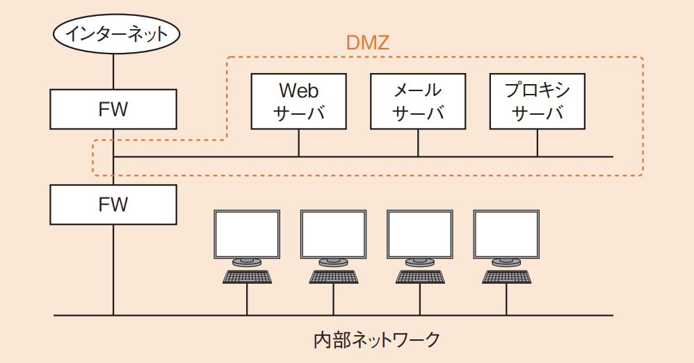

# 3-5-5 セキュリティ実装技術

- [3-5-5 セキュリティ実装技術](#3-5-5-セキュリティ実装技術)
  - [セキュアOS(译: 安全操作系统)](#セキュアos译-安全操作系统)
  - [ネットワークセキュリティ(译: 网络安全)](#ネットワークセキュリティ译-网络安全)
    - [ファイアウォール(FW)(译: 防火墙)](#ファイアウォールfw译-防火墙)
    - [IDS/IPS(译: 入侵检测系统/入侵防御系统)](#idsips译-入侵检测系统入侵防御系统)
    - [NAT/NAPT(IPマスカレード)(译: 网络地址转换/端口地址转换)](#natnaptipマスカレード译-网络地址转换端口地址转换)
    - [VPN(Virtual Private Network)(译: 虚拟专用网络)](#vpnvirtual-private-network译-虚拟专用网络)
  - [データベースセキュリティ(译: 数据库安全)](#データベースセキュリティ译-数据库安全)
    - [利用者認証(译: 用户认证)](#利用者認証译-用户认证)
    - [暗号化(译: 加密)](#暗号化译-加密)
    - [ロール(译: 角色权限管理)](#ロール译-角色权限管理)
  - [アプリケーションセキュリティ(译: 应用程序安全)](#アプリケーションセキュリティ译-应用程序安全)
    - [セキュアプログラミング(译: 安全编程)](#セキュアプログラミング译-安全编程)
    - [脆弱性低減技術(译: 漏洞减缓技术)](#脆弱性低減技術译-漏洞减缓技术)
    - [Same Origin Policy(译: 同源策略)](#same-origin-policy译-同源策略)
    - [パスワードクラック対策(译: 密码破解对策)](#パスワードクラック対策译-密码破解对策)
    - [WAF(译: Web应用防火墙)](#waf译-web应用防火墙)
  - [その他のセキュリティ(译: 其他安全技术)](#その他のセキュリティ译-其他安全技术)
    - [スパム対策/ウイルス対策(译: 垃圾邮件/病毒对策)](#スパム対策ウイルス対策译-垃圾邮件病毒对策)
    - [テンペスト技術(译: TEMPEST技术/防电磁泄漏技术)](#テンペスト技術译-tempest技术防电磁泄漏技术)
    - [**ステガノグラフィ**(译: 隐写术)](#ステガノグラフィ译-隐写术)
    - [時刻認証(タイムスタンプ)(译: 时间戳认证)](#時刻認証タイムスタンプ译-时间戳认证)
    - [**ソーシャルエンジニアリング**(译: 社会工程学)](#ソーシャルエンジニアリング译-社会工程学)
    - [CAPTCHA(译: 验证码)](#captcha译-验证码)
  - [認証プロトコル(译: 认证协议)](#認証プロトコル译-认证协议)
    - [**SPF**(译: 发件人策略框架)](#spf译-发件人策略框架)
    - [**DKIM**(译: 域名密钥识别邮件)](#dkim译-域名密钥识别邮件)
    - [**SMTP-AUTH**(译: SMTP 身份验证)](#smtp-auth译-smtp-身份验证)
    - [OP25B(Outbound Port 25 Blocking)(译: 出站25端口封锁)](#op25boutbound-port-25-blocking译-出站25端口封锁)
    - [**OAuth**(译: OAuth授权协议)](#oauth译-oauth授权协议)
    - [DNSSEC(译: DNS安全扩展)](#dnssec译-dns安全扩展)
    - [Diameter(译: Diameter协议)](#diameter译-diameter协议)
  - [ブロックチェーン(译: 区块链)](#ブロックチェーン译-区块链)

## セキュアOS(译: 安全操作系统)

- セキュアOS:  セキュリティを強化したOSである。
- **DAC**(任意アクセス制御: Discretionary Access Control)(译: 自主访问控制): ユーザが自分自身でアクセス権限を設定できる方式である。
  - UNIXやWindowsなどの通常のOS
- **MAC**(強制アクセス制御: Mandatory Access Control)(译: 强制访问控制): 管理者がアクセス権限を強制する方式を使用する。
  - セキュアOS
- 業務に合わせて**ロール**(役割)(译: 角色)を定義することで, **RBAC**(ロールベースアクセス制御: Role BaseAccess Control)(译: 基于角色的访问控制)を行うことも可能である。
  - それによって, 不要なアクセス権を与えずに安全を確保するという**最小権限**の原則を満たすことができる。
- 代表的なセキュアOS: SELinuxやTrusted Solarisなど
- 加强安全机制的操作系统, 具备访问控制, 最小权限, 审计等功能。

## ネットワークセキュリティ(译: 网络安全)

### ファイアウォール(FW)(译: 防火墙)

- **ファイアウォール**(译: Firewall, 防火墙):ネットワークを中継する場所に設置され, あらかじめ設定された**ACL**(アクセス制御リスト: AccessControl List)(译: 访问控制列表)に基づいてパケットを中継したり破棄したりする機能をもつものである。
- 主な方式
  - **パケットフィルタ型**(译: 数据包过滤型)
    - **IPアドレスとポート番号**を基にアクセス制御を行う
    - 根据 IP 地址, 端口号, 协议等信息对网络层和传输层的数据包进行检查, 决定是否允许通过。速度快, 开销小, 但无法深入检查应用层内容
  - **アプリケーションゲートウェイ型**(译: 应用层网关型)
    - HTTP, SMTPなどのアプリケーションプログラムごとに細かく中継可否を設定できる
    - 又称为"代理型防火墙", 在应用层对通信内容进行全面检查, 通过代理服务器转发请求, 安全性较高但性能开销较大
- **DMZ**(非武装地帯: Demilitarized Zone)(译: 隔离区, 非军事区)
  - 外部に公開する必要があるWebサーバやメールサーバなどの機器もあるため, インターネットと内部ネットワークの間に, 中間のネットワークとして設定する。
  - DMZを中間に設置することで, 内部ネットワークの安全性が高まる。
  - DMZに**プロキシサーバ**(译: Proxy Server, 代理服务器)を置き, PCからインターネットへのWebアクセスなどを中継することもできる。
  - 図: DMZ 
- 控制内部与外部网络之间的数据通信, 阻挡未授权访问。

### IDS/IPS(译: 入侵检测系统/入侵防御系统)

- **IDS**(Intrusion Detection System): ネットワークやホストをリアルタイムで監視して侵入や攻撃を検知し, 管理者に通知するシステムである。
  - **NIDS**(ネットワーク型IDS)(译: Network Intrusion Detection System, 网络入侵检测系统): ネットワークに接続されてネットワーク全般を管理する
  - **HIDS**(ホスト型IDS)(译: Host-based Intrusion Detection System, 基于主机的入侵检测系统): ホストにインストールされ特定のホストを監視する
- IPS(侵入防御システム)(Intrusion Prevention System)
  - 防御も行えるシステムである。
- <発展>
  - ファイアウォールとIDSの違い
    - ファイアウォールでは, IPヘッダやTCPヘッダなどの限られた情報しかチェックできないのに対して, IDSでは検知する内容を自由に設定できることである。
      - 不正なアクセスのパターンを集めた**シグネチャ**(译: Signature, 特征码检测)を登録しておき, それと照合することで不正アクセスを検出できる。
      - 正常パターンを登録しておき, それ以外を異常と見なす**アノマリ検出**(译: 异常检测)も可能である。
- 监测并响应异常或恶意网络行为, IPS具备主动阻止功能。

### [NAT](../3-4ネットワーク/3-4-3通信プロトコル.md#アドレス変換译-地址转换)/NAPT(IPマスカレード)(译: 网络地址转换/端口地址转换)

- 内部ネットワークにプライベートIPアドレスを使用することで, 外から内部ネットワークの存在を隠蔽することができる。
- **プロキシサーバ**を経由することによっても同様の効果を得られる。
- 将私有地址转换为公网地址, 实现多个设备共用一个IP上网。

### VPN(Virtual Private Network)(译: 虚拟专用网络)

- VPN: インターネットやIP-VPN網などの共有のネットワークを利用して, 仮想的な専用線を構築する。
- 利用される技術
  - **IPsec**: IPパケットを暗号化して通信する
  - **SSL-VPN**: SSLを利用して暗号化する
- 在公共网络中建立加密通道, 保证数据安全传输。
- ⭐️ 例題: 社内ネットワークからインターネット接続を行うときに, インターネットヘのアクセスを中継し, Webコンテンツをキャッシュすることによってアクセスを高速にする仕組みで, セキュリティ確保にも利用されるものはどれか。
  - ア: DMZ
  - イ: IPマスカレード(NAPT)
  - ウ: ファイアウォール
  - エ: プロキシ

  > インターネットへのアクセスを代理で中継してくれるサーバがプロキシ(サーバ)である。プロキシには, Webコンテンツをキャッシュする機能があるので, 複数のユーザが同じページを閲覧したときにはアクセスを高速化できる。そして, 内部のネットワークを隠蔽することができるのでセキュリティ確保にも役立つ。  
  > したがって, エが正解である。  
  > イのIPマスカレードもセキュリティ確保の効果は同様であるが, アドレス変換なのでキャッシュはできない。

## データベースセキュリティ(译: 数据库安全)

### 利用者認証(译: 用户认证)

- DBMSへのログイン用アカウントによって利用者認証を行う。
- しかし, Webサーバ上のプログラムからアクセスされる場合などは, 複数のユーザが同じDBMSアカウントを使うので, 利用者の記録が残らないことがある。その場合は, Webサーバ側でアクセス制御をする。
- 验证用户身份的方法, 如密码, 生物识别, IC卡等。
- <発展>
  - DBMSのアクセスログにDBMSのアカウント情報が残るが, 通常, WebアプリケーションではDBMSアカウントは共通なので, その場合は利用者を識別できない。ログに利用者情報を残すためには, Webサーバ側から利用者IDなどの情報を送ってもらう必要がある。

### 暗号化(译: 加密)

- データベースに格納されるデータ自体を暗号化する。
- そのため, DBMSが格納されているストレージなどが盗難された場合でもデータを保護できる。しかし, プログラムからアクセスされた場合には復号されるので, 解読可能になる。SQLインジェクションなど, アプリケーションを中継した攻撃には対応できないので, 注意が必要である。
- 将原始数据变换为不可读的密文, 防止泄露。

### ロール(译: 角色权限管理)

- DBMSのアカウントには, ユーザだけでなくロール(役割)を設定し, ロールごとにアクセスを制御することが可能である。
- 根据角色分配权限, 实现精细化访问控制。

## アプリケーションセキュリティ(译: 应用程序安全)

### セキュアプログラミング(译: 安全编程)

- **セキュアプログラミング**(译: Secure Programming, 安全编程): システム開発時に脆弱性を作り込まないようにするプログラミングである。
- クロスサイトスクリプティングやSQLインジェクションなど, 多くのサイバー攻撃は, セキュアプログラミングによって避けることができる。
- 例えば, 次の点に配慮してプログラムを組むことなどが大切である。
  - 入力値の内容チェックを行う
  - SQL文の組み立てはすべてプレースホルダで実装する
  - エラーをそのままブラウザに表示しない
- 编写避免常见漏洞(如XSS, SQL注入)的代码实践。

### 脆弱性低減技術(译: 漏洞减缓技术)

- ソースコード静的検査
- プログラムの動的検査
- 未知の脆弱性を検出する技術である**ファジング**(译: Fuzzing, 模糊测试)
- 使用沙箱, 自动补丁等技术降低系统被攻击风险。

### Same Origin Policy(译: 同源策略)

- Same Origin Policy(同一生成元ポリシ): あるオリジン(ドメインなどが同一のサイト)から読み込まれた文書やスクリプトを他のオリジンで利用できないように制限する機能である。
- 外部からの干渉を防ぐために利用される。
- 浏览器的安全机制, 限制不同源网页之间的交互。

### パスワードクラック対策(译: 密码破解对策)

- パスワードファイルを取得されるなどのパスワードクラックへの対策
  - **ソルト**(译: Salting, 加盐): パスワードをハッシュ化するときにソルトと呼ばれる文字列を付加する方法
  - **ストレッチング**(译: Key Stretching, 密钥延伸): ハッシュ値の計算を何回も繰り返す手法
- 使用强密码, 锁定机制, 防止暴力破解等措施。

### WAF(译: Web应用防火墙)

- **WAF**: Web Application Firewall
- 脆弱性を取り除ききれなかったWebアプリケーションに対する攻撃を防御する機能がある。
- 保护Web服务免受SQL注入, XSS等攻击的专用防火墙。

## その他のセキュリティ(译: 其他安全技术)

### スパム対策/ウイルス対策(译: 垃圾邮件/病毒对策)

- ウイルスの対処方法
  - ウイルス対策ソフトをインストールする
  - ウイルス定義ファイルを最新状態に更新し続ける
  - OSやアプリケーションを最新版にアップデートする
- これらが守られていないと, ウイルスやスパムの被害にあう可能性が高くなる。
- しかし, 完全に対応することは難しく, 脆弱性の発見にウイルス定義ファイルの更新が間に合わないと**ゼロデイ攻撃**にあう場合がある。
- 使用杀毒软件, 邮件过滤等防止恶意邮件与病毒入侵。
- <用語>
  - **ゼロデイ攻撃**(译: Zero-day Vulnerability, 零日攻击): OSやアプリケーションの修正プログラムが提供されるよりも前に, 実際にセキュリティホール(译: Security Hole, 漏洞)を突いた攻撃が行われることである。

### テンペスト技術(译: TEMPEST技术/防电磁泄漏技术)

- **テンペスト**(TEMPEST:Transient Electromagnetic Pulse Surveillance Technology)(译: 电磁泄漏发射检测与防护)技術: PCや周辺機器から発する微弱な電磁波(漏えい電磁波)を受信することで通信を傍受することである。
- 対抗するためには, 電磁波を遮断する部屋に機器を設置するなどの対応が必要である。
- 防止设备产生的电磁波被截获造成信息泄露的技术。

### **ステガノグラフィ**(译: 隐写术)

- 音声や画像などのデータに秘密のメッセージを埋め込む技術である。
- 同様の技術である電子透かし(译: Digital Watermarking, 数字水印)では, コンテンツに関係がある情報を埋め込んで著作権を守ることが主な目的であるのに対して, ステガノグラフィでは秘匿メッセージをやり取りする。
- 将信息隐藏在图片, 音频等中, 秘密传输。

### 時刻認証(タイムスタンプ)(译: 时间戳认证)

- 契約書や領収書などが電子化されると, それが改ざんされる危険がある。PKIでのディジタル署名は, 他人の改ざんは証明できるが, 本人による改ざんには対処できない。
- そこで, **TSA**(時刻認証局)(译: Time Stamping Authority, 时间戳机构)が提供している**時刻認証**サービスを利用して書類のハッシュ値に時刻を付加し, TSAのディジタル署名を行った**タイムスタンプ**を付与することによって, その時刻に書類が存在していたこと(**存在性**), その時刻の後に改ざんされていないこと(**完全性**)が証明できる。
- 确保文件创建或交易时间的真实性与防篡改性。

### **ソーシャルエンジニアリング**(译: 社会工程学)

- 人間の心理的, 社会的な性質につけ込んで秘密情報を入手する手法のことである。
- 上司や重要顧客などを詐称してシステム管理者に電話をかけパスワードなどを聞き出す, ゴミ箱をあさってパスワードの紙を見つけるなどの方法がある。
- 利用人性弱点(如信任)诱骗信息, 如伪装成技术支持。

### CAPTCHA(译: 验证码)

- CAPTCHA: Completely Automated Public Turing test to tell Computers and Humans Apart(译: 全自动区分计算机和人类的图灵测试)
- ユーザ認証のときに合わせて行うテストで, 利用者がコンピュータでないことを確認するために使われる。
- コンピュータには認識困難な画像で, 人間は文字として認識できる情報を読み取らせることで, コンピュータで自動処理しているのではないことを確かめる。
- 区分人类和机器人访问的机制, 防止自动化攻击。

## 認証プロトコル(译: 认证协议)

### **SPF**(译: 发件人策略框架)

- SPF: Sender Policy Framework
- 電子メールの認証技術の一つで, 差出人のIPアドレスなどを基にメールのドメインの正当性を検証する。
- DNSサーバにSPFレコードとしてメールサーバのIPアドレスを登録しておき, 送られたメールと比較する。
- 验证邮件是否来自授权IP, 防止伪造发件人。

### **DKIM**(译: 域名密钥识别邮件)

- DKIM: Domain Keys Identified Mail
- 電子メールの認証技術の一つで, ディジタル署名を用いて送信者の正当性を立証する。
- 署名に使う公開鍵をDNSサーバに公開しておくことで, 受信者は正当性を確認できる。
- 使用数字签名验证邮件完整性与来源。

### **SMTP-AUTH**(译: SMTP 身份验证)

- 送信メールサーバで, ユーザ名とパスワードなどを用いてユーザを認証する方法である。
- 通常のSMTPのポート番号ではなく, **サブミッションポート**(译: Submission Port, 提交端口)と呼ばれる特別なポートを利用する場合が多いである。
- 确保邮件发送者身份的认证机制。

### OP25B(Outbound Port 25 Blocking)(译: 出站25端口封锁)

- 迷惑メールの送信に自社のネットワークを使われないようにするための対策である。
- 外部のメールサーバと直接, 25番ポートでSMTP通信を行うことを禁止する。
- 阻止恶意程序利用SMTP 25端口发送垃圾邮件。

### **OAuth**(译: OAuth授权协议)

- あらかじめ信頼関係を構築したサービス間で, ユーザの合意のもと, セキュリティを確保した上でユーザの権限を受け渡しする手法である。
- 現在のバージョンは**OAuth2.0**で, Webアプリだけでなく, モバイルアプリなど様々な用途で利用可能である。
- 用户无需透露密码即可授权第三方访问其信息。

### DNSSEC(译: DNS安全扩展)

- DNSSEC: DNS Security Extensions
- DNSの応答の正当性を保証するための仕様である。
- DNSのドメイン登録情報にディジタル署名を付加することで, 正当な応答レコードであることと, 内容が改ざんされていないことを保証する。
- 为DNS响应加上数字签名, 防止DNS欺骗。

### Diameter(译: Diameter协议)

- Diameter: 認証・認可・課金(AAA: Authentication, Authorization, Accounting)プロトコルで, RADIUS(Remote Authentication Dial In User Service)(译: 远端用户拨入验证服务)の後継である。
- トランスポート層のプロトコルとしてUDPの代わりにTCPを利用し, セキュリティに関してはTLSを利用して暗号化することが可能である。
- 用于替代RADIUS的认证, 授权与计费协议。
- ⭐️ 例題: SPF(Sender Policy Framework)を利用する目的はどれか。
  - ア: HTTP通信の経路上での中間者攻撃を検知する。
  - イ: LANへのPCの不正接続を検知する。
  - ウ: 内部ネットワークへの不正侵入を検知する。
  - エ: メール送信のなりすましを検知する。

  > SPFは送信ドメインを認証するための技術で, 該当ドメインに対するメールサーバのIPアドレスをDNSサーバに登録しておき, 受信したメールサーバがそのIPアドレスを確認することで, 送信元のメールサーバが正規のメールサーバであることを確認する技術である。  
  > メール送信のなりすましを検知することができるので, エが正解である。  
  > ア: HTTPS通信の利用によって対処できる。  
  > イ: パーソナルファイアウォールの導入によって対処できる。  
  > ウ: IDSなどの導入によって対処できる。

## ブロックチェーン(译: 区块链)

- **ブロックチェーン**: 取引履歴などのデータとそのハッシュ値を一組として, それをリストとしてつなげて記録した分散型台帳である。
- 同じ台帳をネットワーク上の多数のコンピュータで同期して保有し管理することで, 一部の台帳で取引データが改ざんされても, 取引データの完全性と可用性が確保される。タイムスタンプやハッシュ, メッセージ認証など, 様々なセキュリティ技術を組み合わせて利用している。
- ビットコインなどの仮想通貨で利用されている技術であるが, どのようなデータでも利用できるため, 商取引の記録など, ログや履歴が必要な様々な場面で応用されている。
