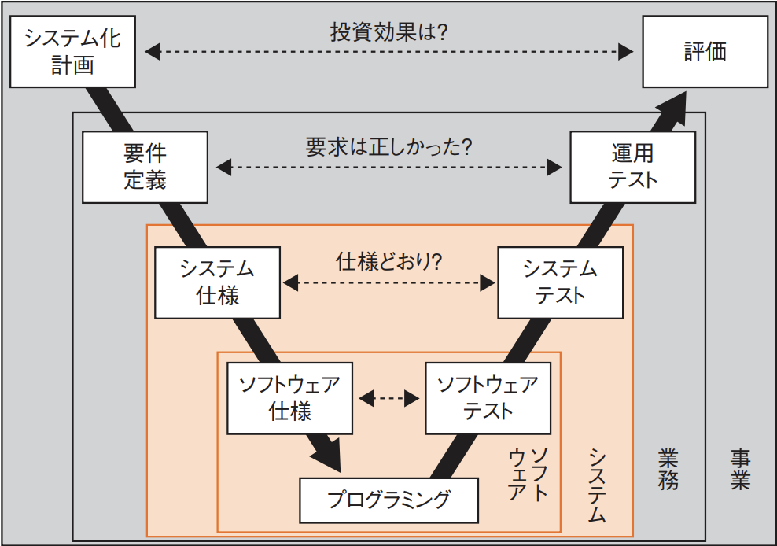
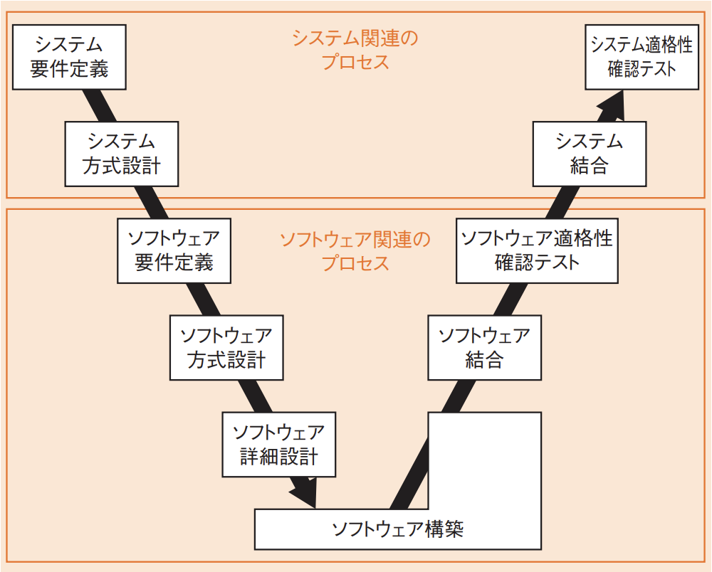

# 4-1-1 システム要件定義(译: 系统需求定义)

- [4-1-1 システム要件定義(译: 系统需求定义)](#4-1-1-システム要件定義译-系统需求定义)
  - [共通フレーム(译: 共通框架 / 通用框架)](#共通フレーム译-共通框架--通用框架)

## 共通フレーム(译: 共通框架 / 通用框架)

- **共通フレーム**: て日本で考案された開発プロセスを標準化し, 共通の物差しとするための共通基盤である。
  - 国際標準のソフトウェアライフサイクルプロセス規格ISO/IEC 12207を基に, 日本独自の仕様としてまとめられた。
  - 現在のバージョンは**共通フレーム2013(SLCP-JCF2013)**で, 情報処理技術者試験のシステム開発技術はこれを中心にまとめられている。
- 共通フレームは, **ソフトウェア開発及び取引の明確化**のために, 様々なプロセスを定義している。
  - システム開発プロセス
  - 企画プロセス
  - **要件定義プロセス**
  - **保守プロセス**
  - サービスマネジメントプロセス
  - 廃棄プロセス
  - 監査プロセス
  - など
- 共通フレームは, 以下の階層構造で構成されている。プロセスを徐々に詳細化していき, 最小単位が注記である。 **プロセス > アクティビティ > タスク > 注記**
- 共通フレームは, ソフトウェアやシステムは事業(ビジネス)や業務のために作られるということから, 次のような視点で要求仕様などを考える。
  - 図: 共通フレームにおける視点 
  - 各視点で次のようなV字型での開発を行い, テスト・評価を何段階も実施して, 様々な立場からシステムを評価する。
    - 図: システム開発のV字型モデル 
- 本章では, システム関連とソフトウェア関連のプロセスについて, 次のようなプロセスを取り扱う。
  - 図: システム関連とソフトウェア関連のプロセス 
  - ポイントは, 左側のプロセスで設計したものを右側のプロセスでテストするために, 要件定義や設計の段階でテストケースを作成しておくことである。
