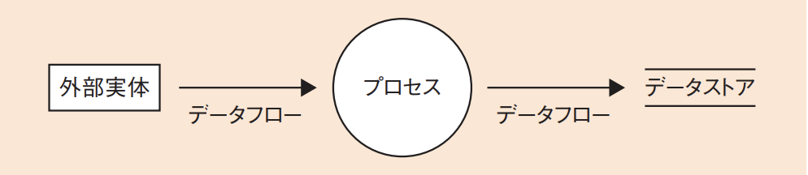

# 4-1-3 ソフトウェア要件定義(译: 软件需求定义)

- [4-1-3 ソフトウェア要件定義(译: 软件需求定义)](#4-1-3-ソフトウェア要件定義译-软件需求定义)
  - [ソフトウェア要件(译: 软件需求)](#ソフトウェア要件译-软件需求)
  - [ソフトウェア開発のアプローチ(译: 软件开发方法)](#ソフトウェア開発のアプローチ译-软件开发方法)
    - [プロセス中心アプローチ(POA)(译: 过程中心方法)](#プロセス中心アプローチpoa译-过程中心方法)
    - [**データ中心アプローチ**(DOA)(译: 数据中心方法)](#データ中心アプローチdoa译-数据中心方法)
    - [**オブジェクト指向アプローチ**(OOA)(译: 面向对象方法)](#オブジェクト指向アプローチooa译-面向对象方法)
  - [DFD(データフローダイアグラム)(译: 数据流图)](#dfdデータフローダイアグラム译-数据流图)
  - [UML(統一モデリング言語)(译: 统一建模语言)](#uml統一モデリング言語译-统一建模语言)
  - [SysML(译: 系统建模语言)](#sysml译-系统建模语言)

## ソフトウェア要件(译: 软件需求)

- ソフトウェア要件定義: 以下の要件等を確立し, 文書化する。
  - 品質特性
  - セキュリティの仕様
  - 安全性の仕様
  - 人間工学的な仕様
  - **ソフトウェア品目とその周辺のインタフェース**
  - **データ定義及びデータベースに対する要件**
- <用語>
  - **ソフトウェア品目**: 全体のソフトウェアを構成する一つ一つのコンテンツのことである。
    - 例えば, OS, データベースソフトウェア, 通信ソフトウェア, アプリケーションソフトウェアなどを指す。
    - これらは多くの場合, さらに細分化して管理される。

## ソフトウェア開発のアプローチ(译: 软件开发方法)

- <参考>
  - 従来の開発が, プロセス中心アプローチに当たる。
  - データベースの設計にはデータ中心アプローチが用いられるため, 応用情報技術者試験の午後のデータベース問題では, データ中心アプローチによる設計の問題がよく出題される。
  - 近年はオブジェクト指向も普及してきているので, システム開発問題としてオブジェクト指向アプローチもよく出題される。

### プロセス中心アプローチ(POA)(译: 过程中心方法)

- プロセス中心アプローチ(Process Oriented Approach): ソフトウェアの機能(プロセス)を中心としたアプローチである。
- プロセスに着目し, システムをサブシステムに, さらに段階的に詳細化していき, 最終的には最小機能の単位であるモジュールに分割する。
- 言語としてはC言語などの構造化言語がよく用いられる。
- 代表的な図法
  - **DFD**(Data Flow Diagram)(译: 数据流图): データの流れを表現する
  - **状態遷移図**: プロセスの状態遷移を表現する
- 以"业务流程"为中心, 强调系统的**处理步骤与顺序**。通常使用 DFD(数据流图)表示处理流程, 适用于事务处理系统。

### **データ中心アプローチ**(DOA)(译: 数据中心方法)

- データ中心アプローチ(Data Oriented Approach): 業務で扱うデータに着目したアプローチである。
- 業務で扱うデータ全体について, E-R図を用いてモデル化し, 全体の**E-Rモデル**を作成する。個々のシステムはこのデータベースを中心に設計することによって, データの整合性や一貫性が保たれ, システム間のやり取りが容易になる。
- プログラミングとデータベースを分離するデータ独立という考え方である。
- 代表的な図法
  - **E-R図**
- 以"数据结构"为核心, 先定义数据的存储和关系, 再推导系统功能。常用工具为E-R图, 强调数据的**稳定性和共享性**。

### **オブジェクト指向アプローチ**(OOA)(译: 面向对象方法)

- オブジェクト指向アプローチ(Object Oriented Approach): プログラムやデータをオブジェクトとしてとらえ, それを組み合わせてシステムを構築するアプローチである。
- プログラム言語としてはJavaなどのオブジェクト指向言語が用いられる。
- 代表的な図法
  - **UML**(Unified Modeling Language)(译: 统一建模语言): クラス図やシーケンス図など
- ⭐️ 例題: ソフトウェアの分析・設計技法の特徴のうち, データ中心分析・設計技法の特徴として, 最も適切なものはどれか。
  - ア: 機能を詳細化する過程で, モジュールの独立性が高くなるようにプログラムを分割していく。
  - イ: システムの開発後の仕様変更は, データ構造や手続の局所的な変更で対応可能なので, 比較的容易に実現できる。
  - ウ: 対象業務領域のモデル化に当たって, 情報資源であるデータの構造に着目する。
  - エ:  プログラムが最も効率よくアクセスできるようにデータ構造を設計する。

  > データ中心分析・設計技法(データ中心アプローチ)では, 対象業務領域をデータ構造に着目してE-R図などにモデル化する。  
  > したがって, ウが正解である。  
  > エ: エのように, データ構造をプログラム中心で考えることはしない。  
  > ア: プロセス中心アプローチの説明である。  
  > イ: オブジェクト指向アプローチの説明である。

## DFD(データフローダイアグラム)(译: 数据流图)

- DFD(Data Flow Diagram): **プロセスを中心**に, **データの流れ**を記述する図である。
- 四つの要素

  | 要素 | 説明 | 中文说明 |
  | - | -- | -- |
  | **プロセス** | $\bullet$ 入力データに対して何かの処理を施し, データを出力する $\bullet$ **必ず, 入力と出力のデータフローが存在する** | 处理输入数据并产生输出的操作或功能单元 |
  | **データストア** | $\bullet$ データの保管場所 $\bullet$ データベースに限らず, ファイルなどのデータを保管する媒体全体を指す | 用于存储数据的仓库, 如数据库, 文件等 |
  | 外部実体(ターミネータ, 情報源) | $\bullet$ システム外に存在するもの $\bullet$ データを入力する作業者や, 出力する媒体, 外部システムなどを指す | 与系统进行数据交互的外部实体, 如用户或其他系统 |
  | **データフロー** | $\bullet$ ほかの部品間でのデータの移動経路を矢印で表したもの $\bullet$ 移動するデータについて矢印の上に記述することもある | 数据在各组件之间的流动路径, 表示数据的传输方向和内容 |

  - 図: DFD 
- DFDは構造化設計手法の一環であり, 大きく次の二つの方法を用いて, 段階的に複数のDFDを作成する。
  1. **段階別詳細化**(トップダウンアプローチ)(译: 分阶段详细化(自顶向下方法))
     - 最初に, システム全体のDFDを作成し, それぞれのプロセスを別のDFDに詳細に記述する。
     - プロセスが一つのモジュールに対応できるまで, 詳細化の工程を繰り返す。
     - 将系统逐步分层细化, 从整体(抽象)到局部(具体)进行设计。常用于结构化开发方法中, 例如从整个业务流程→子流程→具体功能逐步展开。
  2. **新物理モデル**の作成(译: 新物理模型的构建)
     - 既存のシステムや業務を新しいシステムとして作成する場合, まず現状の業務を**現物理モデル**として洗い出す。
     - それを一般的に抽象化して**現論理モデル**とし, さらに新しくイメージした**新論理モデル**を作成する。
     - 最終的に, 具体的な業務に落とし込んだ**新物理モデル**を作成する。
     - また, 現行業務で使用されているすべてのデータ項目を抽出し, **データディクショナリ**(译: Data Dictionary, 数据词典)に登録しておく。
     - 在"新逻辑模型"的基础上, 结合**具体实施环境(如数据库管理系统, 网络, 硬件配置等)**, 制定可落地的物理设计模型。例如: 将数据实体转换为数据库表, 定义索引, 字段类型, 主键等细节。
- ⭐️ 例題: 新システムのモデル化を行う場合のDFD作成の手順として, 適切なものはどれか。
  - ア: 現物理モデル → 現論理モデル → 新物理モデル → 新論理モデル
  - イ: 現物理モデル → 現論理モデル → 新論理モデル → 新物理モデル
  - ウ: 現論理モデル → 現物理モデル → 新物理モデル → 新論理モデル
  - エ: 現論理モデル → 現物理モデル → 新論理モデル → 新物理モデル

  > 新システムのモデル化を行う場合のDFD作成の手順としては, 最初に現物理モデルを作成してからそれを現論理モデルとし, さらにそれを新論理モデルにしてから新物理モデルを完成させる。  
  > したがって, イが正解である。

## UML(統一モデリング言語)(译: 统一建模语言)

- UML(Unified Modeling Language): オブジェクト指向で使われる表記法である。
- 従来から用いられているフローチャートや状態遷移図なども取り込み, 現行の最新バージョンであるUML2.5では, 次の**13種類**のダイアグラム(図)(译: Diagram, 示意图)が定義されている。
  - 図: UML 2.5のダイアグラム 
- オブジェクト指向分析・設計でよく使われる図

  | 図 | 説明 | 中文说明 |
  | - | -- | -- |
  | **クラス図** (译: 类图) | $\bullet$ クラスの仕様とクラス間の関連を表現する図 $\bullet$ ほとんどのオブジェクト指向開発に用いられる $\bullet$ E-R図の発展形であるが, データのエンティティだけでなく, プロセスなどプログラムの静的な構造を表現する | 表示类(对象模板)及其之间关系的图, 用于建模系统静态结构 |
  | **シーケンス図** (译: 顺序图/时序图) | $\bullet$ インスタンス間の相互作用を時系列で表現する図 $\bullet$ クラスではなく, クラスの具体的な表現であるオブジェクト(インスタンス)がどのように相互作用していくかを時系列に沿って上から下に表現していきます | 描述对象间按时间顺序进行消息交互的图, 强调交互顺序 |
  | コミュニケーション図 (译: 通信图) | $\bullet$ オブジェクト間の相互作用を構造中心に表現する図 $\bullet$ シーケンス図と表現する内容は同じで, 置換え可能である | 表示对象间交互结构的图, 不强调时间顺序, 注重连接关系 |
  | **ユースケース図** (译: 用例图) | $\bullet$ システムが提供する機能と利用者の関係を表現する図 $\bullet$ ユーザとの要件定義でよく利用される | 从用户视角表示系统功能与参与者之间关系的图 |
  | アクティビティ図 (译: 活动图) | $\bullet$ 一連の処理における制御の流れを表現する図 $\bullet$ フローチャートの発展形で, 業務の流れなどを記述する | 示处理流程, 分支与并发操作的图, 类似流程图 |
  | ステートマシン図 (译: 状态图/状态机图) | $\bullet$ オブジェクトの状態変化を表現する図 $\bullet$ 状態遷移図の発展形である $\bullet$ 組込み系の開発でよく利用される | 表示对象在不同状态之间转换的图, 适合建模状态驱动行为 |

- ⭐️ 例題: UMLのユースケース図の説明はどれか
  - ア: 外部からのトリガに応じて, オブジェクトの状態がどのように遷移するかを表現する。
  - イ: クラスと関連から構成され, システムの静的な構造を表現する。
  - ウ: システムとアクタの相互作用を表現する。
  - エ: データの流れに注目してシステムの機能を表現する。

  > UML(Unified Modeling Language)はオブジェクト指向や設計のための記法で, 様々な図がある。ユースケース図では, アクタ(译: Actor, 参与者)とシステム内のユースケースを定義し, 相互作用を表現する。  
  > したがって, ウが正解である。  
  > ア: ステートマシン図の説明である。  
  > イ: クラス図の説明である。  
  > エ: UMLではないが, DFD(データフローダイアグラム)の説明である。

## SysML(译: 系统建模语言)

- **SysML**(Systems Modeling Language): システムの設計及び検証を行うために用いられる, UML仕様の一部を流用して機能拡張したグラフィカル(译: Graphical, 计算机图形的)なモデリング(译: Modeling, 建模)言語である。
- UMLよりもコンパクトな仕様となっており, 覚えやすく導入が容易である。
