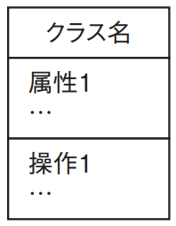

# 4-1-4 ソフトウェア方式設計・ソフトウェア詳細設計(译: 软件概要设计与详细设计)

- [4-1-4 ソフトウェア方式設計・ソフトウェア詳細設計(译: 软件概要设计与详细设计)](#4-1-4-ソフトウェア方式設計ソフトウェア詳細設計译-软件概要设计与详细设计)
  - [ソフトウェア品質(译: 软件质量)](#ソフトウェア品質译-软件质量)
  - [ソフトウェア設計手法(译: 软件设计方法)](#ソフトウェア設計手法译-软件设计方法)
  - [構造化設計(译: 结构化设计)](#構造化設計译-结构化设计)
  - [モジュール分割手法(译: 模块划分方法)](#モジュール分割手法译-模块划分方法)
  - [モジュール分割の基準(译: 模块划分的标准)](#モジュール分割の基準译-模块划分的标准)
  - [オブジェクト指向設計(译: 面向对象设计)](#オブジェクト指向設計译-面向对象设计)
    - [**クラス**(译: Class, 类)](#クラス译-class-类)
    - [**カプセル化**(译: Encapsulation, 封装)](#カプセル化译-encapsulation-封装)
    - [継承(**インヘリタンス**)(译: Inheritance, 继承)](#継承インヘリタンス译-inheritance-继承)
    - [多相性(**ポリモーフィズム**)(译: Polymorphism, 多态)](#多相性ポリモーフィズム译-polymorphism-多态)
    - [オブジェクトコンポジション(译: 对象组合)](#オブジェクトコンポジション译-对象组合)
  - [部品化と再利用(译: 构件化与复用)](#部品化と再利用译-构件化与复用)
  - [パターン(译: 模式)](#パターン译-模式)

## ソフトウェア品質(译: 软件质量)

- ソフトウェア製品の品質特性に関する規格
  - にJIS X 25010(ISO/IEC 25010)(システム及びソフトウェア製品の品質要求及び評価(**SQuaRE**)−システム及びソフトウェア品質モデル)
- JIS X 25010による, 要件定義やシステム設計の際の八つの品質特性と対応する品質副特性

  | システム/ソフトウェア製品品質 (JIS X 25010: 2013) | 品質副特性 | 説明 | 中文说明 |
  | - | - | -- | -- |
  | 機能適合性 | 機能完全性 機能正確性 機能適切性 | ニーズを満足させる機能を提供する度合い | 提供满足需求功能的程度 |
  | 性能効率性 | 時間効率性 資源効率性 容量満足性 | 資源の量に関係する性能の度合い | 与资源使用量相关的性能程度 |
  | 互換性 | 共存性 相互運用性 | 他の製品やシステムなどと情報交換できる度合い | 与其他产品或系统进行信息交换的能力 |
  | 使用性 | 適切度認識性 習得性 運用操作性 ユーザエラー防止性 ユーザインタフェース快美性 アクセシビリティ | 明示された利用状況で, 目標を達成するために利用できる度合い | 在特定使用条件下, 用户可完成目标的程度 |
  | **信頼性** | **成熟性** **可用性** **障害許容性(耐故障性)** **回復性** | 機能が正常動作し続ける度合い | 功能持续正常运行的程度 |
  | セキュリティ | 機密性 インテグリティ 否認防止性 責任追跡性 真正性 | システムやデータを保護する度合い | 保护系统与数据的能力 |
  | 保守性 | モジュール性 再利用性 **解析性** 修正性 試験性 | 保守作業に必要な努力の度合い | 系统维护所需工作量的程度 |
  | 移植性 | 適応性 設置性 置換性 | 別環境へ移してもそのまま動作する度合い | 在不同环境中可顺利迁移运行的程度 |

- 製品を利用するときの品質モデルについての五つの特性とに対応する副特性

  | 利用時の品質モデル | 品質副特性 | 説明 | 中文说明 |
  | - | - | -- | -- |
  | 有効性 |  | 目標を達成する上での正確さ及び完全さの度合い | 实现目标时的正确性与完整性的程度 |
  | 効率性 |  | 目標を達成するための正確さ及び完全さに関連して, 使用した資源の度合い | 实现目标的正确性与完整性所需资源的程度 |
  | **満足性** | 実用性 信用性 快感性 快適性 | 製品又はシステムが明示された利用状況において使用されるとき, 利用者ニーズが満足される度合い | 在明确使用场景中, 用户需求得到满足的程度 |
  | リスク回避性 | 経済リスク緩和性 健康・安全リスク緩和性 環境リスク緩和性 | 経済状況, 人間の生活又は環境に対する潜在的なリスクを緩和する度合い | 缓解经济, 人身安全或环境相关风险的程度 |
  | 利用状況網羅性 | 利用状況完全性 柔軟性 | 有効性, 効率性, リスク回避性及び満足性を伴って製品又はシステムが使用できる度合い | 产品或系统在各种使用场景中能保持有效性, 效率, 风险回避性和满意度的程度 |

- ⭐️ 例題: JIS X 25010 : 2013で規定されたシステム及びソフトウェア製品の品質副特性の説明のうち, 信頼性に分類されるものはどれか。
  - ア: 製品又はシステムが, それらを運用操作しやすく, 制御しやすくする属性をもっている度合い
  - イ: 製品若しくはシステムの一つ以上の部分への意図した変更が製品若しくはシステムに与える影響を総合評価すること, 欠陥若しくは故障の原因を診断すること, 又は修正しなければならない部分を識別することが可能であることについての有効性及び効率性の度合い
  - ウ: 中断時又は故障時に, 製品又はシステムが直接的に影響を受けたデータを回復し, システムを希望する状態に復元することができる度合い
  - エ: 二つ以上のシステム, 製品又は構成要素が情報を交換し, 既に交換された情報を使用することができる度合い

  > JIS X 25010 : 2013で規定された製品品質モデルには, 機能適合性, 信頼性, 性能効率性, 使用性, セキュリティ, 互換性, 保守性及び移植性の八つの特性がある。  
  このうち信頼性は, 成熟性, 可用性, 障害許容性(耐故障性), 回復性の四つの副特性の集合から構成される。  
  > 中断又は故障時にデータを回復し復元することは, 信頼性のうちの回復性に当たるので, ウが正解である。  
  > ア: 使用性のうちの運用操作性の説明である。  
  > イ: 保守性のうちの解析性の説明である。  
  > エ: 互換性のうちの相互運用性の説明である。

- <発展>
  - 品質特性の考え方は, 「すべての特性を満たすようにソフトウェアの品質を上げましょう」ではない。
    - 品質特性は, 信頼性と効率性といったトレードオフの関係になるもの, 満たすとコストがかかるものなど様々である。
    - 顧客の要望を聞き, どの品質特性を優先させるかを考えてシステムを設計することが肝心である。

## ソフトウェア設計手法(译: 软件设计方法)

- ソフトウェア設計手法
  - **構造化設計**: プロセス中心アプローチで主に使われる
  - **オブジェクト指向設計**: オブジェクト指向アプローチで使われる

## 構造化設計(译: 结构化设计)

- 構造化設計: 機能を中心にプログラムの構造を考える設計手法である。
- 機能分割を行い, **段階別詳細化**をすることで階層構造を作成する。
  - このとき, プログラムの最小単位であるモジュールにまで分割する。
- 構造化設計は, **構造化プログラミング**の考え方に基づいた設計手法である。
  - 構造化プログラム: **構造化定理**と呼ばれる「一つの入口と一つの出口をもつプログラムは, 順次・選択・反復の[三つの論理構造](../1-2アルゴリズムとプログラミング/1-2-2アルゴリズム.md#流れ図フローチャート译-流程图)によって記述できる」という考え方により, プログラム上の手続きをいくつかの単位に分け, モジュールに分割する。

## モジュール分割手法(译: 模块划分方法)

- 代表的なモジュールの分割手法

  | 分割手法 | 説明 | 中文说明 |
  | - | -- | -- |
  | STS(Source Transform Sink)分割 (译: 源-转换-汇分割) | $\bullet$ データの流れに着目する $\bullet$ データの入力処理(Source), データの変換処理(Transform), データの出力処理(Sink)の3種類のモジュールに分割する | 将功能分为输入(源), 转换处理和输出(汇)三部分进行模块化的方法 |
  | TR(Transaction)分割 (译: 事务分割) | $\bullet$ トランザクションの種類ごとに一つのモジュールにする $\bullet$ データの種類によってトランザクションが分かれる場合などにモジュール分割する手法である | 将由触发器引导分支的处理流程划分为"触发选择部分"和"处理执行部分"的方法 |
  | 共通機能分割 (译: 通用功能分割) | システム全体で同じような機能を洗い出し, それを共通機能としてモジュールにする手法である | 将多个模块中共同使用的功能整合成一个模块的划分方法 |
  | ジャクソン法とワーニエ法 (译: Jackson法与Warnier法) | $\bullet$ データの構造に着目する $\quad \bullet$ ジャクソン法: 入力データと出力データのデータ構造からプログラムの構造を求める $\quad \bullet$ ワーニエ法: 入力データのデータ構造を分析し, プログラムの論理構造図(ワーニエ図)を作成する | 基于数据结构或处理过程, 进行结构化程序设计的方法 |

## モジュール分割の基準(译: 模块划分的标准)

- モジュール分割を行った後のモジュールは, それぞれのモジュールの**独立性が高いほど良い**とされている。
- モジュールの独立性を高めることで
  - **保守性**が上がる: あるモジュールを変更してもほかへの影響が最小限にとどまるため
  - **再利用性**が上がる: 独立したモジュールは別のソフトウェアで利用しやすくなるため
- モジュールの独立性を確認する基準
  - **モジュール強度**
    - モジュール凝集度, 結束性とも呼ばれ, モジュール内の結び付きの強さを示す度合いである。
    - 七つの強度があり, **強いほど優れた設計**であると判断される。

      |  | モジュール強度 | 説明 | 中文说明 |
      | - | -- | -------- | -------- |
      | 強 | 機能的強度 (译: 功能内聚) | 一つの機能だけを実現するモジュール | 模块仅实现一个明确功能, 是最高级别的内聚形式 |
      | $\uparrow$ | 情報的強度 (译: 信息内聚) | 特定の**データ**を扱う複数の機能を一つのモジュールにまとめたもの | 将处理相同数据的多个功能组合成一个模块 |
      | $\mid$ | 連絡的強度 (译: 传递内聚) | モジュールの要素間で同じ**データの受渡しや参照**が行われるもの | 模块中的各部分通过数据传递或引用连接在一起 |
      | $\mid$ | 手順的強度 (译: 过程内聚) | **順番**に行う複数の機能をまとめたもの | 将需要按顺序执行的多个功能组合成一个模块 |
      | $\mid$ | 時間的強度 (译: 时间内聚) | 時間的に連続した複数の機能をまとめたもの | 将在相近时间执行的多个处理组合成一个模块, 如初始化, 清理等 |
      | $\downarrow$ | 論理的強度 (译: 逻辑内聚) | 論理的に関連のある複数の機能をまとめたもの | 将逻辑相关但功能不同的处理组合在一起, 通常通过条件选择执行某一部分 |
      | 弱 | 暗合的強度 (译: 偶然内聚) | 関係のない複数の機能をまとめたもの | 没有关联的多个功能被随意组合在同一个模块中, 是最低级别的内聚形式, 应避免 |

  - **モジュール結合度**
    - 二つのモジュール間の結合の度合いである。
    - 六つの強度があり, **弱いほど優れた設計**であると判断される。

      |  | モジュール結合度 | 説明 | 中文说明 |
      | - | -- | -------- | -------- |
      | 弱 | データ結合 (译: 数据耦合) | **単一データ**の変数を**引数**として受け渡すもの | 模块之间仅通过参数传递单个数据, 耦合度低, 推荐使用 |
      | $\uparrow$ | スタンプ結合 (译: 印章耦合) | **データ構造**(構造体, レコードなど)を**引数**として受け渡すもの | 模块之间通过参数传递整个数据结构(如结构体), 但未必都使用, 可能存在多余信息 |
      | $\mid$ | 制御結合 (译: 控制耦合) | **制御情報**を引数として与えるもの | 模块之间通过参数传递控制信息(如标志位), 影响被调用模块的执行路径 |
      | $\mid$ | 外部結合 (译: 外部耦合) | **単一データ**の変数を**グローバル変数**として宣言し, 参照するもの | 模块通过访问同一个全局变量中的单个数据项来进行通信, 耦合度较高 |
      | $\downarrow$ | 共通結合 (译: 公共耦合) | **データ構造**を**グローバル変数**として宣言し, 参照するもの | 多个模块共享整个全局数据结构, 修改易导致其他模块出错, 耦合度高 |
      | 強 | 内容結合 (译: 内容耦合) | ほかのモジュールの内部を直接参照しているもの | 一个模块直接访问另一个模块的内部实现(如变量, 指令), 耦合度最高, 严重违反模块化原则 |

- ⭐️ 例題: モジュール設計に関する記述のうち, モジュール強度(結束性)が最も強いものはどれか。
  - ア: ある木構造データを扱う機能をこのデータとともに一つにまとめ, 木構造データをモジュールの外から見えないようにした。
  - イ: 複数の機能のそれぞれに必要な初期設定の操作が, ある時点で一括して実行できるので, 一つのモジュールにまとめた。
  - ウ: 二つの機能A, Bのコードは重複する部分が多いので, A, Bを一つのモジュールにまとめ, A, Bの機能を使い分けるための引数を設けた。
  - エ: 二つの機能A, Bは必ずA, Bの順番に実行され, しかもAで計算した結果をBで使うことがあるので, 一つのモジュールにまとめた。

  > モジュール強度をそれぞれの選択肢で考えてみると, 次のようになる。  
  > ア: 同じデータ構造を扱うので, 情報的強度に関する記述である。  
  > イ: 同じ時点で行う動作をまとめたので, 時間的強度に関する記述である。  
  > ウ: 引数で手順を選択的に実行するので, 論理的強度に関する記述である。  
  > エ: 順番が決まっており, さらに同じデータを引き継いで使用するため, 連絡的強度に関する記述である。  
  > このうち, モジュール強度(結束性)が最も強いのは, アの情報的強度である。

## オブジェクト指向設計(译: 面向对象设计)

- オブジェクト指向: オブジェクト同士の相互作用としてシステムをとらえる考え方である。
- システムの静的な構造や動的な振舞い, システム間の協調などをモデル化して, プログラミングするための仕様を記述する。
- オブジェクト指向でシステム開発をすることによって, プログラムの**保守性と再利用性**を上げることができる。
- オブジェクト指向における代表的な考え方

### **クラス**(译: Class, 类)

- クラスは: オブジェクト指向の基本単位である。
- **属性**(プロパティ, 変数, データ)と**操作**(関数, メソッド)が記述される。
- クラス図では, クラス名と属性, 操作を表現される。 
- クラス自体は抽象的なデータ型で, クラスから生成した**インスタンス**(译: Instance, 实例)(オブジェクト)(译: Object, 对象)が実際の処理を行う。
- 对象的模板或蓝图, 定义了属性(成员变量)和行为(方法)。

### **カプセル化**(译: Encapsulation, 封装)

- カプセル化: クラスに定義された属性や操作にアクセス権を指定することで, クラスの外からのアクセスを制限すること。
- カプセル化を行うことで, 内部の属性や操作を変更してもクラスの外部には影響を与えずに済む。
- 将数据和操作封装在对象内部, 隐藏实现细节, 只暴露必要接口, 提高安全性和模块化。

### 継承(**インヘリタンス**)(译: Inheritance, 继承)

- 継承: あるクラスを基にして別のクラスを作ること。
- 継承の基となったクラスを**スーパクラス**(译:  Superclass, 超类), 継承してできたクラスを**サブクラス**(译: Subclass, 子类)という。
- 子类可以继承父类的属性和方法, 实现代码重用和功能扩展。

### 多相性(**ポリモーフィズム**)(译: Polymorphism, 多态)

- 多相性: 同一の呼出しに対して, 受け取った側のクラスの違いに応じて多様な振舞いを見せる性質である。
- 多態性, 多様性とも呼ばれる。
- 例: 「図形を描画する」という同じメソッドを呼び出しても, そのクラスが三角だったら△を描画し, 四角だったら□を描画するといったように, クラスによって別の振舞いを起こすような動作である。
- 同一个方法或对象在不同上下文中表现出不同的行为, 如方法重载与重写。
- <用語>
  - ポリモーフィズムの利用において, 実際に実装する技術は継承であり, スーパクラスとサブクラスを使用する。このとき, スーパクラスがそれ自体で処理を実行できないようにするため, スーパクラスはインスタンスをもてないように実装する。ここで利用するクラスが**抽象クラス**であり, 抽象クラスは, 継承してサブクラスを作成しないと, インスタンスを作成して実行することができない。

### オブジェクトコンポジション(译: 对象组合)

- オブジェクトコンポジション: オブジェクトをまとめる, あるいは取り込むことによって, より複雑な新しい機能を作ることである。
- 機能を再利用するための, 継承以外の方法である。
  - 継承: **is-a関係**(译: 是一个)
  - コンポジション: **has-a関係**(译: 有一个)
- **委譲**(译: Delegation, 委托): 取り込んだオブジェクトに処理を任せること。
- 通过组合其他对象来构建复杂对象, 实现功能复用, 是继承之外的重要设计手段。
- ⭐️ 例題: オブジェクト指向におけるインヘリタンスの説明はどれか。
  - ア: 幾つかのオブジェクトを集めて, これらを成分とするオブジェクトを作成する。
  - イ: オブジェクトのデータ構造や値を隠ぺいし, オブジェクトの外部から直接, 内部のデータにアクセスできないようにする。
  - ウ: 基底クラスで定義したデータ構造と手続をサブクラスで引き継いで使用する。
  - エ: 同一のデータ構造と同一の手続をもつオブジェクトをまとめて表現する。

  > オブジェクト指向におけるインヘリタンスは, 継承とも呼ばれ, 基底クラス(スーパクラス)で定義したデータ構造と手続をサブクラスで引き継いで使用する。  
  > したがって, ウが正解である。  
  > ア: オブジェクトコンポジションの説明である。  
  > イ: カプセル化の説明である。  
  > エ: クラスの説明である。

## 部品化と再利用(译: 构件化与复用)

- **部品化**: ソフトウェアは, モジュールなどの部品として作成することが可能であるのこと。
- ソフトウェアの部品化を行うと, 最初は通常の開発よりも工数がかかるが, 部品は**再利用**しやすいため, 2回目以降の開発の工数を削減することができる。
- 部品化の例: 標準ライブラリ関数やクラスライブラリなど
- 再利用の方法: るフレームワーク(アプリケーションの基本的な部分を提供する枠組みである)
- ⭐️ 例題: ソフトウェアの再利用の説明のうち, 適切なものはどれか。
  - ア: 再利用可能な部品の開発は, 同一規模の通常のソフトウェアを開発する場合よりも工数がかかる。
  - イ: 同一機能のソフトウェアを開発するとき, 一つの大きい部品を再利用するよりも, 複数の小さい部品を再利用する方が, 開発工数の削減効果は大きい。
  - ウ: 部品の再利用を促進するための表彰制度などによるインセンティブの効果は, 初期においては低いが, 時間の経過とともに高くなる。
  - エ: 部品を再利用したときに削減できる工数の比率は, 部品の大きさに反比例する。

  > ソフトウェアの再利用では, 再利用可能な部品の開発には, 同一規模の通常のソフトウェアを開発する場合よりも工数がかかる。しかし, それを再利用するときに工数が削減できるので, 似たようなシステムを何度も開発する場合には効率的である。  
  > したがって, アが正解である。  
  > イ, エ: 部品が大きい方が, 開発工数の削減効果が大きく, また, 削減できる工数の比率も高くなる。  
  > ウ: 再利用を促進するインセンティブ(译: Incentive, 激励)の効果は, まだ慣れておらず, やりたがる人が少ない初期の頃の方が高くなる。

## パターン(译: 模式)

- 再利用は単なる部品だけでなく, ソフトウェアの設計や構造など, さらに大きな単位で考えられるようになった。
- **デザインパターン**(译: Design Pattern, 设计模式): 設計のノウハウを集結させて再利用を可能にした。
- **アーキテクチャパターン**(译: Architecture, 架构模式): ソフトウェアの構造(アーキテクチャ)に関するパターンを集約している。
  - MVC(Model View Controller)
    - 機能を業務ロジック(Model), 画面出力(View), それらの制御(Controller)の三つのコンポーネントに分けていく。
- <発展>
  - デザインパターンの有名なものには, GoF(Gang of Four)と呼ばれる4人が作成した23個のパターンがある。アーキテクチャパターンの有名なものには, MVCのほかにPOSA(Patterns Oriented Software Architecture)がある。これらのパターンを使うことで, オブジェクト指向での開発を効率的に行うことができ, プログラムの状態を会話で説明することが容易になる。
