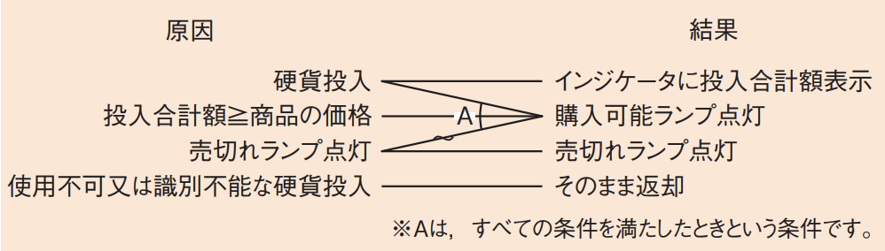

# 4-1-5 ソフトウェア構築(译: 软件构建)

- [4-1-5 ソフトウェア構築(译: 软件构建)](#4-1-5-ソフトウェア構築译-软件构建)
  - [ソフトウェアユニットの作成(译: 软件单元的编写)](#ソフトウェアユニットの作成译-软件单元的编写)
  - [ソフトウェアユニットのテスト(译: 软件单元的测试)](#ソフトウェアユニットのテスト译-软件单元的测试)
  - [テストの手法(译: 测试方法)](#テストの手法译-测试方法)
    - [ホワイトボックステスト(译: 白盒测试)](#ホワイトボックステスト译-白盒测试)
      - [制御パステスト(译: 控制路径测试)](#制御パステスト译-控制路径测试)
      - [データフロー・パステスト(译: 数据流路径测试)](#データフローパステスト译-数据流路径测试)
    - [ブラックボックステスト(译: 黑盒测试)](#ブラックボックステスト译-黑盒测试)
      - [**同値分割**(译: 等价类划分)](#同値分割译-等价类划分)
      - [**限界値分析**(译: 边界值分析)](#限界値分析译-边界值分析)
      - [**決定表**(デシジョンテーブル)(译: 决策表)](#決定表デシジョンテーブル译-决策表)
      - [**原因・結果グラフ**(译: 因果图)](#原因結果グラフ译-因果图)
  - [メトリクス計測(译: 度量指标的测量)](#メトリクス計測译-度量指标的测量)

---

- ソフトウェア構築プロセスでは, ソフトウェアユニットとデータベースを実際に作成し, そのユニットごとのテストを行う。
- 具体的には
  1. ソフトウェアユニットとデータベースの作成及びテスト手順とテストデータの作成
  2. ソフトウェアユニットとデータベースのテストの実施
  3. 利用者文書の更新
  4. ソフトウェア結合テスト要求事項の更新
  5. ソフトウェアコード及びテスト結果の評価を実施する
- <関連>
  - [ソフトウェアコード作成で使用するプログラム言語](../1-2アルゴリズムとプログラミング/1-2-4プログラム言語.md)
  - [コード作成やテストで使用するツール](../2-3ソフトウェア/2-3-4開発ツール.md)

## ソフトウェアユニットの作成(译: 软件单元的编写)

- ソフトウェアユニットの作成において, それぞれが好き勝手にコードを書くと, 形式が統一されず読みにくくなってしまいます。そこで, あらかじめ**コーディング基準**を決め, コードの形式を揃えておく。また, **コーディング支援手法**にも様々なものがある。
- <発展>
  - **コーディング支援手法**: ソフトウェアコードの作成を簡易にするための手法, またはツールである。
    - 例えば, 開発ソフトに組み込むツールを使用し, 定型文を簡略化してコーディングする手法や, コピー＆ペーストで使えるコードをまとめたスニペット集を利用するなどの手法がある。

## ソフトウェアユニットのテスト(译: 软件单元的测试)

- ソフトウェアユニットのテストは, ソフトウェア詳細設計で定義したテスト仕様に従って行い, 要求事項を満たしているかどうかを確認する。
- モジュール(ソフトウェアユニット)単体でのテストになるので, ほかのモジュールと関連する部分に次のような仮のモジュールを用意する。
  - **ドライバ**(译: Driver, 驱动模块): テストするモジュールの**上位モジュール**が未完成の場合, つまり, そのモジュールを呼び出すモジュールが未完成の場合の仮のモジュールのこと。
  - **スタブ**(译: Stub, 桩模块): テストするモジュールの**下位モジュール**が未完成の場合, つまり, そのモジュールから呼び出すモジュールが未完成の場合のモジュールのこと。
- ⭐️ 例題: テスト工程におけるスタブの利用方法に関する記述として, 適切なものはどれか。
  - ア: 指定した命令が実行されるたびに, レジスタや主記憶の一部の内容を出力することによって, 正しく処理が行われていることを確認する。
  - イ: トップダウンでプログラムのテストを行うとき, 作成したモジュールをテストするために, 仮の下位モジュールを用意して動作を確認する。
  - ウ: プログラムの実行中, 必要に応じて変数やレジスタなどの内容を表示し, 必要であればその内容を修正して, テストを継続する。
  - エ: プログラムを構成するモジュールの単体テストを行うとき, そのモジュールを呼び出す仮の上位モジュールを用意して, 動作を確認する。

  > スタブとは, 作成したモジュールをテストするために用意された仮の下位モジュールのことである。  
  > したがって, イが正解である。  
  > ア: スナップショットダンプ(译: Snapshot Dump, 快照转储)の説明である。  
  > ウ: 開発ツールなどで用いられるエディットコンティニュ(译: Edit & Continue, 编辑并继续)の説明である。  
  > エ: ドライバの説明である。

## テストの手法(译: 测试方法)

- テストの手法は, ホワイトボックステストとブラックボックステストの2種類に大別される。
  - ホワイトボックステスト(译: White-box Testing, 白盒测试): ソースコードなどのシステム内部の構造を理解した上で行うテストである。
  - ブラックボックステスト(译: Black-box Testing, 黑盒测试): 外部から見て仕様書どおりの機能をもつかどうかをテストするものである。
- それぞれの代表的なテスト設計手法

### ホワイトボックステスト(译: 白盒测试)

- 基于程序内部逻辑结构进行测试, 要求了解代码实现。

#### 制御パステスト(译: 控制路径测试)

- プログラム中のソースコードがすべて実行されるようにテストデータを与えるテストである。
- 最も代表的なホワイトボックスのテスト設計手法で, どの程度のソースコードが網羅されたかを**カバレッジ**(網羅率)(译: Coverage, 覆盖率)で示す。
- テストする経路によって, 様々な網羅方法がある。

  | 網羅方法 | 説明 | 中文说明 |
  | - | -- | -- |
  | **命令網羅** (译: 语句覆盖(命令覆盖)) | すべての**命令**を最低1回は実行するように設計する | 确保程序中的每一行语句至少执行一次。最基本的覆盖方式 |
  | **判定条件網羅**(分岐網羅) (译: 分支覆盖) | すべての**分岐**で, その**分岐経路のすべて**を1回は実行するように設計する | 确保每个判断(if等)的真值和假值都被执行一次 |
  | **条件網羅** (译: 条件覆盖) | $\bullet$ すべての**条件**で, その**可能な結果のすべて**を1回は実行するように設計する $\bullet$ 判定条件網羅との違い $\quad \bullet$ 例: `if ( a > 0 and b > 0 )`の命令があったとき $\quad \bullet$ 判定条件網羅: andで合わせた全体が真か偽かを考える $\quad \bullet$ 条件網羅: それぞれの条件, つまり`a > 0`や`b > 0`のそれぞれについて真偽を考える | 针对复合条件表达式中的每一个子条件, 分别测试其为真和为假的情况 |
  | **判定条件・条件網羅** (译: 判定/条件覆盖) | 判定条件網羅と条件網羅の両方を満たすように設計する | 同时满足"判定覆盖"与"条件覆盖"的测试方法。更全面 |
  | **複数条件網羅** (译: 多条件覆盖(MC/DC)) | $\bullet$ すべての条件判定の**組合せ**を網羅するように設計する。 $\bullet$ テストケースの数は最も多くなる。 | 覆盖所有子条件的**真/假组合**, 用于高安全要求场景(如航空软件) |
  | **経路組合せ網羅(経路網羅)** (译: 路径覆盖) | すべての**経路**を最低1回は実行するように設計する | 测试程序中所有可能的执行路径。理论上最彻底, 但在复杂程序中难以完全实现 |

- 检查所有可能的执行路径是否都被测试, 例如判断语句的各个分支。

#### データフロー・パステスト(译: 数据流路径测试)

- 制御部分ではなく使用されるデータに焦点を当てて行うテストである。
- ソースコード内で扱うデータや変数について, 定義 → 生成 → 使用 → 消滅の各ステップが正しく順番どおりに行われているかを調べる。
- 关注变量的**定义, 使用, 销毁**等过程, 测试变量是否正确流动, 无死变量或未初始化使用。

### ブラックボックステスト(译: 黑盒测试)

- 只看输入与输出, 不考虑程序内部结构, 模拟用户视角进行测试。

#### **同値分割**(译: 等价类划分)

- 入力値と出力値を, システムとして動作が同じと見なせる値の範囲(**同値クラス**)に分類し, 各同値クラスを代表する値に対してテストを行う方法である。
- 将输入划分为有代表性的"等价类", 从每类中选一个代表测试, 减少测试用例数量。

#### **限界値分析**(译: 边界值分析)

- 同値クラスの両端の値(境界値)をテストする方法である。
- エラーは分岐の境界で起こりやすいので, そこを重点的にテストする。
- 测试"最大值, 最小值, 刚好有效, 刚好无效"等**边界上的输入值**, 因为错误最常发生在边界附近。

#### **決定表**(デシジョンテーブル)(译: 决策表)

- 考慮すべき条件と, その条件に対する結果のマトリックスを作成する方法である。
主に, テスト項目を作成するために用いられる。
- 将**条件与其对应的动作(结果)**列成表格, 系统性覆盖所有逻辑组合, 适合处理复杂规则判断。

#### **原因・結果グラフ**(译: 因果图)

- 入力と出力の関係を表す以下のような図や表を作成し, テストを行う方法である。
- 図: 原因・結果グラフの例 
- 将**输入条件(原因)与预期动作(结果)**之间的关系图形化, 适合转换为决策表使用, 帮助发现遗漏的组合逻辑。

- ⭐️ 例題: ホワイトボックステストのテストケースを設計する際に使用するものはどれか。
  - ア: 原因−結果グラフ
  - イ: 限界値分析
  - ウ: 条件網羅
  - エ: 同値分割

  > ホワイトボックステストに分類されるのは, 制御パステストの一つであるウの条件網羅である。  
  > したがって, ウが正解である。  
  > ア, イ, エ: ブラックボックステストに分類される。

## メトリクス計測(译: 度量指标的测量)

- **メトリクス計測**: ソフトウェアの品質を評価するために, ツールなどを使い, 客観的な指標を計測すること。
- メトリクス計測では, 関数やクラスの**モジュール強度**や**モジュール結合度**, **分岐**の数, アクセス率などを計測することで, ソフトウェアの弱点を具体的に把握することができる。
