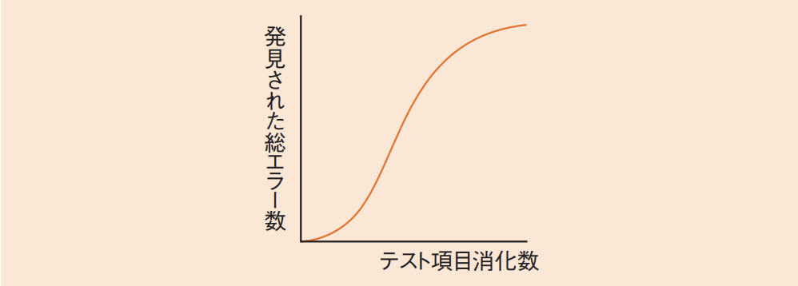

# 4-1-6 ソフトウェア結合・ソフトウェア適格性確認テスト(译: 软件集成与软件适格性确认测试)

- [4-1-6 ソフトウェア結合・ソフトウェア適格性確認テスト(译: 软件集成与软件适格性确认测试)](#4-1-6-ソフトウェア結合ソフトウェア適格性確認テスト译-软件集成与软件适格性确认测试)
  - [テストの管理手法(译: 测试的管理方法)](#テストの管理手法译-测试的管理方法)
    - [**信頼度成長曲線(ゴンペルツ曲線)**(译: 可靠性增长曲线(Gompertz曲线))](#信頼度成長曲線ゴンペルツ曲線译-可靠性增长曲线gompertz曲线)
    - [管理図(译: 控制图)](#管理図译-控制图)
    - [**エラー埋込法**(译: 错误注入法)](#エラー埋込法译-错误注入法)

---

- ソフトウェア結合プロセス: ソフトウェアユニットやソフトウェアコンポーネントを結合し, 結合が完了したらテストを行う。
- ソフトウェア適格性確認テストのプロセス: ソフトウェア品目が適格性確認要求事項に従っているかどうかのテストを行う。

## テストの管理手法(译: 测试的管理方法)

- テストの実行後には, テストの結果を分析して管理する必要がある。
- テストを管理する方法

### **信頼度成長曲線(ゴンペルツ曲線)**(译: 可靠性增长曲线(Gompertz曲线))

- **ソフトウェア信頼度成長モデル**(译: Software Reliability Growth Model, 软件可靠性增长模型): ソフトウェア開発のテスト工程では, エラー(バグ)を発見して修正する作業が順次行われるので, テスト項目の消化とともに, 発見されるエラーの増加割合は減少していくこと。
- **信頼度成長曲線(ゴンペルツ曲線)**: 総エラー数の増加度合いは, 経験的に次図のような曲線に従う。
  - 図: 信頼度成長曲線(ゴンペルツ曲線) 
- テスト項目に対して発見される総エラー数がこの曲線に沿わない場合はテストに問題があると見なし, 検討する。発見されるエラー数が少なすぎる場合は, プログラムの品質が高いことも考えられるが, テストケースが適切でないという疑いもある。発見された総エラー数が上図の曲線のように収束に向かっていくことをテスト終了の要件にすることも多いである。
- 在软件测试过程中, 根据发现的缺陷数随时间的变化情况, 绘制出**缺陷检出趋势曲线**, 预测软件可靠度的增长程度。
- Gompertz曲线是一种S形曲线, 初期缓慢, 中期快速, 后期趋缓, 常用于估算剩余缺陷。

### 管理図(译: 控制图)

- バグの管理では, 時間の経過に伴うバグ検出数や未消化テスト項目数, 未解決バグ数をプロットし, **バグ管理図**を作成する。
- 未消化テスト項目数と累積誤り検出数を並記する**テスト工程品質管理図**を作成することもある。
- 源自统计过程控制(SPC), 用于监控测试过程的质量是否处于可控状态。可通过绘制测试指标(如缺陷数, 处理时间)变化, 识别是否存在异常波动。

### **エラー埋込法**(译: 错误注入法)

- プログラムに意図的にエラーを埋め込んだ状態でテストを行う方法である。
- 埋込みエラーと真のエラーは同じ割合で発見されるという仮定の下, 発見された埋込エラー数から, まだ発見されていない真のエラー数を推測する。
- 人为在程序中注入已知错误, 然后通过测试检出这些错误的比例, 来推测**未知真实错误**的可能数量, 进而评估测试的充分性。适用于评估"错误漏检率"。
- ⭐️ 例題: エラー埋込み法による残存エラーの予測において, テストが十分に進んでいると仮定する。当初の埋込みエラーは48個である。テスト期間中に発見されたエラーの内訳は, 埋込みエラーが36個, 真のエラーが42個である。このとき, 残存する真のエラーは何個と推定されるか。
  - ア: 6
  - イ: 14
  - ウ: 54
  - エ: 56

  > 埋込みエラー数と真のエラー数を, 発見されたエラー数と残存エラーに分けて計算すると以下のようにまとめられる。
  >
  > |  | 埋込みエラー数 | 真のエラー数 |
  > | - | - | - |
  > | 発見されたエラー | 36 | 42 |
  > | 残存エラー | 12(= 48 - 36) | ? |
  >
  > 埋込みエラーと真のエラーで残存エラーの割合が同じだとすると, 残存する真のエラー数は, $12 \times (42 / 36) = 14$となる。  
  > したがって, イが正解である。
