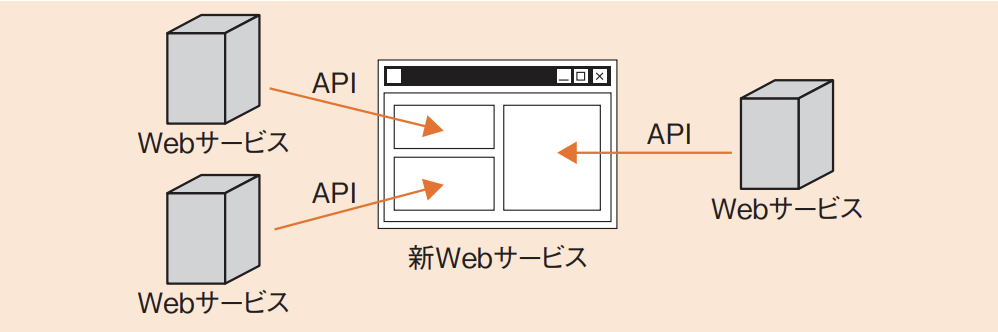

# 4-2-1 開発プロセス・手法(译: 开发流程与方法)

- [4-2-1 開発プロセス・手法(译: 开发流程与方法)](#4-2-1-開発プロセス手法译-开发流程与方法)
  - [ソフトウェア開発モデル(译: 软件开发模型)](#ソフトウェア開発モデル译-软件开发模型)
  - [アジャイル開発の手法(译: 敏捷开发方法)](#アジャイル開発の手法译-敏捷开发方法)
    - [XP(エクストリームプログラミング)(译: 极限编程)](#xpエクストリームプログラミング译-极限编程)
    - [スクラム(译: Scrum)](#スクラム译-scrum)
    - [リーンソフトウェア開発(译: 精益软件开发)](#リーンソフトウェア開発译-精益软件开发)
  - [ソフトウェアライフサイクルプロセス(译: 软件生命周期流程)](#ソフトウェアライフサイクルプロセス译-软件生命周期流程)
  - [プロセス成熟度(译: 流程成熟度)](#プロセス成熟度译-流程成熟度)
  - [リバースエンジニアリング(译: 逆向工程)](#リバースエンジニアリング译-逆向工程)
  - [マッシュアップ(Mashup)(译: 混搭开发(Mashup))](#マッシュアップmashup译-混搭开发mashup)

## ソフトウェア開発モデル(译: 软件开发模型)

- ソフトウェア開発モデル: ソフトウェア開発の効率化や品質向上のために用いられる。
- 代表的なもの

  | 開発モデル | 説明 | 中文说明 |
  | - | -- | -- |
  | **ウォーターフォールモデル** (译: Waterfall Model, 瀑布模型) | $\bullet$ 最も一般的な, 古くからある開発モデルである $\bullet$ 開発プロジェクトを時系列に, 「要件定義」「設計」「プログラミング」「テスト」というかたちでいくつかの作業工程に分解し, それを順番に進めていく $\bullet$ なるべく後戻りしないように, 各工程の最後にレビューを行うなどして信頼性を上げる | 开发流程呈现"瀑布式"线性结构, 阶段清晰但缺乏灵活性, 适用于需求明确的项目 |
  | プロトタイピングモデル (译: Prototyping Model, 原型模型) | 開発の早い段階で試作品(プロトタイプ)を作成し, それをユーザが確認し評価することで, システムの仕様を確定していく方法 | 通过制作原型与用户反复沟通, 逐步明确需求, 适用于需求不明确时 |
  | **スパイラルモデル** (译: 螺旋模型) | $\bullet$ システム全体をいくつかの部分に分け, 分割した単位で開発のサイクルを繰り返す $\bullet$ **ラウンドトリップ**(译: Round Trip, 往返式): その発展形で, オブジェクト指向開発において, 分析と設計, プログラミングを何度か行き来しながらトライアンドエラーで完成させていく | 结合原型与瀑布模型, 强调"风险评估"与"反复迭代", 适用于大型复杂项目 |
  | RAD(Rapid Application Development) (译: 快速应用开发模型) | $\bullet$ "早く, 安く, 高品質"を目的とした短期のシステム開発の手法である $\bullet$ CASEツールや開発ツールなどを活用し, プログラム作成を半自動化する | 通过原型, 工具等手段加快开发速度, 适用于对速度要求高的系统 |
  | **アジャイル開発** (译: Agile Software Development, 敏捷开发) | $\bullet$ 迅速に無駄なくソフトウェア開発を行う手法の総称である $\bullet$ 代表的な手法にXP(eXtreme Programming)やスクラムがある | 强调迭代, 小步快跑, 持续反馈, 适合需求频繁变化的项目 |
  | インクリメンタルモデル (译: Incremental Model, 增量模型) | $\bullet$ 大きなシステムをいくつかの独立性の高いサブシステムに分け, そのサブシステムごとに開発, リリースしていく手法である $\bullet$ 段階的にリリースするので, すべての機能がそろっていなくてもシステムの動作を確認できる | 将系统分解为多个部分, 逐步实现和交付, 适用于需求可拆分项目 |
  | エボリューショナルモデル (译: Evolutionary Model, 演化模型) | $\bullet$ 開発プロセスの一連の作業を複数回繰り返し行う $\bullet$ 要求に従ってソフトウェアを作成してその出来を評価し, 改訂された要求に従って再度ソフトウェアを作成する, という作業を繰り返する $\bullet$ **成長モデル**, **進化型モデル**ともいう | 通过不断完善和演进的方式逐步构建系统, 适合需求动态变化项目 |
  | DevOps (译: DevOps模式) | $\bullet$ 開発担当者と運用担当者が連携して協力する開発手法である $\bullet$ 開発(Development)と運用(Operations)の合成語である | 融合开发与运维, 强调自动化, 协作与持续交付, 提升交付效率与质量 |

## アジャイル開発の手法(译: 敏捷开发方法)

- アジャイル開発は: 迅速かつ適応的にソフトウェア開発を行う軽量な開発手法で, 従来の開発手法とは考え方に違いがある。
- 価値について, **アジャイルソフトウェア開発宣言**
  - プロセスやツールよりも個人と対話を(译: 重视个人与交流, 高于流程与工具)  → 软件开发的成功依赖于开发者之间良好的沟通, 而非过度依赖工具和规范流程。
  - 包括的なドキュメントよりも動くソフトウェアを(译: 重视可运行的软件, 高于详尽的文档)  → 文档是必要的, 但更重要的是交付可以运行的功能。
  - 契約交渉よりも顧客との協調を(译: 重视与客户的协作, 高于合同谈判)  → 项目应以客户满意为目标, 灵活协作优于死板条款。
  - 計画に従うことよりも変化への対応を(译: 重视响应变化, 高于遵循计划)  → 在不断变化的环境中, 灵活应对比严格执行原计划更能保证成功。
- アジャイル開発の代表的な手法

### XP(エクストリームプログラミング)(译: 极限编程)

- Extreme Programming
- 事前計画よりも柔軟性を重視する, 難易度の高い開発や状況が刻々と変わるような開発に適した手法である。
- 五つの価値
  - コミュニケーション
  - シンプル
  - フィードバック
  - 勇気
  - 尊重
- 代表的なプラクティス(習慣, 実践)(译: Practice, 练习, 习惯, 实践)

  | プラクティス | 説明 | 中文说明 |
  | - | -- | -- |
  | **イテレーション** (译: Iteration, 迭代) | $\bullet$ アジャイル開発を繰り返す単位 $\bullet$ 短いサイクルで繰り返すことで, 反復し, 柔軟に対処しながら開発を行う | 一次完整的开发周期, 如Scrum的Sprint, 通常为1~4周 |
  | **ペアプログラミング** (译: Pair Programming, 双人编程) | $\bullet$ 二人一組で実装を行い, 一人がコードを書き, もう一人がそれをチェックしナビゲートする手法である $\bullet$ 二人のペアを変えながら開発を行うことで, コミュニケーションを円滑にする $\bullet$ 教育的な効果もある | 两人协作编程, 一人编码一人审查, 提升质量与知识共享 |
  | **テスト駆動開発** (译: TDD(Test-Driven Development), 测试驱动开发) | 実装より先にテストを作成する | 编写测试 → 编写代码 → 重构, 提升设计质量与可测试性 |
  | **リファクタリング** (译: Refactoring, 重构) | 完成済のコードを, 動作を変更させずに改善する | 在不改变程序外部行为的前提下, 改善内部结构 |
  | **継続的インテグレーション** (译: CI(Continuous Integration), 持续集成) | $\bullet$ 品質改善や納期短縮のための習慣である $\bullet$ 開発者がソースコードの変更を頻繁にリポジトリに登録し, ビルドとテストを定期的に実行することで, テストの効率化や段階的な機能追加を実現できる | 多人协作下频繁合并代码, 配合自动构建与测试 |
  | **バーンダウンチャート** (译: Burndown Chart, 燃尽图) | $\bullet$ 時間と作業量の関係をグラフ化したものである $\bullet$ プロジェクトの状況を可視化することができる | 用于显示剩余工作随时间递减的趋势, 监控迭代进度 |
  | **レトロスペクティブ**(ふりかえり) (译: Retrospective, 迭代回顾) | イテレーションごとにチームの作業方法を見返し, 作業を改善していく手法である | 每次迭代结束后的团队反思会议, 提出持续改进点 |

- 是一种重视代码质量与开发效率的敏捷开发手法
- 通过将"好的开发实践"做到极致来应对快速变化的需求
- ⭐️ 例題: アジャイル開発などで導入されている"ペアプログラミング"の説明はどれか。
  - ア: 開発工程の初期段階に要求仕様を確認するために, プログラマと利用者がペアとなり, 試作した画面や帳票を見て, 相談しながらプログラムの開発を行う。
  - イ: 効率よく開発するために, 2人のプログラマがペアとなり, メインプログラムとサブプログラムを分担して開発を行う。
  - ウ: 短期間で開発するために, 2人のプログラマがペアとなり, 交互に作業と休憩を繰り返しながら長時間にわたって連続でプログラムの開発を行う。
  - エ: 品質の向上や知識の共有を図るために, 2人のプログラマがペアとなり, その場で相談したりレビューしたりしながら, 一つのプログラムの開発を行う。

  > ペアプログラミングとは, 2人のプログラマがペアとなり開発を行う手法である。2人で分担するのではなく, 一つのプログラムを一緒に開発していく。一方がプログラミングを行っているときに他方がレビューを行ったり, 相談を行うことなどで, 品質の向上や知識の共有を図ることができる。  
  > したがって, エが正解である。  
  > ア: 利用者とプログラマは要求仕様の確認を一緒に行うことはあるが, プログラムの開発は行わない。  
  > イ 分担して行うプログラミングであり, ペアプログラミングではない。  
  > ウ 交代でプログラミングを行う作業は, ペアプログラミングではない。

### スクラム(译: Scrum)

- 開発チームが一体となって, 共通のゴールに向けて働くことを目的とした方法論である。
- プロジェクトの途中で, 顧客が要求や必要事項を変えられるということを想定している。
- スクラムでは, プロダクトオーナー, 開発チーム, スクラムマスターという三つの役割から**スクラムチーム**を形成する。
  - **プロダクトオーナー**(译: Product Owner, 产品负责人): 作成するプロダクトに最終的に責任をもつ人になる。
  - スクラムマスター(译: Scrum Master, 敏捷教练):プロジェクトの推進に責任をもつ人になる。
- **スプリント**(译: Sprint): スクラムの工程の単位である。
  - 開発, まとめ, レビュー, 調整などの作業を繰り返す。
- プロダクトバックログ, スプリントバックログという2種類の**バックログ**(译: Backlog, 代办清单)を作成し, 製品に必要な要素や, スプリントで実現する仕様をまとめて管理する。
- 以"迭代增量"方式推进项目, 每个短周期称为スプリント(Sprint)
- 强调团队自组织, 透明沟通与持续交付
- ⭐️ 例題: アジャイル開発手法の説明のうち, スクラムのものはどれか。
  - ア: コミュニケーション, シンプル, フィードバック, 勇気, 尊重の五つの価値を基礎とし, テスト駆動型開発, ペアプログラミング, リファクタリングなどのプラクティスを推奨する。
  - イ:  推測(プロジェクト立上げ, 適応的サイクル計画), 協調(並行コンポーネント開発), 学習(品質レビュー, 最終QA /リリース)のライフサイクルをもつ。
  - ウ: プロダクトオーナなどの役割, スプリントレビューなどのイベント, プロダクトバックログなどの作成物, 及びルールから成るソフトウェア開発のフレームワークである。
  - エ: モデルの全体像を作成した上で, 優先度を付けた詳細なフィーチャリストを作成し, フィーチャを単位として計画し, フィーチャ単位に設計と構築を繰り返す。

  > アジャイル開発手法でのスクラムとは, チームで開発を行うためのプロセスのフレームワークである。プロダクトオーナなどの役割や, スプリントレビューなどのイベント, プロダクトバックログなどの作成物, ルールなどが含まれている。  
  > したがって, ウが正解である。  
  > ア: XP(eXtreme Programming)で提唱される価値やプラクティスの説明である。  
  > イ: ASD(Adaptive Software Development)(译: 自适应软件开发)の説明である。  
  > エ: FDD(Feature Driven Development)(译: 特征驱动的开发)の説明である。

### リーンソフトウェア開発(译: 精益软件开发)

- Lean Software Development
- 製造業の現場から生まれた考え方をアジャイル開発のプラクティスに適用したものである。
- 七つの原則を重視しながら開発を進めていく。

  | 七つの原則 | 説明 | 说明 |
  | - | -- | -- |
  | ムダをなくす | ムダを排除する | 消除浪费 Eliminate Waste |
  | 品質を作り込む | 最初から品質を内在化 | 内建质量 Build Quality In |
  | 知識を作り出す | 学習を促進する | 创造知识 Build Quality In / Amplify Learning |
  | 決定を遅らせる | 適切なタイミングで決定する | 延迟决策 Defer Commitment |
  | 早く提供する | すばやくデリバリする  | 尽早交付 Deliver as Fast as Possible |
  | 人を尊重する | チームと個人を尊重する | 尊重员工 Respect People |
  | 全体を最適化する | チーム全体の最適化 | 全面优化 Optimize the Whole |

## ソフトウェアライフサイクルプロセス(译: 软件生命周期流程)

- SLCP(Software Life Cycle Process: ソフトウェアライフサイクルプロセス): ソフトウェアの開発プロジェクトにおいて, 取得者(発注者)と供給者(受注者)の間で開発作業についての誤解が生じないように, ソフトウェア開発に関連する作業内容を詳細に規定したものである。
- 現在のバージョンは**SLCP-JCF2013**で, ISO/IEC 12207(JIS X 0160)を包含しており, 共通フレーム2013とも呼ばれる。

## プロセス成熟度(译: 流程成熟度)

- **CMMI**(Capability Maturity Model Integration: 能力成熟度モデル統合)(译: 能力成熟度模型集成): 開発と保守のプロセスを評価, 改善するために, システム開発組織のプロセスの成熟度をモデル化したものである。
- CMMIでは, 組織を次の5段階のプロセス成熟度モデルに照らし合わせ, 等級をつけて評価する。

  | CMMIのレベル | 段階| 説明 | 中文说明 |
  | - | - | ---- | ---- |
  | レベル1 | **初期** (译: 初始级) | $\bullet$ 場当たり的で秩序がない状態 $\bullet$ 成功は, 担当する人員の力量に依存する | 开发过程混乱无序, 结果完全依赖个人能力而非组织流程。成功无法复制 |
  | レベル2 | **管理された** (译: 可管理级)  | $\bullet$ 基本的なプロジェクト**管理**が確実に行われる状態 $\bullet$ 反復可能 | 具备项目管理机制, 可在类似项目中重复使用流程, 基本可控 |
  | レベル3 | **定義された** (译: 已定义级) | 標準の**開発プロセス**があり, 利用されている状態 | 组织有统一, 标准的软件开发流程, 并在多个项目中实施应用 |
  | レベル4 | **定量的に管理された** (译: 量化管理级) | 品質と実績のデータをもち, プロセスの実情を**定量的**に把握している状態 | 通过数据衡量质量和效率, 流程受到量化控制, 具备可预测性 |
  | レベル5 | **最適化している** (译: 优化级) | プロセスの状態を**継続的に改善**するための仕組みが備わっている状態 | 在量化基础上追求持续改进, 不断优化流程, 推动组织成长与创新 |

- ⭐️ 例題: CMMIの説明はどれか。
  - ア: ソフトウェア開発組織及びプロジェクトのプロセスの成熟度を評価するためのモデルである。
  - イ: ソフトウェア開発のプロセスモデルの一種である。
  - ウ: ソフトウェアを中心としたシステム開発及び取引のための共通フレームのことである。
  - エ: プロジェクトの成熟度に応じてソフトウェア開発の手順を定義したモデルである。

  > CMMI(Capability Maturity Model Integration)とは, ソフトウェア開発の成熟度をレベル1 ~ 5の5段階で表したモデルである。ソフトウェア開発組織などでプロセスの成熟度を評価するのである。  
  > したがって, アが正解である。  
  > イ: ウォーターフォールモデル, スパイラルモデルなどが該当する。  
  > ウ: 共通フレーム2013などが該当する。  
  > エ: OPM3(Organizational Project Management maturity model 3)(译: 组织项目管理成熟度模型)などのプロジェクトマネジメントの成熟度モデルがある。

## リバースエンジニアリング(译: 逆向工程)

- **リバースエンジニアリング**: ソフトウェアの動作を解析するなどして構造を分析し, ソースコードを明らかにすることである。
- オブジェクトコードをソースコードに変換する**逆コンパイラ**(译: Decompiler, 反编译器)や, 関数の呼出関係を表現したグラフである**コールグラフ**(译: Call Graph, 函数调用图)などを使用して解析する。
- リバースエンジニアリングを行い, 元のソフトウェア権利者の許可なくソフトウェアを開発, 販売すると, 元のソフトウェアの**知的財産権を侵害**するおそれがある。また, 利用許諾契約によってはリバースエンジニアリングを禁止している場合もあるので注意が必要である。

## マッシュアップ(Mashup)(译: 混搭开发(Mashup))

- **マッシュアップ**: 複数の提供者によるAPI(Application Programming Interface)を組み合わせることで新しいサービスを提供する技術である。
- 主にWebプログラミングで用いられており, 複数のWebサービスのAPIを組み合わせて, あたかも一つのWebサービスのように提供する。
- 図: マッシュアップのイメージ 
- <発展>
  - マッシュアップの具体例としては, Google Mapsの地図情報を活用し, 地図を表示しながら店舗や観光地の口コミ情報を掲載するサイトなどがある。GoogleやAmazon, Yahoo!などで公開されているAPIを用いることで, 様々なWebサービスを簡単に組み合わせることができる。
- ⭐️ 例題: マッシュアップに該当するものはどれか。
  - ア: 既存のプログラムから, そのプログラムの仕様を導き出す。
  - イ: 既存のプログラムを部品化し, それらの部品を組み合わせて, 新規プログラムを開発する。
  - ウ: クラスライブラリを利用して, 新規プログラムを開発する。
  - エ: 公開されている複数のサービスを利用して, 新たなサービスを提供する。

  > マッシュアップとは, 公開されている複数のサービスを利用して新たなサービスを提供することである。  
  > したがって, エが正解である。  
  > ア: リバースエンジニアリングである。  
  > イ, ウ: コンポーネント指向のソフトウェアコンポーネント(部品)を用いたプログラミングである。
