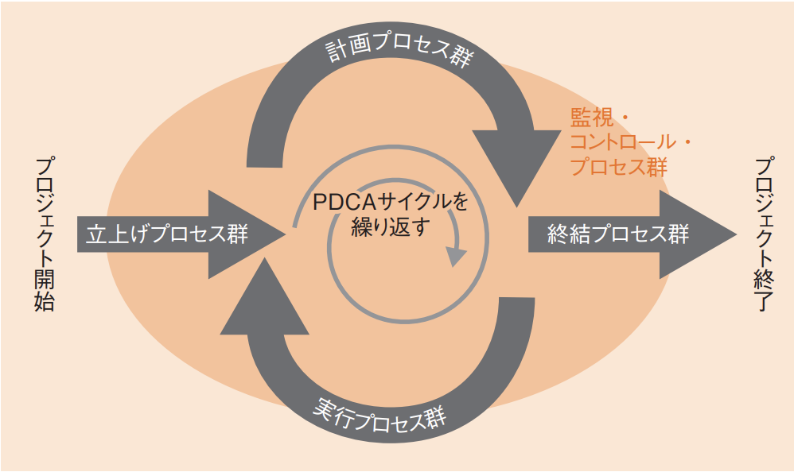
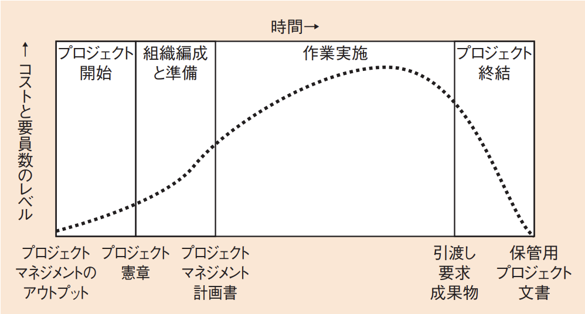
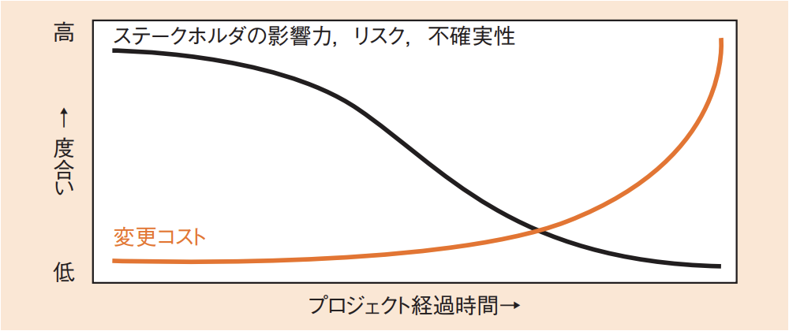

# 5-1-1 プロジェクトマネジメント(译: 项目管理)

- [5-1-1 プロジェクトマネジメント(译: 项目管理)](#5-1-1-プロジェクトマネジメント译-项目管理)
  - [プロジェクトとは(译: 什么是项目)](#プロジェクトとは译-什么是项目)
  - [プロジェクトマネジメント(译: 项目管理)](#プロジェクトマネジメント译-项目管理)
  - [PMBOK(译: 项目管理知识体系)](#pmbok译-项目管理知识体系)
  - [プロジェクトライフサイクル(译: 项目生命周期)](#プロジェクトライフサイクル译-项目生命周期)
  - [複数のプロジェクトのマネジメント(译: 多个项目的管理)](#複数のプロジェクトのマネジメント译-多个项目的管理)

---

- プロジェクトマネジメントでは, プロジェクトの目標を達成するために, 計画し(Plan), 計画どおりに作業を進め(Do), 計画と実績の差異を検証し(Check), 差異の原因に対する処置を行う(Act), PDCAマネジメントサイクルで管理する。

## プロジェクトとは(译: 什么是项目)

- プロジェクト(译: Project, 项目): **目標達成のために行う有期の活動**である。
  - 独自性をもち, ゴールがある
  - 明確な始まりと終わりがある
- プロジェクトの終わり: プロジェクト目標が達成されたときか, プロジェクトが中止されたときである。

## プロジェクトマネジメント(译: 项目管理)

- プロジェクトマネジメント(译: Project Management, 项目管理): プロジェクトの要求事項を満たすため, 知識, スキル, ツール及び技法をプロジェクト活動に適用することである。
- 具体的に
  - **テーラリング**(プロジェクトの設計)を実施し, プロセスごとに適切なツールや技法を決める。
  - **ステークホルダ**(利害関係者)のニーズと期待に応えつつ, 競合する要求のバランスをとる。
- プロジェクトは, プロジェクトマネジメントを行うことによって, 組織が意図する成果を創造するのである。
- <用語>
  - **ステークホルダ**(译: Stakeholder, 利益相关者): 直接/間接的に利害関係をもつ人全体のことである。取引先やスポンサー, 顧客, 従業員などはすべてステークホルダである。[「5-1-3プロジェクトのステークホルダ」](5-1-3プロジェクトのステークホルダ.md)

## PMBOK(译: 项目管理知识体系)

- **PMBOK**(译: Project Management Body Of Knowledge, 项目管理知识体系): プロジェクトマネジメントの門家が, 「実務でこうすればプロジェクト成功の可能性が高くなる」という方法論やスキルなどを集めて作成された標準である。
- 五つの**プロセス群**

  | プロセス群 | 説明 | 中文说明 |
  | - | -- | -- |
  | 立上げプロセス群 (译: 项目启动过程组) | プロジェクトの認可を得て, 新しいフェーズを明確に定める | 正式启动项目, 定义目标和范围 |
  | 計画プロセス群 (译: 计划过程组) | プロジェクトのスコープを定義し, 目標を洗練し, 一連の行動を規定する | 制定和完善实现项目目标所需的计划 |
  | 実行プロセス群 (译: 执行过程组) | プロジェクトの作業を実行する | 按照计划开展工作, 产生成果物 |
  | 監視コントロール・プロセス群 (译: 监控过程组) | プロジェクトの進捗やパフォーマンスを追跡し, 統制し, 変更を開始する | 监控项目进展和质量, 并根据需要进行调整 |
  | 終結プロセス群 (译: 收尾过程组) | プロジェクトを公式に完結し, すべてのアクティビティを終了する | 正式结束项目或阶段, 并交付成果 |

  - 図: 各プロセス群の相互関係 
- 十の**知識エリア**
  1. プロジェクト統合マネジメント(译: 项目整合管理)
  2. プロジェクトステークホルダマネジメント(译: 项目干系人管理)
  3. プロジェクトスコープマネジメント(译: 项目范围管理)
  4. プロジェクト資源マネジメント(译: 项目资源管理)
  5. プロジェクトスケジュールマネジメント(译: 项目进度管理)
  6. プロジェクトコストマネジメント(译: 项目成本管理)
  7. プロジェクトリスクマネジメント(译: 项目风险管理)
  8. プロジェクト品質マネジメント(译: 项目质量管理)
  9. プロジェクト調達マネジメント(译: 项目采购管理)
  10. プロジェクトコミュニケーションマネジメント(译: 项目沟通管理)

## プロジェクトライフサイクル(译: 项目生命周期)

- **プロジェクトライフサイクル**(译: Project Life Cycle, 项目生命周期): プロジェクトのフェーズの集合である。
- プロジェクトの規模や複雑さは様々であるが, ライフサイクルはプロジェクト開始, 組織編成と準備, 作業実施, プロジェクト終結の4段階で表現することができる。
- プロジェクトライフサイクルにおける典型的なコストと要員数は, **プロジェクト開始時に少なく, 作業を実行するにつれて頂点に達し, プロジェクトが終了に近づくと急激に落ち込む**。
  - 図: プロジェクトライフサイクルにおけるコストと要員数の推移 
- ステークホルダの影響力, リスク, 不確実性は, プロジェクト開始時に最大であり, プロジェクトが進むにつれて徐々に低下する。変更コストは, プロジェクトが終了に近づくにつれて図のように大幅に増加していく。
  - 図: ステークホルダの関わり方と変更コストの推移 
- ⭐️ 例題: 多くのプロジェクトライフサイクルに共通する特性はどれか。
  - ア: プロジェクト完成時のコストに対してステークホルダが及ぼす影響の度合いは, プロジェクトの終盤が最も高い。
  - イ: プロジェクトの開始時は不確実性の度合いが最も高いので, プロジェクト目標が達成できないリスクが最も大きい。
  - ウ:  プロジェクト要員の必要人数は, プロジェクトの開始時点が最も多い。
  - エ: 変更やエラー訂正にかかるコストは, プロジェクトの初期段階が最も高い。

  > 不確実性の度合いはプロジェクトの開始時が最も高いため, プロジェクトが成功せず, プロジェクト目標が達成できないリスクも最も高くなる。  
  > したがって, イが正解である。  
  > ア: コストに対してステークホルダが及ぼす影響の度合いは, プロジェクト開始時が最も高く, 終盤に向けて低くなっていく。  
  > ウ: プロジェクト要員の必要人員は, 開始時点と終盤は少なく, 途中の作業実施時に最も多くなる。  
  > エ: 変更やエラー訂正にかかるコストは, プロジェクトの終盤が最も高くなる。

## 複数のプロジェクトのマネジメント(译: 多个项目的管理)

- プロジェクトが複数あり, それぞれが独立しているわけではなく, 一緒に管理することで効率化を図れる場合には, それをまとめて**プログラム**(译: Program, 项目群)という単位にする。
- **プログラムマネジメント**(译: Program Management, 项目群管理): 複数のプロジェクトを合わせてプログラムとして管理すること。
- プロジェクトマネージャ: 一つのプロジェクトを管理する人である。
- プログラムマネージャ: 関連する複数のプロジェクトを調整して管理する人である。
- **PMO**(Project Management Office)(译: 项目管理办公室): 複数のプロジェクトやプログラムを一元的にマネジメントし, 全体として最適化を図る役割を担う部署である。
  - プロジェクトに関するプロセスを標準化し, ツールや技法などをプロジェクトと共有する。
  - **ポートフォリオ・マネジメント**(译: Portfolio Management, 项目管理办公室): 企業の戦略目標から, どのようなプロジェクトやプログラムを実行し, 資源を配分するのかを決定すること。
