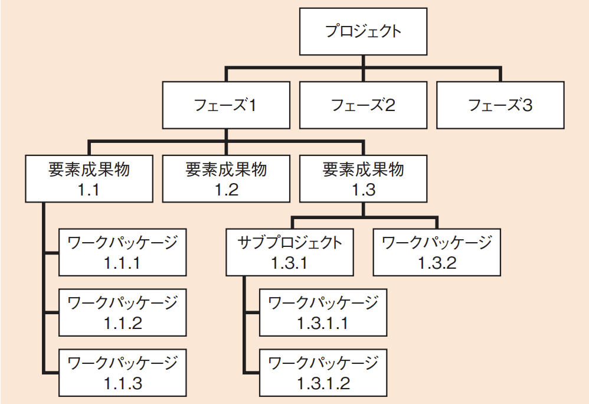

# プロジェクトのスコープ(译: 项目范围)

- [プロジェクトのスコープ(译: 项目范围)](#プロジェクトのスコープ译-项目范围)
  - [プロジェクトスコープマネジメントのプロセス(译: 项目范围管理的过程)](#プロジェクトスコープマネジメントのプロセス译-项目范围管理的过程)
  - [プロジェクトスコープ記述書(译: 项目范围说明书)](#プロジェクトスコープ記述書译-项目范围说明书)
  - [スコープコントロール(译: 范围控制)](#スコープコントロール译-范围控制)
  - [WBS(译: 工作分解结构)](#wbs译-工作分解结构)
  - [WBS辞書(译: WBS词典)](#wbs辞書译-wbs词典)

---

- プロジェクトスコープマネジメントでは, プロジェクトに必要な作業を過不足なく含めることが目的である。
- **プロジェクトスコープ**(译: Project Scope, 项目范围): プロジェクトの範囲であり, 必要なプロダクトやサービスを生み出すために行わなければならない作業である。

## プロジェクトスコープマネジメントのプロセス(译: 项目范围管理的过程)

- プロジェクトスコープマネジメントに含まれるプロセス
  - スコープマネジメント計画
  - 要求事項収集
  - スコープ定義
  - WBS作成
  - スコープ妥当性確認
  - スコープコントロール
- <発展>
  - **要求事項収集**: プロジェクト目標を達成するためにステークホルダにニーズを定義し, 文書化するプロセスである。
    - スポンサーや顧客など, ステークホルダのニーズを**要求事項文書**にまとめる。

## プロジェクトスコープ記述書(译: 项目范围说明书)

- プロジェクトスコープマネジメントでは, **スコープ定義**において, 専門家の判断やプロダクト分析, ワークショップなどの結果を参考にしながらスコープを定義する。
- 定義したスコープは, **プロジェクトスコープ記述書**に, プロジェクトの要求**成果物**, 成果物受入れ基準, プロジェクトからの**除外事項**などの項目を含めて記述する。

## スコープコントロール(译: 范围控制)

- プロジェクトスコープマネジメントでは, プロジェクトスコープに従って, スコープの変更や, 予定と異なるスコープになることを最小限に抑えるためコントロールする必要がある。
- プロジェクトのスコープは, 時間の経過とともに拡大していく傾向があり, そうなった状態を**スコープクリープ**という。
  - スコープクリープが起こるとプロジェクトの成功が危うくなるため, プロジェクトマネージャは, 起こらないように適切にスコープコントロールを行う必要がある。

## WBS(译: 工作分解结构)

- **WBS**(译: Work Breakdown Structure, 工作分解结构): 成果物を中心に, プロジェクトチームが実行する作業を階層的に要素分解したものである。
  - WBSを使うと, プロジェクトのスコープ全体を系統立ててまとめて定義することができる。
- WBSでは, 上位のWBSレベルから下位のWBSレベルへと, より詳細な構成要素に分解する。
  - **ワークパッケージ**(译: Work Package, 任务包): 最も詳細に分解した**最下位のWBS**である。実際に行う作業である**アクティビティ**を割り当てる。
- WBSの構造の形態
  - プロジェクトライフサイクルのフェーズを要素分解の第1レベルに置く方法
  - 主要な成果物を第1レベルに置く方法
  - 組織単位・契約単位で分ける方法
  - 図: WBSの構造 
- WBSは毎回一から作るのではなく, これまでのプロジェクトで作成されたWBSを参考にすることで, より効率的にプロジェクトを運営できる。
  - **WBSテンプレート**: 過去のプロジェクトの実績に基づき, 典型的な作業の階層構造や作業項目をまとめたひな形である。
  - WBSテンプレートを作ることで, 中長期的にスケジュール作成の効率と精度を高めることができるようになる。
- ⭐️ 例題: PMBOKのWBSで定義するものはどれか。
  - ア: プロジェクトで行う作業を階層的に要素分解したワークパッケージ
  - イ: プロジェクトの実行, 監視・コントロール, 及び終結の方法
  - ウ: プロジェクトの要素成果物, 除外事項及び制約条件
  - エ: ワークパッケージを完了するために必要な作業

  > WBSでは, プロジェクトで行う作業を階層的に要素分解していき, ワークパッケージまで細分化する。  
  > したがって, アが正解である。  
  > イ: プロジェクトマネジメント計画書の説明である。  
  > ウ: プロジェクトスコープ記述書の説明である。  
  > エ: アクティビティの説明である。  

## WBS辞書(译: WBS词典)

- **WBS辞書**は, WBS作成プロセスにおいて生成する文書であり, WBSを補完する。各WBS要素に対応する**作業の詳細な記述**や, 技術的な文書の詳細な記述を行う。
