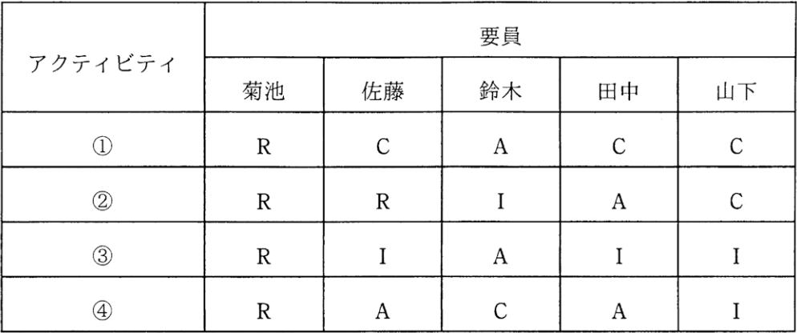

# 5-1-5 プロジェクトの資源(译: 项目资源)

- [5-1-5 プロジェクトの資源(译: 项目资源)](#5-1-5-プロジェクトの資源译-项目资源)
  - [プロジェクト資源マネジメントのプロセス(译: 项目资源管理的过程)](#プロジェクト資源マネジメントのプロセス译-项目资源管理的过程)
  - [責任分担マトリックス(译: 责任分配矩阵)](#責任分担マトリックス译-责任分配矩阵)
  - [教育技法(译: 培训技巧)](#教育技法译-培训技巧)

---

- プロジェクト資源マネジメントは, プロジェクトチームのメンバが各々の役割と責任を全うすることでチームとして機能し, プロジェクトの目標を達成することを目的に行われる。

## プロジェクト資源マネジメントのプロセス(译: 项目资源管理的过程)

- プロジェクト資源マネジメントのプロセス
  - 資源マネジメント計画作成
  - プロジェクトチーム編成
  - プロジェクトチーム育成
  - など
- 複数のプロジェクトにまたがる資源のマネジメントについては, **PMO**が取り扱う。

## 責任分担マトリックス(译: 责任分配矩阵)

- 責任分担マトリックス: プロジェクトチームのメンバの役割や責任の分担を明らかにした表である。
- R(Responsible: 実行責任者), A(Accountable: 説明責任者), C(Consulted: 相談先), I(Informed: 報告先)の四つの責任について, 利害関係者の分担をマトリックス表にしたものである。
- ⭐️ 例題: 表は, RACIチャートを用いた, ある組織の責任分担マトリックスである。条件を満たすように責任分担を見直すとき, 適切なものはどれか。 〔条件〕 ・各アクティビティにおいて, 実行責任者は1人以上とする。 ・各アクティビティにおいて, 説明責任者は1人とする。 
  - ア: アクティビティ①の菊池の責任をIに変更
  - イ: アクティビティ②の佐藤の責任をAに変更
  - ウ: アクティビティ③の鈴木の責任をCに変更
  - エ: アクティビティ④の田中の責任をRに変更

  > 〔条件〕の一つ目に, 「各アクティビティにおいて, 実行責任者は1人以上とする」とあるので, アクティビティ① ~ ④に実行責任者(R)の要員が1人以上必要である。問題文の表では, この条件は満たしている。  
  > 〔条件〕の二つ目に, 「各アクティビティにおいて, 説明責任者は1人とする」とあるので, アクティビティ① ~ ④に説明責任者(A)の要員が1人だけ必要である。表を見ると, アクティビティ④でAが2人(佐藤, 田中)に割り当てられているので, どちらかを別の役割にする必要がある。  
  > 実行責任者(R)は1人以上なので増えても問題はなく, アクティビティ④の田中の責任をRにすることで〔条件〕をすべて満たすことができる。  
  > したがって, エが正解である。

## 教育技法(译: 培训技巧)

- プロジェクトの人材育成では, 知識中心ではなく, より実践的な教育技法が用いられる。
- 代表的なもの
  - **OJT**(On the Job Training)(译: 在职训练): 日常業務の中で先輩や上司が個別指導する
  - **ケーススタディ**(译: Case Study, 案例研究): 具体的な事例を取り上げて詳細に分析し, 解決策を見出していく
  - **インバスケット**(译: In-basket, 篮中训练): 制限時間内で多くの問題を処理させる
