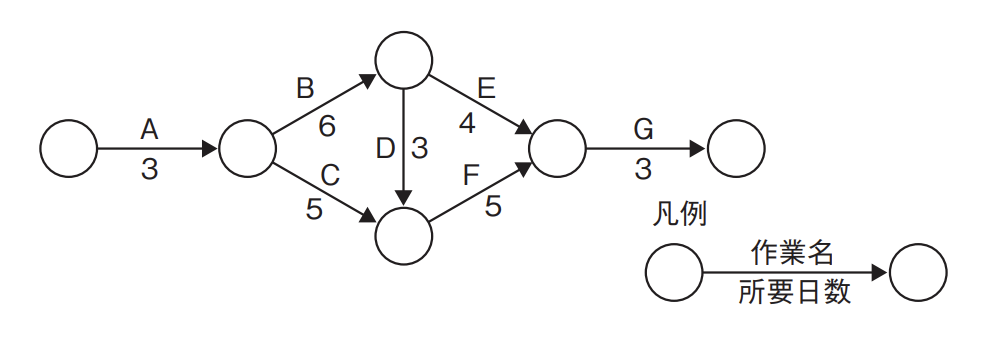

# プロジェクトの時間(译: 项目的时间)

- [プロジェクトの時間(译: 项目的时间)](#プロジェクトの時間译-项目的时间)
  - [プロジェクトスケジュールマネジメントのプロセス(译: 项目进度管理的过程)](#プロジェクトスケジュールマネジメントのプロセス译-项目进度管理的过程)
  - [アクティビティ(译: 活动)](#アクティビティ译-活动)
  - [スケジュールの作成方法(译: 进度的制定方法)](#スケジュールの作成方法译-进度的制定方法)
    - [**クリティカルパス法**(译: 关键路径法)](#クリティカルパス法译-关键路径法)
    - [**クリティカルチェーン法**(译: 关键链法)](#クリティカルチェーン法译-关键链法)
    - [**スケジュール短縮手法**(译: 进度压缩方法)](#スケジュール短縮手法译-进度压缩方法)
    - [**プレシデンスダイアグラム法**(译: 优先关系图法)](#プレシデンスダイアグラム法译-优先关系图法)
  - [スケジュールコントロール(译: 进度控制)](#スケジュールコントロール译-进度控制)
  - [ガントチャート(译: 甘特图)](#ガントチャート译-甘特图)

---

- プロジェクトスケジュールマネジメントでは, プロジェクトを所定の時期に完了させることが目的である。プロジェクトだけでなく, プロジェクトに関わる要員それぞれの進捗管理も重要である。

## プロジェクトスケジュールマネジメントのプロセス(译: 项目进度管理的过程)

- プロジェクトスケジュールマネジメントに含まれるプロセス
  - スケジュールマネジメント計画
  - アクティビティ定義
  - アクティビティ順序設定
  - アクティビティ資源見積り
  - アクティビティ所要期間見積り
  - スケジュール作成
  - スケジュールコントロール

## アクティビティ(译: 活动)

- **アクティビティ**(译: Activity, 活动): プロジェクトのWBSで定義された**ワークパッケージ**を, より
小さく, よりマネジメントしやすい単位に要素分解したものである。
- チームメンバや専門家などと協力してアクティビティを分解し, 必要なすべてのアクティビティを網羅した**アクティビティ・リスト**を作成する。
- すべて**マイルストーン**を特定し, マイルストーン・リストを作成する。
- アクティビティの**順序関係**をまとめ, プロジェクトのスケジュールを**アローダイアグラム**で表現する。
- <用語>
  - **マイルストーン**(译: Milestone, 里程碑)とは, プロジェクトにおいて重要な意味をもつ時点やイベントのことで, 節目の工程となるものである。

## スケジュールの作成方法(译: 进度的制定方法)

- アクティビティごとに, 資源がいつどれだけ必要になるか, 作業量や期間はどの程度かを見積もり, スケジュールを作成する。
- スケジュール作成の代表的な手法

### **クリティカルパス法**(译: 关键路径法)

- アクティビティ(作業)の順序関係を表した**アローダイアグラム**から, プロジェクト完了までにかかる最長の経路である**クリティカルパス**を計算し, それを基準にそれぞれのアクティビティがプロジェクト完了を延期せずにいられる余裕がどれだけあるか(**トータルフロート**)を計算する。
- 具体的には, 最初にスケジュール・ネットワークの経路の往路時間計算(**フォワードパス**)を求め, 作業期間の合計が最も大きい経路を**クリティカルパス**とし, その期間を**プロジェクト全体の所要時間**とする。そして, その所要時間から逆算して復路時間計算(**バックワードパス**)を行う。フォワードパスにより, すべてのアクティビティの**最早開始日**と**最早終了日**を, バックワードパスにより**最遅開始日**と**最遅終了日**を求めることができる。
- <用語>
  - **トータルフロート(译: Total Float, 总浮动)**: 最早日付と最遅日付の差で測定される値で, スケジュールの柔軟性を示す指標になる。
- <参考>
  - クリティカルパスは, プロジェクト完了までにかかるそれぞれの経路の所要時間の合計から最長の経路を選択して求めるものである。このクリティカルパスでの所要時間が, プロジェクト全体で必要な最短の時間となる。

### **クリティカルチェーン法**(译: 关键链法)

- クリティカルパス法は, 資源(人員など)に関する制限を考慮せずに計算していた。しかし実際には資源に限度があるので, その資源に合わせてクリティカルパスを修正する手法がクリティカルチェーン法である。

### **スケジュール短縮手法**(译: 进度压缩方法)

- スケジュールの予定がスケジュール目標に間に合わない場合にスケジュールを短縮させる方法
  - **クラッシング**(译: Crashing, 赶工): コストとスケジュールのトレードオフを分析し, 最小の追加コストで最大の**期間短縮**を実現する手法を決定することである。
  - **ファストトラッキング**(译: Fast Tracking, 快速跟进): 順を追って実行するフェーズやアクティビティを**並行して実行**するというスケジュール短縮手法である。
- ⭐️ 例題: 図のプロジェクトを最短の日数で完了したいとき, 作業Eの最遅開始日は何日目か。
  - ア: 9
  - イ: 12
  - ウ: 13
  - エ: 17

  > フォワードパスを求め, クリティカルパスとそれぞれの作業の最早終了日を求めると, 以下の赤字で示したようになる。  
  >   
  > プロジェクト全体の所要日数はクリティカルパス上の20日なので, ここから逆算して求めると, 作業Eは作業Fと同じく最遅終了日が17日となり, 作業Eは所要日数4日で終わるため, 最遅開始日は13日となる。  
  > したがって, ウが正解である。

### **プレシデンスダイアグラム法**(译: 优先关系图法)

- プロジェクトのアクティビティの関係を表す図である。
- アクティビティの依存関係には, 次の四つの関係がある

  |  アクティビティの依存関係 | 説明 | 中文说明 |
  | - | -- | -- |
  | 終了−開始関係 (译: Finish to Start, FS,  结束−开始关系) | 先行しているアクティビティが終了しないと, 次のアクティビティが開始できない関係 | 前置任务必须完成, 后续任务才能开始 (最常见的依赖关系) |
  | 終了−終了関係 (译: Finish to Finish, FF,  结束−结束关系) | 先行しているアクティビティが終了しないと, 次のアクティビティを終了できない関係 | 前置任务完成后, 后续任务才能完成 |
  | 開始−開始関係 (译: Start to Start, SS,  开始−开始关系) | 先行しているアクティビティが開始しないと, 次のアクティビティが開始できない関係 | 前置任务开始后, 后续任务才能开始 |
  | 開始−終了関係 (译: Start to Finish, SF,  开始−结束关系) | 先行しているアクティビティが開始しないと, 次のアクティビティが終了できない関係 | 前置任务开始后, 后续任务才能结束 (最少见的依赖关系) |

- ⭐️ 例題: 図は, 実施する三つのアクティビティについて, プレシデンスダイアグラム法を用いて, 依存関係及び必要な作業日数を示したものである。全ての作業を完了するのに必要な日数は最少で何日か。
  - ア: 11
  - イ: 12
  - ウ: 13
  - エ: 14

  > アクティビティ Aとアクティビティ Bは終了−開始関係で, アクティビティ Aが終了してからアクティビティ Bを開始できるが, リード(早められる時間)が2日あるので, アクティビティ Aの終了2日前, 6−2 = 4日が経過した後にアクティビティ Bを開始できることになる。  
  > 次に, アクティビティBとアクティビティCは開始−開始関係で, アクティビティ Bを開始したときにアクティビティ Cも開始可能になるが, ラグ(遅れる時間)が3日あるため, 4 + 3 = 7日が経過した後にアクティビティ Cを開始する。アクティビティ Bは7日かかるので終了するのは4 + 7 = 11日, アクティビティ Cは5日かかるので終了するのは7 + 5 = 12日である。そのため, 全ての作業を完了するのに要する最少日数は, アクティビティ Cが終了するまでの12日となる。  
  > したがって, イが正解である。

## スケジュールコントロール(译: 进度控制)

- スケジュールコントロール: プロジェクトの進捗を更新するためにプロジェクトの状況を監視し, スケジュールに対する変更をマネジメントする。
- スケジュール作成で行われたクリティカルパス法などの分析により, 基本となるスケジュールである**スケジュールベースライン**(译: Schedule Baseline, 进度基准)を決定する。それを基に差異分析を行い, スケジュールを調整する。
- プロジェクトの費用管理と進捗管理を同時に行うため, 横軸に開発期間, 縦軸に予算消化率を設定してグラフ化した**トレンドチャート**(译: Trend Chart, 趋势图)を用いることもある。

## ガントチャート(译: 甘特图)

- ガントチャート(译: Gantt Chart, 甘特图): 作業の進捗状況を表す図である。プロジェク
ト管理などにおいて工程管理に用いられる。
- 縦軸でWBSのそれぞれの要素を表し, 横棒で実施される期間や実施状況を色分けなどして表する。ガントチャートは, 次のような一種の棒グラフのかたちで示される。 図: ガントチャートの例 
