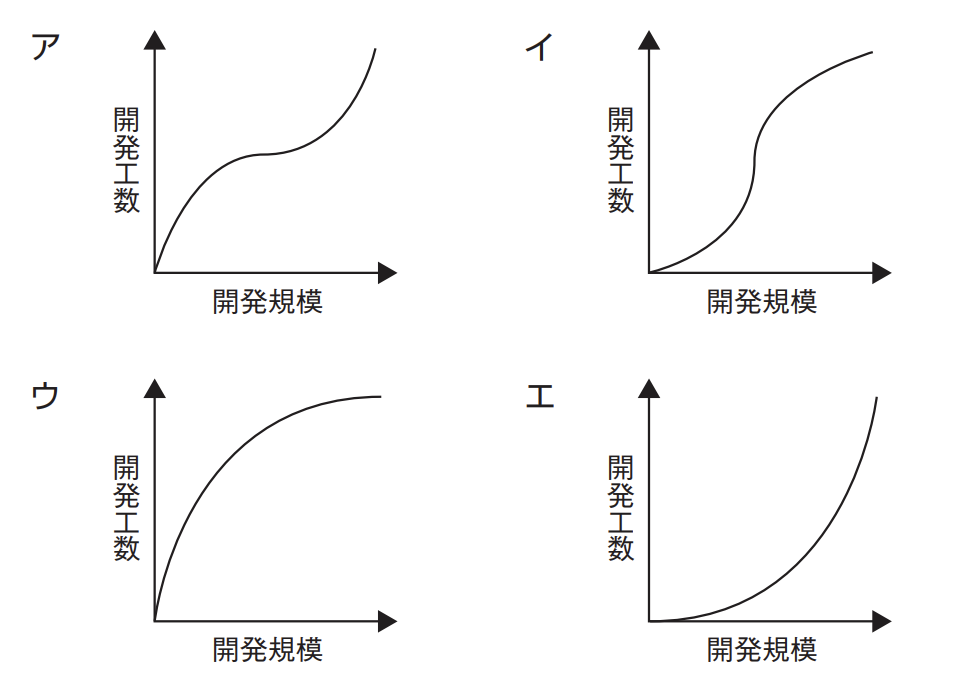

# プロジェクトのコスト(译: 项目的成本)

- [プロジェクトのコスト(译: 项目的成本)](#プロジェクトのコスト译-项目的成本)
  - [プロジェクトコストマネジメントのプロセス(译: 项目成本管理的过程)](#プロジェクトコストマネジメントのプロセス译-项目成本管理的过程)
  - [コスト見積手法(译: 成本估算方法)](#コスト見積手法译-成本估算方法)
    - [**ファンクションポイント法(FP法)**(译: 功能点法)](#ファンクションポイント法fp法译-功能点法)
    - [LOC法(Lines Of Code, 译: 代码行数法)](#loc法lines-of-code-译-代码行数法)
    - [COCOMO(译: Constructive Cost Mode, COCOMO模型)](#cocomo译-constructive-cost-mode-cocomo模型)
    - [三点見積法(PERT分析)(译: 三点估算法(PERT分析))](#三点見積法pert分析译-三点估算法pert分析)
  - [開発規模と開発工数の関係(译: 开发规模与开发工时的关系)](#開発規模と開発工数の関係译-开发规模与开发工时的关系)
  - [EVM(Earned Value Management)(译: 挣值管理)](#evmearned-value-management译-挣值管理)

---

- プロジェクトコストマネジメントは, プロジェクトを決められた予算内で完了させることを目的に行われる。プロジェクトだけでなく, プロジェクトに関わる要員それぞれのコスト管理も重要である。

## プロジェクトコストマネジメントのプロセス(译: 项目成本管理的过程)

- プロジェクトコストマネジメントに含まれるプロセス
  - コストマネジメント計画
  - コスト見積り
  - 予算設定
  - コストコントロール

## コスト見積手法(译: 成本估算方法)

- 代表的なコスト見積手法

### **ファンクションポイント法(FP法)**(译: 功能点法)

- ソフトウェアの**機能(ファンクション)**を基本にして, その処理内容の**複雑さ**から**ファンクションポイント**を算出する。帳票, 画面, ファイルなどのソフトウェアの機能を洗い出し, その数を見積もる。その後, 機能を次の5種類のファンクションタイプに分け, それぞれの難易度を容易・普通・複雑の3段階で評価して点数化し, それを合計して**基準値**とする。
- ファンクションの評価基準の例

  | ファンクション | ファンクションタイプ | 容易 | 普通 | 複雑 |
  | -- | -- | - | - | - |
  | トランザクション ファンクション | 外部入力(EI) | 3 | 4 | 6 |
  | トランザクション ファンクション | 外部出力(EO) | 4 | 5 | 7 |
  | トランザクション ファンクション | 外部参照(EQ) | 3 | 4 | 6 |
  | データファンクション | 内部論理ファイル(ILF) | 7 | 10 | 15 |
  | データファンクション | 外部インタフェースファイル(EIF) | 5 | 7 | 10 |

- 次に, システム特性に対してその複雑さを14の項目で0 ~ 5の6段階で評価し, それを合計して調整値を求める。基準値と調整値を基に, 次の式でファンクションポイントを算出する。
  $$ファンクションポイント = 基準値 \times (0.65 + 調整値 / 100)$$

- ファンクションポイント法は, プログラミングに入る前にユーザ要件が決まり, 必要な機能が見えてきた段階で見積りが行えるという特徴がある。

### LOC法(Lines Of Code, 译: 代码行数法)

- ソースコードの行数でプログラムの規模を見積もる方法である。オンライン系とバッチ系に分けて機能を洗い出す。
- 従来からある方法であるが, 担当者によって見積り規模に大きな偏差が出ることから, 客観的に計算できるファンクションポイント法が普及してきた。

### COCOMO(译: Constructive Cost Mode, COCOMO模型)

- ソフトウェアで予想されるソースコードの行数に, エンジニアの能力や要求の信頼性などによる補正係数をかけ合わせ, 開発に必要な工数, 期間などを算出する。
- 現在は, ファンクションポイントやCMMIなどの概念を取り入れて発展させたCOCOMOⅡが提唱されている。

### 三点見積法(PERT分析)(译: 三点估算法(PERT分析))

- 見積りの不確実性を考慮して, コストの精度を高める。
- 具体的には, 最も起こる可能性のある最頻値($C_M$)と, 最良のケースを想定した楽観値($C_O$), 最悪のケースを想定した悲観値($C_P$)の3種類を見積もる。これらの3種類の見積りを加重平均し, 次の式でコストの期待値($C_E$)を求める。
  $$C_E = \frac{C_O + 4C_M + C_P}{6}$$
- ⭐️ 例題: ソフトウェアの機能量に着目して開発規模を見積もるファンクションポイント法で, 調整前FPを求めるために必要となる情報はどれか。
  - ア: 開発者数
  - イ: 画面数
  - ウ: プログラムステップ数
  - エ: 利用者数

  > ファンクションポイント法では, ソフトウェアの機能(ファンクション)を基本にして, その処理内容の複雑さからファンクションポイントを算出する。このとき, 帳票, 画面, ファイルなどのソフトウェアの機能を洗い出すので, 画面数の情報は必要となる。  
  > したがって, イが正解である。  
  > ア, エ: 開発者数や利用者数は, ファンクションポイントを計算する際には考慮されない。  
  > ウ: ファンクションポイント法では, プログラムのステップ数は利用しない。

## 開発規模と開発工数の関係(译: 开发规模与开发工时的关系)

- COCOMOでは, システム開発の工数を見積もる際に以下のような式を使う。
  $$MM = 3.0 \times (KDSI)^{1.12}$$
- MMは開発工数[人月]で, KDSIは開発規模[行(ソースコードの行数)]である。つまり, 開発規模が大きくなると, それに比例する以上に, 指数的に開発工数が大きくなるというモデルである。
- 一般的にはこのように, 開発規模が大きくなるほど開発工数もどんどん大きくなると考えられている。
- ⭐️ 例題: ソフトウェアの開発規模と開発工数の関係を表すグラフはどれか。 

  > 一般に, ソフトウェアの開発規模が大きくなるにつれて, 開発工数も指数的に大きくなっていくと考えられている。  
  > したがって, エのようなグラフになる。

## EVM(Earned Value Management)(译: 挣值管理)

- **アーンド・バリュー・マネジメント(EVM)**は, 予算とスケジュールの両方の観点からプロジェクトの遂行を定量的に評価するプロジェクトマネジメントの技法である。PMBOKでは, コスト・コントロールの技法として使われている。
- アーンド・バリュー・マネジメントでは, 次の三つの値を用いて測定し, 監視する。
  - **PV**(Planned Value: 計画値): 遂行すべき作業に割り当てられた予算である。計画から求められる。
  - **EV**(Earned Value: 出来高): 実施した作業の価値である。完了済の作業に対して当初割り当てられていた予算を算出する。
  - **AC**(Actual Cost: 実コスト): 実施した作業のために実際に発生したコストである。実測値から求められる。
- これらの三つの値を使って, 次のような差異や効率指数を計算することができる。

  |  | 式 | 説明 |
  | -- | -- | -- |
  | SV(Schedule Variance: スケジュール差異) | $SV = EV - PV$ | 進捗の遅れをコストで表す $SV$が$+$ならスケジュールは進んでおり, $−$なら遅れている |
  | CV(Cost Variance: コスト差異) | $CV = EV - AC$ | コストの超過を表す $CV$が$+$ならコストは黒字, $−$なら赤字である。 |
  | **SPI**(Schedule Performance Index: スケジュール効率指数) | $SPI = EV / PV$ | 進捗状況を指数で表す $SPI > 1$なら進んでおり, $SPI < 1$なら遅れている |
  | **CPI**(Cost Performance Index: コスト効率指数) | $CPI = EV / AC$ | コストの効率を指数で表す $CPI > 1$なら黒字, $CPI < 1$ならコスト超過である |
