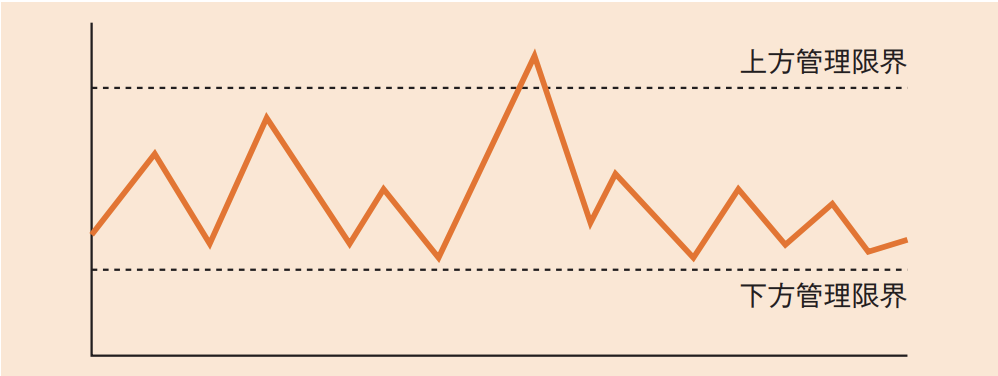

# プロジェクトの品質(译: 项目的质量)

- [プロジェクトの品質(译: 项目的质量)](#プロジェクトの品質译-项目的质量)
  - [プロジェクト品質マネジメントのプロセス(译: 项目质量管理的过程)](#プロジェクト品質マネジメントのプロセス译-项目质量管理的过程)
  - [品質マネジメントの手法(译: 质量管理的方法)](#品質マネジメントの手法译-质量管理的方法)
    - [**管理図**(译: 管理图)](#管理図译-管理图)
    - [ベンチマーク(译: 基准比较)](#ベンチマーク译-基准比较)
    - [レビュー, テスト(译: 评审, 测试)](#レビュー-テスト译-评审-测试)
    - [品質の指標(译: 质量指标)](#品質の指標译-质量指标)

---

- プロジェクト品質マネジメントの目的は, プロジェクトが取り組むニーズを満足させることである。プロジェクトでは, 必要に応じて行われる継続的プロセス改善活動とともに, 方針, 手順を通して品質マネジメントを実施する。

## プロジェクト品質マネジメントのプロセス(译: 项目质量管理的过程)

- プロジェクト品質マネジメントに含まれるプロセス
  - 品質マネジメント計画(品質計画)
    - 品質要求事項や品質標準を定め, プロジェクトでそれを順守するための方法を文書化する。
  - 品質保証
    - 適切な品質標準と運用基準の適用を確実に行うために, 品質の要求事項と品質管理測定の結果を監査する。
  - 品質コントロール(品質管理)
    - パフォーマンスを査定し, 必要な変更を提案するために品質活動の実行結果を監視し, 記録する。QC七つ道具や新QC七つ道具などを駆使する。
- ⭐️ 例題: 品質の定量評価の指標のうち, ソフトウェアの保守性の評価指標になるものはどれか。
  - ア: (最終成果物に含まれる誤りの件数)÷(最終成果物の量)
  - イ: (修正時間の合計)÷(修正件数)
  - ウ: (変更が必要となるソースコードの行数)÷(移植するソースコードの行数)
  - エ: (利用者からの改良要求件数)÷(出荷後の経過月数)

  > ソフトウェアの品質特性を定義した規格ISO/IEC 25010(JIS X25010)では, ソフトウェアの保守性を, 「意図した保守者によって, 製品又はシステムが修正することができる有効性及び効率性の度合い」と定義している。修正の容易さを表すので, (修正時間の合計)÷(修正件数)で, 修正1件当たりにかかる時間を算出することは, 保守性の評価指標になる。  
  > したがって, イが正解である。  
  > アは信頼性の評価指標となる。  
  > ウは移植性の評価指標となる。  
  > エは機能適合性の評価指標となる。

## 品質マネジメントの手法(译: 质量管理的方法)

- 代表的な品質マネジメントの手法

### **管理図**(译: 管理图)

- 管理図は, プロセスが安定しているかどうか, またはパフォーマンスが予測どおりであるかどうかを判断するための図である。許容される**上方管理限界**と**下方管理限界**を設定する。
- 図: 管理図の例 

### ベンチマーク(译: 基准比较)

- 実施中または計画中のプロジェクトを類似性の高いプロジェクトと比べることによって, ベストプラクティスを特定したり, 改善策を考えたり, 測定基準を設けたりすることである。

### レビュー, テスト(译: 评审, 测试)

- ウォークスルー(译: Walkthrough, 走查), インスペクション(译: Inspection, 正式检查)などのレビューや, 段階的なテストは, 品質を向上させるための大切な手法である。

### 品質の指標(译: 质量指标)

- JIS X 25010(ISO/IEC 25010)で定められているソフトウェア品質特性の指標は, ソフトウェア開発時の品質の指標としてよく用いられる。
