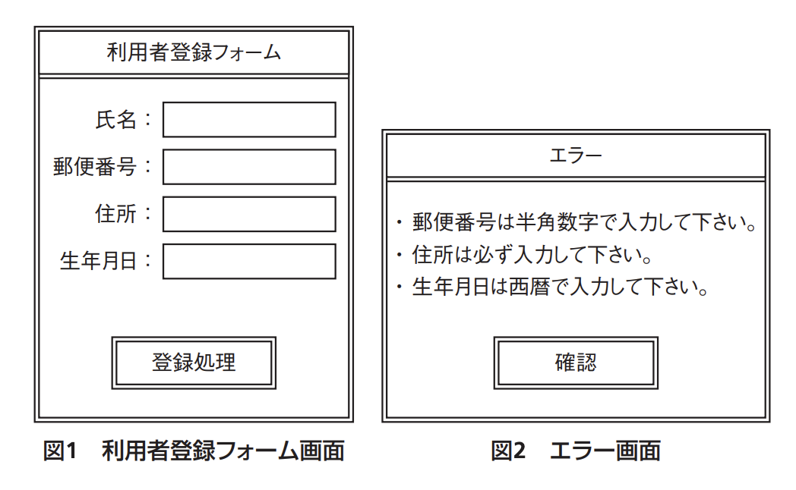

# システム監査(译: 系统审计)

- [システム監査(译: 系统审计)](#システム監査译-系统审计)
  - [監査業務(译: 审计业务)](#監査業務译-审计业务)
  - [システム監査人の要件(译: 系统审计员的要求)](#システム監査人の要件译-系统审计员的要求)
  - [システム監査の手順(译: 系统审计的步骤)](#システム監査の手順译-系统审计的步骤)
  - [システム監査計画(译: 系统审计计划)](#システム監査計画译-系统审计计划)
  - [システム監査の実施(予備調査, 本調査, 評価・結論)(译: 系统审计的实施(预备调查, 正式调查, 评价与结论))](#システム監査の実施予備調査-本調査-評価結論译-系统审计的实施预备调查-正式调查-评价与结论)
  - [システム監査の報告(译: 系统审计报告)](#システム監査の報告译-系统审计报告)
  - [システム監査終了後の任務(译: 系统审计结束后的任务)](#システム監査終了後の任務译-系统审计结束后的任务)
  - [システム監査技法(译: 系统审计技术)](#システム監査技法译-系统审计技术)
  - [監査証跡とコントロール(译: 审计追踪与控制)](#監査証跡とコントロール译-审计追踪与控制)
  - [監査関連法規・標準(译: 审计相关法规与标准)](#監査関連法規標準译-审计相关法规与标准)

---

- システム監査を行うことで, 対象の組織体(企業や政府など)が情報システムにまつわるリスクに対するコントロールを適切に整備・運用しているかどうかをチェックする。そうすることで, 情報システムが組織体の経営方針や戦略目標を実現し, 組織体の安全性, 信頼性, 効率性を保つために機能できるようになる。

## 監査業務(译: 审计业务)

- 対象によって: **システム監査**, 会計監査, **情報セキュリティ監査**, 個人情報保護監査, コンプライアンス監査など
- 外部と内部
  - **外部監査**: 社外の独立した第三者が行う
  - **内部監査**: その組織自体の内部で行われる
- 保証型と助言型
  - **保証型監査**: 基準に照らし合わせて適切であることを保証する
  - **助言型監査**: 問題点を検出して改善提案を行う

## システム監査人の要件(译: 系统审计员的要求)

- **独立性**: システム監査人の要件で最も大切なもの。
  - 内部監査の場合でも, システム監査は社内の独立した部署で行われる。
- システム監査人は監査対象から独立していなければならない。
  - 身分上独立している**外観上の独立性**だけでなく, 公正かつ客観的に監査判断ができるよう**精神上の独立性**も求められる。
- システム監査人は, **職業倫理**と**誠実性**, そして**専門能力**をもって職務を実施する必要がある。
- ⭐️ 例題: システム監査実施体制のうち, システム監査人の独立性の観点から避けるべきものはどれか。
  - ア: 監査チームメンバに任命された総務部のAさんが, 他のメンバと一緒に, 総務部の入退室管理の状況を監査する。
  - イ: 監査部のBさんが, 個人情報を取り扱う業務を委託している外部企業の個人情報管理状況を監査する。
  - ウ: 情報システム部の開発管理者から5年前に監査部に異動したCさんが, マーケティング部におけるインターネットの利用状況を監査する。
  - エ: 法務部のDさんが, 監査部からの依頼によって, 外部委託契約の妥当性の監査において, 監査人に協力する。

  > 総務部のAさんが, 総務部の入退室管理の状況を監査するという行為は, 自分の所属する部署の監査になるので, 外観上の独立性から問題になる。  
  > したがって, アが正解である。  
  > イ, エ: 監査対象から独立しているので問題ない。  
  > ウ: 関係部署に以前所属していたという場合は問題になることもあるが, 5年前だと, ある程度年数が経っていると判断されるので, 問題ないと考えられる。

## システム監査の手順(译: 系统审计的步骤)

1. **監査計画**に基づき
2. **予備調査**
3. **本調査**
4. **評価・結論**

## システム監査計画(译: 系统审计计划)

- システム監査人は, 実施するシステム監査の目的を有効かつ効率的に達成するために, 監査手続の内容, 時期及び範囲などについて適切な**監査計画**を立案する。
- 監査計画は, 事情に応じて修正できるよう, 弾力的に運用する。

## システム監査の実施(予備調査, 本調査, 評価・結論)(译: 系统审计的实施(预备调查, 正式调查, 评价与结论))

- **監査手続**は, 十分な**監査証拠**を入手するための手続である。
  - システム監査人は適切かつ慎重に監査手続を実施し, 監査結果を裏付けるのに十分かつ適切な監査証拠を入手する。
- 監査手続の結果とその関連資料を**監査調書**として作成する。
  - 監査調書は, 監査結果の裏付けとなるため, 監査の結論に至った過程が分かるように記録し, 保存する。

## システム監査の報告(译: 系统审计报告)

- システム監査人は, 実施した監査についての**監査報告書**を作成し, 監査の依頼者(組織体の長)に提出する。
  - 監査報告書には, 実施した監査の対象や概要, 保証意見または助言意見, 制約などを記載する。
- 監査を実施した結果において発見された**指摘事項**と, その改善を進言する**改善勧告**について明瞭に記載する。

## システム監査終了後の任務(译: 系统审计结束后的任务)

- システム監査人は, **監査報告書の記載事項**について責任を負う。
- 監査の結果に基づいて改善できるよう, 監査報告に基づく**改善指導**(**フォローアップ**)を行う。
- システム監査の実施結果の妥当性を評価する**システム監査の品質評価**も行うことがある。

## システム監査技法(译: 系统审计技术)

- システム監査の技法としては, 一般的な資料の閲覧・収集, ドキュメントレビュー(査閲), チェックリスト, 質問書・調査票, インタビューなどのほかに次のような方法がある。

  | システム監査技法 | 説明 | 中文说明 |
  | - | -- | -- |
  | 統計的サンプリング法 | 母集団からサンプルを抽出し, そのサンプルを分析して母集団の性質を統計的に推測する | 从大量数据中按统计方法抽取一部分进行审计, 并根据结果推测整体的方法 |
  | 監査モジュール法 | 監査対象のプログラムに監査用のモジュールを組み込んで, プログラム実行時の監査データを抽出する | 在被审计系统中嵌入专门的审计模块, 自动记录和验证处理过程及结果的方法 |
  | ITF(Integrated Test Facility)法 | 稼働中のシステムにテスト用の架空口座(ID)を設置し, システムの動作を検証する 実際のトランザクションとして架空口座のトランザクションを実行し, 正確性をチェックする。 | 在实际系统中设置虚拟部门或交易数据, 在正常运行中进行测试的方法 |
  | ウォークスルー法 | データの生成から入力, 処理, 出力, 活用までのすべてのプロセスや, 組み込まれているコントロールについて, 書面上で, または実際に追跡する技法 | 开发者和相关人员一起逐步检查规格说明书或程序, 发现错误或问题的方法 |
  | コンピュータ支援監査技法(**CAAT**: Computer Assisted Audit Techniques) | 監査のツールとしてコンピュータを利用する監査技法の総称 ITF法もCAATの一例であり, テストデータ法など様々な技法がある | 利用计算机进行数据分析和检查, 提高审计效率的方法, 通常称为CAATs(计算机辅助审计技术) |

## 監査証跡とコントロール(译: 审计追踪与控制)

- **監査証跡**: 監査対象システムの入力から出力に至る過程を追跡できる一連の仕組みと記録である。
  - 情報システムに対して, **信頼性**, **安全性**, **効率性**の**コントロール**が適切に行われていることを実証するために用いられる。

- 監査におけるコントロールとは, 統制を行うための手続きである。
  - コントロールの具体例
    - **エディットバリデーションチェック**: 画面上で入力した値が一定の規則に従っているかどうかを確認する
    - **るコントロールトータルチェック**: 数値情報の合計値を確認することでデータに漏れや重複がないかを確認する
- ⭐️ 例題: 業務システムの利用登録をするために, 利用者登録フォーム画面(図1)から登録処理を行ったところ, エラー画面(図2)が表示され, 再入力を求められた。このコントロールはどれか。 
  - ア: アクセスコントロール
  - イ: エディットバリデーションチェック
  - ウ: コントロールトータルチェック
  - エ: プルーフリスト

  > 図2のエラーの内容は, 図1の利用者登録フォーム画面で入力したデータに対してチェックが行われて表示されたものである。そのため, 入力値に対するエラーをチェックするエディットバリデーションチェックが行われていることが分かる。  
  > したがって, イが正解である。  
  > ア: ファイアウォールなどを使用して, 許可されたアクセス以外を通さないように制御するコントロールである。  
  > ウ: 数値の合計値をチェックして, 漏れや重複がないことを確認するコントロールである。  
  > エ: 入力データを処理・加工せずにそのまま出力したものである。入力した値が正しかったかどうかをチェックするためのコントロールに利用される。

## 監査関連法規・標準(译: 审计相关法规与标准)

- システム監査に関連する標準や法規

  | システム監査に関連する標準や法規 | 説明 | 中文说明 |
  | - | -- | -- |
  | **システム監査基準** | $\bullet$ **システム監査人のための行動規範**である $\bullet$ 一般基準, 実施基準, 報告基準からなっている | $\bullet$ 系统审计员的行为规范 $\bullet$ 由一般基准, 实施基准和报告基准构成 |
  | **システム管理基準** | $\bullet$ システム監査基準に従って**判断の尺度に使う項目**である $\bullet$ 全部で287項目あり, 情報戦略, 企画業務, 開発業務, 運用業務, 保守業務, 共通業務について, システム管理基準の項目を活用しながらシステム監査を行っていく | $\bullet$ 依照系统审计基准, 用作判断的尺度 $\bullet$ 共287项, 涵盖信息战略, 规划业务, 开发业务, 运行业务, 维护业务及共通业务, 审计时参考这些项目 |
  | **情報セキュリティ監査基準** | $\bullet$ **情報セキュリティ監査人のための行動規範**である $\bullet$ システム監査基準の情報セキュリティバージョンといえる | $\bullet$ 信息安全审计员的行为规范 $\bullet$ 可视为系统审计基准的信息安全版本 |
  | **情報セキュリティ管理基準** | $\bullet$ 情報セキュリティ監査基準に従って**判断の尺度**に使う項目である $\bullet$ 平成20年度改正版では, ISO/IEC 27001とISO/IEC 27002を基に策定されており, 「**ISMS適合性評価制度**」で用いられる**適合性評価の尺度と整合**するように配慮されている | $\bullet$ 依照信息安全审计基准, 用作判断的尺度 $\bullet$ 2008年修订版基于ISO/IEC 27001与ISO/IEC 27002制定, 并与ISMS适合性评价制度所使用的评价尺度保持一致 |
  | 個人情報保護関連法規 | 個人情報保護に関する法律や, プライバシーマーク制度で使われる**JIS Q 15001**などのガイドラインは, 個人情報保護に関する監査に対して利用される | 与个人信息保护相关的法律, 以及隐私标志制度所使用的 JIS Q 15001 等指引, 可用于个人信息保护方面的审计 |
  | **知的財産権**関連法規 | システム監査では権利侵害行為を指摘する必要があるため, 著作権法, 特許法, 不正競争防止法などの知的財産権に関する法律を参考にする | 系统审计需指出侵权行为, 因此需参考著作权法, 专利法, 不正当竞争防止法等与知识产权相关的法律 |
  | 労働関連法規 | システム監査では法律に照らして労働環境における問題点を指摘する必要があるので, 労働基準法, 労働者派遣法, 男女雇用機会均等法などの労働に関する法律を参考にする | 系统审计需依据法律指出劳动环境中的问题, 因此需参考劳动基准法, 劳动者派遣法, 男女雇佣机会均等法等劳动相关法律 |
  | 法定監査関連法規 | システム監査は, 会計監査などの法定監査との連携を図りながら実施する必要があるため, 株式会社の監査等に関する商法の特例に関する法律や金融商品取引法, 商法など法定監査に関わる法律も参考にする | 系统审计需与会计审计等法定审计相配合, 因此需参考公司审计特别规定, 金融商品交易法, 商法等与法定审计相关的法律 |
