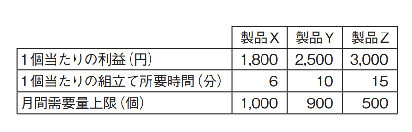
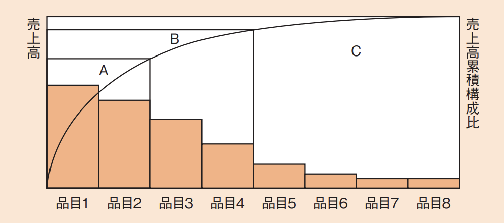
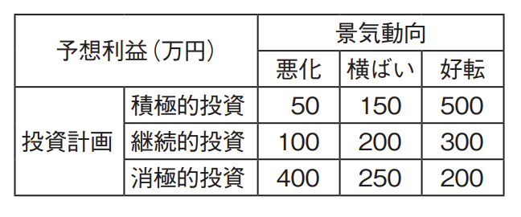

# OR・IE(译: 运筹学与工业工程)

- [OR・IE(译: 运筹学与工业工程)](#orie译-运筹学与工业工程)
  - [OR・IEの定義(译: 运筹学与工业工程的定义)](#orieの定義译-运筹学与工业工程的定义)
  - [線形計画法(LP)(译: 线性规划法)](#線形計画法lp译-线性规划法)
  - [在庫管理(译: 库存管理)](#在庫管理译-库存管理)
  - [ゲーム理論(译: 博弈论)](#ゲーム理論译-博弈论)
  - [検査手法(译: 检查手法)](#検査手法译-检查手法)
  - [稼働分析(译: 稼动分析)](#稼働分析译-稼动分析)
  - [品質管理手法(译: 质量管理手法)](#品質管理手法译-质量管理手法)
  - [分析手法(译: 分析手法)](#分析手法译-分析手法)

## OR・IEの定義(译: 运筹学与工业工程的定义)

- オペレーションズリサーチ(OR: Operations Research, 运筹学): 数学的・統計的モデルやアルゴリズムなどを利用して, 様々な計画に対して最も効率的な方法を決定する技法である。
- インダストリアルエンジニアリング(IE: Industrial Engineering, 工业工程): 企業が経営資源をより効率的・効果的に運用できるよう, 作業手順や工程, 管理方法などを分析・評価して, 改善策を現場に適用できるようにする技術である。生産工学, 経営工学などと訳される。

## 線形計画法(LP)(译: 线性规划法)

- ORの手法の一つである。
- LP(Linear Programming: 線形計画法): いくつかの一次式を満たす変数の中で, ある一次式を最大化または最小化する値を求める方法である。
- ⭐️ 例題: ある工場では表に示す3製品を製造している。実現可能な最大利益は何円か。ここで, 各製品の月間需要量には上限があり, 組立て工程に使える工場の時間は月間200時間までとする。また, 複数種類の製品を同時に並行して組み立てることはできないものとする。 
  - ア: 2,625,000
  - イ: 3,000,000
  - ウ: 3,150,000
  - エ: 3,300,000

  > この条件から, 製品X, Y, Zの個数をそれぞれx, y, zとすると, 表の条件は以下のような式になる。  
  > $0 \le x \le 1,000 [個], 0 \le y \le 900 [個], 0 \le z \le 500 [個]$  
  > $6 \times x + 10 \times y + 15 \times z \le 200 \times 60 = 12,000 [分]$  
  > ここで, 1個当たりだけでなく, **1個当たり1分当たりの利益率を考えて**みると, 次のようになる。  
  > $製品X \quad 1,800 / 6 = 300 [円/個 \cdot 分]$  
  > $製品Y \quad 2,500 / 10 = 250 [円/個 \cdot 分]$  
  > $製品Z \quad 3,000 / 15 = 200 [円/個 \cdot 分]$  
  > そこで, できる限り製品Xを作り, 順にY, Zと作っていくと, 実現可能な利益額が最大になることが分かる。  
  > $x \le 1,000 [個]$なので, 製品Xを最大の1,000個作ると, 所要時間は$6 \times 1,000 = 6,000 [分]$である。  
  > 続いて, $y \le 900 [個]$なので, 製品Yを最大の900個作ると, 所要時間は$10 \times 900 = 9,000 [分]$となり, XとYだけで200時間(12,000分)を超えてしまう。  
  > そこで, 製品Xを最大限(1,000個)作り, 製品Zを作らず, 製品Yをできるだけ作ることにすると, 次のようになる。  
  > $6 \times 1,000 + 10 \times y = 12,000$  
  > $y = 600 [個]$  
  > つまり, 製品Yを600個作ればよいことがわかる。  
  > このときの利益は, $1,800 \times 1,000 + 2,500 \times 600 = 3,300,000$となるので, エが正解である。

## 在庫管理(译: 库存管理)

- 在庫管理の考え方には, 一定期間ごとに発注を行う**定期発注方式**と, 一定量の発注を行う**定量発注方式**の2種類がある。
  - 在庫は, もっているだけで在庫費用がかかる。
  - 定期発注方式の場合: 発注費用と在庫費用を最小化する**EOQ**(Economic Ordering Quantity: **経済的発注量**), または**発注ロットサイズ**を考えることが重要である。
  - 定量発注方式の場合: 在庫がこの数を切ったら発注するという**発注点**を考えることが大切になる。
- どの商品を在庫としてもつか, 集中して管理するかということも在庫管理では重要である。
  - **ABC分析**では, 商品を売上高が多い順にA, B, Cの三つに分類し, 能率的に管理を行う。品目, 売上高, 売上高累積構成比をグラフにすると, おおよそ以下のようになる。 図: ABC分析 

## ゲーム理論(译: 博弈论)

- ゲーム理論: ある特定の条件下において, 互いに影響を与え合う複数のプレイヤーの間での意思決定の考え方を研究するものである。
  - ビジネスの分野でも, 競争相手がいる場合にはゲーム理論を応用できる場面はいろいろある。
- ゲーム理論では, ゲームを支配するルールを決め, その行動戦略がいくつかあり, プレイヤーがそれを選択する, という枠組みの中でどう意思決定すると利得(利益などの効用)を最大化できるかを考える。
- 戦略の例
  - **純粋戦略**: 毎回同じ行為をする
  - **混合戦略**: 毎回異なった行為をする
- 意思決定を行う際の判断基準
  - **マクシミン原理**(译: Maximin Principle, 极小极大原理): 最悪の場合の利得を最大とする基準
  - **マクシマックス原理**(译: Maximax Principle, 极大极大原理): 最良の場合の利得を最大とする基準
- **ナッシュ均衡**(译: Nash equilibrium, 纳什均衡): 各プレイヤーが自己の利得を最大化することを考え, どのプレイヤーも戦略変更によってより高い利得を得ることができなくなった戦略の組合せのこと
- ⭐️ 例題: 経営会議で来期の景気動向を議論したところ, 景気は悪化する, 横ばいである, 好転するという三つの意見に完全に分かれてしまった。来期の投資計画について, 積極的投資, 継続的投資, 消極的投資のいずれかに決定しなければならない。表の予想利益については意見が一致した。意思決定に関する記述のうち, 適切なものはどれか。 
  - ア: 混合戦略に基づく最適意思決定は, 積極的投資と消極的投資である。
  - イ: 純粋戦略に基づく最適意思決定は, 積極的投資である。
  - ウ: マクシマックス原理に基づく最適意思決定は, 継続的投資である。
  - エ: マクシミン原理に基づく最適意思決定は, 消極的投資である。

  > 混合戦略, 純粋戦略という分類は, 今回は当てはまらない。  
  > 今回の意思決定は, 戦略を一つに決定するという意味では純粋戦略である。それぞれの景気動向が3分の1の確率で起こるとし, 期待利益を最大化するという戦略を取る場合の利得は, 積極的投資は(50 + 150 + 500)÷3 = 233, 継続的投資は(100 + 200 + 300)÷3 = 200, 消極的投資は(400 + 250 + 200)÷3 = 283となり, 消極的投資が有利である。  
  > また, マクシマックス原理では, 最良の場合の利得, つまり積極的投資だと500, 継続的投資だと300, 消極的投資だと400のうちで利得を最高にするので, 積極的投資が最適である。  
  > マクシミン原理では, 最悪の場合, つまり積極的投資だと50, 継続的投資だと100, 消極的投資だと200のうちで利得を最高にするので, 消極的投資が最適になる。  
  > したがって, エが正解である。

## 検査手法(译: 检查手法)

- 検査を行うとき, あるロットのすべての物品を調べるのではなく, **抜取検査**で少数の標本を調べることがある。
  - しかし, 単純に不良品がn個以下のロットを合格とすると, 抜取り方によって品質にばらつきが出てしまうので, そのロットの合格確率を統計的に求める。
- 横軸にロットの不良率, 縦軸にロットの合格確率をとった曲線をOC(Operating Characteristic: 検査特性)曲線という。
  - OC曲線を見れば, ある不良率をもったロットがどの程度の確率で合格するのかを判断できる。
- ⭐️ 例題: 横軸にロットの不良率, 縦軸にロットの合格率をとり, 抜取検査でのロットの品質とその合格率との関係を表したものはどれか。
  - ア: OC曲線
  - イ: バスタブ曲線
  - ウ: ポアソン分布
  - エ: ワイブル分布

  > この問はOC曲線の説明そのものなので, アが正解である。  
  > ウ: ポアソン分布は統計的な分布で, 待ち行列モデルの到着率などで使われている。  
  > エ: ワイブル分布は, 物体の体積と強度との関係を定量的に記述するための確率分布である。寿命を統計的に記述するためにも利用されている。

## 稼働分析(译: 稼动分析)

- **稼働分析**: IEの代表的な作業測定方法で, 一定の期間内での生産活動の中で, 人または機械がどのような作業にどれだけの時間を掛けているかを明らかにする分析である。
- 稼働分析の手法
  - **ストップウォッチ(Stop Watch)法**(译: 秒表法): 実際の作業動作そのものをストップウォッチで数回反復測定して, 作業時間を調査する
  - **PTS(Predetermined Time Standard system)法**(译: 预定时间标准法): 作業を基本動作に分解して, 基本動作の時間標準テーブルから, 構成される基本動作の時間を合計して作業時間を求める
  - **ワークサンプリング法**(译: 工作抽样法): すべてを調査するのではなく, 観測回数・観測時刻を設定し, 実地観測によって観測された要素作業数の比率などから, 統計的理論に基づいて作業時間を見積もる

## 品質管理手法(译: 质量管理手法)

- 主に**定量分析**に用いられる: **QC七つ道具**

  | QC七つ道具 | 説明 | 中文说明 |
  | - | -- | -- |
  | 層別 (译: 分层法) | 母集団をいくつかの層に分割することである | 将数据按层(群组)分类分析, 以便更清楚地发现原因与趋势 |
  | ヒストグラム (译: 直方图) | データの分布状況を把握するのに用いる図である。データの範囲を適当な間隔に分割し, 度数分布表を棒グラフ化する | 用柱状图表示数据分布, 用于分析离散程度和集中趋势 |
  | **パレート図** (译: 帕累托图/二八图) | $\bullet$ 項目別に層別して, **出現頻度の高い順に並べる**とともに, 累積和を示して, 累積比率を折れ線グラフで表す図である $\bullet$ 前述した**ABC分析**とほぼ同様の図になる | 按影响大小排序的柱状图, 用于识别关键的少数因素(80/20法则) |
  | **散布図** (译: 散点图) | $\bullet$ 二つの特性を横軸と縦軸とし, 観測値をプロットする。相関関係や異常点を探るのに用いられる $\bullet$ 点の散らばり方に**直線的な関係**があるときには, xとyの間に**相関がある**といわれる $\bullet$ 右肩上がりのときは**正の相関**, 右肩下がりのときは負の相関である $\bullet$ 統計分析によって相関係数を求めることもあるが, 正の相関のときには**相関係数は正**, 負の相関のときには**相関係数は負**になる | 用点表示两个变量的关系, 用于观察变量间是否存在相关性 |
  | 特性要因図 (訳: 因果图/鱼骨图/石川图) | ある特性をもたらす一連の原因を階層的に整理するものである。矢印の先に結果を記入して, 因果関係を図示す | 通过鱼骨状图示把问题与可能原因联系起来, 系统性地找出原因 |
  | チェックシート (译: 检查表) | 事実を区分して, 詳しく定量的にチェックするためにデータをまとめてグラフ化する手法である | 事先设计好的检查表, 用于系统化数据收集, 避免遗漏或错误 |
  | 管理図 (译: 管理图/控制图) | 連続した量や数値などのデータを時系列に並べ, 異常かどうかの判断基準を管理限界線として引いて管理する図である | 于监控质量是否处于统计稳定状态的图表, 便于及早发现异常 |

- 主に**定性分析**に用いられる: **新QC七つ道具**

  | 新QC七つ道具 | 説明 | 中文说明 |
  | - | -- | -- |
  | 親和図法 (译: 亲和图法) | 多くの散乱した情報から, 言葉の意味合いを整理して問題を確定する手法である | 将复杂零散的意见或事实卡片化, 根据相似性或关联性进行分组整理的方法 |
  | 連関図法 (译: 关联图法) | 問題が複雑にからみ合っているときに, 問題の因果関係を明確にすることで原因を特定する手法である | 用箭头表示问题要因之间的因果关系, 从而明确真正的原因和关键要素的方法 |
  | 系統図法 (译: 系统图法) | 目的と手段を多段階に展開する手法である | 将"手段"与"目的"的关系以层级方式展开整理, 用于寻找达成目标的方法 |
  | マトリックス図法 (译: 矩阵图法) | 目的や現象と, 手段や要因のそれぞれの対応関係を多元的に整理する手法である | 将两个或以上要素之间的关系以矩阵形式表示, 明确关系的有无与强弱 |
  | マトリックスデータ解析法 (译: 矩阵数据解析法) | 問題に関係する特性値間の相関関係を手がかりに総合特性を見つけ, 個体間の違いを明確にする手法である | 对矩阵图中的数值数据进行统计分析, 定量把握因素之间的关联性的方法 |
  | PDPC(Process Decision Program Chart)法 (译: 过程决策程序图法) | プロセス決定計画図と訳され, 計画を実行する上で, 事前に考えられる様々な結果を予測し, プロセスをできるだけ望ましい方向に導く手法である | 在制定计划时, 事先找出可能发生的问题或障碍, 并提出应对措施的方法 |
  | アローダイアグラム法 (译: 箭线图法) | クリティカルパス法やPERTで使われている手法である | 用箭头表示作业顺序和依赖关系, 以便掌握整体进度与关键路径的方法 |

- ⭐️ 例題: 発生した故障について, 発生要因ごとの件数の記録を基に, 故障発生件数で上位を占める主な要因を明確に表現するのに適している図法はどれか。
  - ア: 特性要因図
  - イ: パレート図
  - ウ: マトリックス図
  - エ: 連関図

  > 品質管理手法において, 主に定量分析に用いられるものがQC七つ道具である。  
  > QC七つ道具のうち, 項目別に層別して, 出現頻度の高い順に並べるとともに, 累積和を示して, 累積比率を折れ線グラフで表す図をパレート図という。  
  > パレート図では, 発生した故障について, 発生要因ごとの故障発生件数を上位から順に並べることで, 故障に占める主な要因を明確に表現することが可能である。  
  > したがって, イが正解である。  
  > ア: QC七つ道具の一つで, ある特性をもたらす一連の原因を階層的に整理する手法である。  
  > ウ: 新QC七つ道具の一つで, 目的とその手段など, 二つの関係を行と列の二次元に表し, 行と列の交差点に二つの関係の程度を記述する手法である。  
  > エ: 新QC七つ道具の一つで, 問題が複雑にからみ合っているときに, 問題の因果関係を明確にすることで原因を特定する手法である。

## 分析手法(译: 分析手法)

- ORやIEで利用される分析手法には様々なものがある。
- 代表的な分析手法

  | 代表的な分析手法 | 説明 | 中文说明 |
  | - | -- | -- |
  | 回帰分析 (译: 回归分析) | $\bullet$ 相互関係がある二つの変数の間の関係を統計的な手法で推測する $\bullet$ 最小二乗法などが用いられる | 通过数据将变量之间的关系建模为数学公式, 用于预测和原因分析的方法 |
  | パレート分析 (译: 帕累托分析) | $\bullet$ 複数の事象などを, 現れる頻度によって分類し, 管理効率を高める手法である $\bullet$ パレート図を作成して行う | 将问题或要因按重要性排序, 说明少数主要因素导致大部分结果的方法 |
  | クラスタ分析 (译: 聚类分析) | 対象の集合を似たようなグループに分け, その特徴となる要因を分析する手法である | 根据相似性将数据分组, 以发现具有共同特征的群体的方法 |
  | モンテカルロ法 (译: 蒙特卡洛法) | 乱数を用いてシミュレーションや数値演算を行うことで答えを求める手法である | 基于概率分布使用随机数进行模拟, 用于数值计算与风险评估的方法 |
